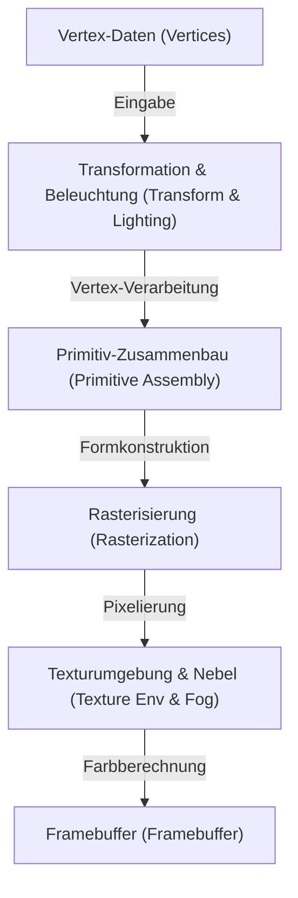
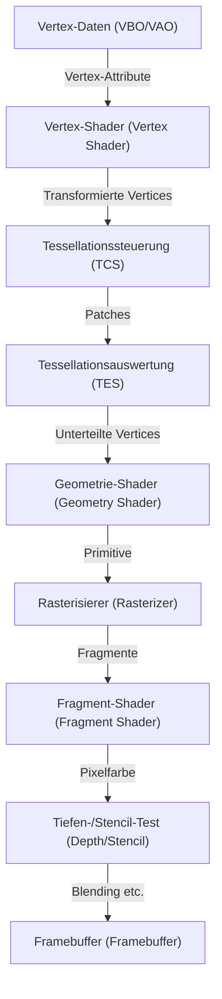
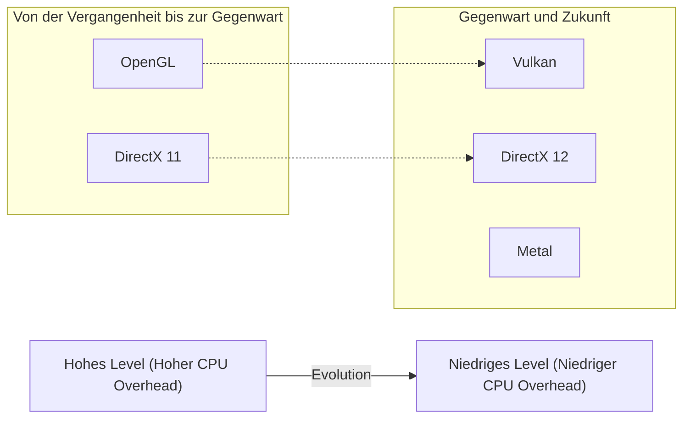

# 1. Einleitung

3D-Grafiken auf modernen Computern sind längst nicht mehr nur etwas für Spezialisten. Smartphone-Spiele, Datenvisualisierung im Webbrowser, VFX in Filmen, CAD-Software, VR/AR und viele andere Bereiche nutzen 3D-Grafiktechnologien. Bis diese Technologien jedoch so weit verbreitet waren wie heute, gab es parallel zur Entwicklung der Hardware einen langen Kampf um die Standardisierung der Software (APIs).

In diesem Artikel konzentrieren wir uns auf "OpenGL (Open Graphics Library)", das lange Zeit als De-facto-Standard für 3D-Grafik-APIs galt. Wir beginnen mit den historischen Hintergründen, wie OpenGL entstand und sich entwickelte, und tauchen dann tief in die Funktionsweise der modernen programmierbaren Grafikpipeline, den mathematischen Hintergrund der Matrizenberechnung sowie konkrete Implementierungsbeispiele in C/C++ und GLSL ein.

---

# 2. Die Geschichte von OpenGL: Von SGI und IRIS GL zum Standard

## 2.1 Die Entstehung von Silicon Graphics, Inc. (SGI) und IRIS GL

In den 1980er und 1990er Jahren war die von Jim Clark gegründete Silicon Graphics, Inc. (SGI) der absolute König im Bereich der 3D-Computergrafik (CG). Die Workstations von SGI waren mit spezieller Grafikhardware ausgestattet und boten eine für die damalige Zeit beispiellose 3D-Renderingleistung. Es ist bekannt, dass SGI-Computer auch für die CG-Produktion von Filmen wie "Jurassic Park" und "Terminator 2" verwendet wurden.

Um das volle Potenzial der SGI-Hardware auszuschöpfen, wurde eine proprietäre Grafik-API namens "IRIS GL (Integrated Raster Imaging System Graphics Library)" entwickelt. IRIS GL wurde so konzipiert, dass Programmierer problemlos Polygon-Rendering, Beleuchtung und Verdeckungsberechnung durch Z-Pufferung handhaben konnten, ohne sich um die komplexen Details der Hardware kümmern zu müssen.

IRIS GL hatte jedoch ein großes Problem: Es war stark von der SGI-Hardware abhängig. IRIS GL war zu einer riesigen API angewachsen, die sogar die Steuerung des Fenstersystems und der Eingabegeräte umfasste, was die Portierung auf andere Plattformen (wie Sun Microsystems, HP-Workstations oder die aufkommenden PCs) extrem schwierig machte.

## 2.2 Der Übergang zu einem offenen Standard und die Geburt von OpenGL

In den frühen 1990er Jahren, als der Wettbewerb auf dem 3D-Grafikmarkt immer härter wurde, beschloss SGI, IRIS GL zu organisieren und zu abstrahieren, um die eigene Technologie zu verbreiten und eine branchenübliche API zu schaffen, die auch auf Hardware anderer Hersteller funktionierte.

OpenGL wurde als offene API für reines 3D-Grafik-Rendering neu konzipiert, wobei Abhängigkeiten vom Fenstersystem und SGI-spezifische Funktionen aus IRIS GL entfernt wurden. Im Jahr 1992 wurde OpenGL 1.0 offiziell vorgestellt.

Um die Spezifikationen und die Verwaltung von OpenGL zu leiten, wurde das "OpenGL Architecture Review Board (ARB)" gegründet, an dem große Unternehmen wie SGI, DEC, IBM, Intel und Microsoft beteiligt waren. Dadurch entwickelte sich OpenGL von der proprietären Technologie eines einzigen Unternehmens zu einem branchenweiten Standard.

## 2.3 Von der Fixed-Function-Pipeline zur programmierbaren Pipeline

Frühe Versionen von OpenGL (1.x bis frühe 2.x) nutzten eine Architektur namens "Fixed-Function Pipeline". Bei dieser Architektur waren Prozesse wie Beleuchtung, Transformation und Texture Mapping in der Hardware fest verankert, und der Programmierer musste lediglich Parameter (wie Position und Farbe des Lichtes, Materialeigenschaften usw.) einstellen, um das Rendering durchzuführen.



Die Fixed-Function-Pipeline war sehr einfach zu bedienen und ideal für Anfänger, um 3D-Grafiken zu erlernen. (Viele erinnern sich wahrscheinlich noch an Funktionen wie `glBegin()`, `glEnd()` und `glVertex3f()`).

In den 2000er Jahren jedoch, als die Entwicklung von GPUs (Graphics Processing Units) rasante Fortschritte machte, forderten Entwickler die Möglichkeit, eigene Shading-Algorithmen (Schattierungen) zu implementieren und unrealistische Darstellungen wie Toon-Rendering (NPR) schnell auf der Hardware zu verarbeiten.

Um diesen Anforderungen gerecht zu werden, wurde in OpenGL 2.0 (2004) die "GLSL (OpenGL Shading Language)" eingeführt, die es ermöglichte, einen Teil der GPU-Verarbeitung durch vom Programmierer geschriebene Programme (Shader) zu ersetzen. Mit OpenGL 3.1 (2009) und dem Core Profile von OpenGL 3.2 wurde die Fixed-Function-Pipeline als veraltet deklariert (und später entfernt), wodurch der vollständige Übergang zur "programmierbaren Pipeline" vollzogen wurde.

---

# 3. Modernes OpenGL und Details der Grafikpipeline

Im modernen OpenGL (Core Profile der Version 3.3 und höher) muss der Programmierer die einzelnen Phasen der Grafikpipeline selbst steuern. Der Ablauf der Pipeline ist im folgenden Diagramm dargestellt.



## 3.1 Die Rolle jeder Phase

1. **Vertex-Shader (Vertex Shader)**: Erforderlich. Wird für jeden eingegebenen Vertex ausgeführt. Die Hauptaufgabe besteht darin, die lokalen Koordinaten des Vertex in Bildschirmkoordinaten (Clip-Space) umzuwandeln.
2. **Tessellations-Shader (Tessellation Shaders)**: Optional. Unterteilt Polygone in feinere Polygone, um detailliertere Formen zu erzeugen.
3. **Geometrie-Shader (Geometry Shader)**: Optional. Empfängt eine Menge von Vertices (Punkte, Linien, Dreiecke) und kann neue Formen generieren oder verwerfen.
4. **Rasterisierer (Rasterizer)**: Feste Funktion. Wandelt mathematische Formen (Polygone) in "Fragmente" um, die den Pixeln auf dem Bildschirm entsprechen. Hier werden die Attribute zwischen den Vertices interpoliert (Interpolation).
5. **Fragment-Shader (Fragment Shader)**: Erforderlich. Wird für jedes Fragment ausgeführt und berechnet die endgültige Pixelfarbe (RGBA) und den Tiefenwert. Textur-Sampling und Beleuchtungsberechnungen finden hier statt.
6. **Verschiedene Tests und Blending**: Tiefentest (Vordergrundobjekte werden bevorzugt gezeichnet), Stencil-Test, Alpha-Blending usw. werden durchgeführt, und das Ergebnis wird schließlich in den Framebuffer geschrieben.

---

# 4. Mathematik von Matrizen und Koordinatentransformationen

Um Objekte im 3D-Raum auf einem 2D-Bildschirm darzustellen, müssen mehrere Koordinatensysteme (Räume) nacheinander transformiert werden. Dies wird durch die lineare Algebra mit "Matrizen (Matrix)" erreicht.

## 4.1 Transformation vom lokalen Raum zum Bildschirmraum

Im Allgemeinen werden die folgenden drei Matrizen miteinander multipliziert, um die Transformation durchzuführen. Dies wird als **MVP-Matrix (Model-View-Projection Matrix)** bezeichnet.

$$
V_{clip} = M_{projection} \cdot M_{view} \cdot M_{model} \cdot V_{local}
$$

1. **Modellmatrix ($M_{model}$)**:
   Platziert das lokale Koordinatensystem (Local Space) des Objekts selbst in das globale Koordinatensystem (World Space). Führt Translation, Rotation und Skalierung durch.
2. **Ansichtsmatrix ($M_{view}$)**:
   Transformiert die Koordinaten des World Space in den Raum, der von der Kamera (Betrachter) gesehen wird (View Space / Camera Space). Die Kamera nach hinten zu bewegen ist dasselbe, wie die gesamte Welt nach vorne zu bewegen.
3. **Projektionsmatrix ($M_{projection}$)**:
   Die Transformation vom View Space zum Clip Space. Es gibt die perspektivische Projektion (Perspective Projection) und die orthografische Projektion (Orthographic Projection). Die perspektivische Projektion erzeugt den Effekt, dass entfernte Objekte kleiner erscheinen (Perspektive).

## 4.2 Struktur der perspektivischen Projektionsmatrix

Die perspektivische Projektionsmatrix ist sehr wichtig. Unter Verwendung des Sichtfelds (FOV), des Seitenverhältnisses (Aspect) sowie der nahen (Near) und fernen (Far) Clipping-Ebenen wird die folgende 4x4-Matrix erstellt:

$$
\begin{bmatrix}
\frac{1}{\text{aspect} \cdot \tan(\text{fov}/2)} & 0 & 0 & 0 \\
0 & \frac{1}{\tan(\text{fov}/2)} & 0 & 0 \\
0 & 0 & -\frac{\text{far} + \text{near}}{\text{far} - \text{near}} & -\frac{2 \cdot \text{far} \cdot \text{near}}{\text{far} - \text{near}} \\
0 & 0 & -1 & 0
\end{bmatrix}
$$

Diese Matrix modifiziert die W-Komponente der Vertexkoordinaten (homogenes Koordinatensystem), und durch die anschließende "perspektivische Division (Perspective Divide)" werden die x-, y- und z-Koordinaten auf das normalisierte Gerätekoordinatensystem (NDC: Normalized Device Coordinates) von -1.0 bis 1.0 abgebildet.

---

# 5. Grundlagen von GLSL (OpenGL Shading Language)

Wir verwenden GLSL, das eine C-ähnliche Syntax aufweist, um Programme zu schreiben, die auf der GPU ausgeführt werden.

## 5.1 Vertex-Shader (Vertex Shader)

```glsl
#version 330 core
layout (location = 0) in vec3 aPos;     // 頂点位置
layout (location = 1) in vec2 aTexCoord; // テクスチャ座標

out vec2 TexCoord; // フラグメントシェーダーへ渡す変数

uniform mat4 model;
uniform mat4 view;
uniform mat4 projection;

void main()
{
    // MVP行列を掛けてクリップ座標系へ変換
    gl_Position = projection * view * model * vec4(aPos, 1.0);
    TexCoord = aTexCoord;
}
```

## 5.2 Fragment-Shader (Fragment Shader)

```glsl
#version 330 core
out vec4 FragColor;

in vec2 TexCoord; // 頂点シェーダーから補間されて渡される

uniform sampler2D texture1; // テクスチャユニット

void main()
{
    // テクスチャから色をサンプリング
    FragColor = texture(texture1, TexCoord);
}
```

---

# 6. Setup und Implementierung von modernem OpenGL mit C/C++

Im Folgenden zeigen wir den grundlegenden Code zum Erstellen eines Fensters und zum Zeichnen eines Dreiecks mit C++. Wir verwenden **GLFW** für die Fensterverwaltung und **GLAD** (oder GLEW) zum Laden der Funktionszeiger von OpenGL.

## 6.1 Initialisierung und Fenstererstellung

```cpp
#include <glad/glad.h>
#include <GLFW/glfw3.h>
#include <iostream>

// ウィンドウリサイズ時のコールバック
void framebuffer_size_callback(GLFWwindow* window, int width, int height) {
    glViewport(0, 0, width, height);
}

int main() {
    // 1. GLFWの初期化
    glfwInit();
    // OpenGL 3.3 Core Profileを指定
    glfwWindowHint(GLFW_CONTEXT_VERSION_MAJOR, 3);
    glfwWindowHint(GLFW_CONTEXT_VERSION_MINOR, 3);
    glfwWindowHint(GLFW_OPENGL_PROFILE, GLFW_OPENGL_CORE_PROFILE);

#ifdef __APPLE__
    glfwWindowHint(GLFW_OPENGL_FORWARD_COMPAT, GL_TRUE); // macOS用
#endif

    // 2. ウィンドウの作成
    GLFWwindow* window = glfwCreateWindow(800, 600, "LearnOpenGL", NULL, NULL);
    if (window == NULL) {
        std::cout << "Failed to create GLFW window" << std::endl;
        glfwTerminate();
        return -1;
    }
    glfwMakeContextCurrent(window);
    glfwSetFramebufferSizeCallback(window, framebuffer_size_callback);

    // 3. GLADの初期化 (OS固有のOpenGL関数ポインタをロード)
    if (!gladLoadGLLoader((GLADloadproc)glfwGetProcAddress)) {
        std::cout << "Failed to initialize GLAD" << std::endl;
        return -1;
    }

    // 続く...
```

## 6.2 Erstellung von Vertex-Daten und Puffern (VAO, VBO)

In modernem OpenGL müssen Vertex-Daten in den Speicher der GPU (VRAM) übertragen und das Layout dieser Daten definiert werden.

```cpp
    // 頂点データ (X, Y, Z)
    float vertices[] = {
        -0.5f, -0.5f, 0.0f, // 左下
         0.5f, -0.5f, 0.0f, // 右下
         0.0f,  0.5f, 0.0f  // 上部
    };

    unsigned int VBO, VAO;
    // VAO (Vertex Array Object) の生成とバインド
    glGenVertexArrays(1, &VAO);
    glBindVertexArray(VAO);

    // VBO (Vertex Buffer Object) の生成とバインド
    glGenBuffers(1, &VBO);
    glBindBuffer(GL_ARRAY_BUFFER, VBO);
    
    // データをGPUに転送
    glBufferData(GL_ARRAY_BUFFER, sizeof(vertices), vertices, GL_STATIC_DRAW);

    // 頂点属性ポインタの設定 (location = 0)
    glVertexAttribPointer(0, 3, GL_FLOAT, GL_FALSE, 3 * sizeof(float), (void*)0);
    glEnableVertexAttribArray(0);

    // バインド解除 (安全のため)
    glBindBuffer(GL_ARRAY_BUFFER, 0); 
    glBindVertexArray(0);
```

## 6.3 Hauptschleife (Rendering)

Nach dem Kompilieren und Verknüpfen der Shader (wir gehen hier davon aus, dass dies in einer Funktion geschieht), betreten wir die Haupt-Rendering-Schleife.

```cpp
    // シェーダープログラムのロードとコンパイル (実装省略)
    // unsigned int shaderProgram = LoadShaders("vertex.glsl", "fragment.glsl");

    // メインループ
    while (!glfwWindowShouldClose(window)) {
        // 入力処理 (Escapeキーで終了など)
        if (glfwGetKey(window, GLFW_KEY_ESCAPE) == GLFW_PRESS)
            glfwSetWindowShouldClose(window, true);

        // 1. 画面のクリア
        glClearColor(0.2f, 0.3f, 0.3f, 1.0f);
        glClear(GL_COLOR_BUFFER_BIT | GL_DEPTH_BUFFER_BIT);

        // 2. シェーダーの有効化
        // glUseProgram(shaderProgram);

        // 3. VAOをバインドして描画
        glBindVertexArray(VAO);
        glDrawArrays(GL_TRIANGLES, 0, 3);

        // 4. バッファのスワップとイベントのポーリング
        glfwSwapBuffers(window);
        glfwPollEvents();
    }

    // リソースの解放
    glDeleteVertexArrays(1, &VAO);
    glDeleteBuffers(1, &VBO);
    // glDeleteProgram(shaderProgram);

    glfwTerminate();
    return 0;
}
```

---

# 7. Aktueller Stand und Zukunft von OpenGL (Vulkan, Metal, DirectX 12)

Angefangen bei SGIs IRIS GL und geboren 1992, hat OpenGL die Branche seit mehr als einem Vierteljahrhundert als standardisierte plattformübergreifende API unterstützt. Allerdings stößt die Designphilosophie von OpenGL als „einzelne, riesige Zustandsmaschine (State Machine)“ bei modernen Hardwarearchitekturen (wie Multi-Core-CPUs und massiven GPUs für parallele Verarbeitung) zunehmend an ihre Grenzen.

Da OpenGL viele globale Zustände besitzt, ist es schwierig, Rendering-Befehle Multithreaded zu erzeugen, was zu dem grundlegenden Problem führt, dass der CPU-Overhead tendenziell hoch ist.

Um dieses Problem zu lösen, ist eine neue Generation von APIs entstanden, die eine dünnere Abstraktionsschicht auf niedrigerer Ebene bieten, sodass Entwickler die GPU-Speicher- und Synchronisationsverarbeitung fein steuern können.
* **Vulkan**: Eine plattformübergreifende API, die von der Khronos Group, die auch OpenGL verwaltet, als Nachfolger von OpenGL formuliert wurde.
* **DirectX 12**: Eine Low-Level-API, die von Microsoft für Windows und Xbox bereitgestellt wird.
* **Metal**: Eine proprietäre API von Apple für macOS und iOS (Apple hat OpenGL als veraltet markiert).



## 7.1 Warum es sich dennoch lohnt, OpenGL zu lernen

Auch wenn neue Low-Level-APIs zunehmend zum Mainstream werden, ist es keineswegs sinnlos, OpenGL zu lernen. Die Gründe dafür sind folgende:

1. **Geringe Lernkurve**: Um mit Vulkan oder DirectX 12 auch nur das erste Dreieck auf dem Bildschirm zu zeichnen, sind hunderte bis tausende Zeilen Code und ein komplexes Setup erforderlich. Im Gegensatz dazu ist OpenGL nach wie vor ein hervorragender Einstieg, um das „Wesen der 3D-Grafik“ wie die Grundlagen der Grafikpipeline, Matrizenberechnungen und Shader-Programmierung zu erlernen.
2. **Riesige Menge an vorhandenen Assets und Community**: Es gibt weltweit unzählige in OpenGL geschriebene Softwares, Engines und Tutorials.
3. **WebGL**: WebGL, der Standard für das Rendern von 3D-Grafiken im Browser, basiert auf OpenGL ES. In der Webwelt sind OpenGL-Kenntnisse also immer noch direkt anwendbar.

# 8. Fazit

Angefangen als proprietäre Technologie für SGI-Workstations hat sich OpenGL zu einem Industriestandard entwickelt und jeden Bereich von Spielen bis hin zum wissenschaftlichen Rechnen unterstützt. Ein Rückblick auf die Geschichte und das Verständnis der grundlegenden Mechanismen von OpenGL bilden eine solide Grundlage für das Erlernen von Technologien der nächsten Generation wie Vulkan und WebGPU.

Die Welt der Grafikprogrammierung ist tiefgründig, und der Moment, in dem mathematische Formeln und Code in wunderschöne Grafiken auf dem Bildschirm verwandelt werden, vermittelt eine Faszination, die man in keiner anderen Art der Programmierung findet. Ich hoffe, dieser Artikel inspiriert Sie dazu, selbst OpenGL-Code zu schreiben und Ihre eigene 3D-Welt zu erschaffen.
