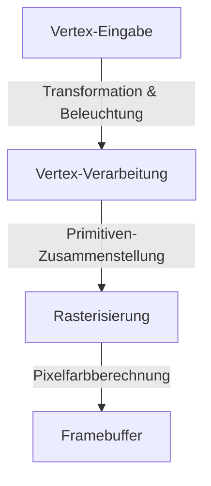
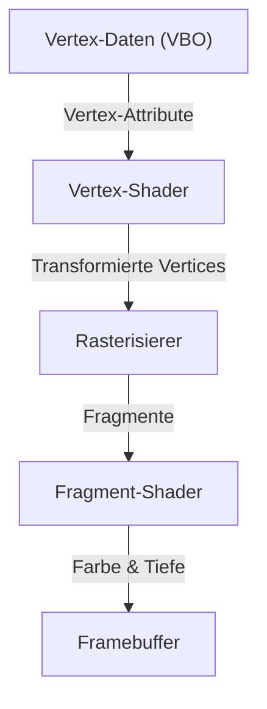

# 1. Einleitung

In der modernen Computerwelt sind 3D-Grafiken zu einem unverzichtbaren Bestandteil geworden. Von Videospielen, Film-VFX und CAD über Smartphone-Apps bis hin zu Datenvisualisierungen im Webbrowser profitieren wir täglich von 3D-Technologien. Der Weg zur „Standardisierung“, um gemeinsame Programme über verschiedene Plattformen hinweg auszuführen und gleichzeitig die maximale Hardwareleistung abzurufen, war jedoch keineswegs einfach.

In diesem Artikel befassen wir uns mit „OpenGL (Open Graphics Library)“, das über viele Jahre hinweg als De-facto-Standard für 3D-Grafik-APIs galt. Wir beleuchten den historischen Hintergrund des Wandels von einem proprietären Firmenstandard zu einem offenen Standard, die Funktionsweise der modernen programmierbaren Grafik-Pipeline, die mathematischen Grundlagen der Matrixoperationen zur Projektion des 3D-Raums auf einen 2D-Bildschirm sowie konkrete Implementierungsbeispiele mit C/C++ und GLSL.

# 2. Die Geschichte von OpenGL: Die Loslösung von proprietären Standards

## 2.1 Der Aufstieg von SGI und IRIS GL

In den 1980er- und 1990er-Jahren war Silicon Graphics, Inc. (SGI) die dominierende Kraft im Bereich der 3D-Computergrafik. Die Workstations von SGI verfügten über dedizierte Grafikhardware und wurden in der Filmindustrie sowie in Forschungseinrichtungen in großem Umfang eingesetzt.

Speziell für die Hardware von SGI wurde die Grafik-API „IRIS GL“ entwickelt. Obwohl IRIS GL äußerst leistungsfähig und benutzerfreundlich war, besaß es den gravierenden Nachteil, dass es eng an die proprietäre Hardware und das Fenstersystem von SGI gebunden war, was zu einer extrem schlechten Portierbarkeit auf andere Systeme führte.

## 2.2 Die Geburt eines offenen Standards

Zu Beginn der 1990er-Jahre verbesserten sich die Leistungsfähigkeiten von PCs und Workstations anderer Hersteller, und der Wettbewerb auf dem Grafikmarkt verschärfte sich. Um die eigene Technologie weiter zu verbreiten, unternahm SGI einen strategischen Schritt: 1992 kündigte das Unternehmen „OpenGL“ an – eine Neugestaltung von IRIS GL als offene API für reines 3D-Rendering, bei der hardwareabhängige Komponenten entkoppelt wurden.

Die Verwaltung der OpenGL-Spezifikation übernahm das „OpenGL Architecture Review Board (ARB)“, dem führende Technologieunternehmen wie SGI, IBM, DEC, Microsoft und Intel angehörten. Dadurch etablierte sich OpenGL als branchenweiter Standard, der frei von den Beschränkungen einzelner Plattformen war.

## 2.3 Paradigmenwechsel zu programmierbaren Pipelines

Frühe OpenGL-Versionen nutzten eine Architektur, die als „Fixed-Function-Pipeline“ bekannt war. Bei diesem Ansatz waren Operationen wie Beleuchtung und Koordinatentransformationen hardware- bzw. treiberseitig fest vorgegeben, und Programmierer erstellten Renderings, indem sie lediglich Parameter konfigurierten.



Dieser Ansatz war zwar für Einsteiger leicht verständlich, machte es jedoch schwierig, benutzerdefiniertes Shading (wie Toon-Rendering) oder anspruchsvolle visuelle Effekte zu implementieren. Um dem zu begegnen, führte OpenGL 2.0 (2004) die „GLSL (OpenGL Shading Language)“ ein und entwickelte sich zu einer „programmierbaren Pipeline“, die es Entwicklern ermöglichte, die Abläufe der GPU direkt zu programmieren. Heutzutage sind feste Funktionen entweder veraltet (deprecated) oder wurden entfernt, und flexibles Rendering mittels Shadern ist die Standardvoraussetzung.

# 3. Die moderne OpenGL-Pipeline

Im modernen OpenGL (Core Profile) müssen Entwickler jede Stufe der Grafik-Pipeline detailliert steuern.



1. **Vertex-Shader (Vertex Shader)**:
   Wird für jeden eingegebenen Vertex ausgeführt. Seine Hauptaufgabe besteht darin, die lokalen Koordinaten des Modells in Clip-Koordinaten aus Sicht der Kamera zu transformieren.
2. **Rasterisierer (Rasterizer)**:
   Zerlegt und interpoliert Polygone (wie Dreiecke), die aus Vertices bestehen, in „Fragmente“, die den Pixeln auf dem Bildschirm entsprechen.
3. **Fragment-Shader (Fragment Shader)**:
   Berechnet die endgültige Farbe (RGB) jedes Fragments. Hier finden hauptsächlich das Texture-Mapping und die Beleuchtungsberechnungen statt.

# 4. Grundlagen von Matrixoperationen und Koordinatentransformationen

Um Objekte im 3D-Raum korrekt auf einem 2D-Bildschirm darzustellen, sind Koordinatentransformationen mithilfe von Matrizen unerlässlich. Im Allgemeinen werden Transformationen durch die Multiplikation von drei Matrizen durchgeführt. Dies wird als MVP-Matrix (Model-View-Projection) bezeichnet.

- **Modellmatrix (Model Matrix)**:
  Positioniert ein Objekt aus seinem lokalen Raum im absoluten Koordinatensystem der gesamten Welt (Welt-Raum). Dies umfasst Translation, Rotation und Skalierung.
- **View-Matrix (View Matrix)**:
  Transformiert Koordinaten aus dem Welt-Raum in den Raum, der aus dem Blickwinkel der Kamera betrachtet wird (View-Space / Kamera-Raum).
- **Projektionsmatrix (Projection Matrix)**:
  Transformiert Koordinaten aus dem View-Space in den Clip-Space. Hierbei wird die perspektivische Projektion berechnet, um Tiefeneffekte anzuwenden (bei denen weiter entfernte Objekte kleiner erscheinen).

# 5. Implementierungsbeispiel mit GLSL und C/C++

Hier zeigen wir ein grundlegendes Beispiel für GLSL-Shader-Code zum Rendern eines Dreiecks mit modernem OpenGL.

## 5.1 Beispiel eines Vertex-Shaders

```glsl
#version 330 core
layout (location = 0) in vec3 aPos;

uniform mat4 model;
uniform mat4 view;
uniform mat4 projection;

void main()
{
    gl_Position = projection * view * model * vec4(aPos, 1.0);
}
```

## 5.2 Beispiel eines Fragment-Shaders

```glsl
#version 330 core
out vec4 FragColor;

void main()
{
    FragColor = vec4(1.0, 0.5, 0.2, 1.0); // Ausgabe der Farbe Orange
}
```

Auf der C/C++-Seite werden Bibliotheken wie GLFW verwendet, um ein Fenster zu erstellen, und Vertex-Daten (VBO: Vertex Buffer Object) zusammen mit dem Layout der Vertex-Attribute (VAO: Vertex Array Object) an die GPU übertragen. Innerhalb der Hauptschleife wird dann der Bildschirm geleert und über Funktionen wie `glDrawArrays` mit dem konfigurierten Shader-Programm der Zeichenbefehl erteilt.

# 6. Die Zukunft von Grafik-APIs

Obwohl OpenGL die Branche über viele Jahre hinweg getragen hat, stößt seine historische Architekturphilosophie – der Betrieb als gewaltige Zustandsmaschine (State Machine) – zunehmend an Grenzen, wenn es darum geht, die volle Leistung moderner Multi-Core-CPUs und massiv paralleler GPUs abzurufen.

Aus diesem Grund vollzieht die Industrie einen Übergang zu Low-Level-APIs der nächsten Generation (wie Vulkan, DirectX 12 und Metal), die eine hardwarenahe Steuerung ermöglichen und für Multithread-Rendering optimiert sind. Da die Initialisierung dieser modernen APIs jedoch außergewöhnlich komplex ist, besitzt OpenGL als Bildungs- und Einstiegs-API zum Erlernen der grundlegenden Konzepte der 3D-Grafik (Pipelines, Matrizentransformationen und Shader) nach wie vor einen enormen Wert.

Sich zunächst mit OpenGL die Grundlagen der 3D-Programmierung anzueignen und anschließend je nach Anforderungen auf APIs wie Vulkan umzusteigen, bleibt auch heute noch einer der am meisten empfohlenen Lernpfade.
