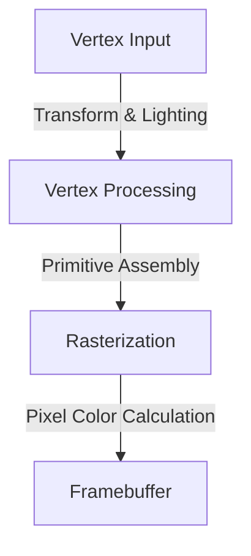
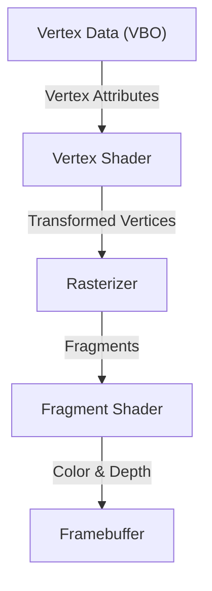

# 1. Introduction

In modern computing environments, 3D graphics have become an indispensable element. From video games, movie VFX, and CAD to smartphone apps and in-browser data visualization, we benefit from 3D technology every day. However, the path toward "standardization"—enabling common programs to run across different platforms while maximizing hardware performance—was by no means smooth.

In this article, we explore "OpenGL (Open Graphics Library)," which has reigned as the de facto standard for 3D graphics APIs for many years. We will comprehensively examine its historical background—evolving from a single company's proprietary standard into an open standard—as well as the mechanics of the modern programmable graphics pipeline, the mathematical foundations of matrix operations used to project 3D space onto a 2D screen, and concrete implementation examples using C/C++ and GLSL.

# 2. History of OpenGL: Breaking Free from Proprietary Standards

## 2.1 The Rise of SGI and IRIS GL

During the 1980s and 1990s, Silicon Graphics, Inc. (SGI) held overwhelming dominance in the realm of 3D computer graphics. SGI workstations featured dedicated graphics hardware and were widely adopted across the film industry and research institutions.

The graphics API developed specifically for SGI's hardware was "IRIS GL." While IRIS GL was exceptionally powerful and easy to use, it suffered from a fatal drawback: it was tightly coupled to SGI's proprietary hardware and windowing system, resulting in extremely poor portability to other systems.

## 2.2 The Birth of an Open Standard

In the early 1990s, as PC and competitor workstation performance improved and competition in the graphics market intensified, SGI made a strategic move to promote the widespread adoption of its technology. This was the release of "OpenGL" in 1992—redesigned as an open API for pure 3D rendering by decoupling the hardware-dependent components from IRIS GL.

The OpenGL specification came under the governance of the "OpenGL Architecture Review Board (ARB)," composed of major technology companies such as SGI, IBM, DEC, Microsoft, and Intel. This established OpenGL's position as an industry-wide standard free from the constraints of any specific platform.

## 2.3 Paradigm Shift to Programmable Pipelines

Early OpenGL adopted an architecture known as the "fixed-function pipeline." In this approach, operations such as lighting and coordinate transformations were fixed on the hardware (or driver) side, and programmers rendered scenes simply by configuring parameters.



While this approach was approachable for beginners, implementing custom shading (such as toon rendering) or advanced visual effects was difficult. To address this, OpenGL 2.0 (2004) introduced "GLSL (OpenGL Shading Language)," evolving into a "programmable pipeline" that allowed developers to directly program the GPU's operations. Today, fixed functions are either deprecated or removed, and flexible rendering using shaders is the standard assumption.

# 3. Modern OpenGL Pipeline

In modern OpenGL (Core Profile), developers are required to control each stage of the graphics pipeline in detail.



1. **Vertex Shader**:
   Executed for each input vertex. Its primary role is to transform the model's local coordinates into clip space coordinates as viewed from the camera.
2. **Rasterizer**:
   Breaks down and interpolates polygons (such as triangles) composed of vertices into "fragments" corresponding to pixels on the screen.
3. **Fragment Shader**:
   Calculates the final color (RGB) of each fragment. Texture mapping and lighting calculations are primarily performed here.

# 4. Fundamentals of Matrix Operations and Coordinate Transformations

To correctly render objects in 3D space onto a 2D monitor, coordinate transformations using matrices are indispensable. In general, transformations are performed by multiplying three matrices together. This is referred to as the MVP (Model-View-Projection) matrix.

- **Model Matrix**:
  Positions an object from its local space into the absolute coordinate system of the overall world (world space). This includes translation, rotation, and scaling.
- **View Matrix**:
  Transforms coordinates from world space into the space viewed from the camera's perspective (view space).
- **Projection Matrix**:
  Transforms coordinates from view space into clip space. This calculates perspective projection to apply depth effects (where distant objects appear smaller).

# 5. Implementation Example with GLSL and C/C++

Here is an example of basic GLSL shader code for rendering a triangle using modern OpenGL.

## 5.1 Vertex Shader Example

```glsl
#version 330 core
layout (location = 0) in vec3 aPos;

uniform mat4 model;
uniform mat4 view;
uniform mat4 projection;

void main()
{
    gl_Position = projection * view * model * vec4(aPos, 1.0);
}
```

## 5.2 Fragment Shader Example

```glsl
#version 330 core
out vec4 FragColor;

void main()
{
    FragColor = vec4(1.0, 0.5, 0.2, 1.0); // Output orange color
}
```

On the C/C++ side, libraries such as GLFW are used to create a window, and vertex data (VBO: Vertex Buffer Object) along with the vertex attribute layout (VAO: Vertex Array Object) are transferred to the GPU. Then, inside the main loop, the screen is cleared, and draw calls are issued using functions like `glDrawArrays` with the configured shader program.

# 6. The Future of Graphics APIs

While OpenGL has supported the industry for many years, its legacy architectural philosophy—operating as a massive state machine—has increasingly become a bottleneck in fully unlocking the performance of modern multi-core CPUs and massively parallel GPUs.

As a result, the industry is transitioning toward next-generation APIs (such as Vulkan, DirectX 12, and Metal) that allow low-level control closer to the hardware and are optimized for multi-threaded rendering. However, because the initialization process for these modern APIs is exceptionally complex, OpenGL continues to hold tremendous value as an educational and introductory API for learning the fundamental concepts of 3D graphics (pipelines, matrix transformations, and shaders).

Mastering the fundamentals of 3D programming with OpenGL first, and then stepping up to APIs like Vulkan as requirements demand, remains one of the most highly recommended learning paths today.
