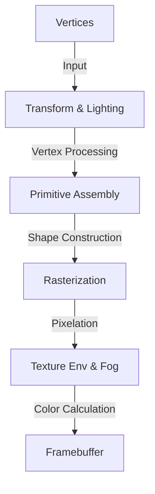
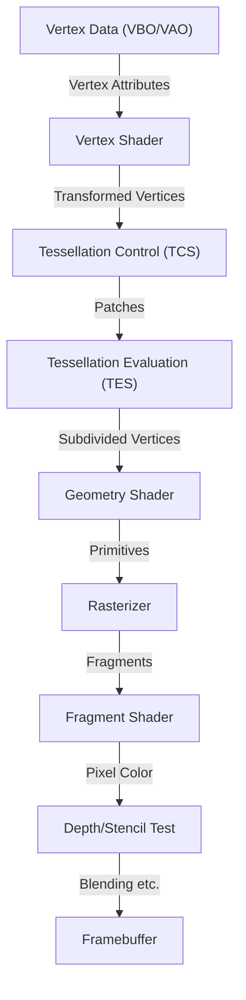
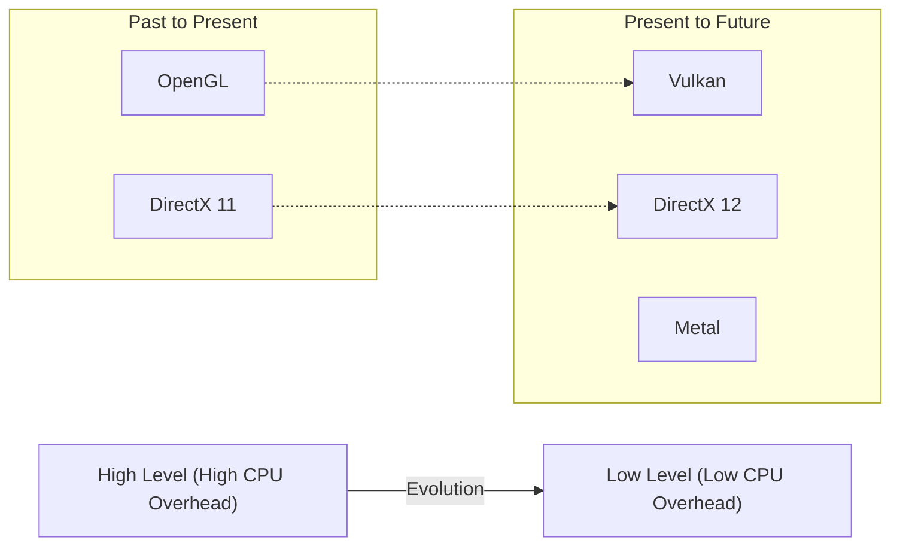

# 1. Introduction

3D graphics in modern computers is no longer just for a few experts. 3D graphics technologies are utilized everywhere: games on smartphones, data visualization in web browsers, VFX in movies, CAD software, VR/AR, and more. However, before these technologies became as widely popular as they are today, there was a long battle for the standardization of software (APIs) alongside the evolution of hardware.

In this article, we will focus on "OpenGL (Open Graphics Library)," which has reigned for many years as the de facto standard for 3D graphics APIs. We will dig deep and thoroughly explain the historical background of how OpenGL was born and evolved, the mechanism of the modern programmable graphics pipeline, the mathematical background using matrix operations, and concrete implementation examples using C/C++ and GLSL.

---

# 2. History of OpenGL: The Path from SGI and IRIS GL to a Standard Specification

## 2.1 Silicon Graphics, Inc. (SGI) and the Birth of IRIS GL

In the 1980s and 1990s, Silicon Graphics, Inc. (SGI), founded by Jim Clark, reigned as the absolute champion in the field of 3D computer graphics (CG). SGI's workstations were equipped with dedicated graphics hardware and boasted unprecedented 3D rendering performance for the time. It is famous that SGI computers were used for the CG production of movies like *Jurassic Park* and *Terminator 2*.

To maximize the performance of SGI's hardware, a proprietary graphics API called "IRIS GL (Integrated Raster Imaging System Graphics Library)" was developed. IRIS GL was designed so that programmers could easily handle polygon rendering, lighting, hidden surface removal using Z-buffers, etc., without worrying about the complex details of the hardware.

However, IRIS GL had a major problem: it was "strongly dependent on SGI hardware." IRIS GL had grown into a huge API that even included window systems and input device controls, making it extremely difficult to port to other platforms (for example, Sun Microsystems or HP workstations, or the emerging PCs).

## 2.2 Transition to an Open Standard and the Birth of OpenGL

In the early 1990s, as competition in the 3D graphics market intensified, SGI made the decision to organize and abstract IRIS GL to spread its technology and create an industry-standard API that would run on other companies' hardware.

By decoupling dependencies on the window system and SGI-specific features from IRIS GL, it was redesigned as an open API purely for 3D graphics rendering, and "OpenGL" was born. In 1992, OpenGL 1.0 was officially announced.

To formulate and manage the specifications of OpenGL, the "OpenGL Architecture Review Board (ARB)" was established, with major companies such as SGI, DEC, IBM, Intel, and Microsoft participating. As a result, OpenGL was elevated from a single company's proprietary technology to an industry-wide standard.

## 2.3 From Fixed-Function Pipeline to Programmable Pipeline

Early OpenGL (1.x to early 2.x) adopted an architecture called the "Fixed-Function Pipeline". In this setup, processes such as lighting, transform, and texture mapping were fixed within the hardware, and programmers only needed to set parameters (light position and color, material properties, etc.) to perform rendering.



The fixed-function pipeline was very easy to use and was optimal for beginners learning 3D graphics. (Many people probably remember functions like `glBegin()`, `glEnd()`, and `glVertex3f()`).

However, entering the 2000s, as the evolution of GPUs (Graphics Processing Units) became remarkable, developers began to demand "wanting to do more custom shading" and "wanting to process non-photorealistic rendering (NPR) like toon rendering at high speed on hardware."

In response to this, "GLSL (OpenGL Shading Language)" was introduced in OpenGL 2.0 (2004), allowing programmers to replace parts of the GPU processing with programs (shaders) they wrote themselves. Then, with OpenGL 3.1 (2009) and the Core Profile of OpenGL 3.2, the fixed-function pipeline was deprecated (and later removed), transitioning completely to a "Programmable Pipeline."

---

# 3. Modern OpenGL and Graphics Pipeline Details

In modern OpenGL (Core Profile version 3.3 and later), programmers must control each stage of the graphics pipeline themselves. The flow of the pipeline is shown in the figure below.



## 3.1 Role of Each Stage

1. **Vertex Shader**: Required. Executed for each input vertex. The main role is to transform local vertex coordinates into screen coordinates (clip space).
2. **Tessellation Shaders**: Optional. Subdivides polygons into finer polygons to generate detailed shapes.
3. **Geometry Shader**: Optional. Receives a collection of vertices (points, lines, triangles) and can generate new shapes or discard them.
4. **Rasterizer**: Fixed function. Converts mathematical shapes (polygons) into "fragments" corresponding to screen pixels. Here, attributes between vertices are interpolated.
5. **Fragment Shader**: Required. Executed for each fragment to calculate the final pixel color (RGBA) and depth value. Texture sampling and lighting calculations are performed here.
6. **Tests and Blending**: Depth testing (prioritizing rendering of objects in front), stencil testing, alpha blending, etc., are performed, and ultimately written to the framebuffer.

---

# 4. Mathematics of Matrices and Coordinate Transformation

To render objects in 3D space onto a 2D screen, it is necessary to sequentially transform through several coordinate systems (spaces). This is achieved through linear algebra using "Matrices."

## 4.1 Transformation from Local Space to Screen Space

Generally, transformation is performed by multiplying the following three matrices together. This is called the **MVP Matrix (Model-View-Projection Matrix)**.

$$
V_{clip} = M_{projection} \cdot M_{view} \cdot M_{model} \cdot V_{local}
$$

1. **Model Matrix ($M_{model}$)**:
   Places the object's own coordinate system (Local Space) into the entire world's coordinate system (World Space). It performs Translation, Rotation, and Scaling.
2. **View Matrix ($M_{view}$)**:
   Transforms coordinates in world space to the space seen from the camera (View Space / Camera Space). Moving the camera backward is equivalent to moving the entire world forward.
3. **Projection Matrix ($M_{projection}$)**:
   Transformation from view space to Clip Space. There are Perspective Projection and Orthographic Projection. In the case of perspective projection, it creates the effect that distant objects appear smaller (perspective).

## 4.2 Structure of the Perspective Projection Matrix

The perspective projection matrix is very important. A 4x4 matrix like the following is constructed using the Field of View (FOV), Aspect ratio, Near plane, and Far plane.

$$
\begin{bmatrix}
\frac{1}{\text{aspect} \cdot \tan(\text{fov}/2)} & 0 & 0 & 0 \\
0 & \frac{1}{\tan(\text{fov}/2)} & 0 & 0 \\
0 & 0 & -\frac{\text{far} + \text{near}}{\text{far} - \text{near}} & -\frac{2 \cdot \text{far} \cdot \text{near}}{\text{far} - \text{near}} \\
0 & 0 & -1 & 0
\end{bmatrix}
$$

This matrix changes the W component (homogeneous coordinates) of vertex coordinates, and a subsequent "Perspective Divide" maps the x, y, and z coordinates to Normalized Device Coordinates (NDC) from -1.0 to 1.0.

---

# 5. Basics of GLSL (OpenGL Shading Language)

Using GLSL, which has syntax similar to C, you write programs that run on the GPU.

## 5.1 Vertex Shader

```glsl
#version 330 core
layout (location = 0) in vec3 aPos;     // 頂点位置
layout (location = 1) in vec2 aTexCoord; // テクスチャ座標

out vec2 TexCoord; // フラグメントシェーダーへ渡す変数

uniform mat4 model;
uniform mat4 view;
uniform mat4 projection;

void main()
{
    // MVP行列を掛けてクリップ座標系へ変換
    gl_Position = projection * view * model * vec4(aPos, 1.0);
    TexCoord = aTexCoord;
}
```

## 5.2 Fragment Shader

```glsl
#version 330 core
out vec4 FragColor;

in vec2 TexCoord; // 頂点シェーダーから補間されて渡される

uniform sampler2D texture1; // テクスチャユニット

void main()
{
    // テクスチャから色をサンプリング
    FragColor = texture(texture1, TexCoord);
}
```

---

# 6. Modern OpenGL Setup and Implementation in C/C++

From here, we show the basic code to actually create a window and draw a triangle using C++. We use **GLFW** for window management and **GLAD** (or GLEW) for loading OpenGL function pointers.

## 6.1 Initialization and Window Creation

```cpp
#include <glad/glad.h>
#include <GLFW/glfw3.h>
#include <iostream>

// ウィンドウリサイズ時のコールバック
void framebuffer_size_callback(GLFWwindow* window, int width, int height) {
    glViewport(0, 0, width, height);
}

int main() {
    // 1. GLFWの初期化
    glfwInit();
    // OpenGL 3.3 Core Profileを指定
    glfwWindowHint(GLFW_CONTEXT_VERSION_MAJOR, 3);
    glfwWindowHint(GLFW_CONTEXT_VERSION_MINOR, 3);
    glfwWindowHint(GLFW_OPENGL_PROFILE, GLFW_OPENGL_CORE_PROFILE);

#ifdef __APPLE__
    glfwWindowHint(GLFW_OPENGL_FORWARD_COMPAT, GL_TRUE); // macOS用
#endif

    // 2. ウィンドウの作成
    GLFWwindow* window = glfwCreateWindow(800, 600, "LearnOpenGL", NULL, NULL);
    if (window == NULL) {
        std::cout << "Failed to create GLFW window" << std::endl;
        glfwTerminate();
        return -1;
    }
    glfwMakeContextCurrent(window);
    glfwSetFramebufferSizeCallback(window, framebuffer_size_callback);

    // 3. GLADの初期化 (OS固有のOpenGL関数ポインタをロード)
    if (!gladLoadGLLoader((GLADloadproc)glfwGetProcAddress)) {
        std::cout << "Failed to initialize GLAD" << std::endl;
        return -1;
    }

    // 続く...
```

## 6.2 Constructing Vertex Data and Buffers (VAO, VBO)

In modern OpenGL, you must transfer vertex data to GPU memory (VRAM) and define the layout of that data.

```cpp
    // 頂点データ (X, Y, Z)
    float vertices[] = {
        -0.5f, -0.5f, 0.0f, // 左下
         0.5f, -0.5f, 0.0f, // 右下
         0.0f,  0.5f, 0.0f  // 上部
    };

    unsigned int VBO, VAO;
    // VAO (Vertex Array Object) の生成とバインド
    glGenVertexArrays(1, &VAO);
    glBindVertexArray(VAO);

    // VBO (Vertex Buffer Object) の生成とバインド
    glGenBuffers(1, &VBO);
    glBindBuffer(GL_ARRAY_BUFFER, VBO);
    
    // データをGPUに転送
    glBufferData(GL_ARRAY_BUFFER, sizeof(vertices), vertices, GL_STATIC_DRAW);

    // 頂点属性ポインタの設定 (location = 0)
    glVertexAttribPointer(0, 3, GL_FLOAT, GL_FALSE, 3 * sizeof(float), (void*)0);
    glEnableVertexAttribArray(0);

    // バインド解除 (安全のため)
    glBindBuffer(GL_ARRAY_BUFFER, 0); 
    glBindVertexArray(0);
```

## 6.3 Main Loop (Rendering)

After handling shader compilation and linking processes (assuming they are abstracted into functions here), we enter the main rendering loop.

```cpp
    // シェーダープログラムのロードとコンパイル (実装省略)
    // unsigned int shaderProgram = LoadShaders("vertex.glsl", "fragment.glsl");

    // メインループ
    while (!glfwWindowShouldClose(window)) {
        // 入力処理 (Escapeキーで終了など)
        if (glfwGetKey(window, GLFW_KEY_ESCAPE) == GLFW_PRESS)
            glfwSetWindowShouldClose(window, true);

        // 1. 画面のクリア
        glClearColor(0.2f, 0.3f, 0.3f, 1.0f);
        glClear(GL_COLOR_BUFFER_BIT | GL_DEPTH_BUFFER_BIT);

        // 2. シェーダーの有効化
        // glUseProgram(shaderProgram);

        // 3. VAOをバインドして描画
        glBindVertexArray(VAO);
        glDrawArrays(GL_TRIANGLES, 0, 3);

        // 4. バッファのスワップとイベントのポーリング
        glfwSwapBuffers(window);
        glfwPollEvents();
    }

    // リソースの解放
    glDeleteVertexArrays(1, &VAO);
    glDeleteBuffers(1, &VBO);
    // glDeleteProgram(shaderProgram);

    glfwTerminate();
    return 0;
}
```

---

# 7. The Present and Future of OpenGL (Vulkan, Metal, DirectX 12)

Starting from SGI's IRIS GL and born in 1992, OpenGL has supported the industry as a cross-platform standard API for over a quarter of a century. However, the design philosophy of OpenGL as a "single massive state machine" is reaching its limits against modern hardware architectures (multi-core CPUs and massive GPUs specialized for parallel processing).

Because OpenGL has a lot of global states, generating rendering commands on multiple threads is difficult, and it fundamentally suffers from a high CPU overhead.

To solve this problem, a new generation of APIs has emerged that provides thinner, lower-level abstractions, allowing developers to fine-tune GPU memory and synchronization processes.
* **Vulkan**: A cross-platform API curated by the Khronos Group, which manages OpenGL, often considered the successor to OpenGL.
* **DirectX 12**: A low-level API provided by Microsoft for Windows and Xbox.
* **Metal**: A proprietary API provided by Apple for macOS and iOS (Apple has deprecated OpenGL).



## 7.1 Why It Is Still Worth Learning OpenGL

Even as new low-level APIs are becoming mainstream, the significance of learning OpenGL is by no means lost. The reasons are as follows:

1. **Low Learning Curve**: Vulkan and DirectX 12 require hundreds to thousands of lines of code and complex setup just to draw the first triangle on the screen. In contrast, OpenGL is still excellent as an entry point for learning the "essence of 3D graphics" such as graphics pipeline fundamentals, matrix operations, and shader programming.
2. **Massive Existing Assets and Community**: There are countless pieces of software, engines, and tutorials written in OpenGL around the world.
3. **WebGL**: WebGL, the standard for rendering 3D graphics on browsers, is based on OpenGL ES. In the Web world, knowledge of OpenGL is still directly useful.

# 8. Conclusion

Starting from a proprietary technology for SGI workstations, growing into an industry standard, and supporting every field from games to scientific computing, OpenGL has had a remarkable journey. Looking back on its history and understanding its fundamental mechanisms will serve as a solid foundation for learning next-generation technologies like Vulkan and WebGPU.

The world of graphics programming is profound, and the moment when mathematical formulas and code translate into beautiful visuals on the screen brings a sense of awe unlike any other programming experience. By all means, use this article as a catalyst to actually write OpenGL code and build your own 3D worlds.
