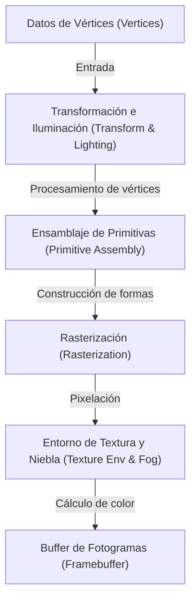
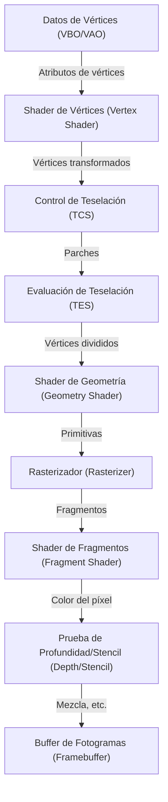
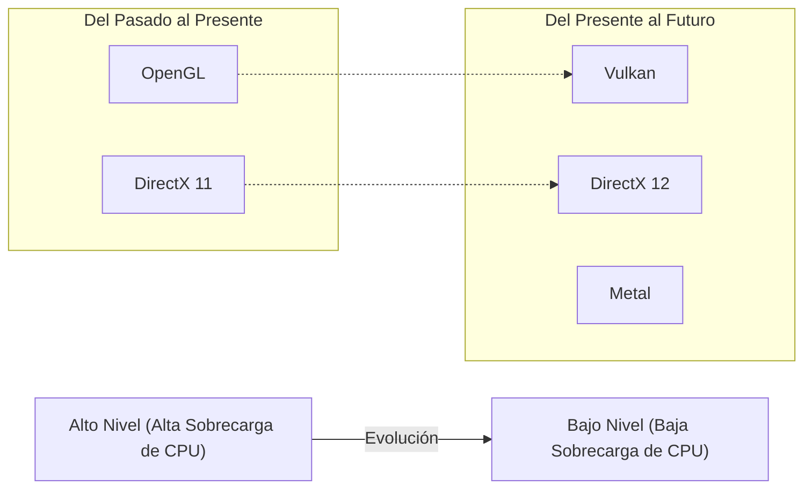

# 1. Introducción

Los gráficos 3D en la informática moderna ya no son exclusivos de unos pocos especialistas. Los juegos en smartphones, la visualización de datos en navegadores web, los efectos visuales (VFX) en películas, el software CAD, la RV/RA (VR/AR); la tecnología de gráficos 3D se utiliza en todas partes. Sin embargo, para que estas tecnologías llegaran a estar tan extendidas como lo están hoy, hubo una larga batalla por la estandarización del software (APIs) en paralelo con la evolución del hardware.

En este artículo, nos centraremos en "OpenGL (Open Graphics Library)", que ha reinado durante mucho tiempo como el estándar de facto para las APIs de gráficos 3D. Empezaremos por el trasfondo histórico de cómo nació y evolucionó OpenGL, y luego profundizaremos en el funcionamiento del pipeline moderno de gráficos programables, los fundamentos matemáticos que utilizan operaciones con matrices, y ejemplos de implementación concretos utilizando C/C++ y GLSL.

---

# 2. La historia de OpenGL: De SGI e IRIS GL al estándar de la industria

## 2.1 El nacimiento de Silicon Graphics, Inc. (SGI) e IRIS GL

Durante los años 80 y 90, el rey absoluto en el campo de los gráficos por ordenador (CG) en 3D era Silicon Graphics, Inc. (SGI), fundada por Jim Clark. Las estaciones de trabajo de SGI estaban equipadas con hardware gráfico dedicado y contaban con un rendimiento de renderizado 3D sin precedentes para la época. Es famoso el uso de ordenadores SGI para la producción de CG en películas como "Jurassic Park" y "Terminator 2".

Para aprovechar al máximo el rendimiento del hardware de SGI, se desarrolló una API de gráficos propietaria llamada "IRIS GL (Integrated Raster Imaging System Graphics Library)". IRIS GL fue diseñada para permitir a los programadores manejar fácilmente el dibujo de polígonos, la iluminación, la eliminación de superficies ocultas utilizando un Z-buffer, etc., sin tener que preocuparse por los complejos detalles del hardware.

Sin embargo, IRIS GL tenía un gran problema: era "altamente dependiente del hardware de SGI". IRIS GL había crecido hasta convertirse en una enorme API que incluía hasta el control de sistemas de ventanas y dispositivos de entrada, lo que hacía extremadamente difícil su migración a otras plataformas (como las estaciones de trabajo de Sun Microsystems o HP, o los emergentes PCs).

## 2.2 La transición hacia los estándares abiertos y el nacimiento de OpenGL

A principios de los años 90, a medida que se intensificaba la competencia en el mercado de gráficos 3D, SGI decidió reorganizar y abstraer IRIS GL con el fin de popularizar su tecnología y establecer una API estándar en la industria que también funcionara en el hardware de otras empresas.

Al separar la dependencia del sistema de ventanas y las funciones específicas de SGI de IRIS GL, "OpenGL" se rediseñó como una API abierta puramente para el renderizado de gráficos 3D. En 1992, se anunció oficialmente OpenGL 1.0.

Para definir y gestionar las especificaciones de OpenGL, se creó el "OpenGL Architecture Review Board (ARB)", en el que participaban grandes empresas como SGI, DEC, IBM, Intel y Microsoft. Esto permitió a OpenGL pasar de ser una tecnología propietaria de una sola empresa a convertirse en un estándar para toda la industria.

## 2.3 Del pipeline de funciones fijas al pipeline programable

Las primeras versiones de OpenGL (1.x hasta principios de la 2.x) adoptaron una arquitectura llamada "Pipeline de funciones fijas (Fixed-Function Pipeline)". En este sistema, procesos como la iluminación, las transformaciones y el mapeo de texturas estaban fijos dentro del hardware, y los programadores solo tenían que establecer los parámetros (posición y color de la luz, propiedades de los materiales, etc.) para que se realizara el renderizado.



El pipeline de funciones fijas era muy fácil de usar y era ideal para que los principiantes aprendieran gráficos 3D. (Muchos recordarán funciones como `glBegin()`, `glEnd()`, `glVertex3f()`).

Sin embargo, en la década de 2000, con la rápida evolución de las GPUs (Graphics Processing Units), los desarrolladores empezaron a exigir "hacer nuestro propio sombreado (shading)" y "procesar rápidamente en hardware expresiones irreales (NPR) como el renderizado tipo toon".

En respuesta a esto, en OpenGL 2.0 (2004) se introdujo "GLSL (OpenGL Shading Language)", permitiendo que partes del procesamiento de la GPU fueran reemplazadas por programas (shaders) escritos por el programador. Finalmente, con el Core Profile de OpenGL 3.1 (2009) y OpenGL 3.2, el pipeline de funciones fijas se desaprobó (y posteriormente se eliminó), haciendo una transición completa hacia un "pipeline programable".

---

# 3. OpenGL moderno y detalles del pipeline de gráficos

En el OpenGL moderno (Core Profile de la versión 3.3 y posteriores), los programadores deben controlar cada etapa del pipeline de gráficos por sí mismos. El flujo del pipeline se muestra en el siguiente diagrama:



## 3.1 El papel de cada etapa

1. **Shader de Vértices (Vertex Shader)**: Obligatorio. Se ejecuta para cada vértice de entrada. Su función principal es transformar las coordenadas locales de los vértices a coordenadas en pantalla (espacio de recorte).
2. **Shaders de Teselación (Tessellation Shaders)**: Opcional. Divide los polígonos en polígonos más finos para generar formas más detalladas.
3. **Shader de Geometría (Geometry Shader)**: Opcional. Recibe un conjunto de vértices (puntos, líneas, triángulos) y puede generar o descartar nuevas formas.
4. **Rasterizador (Rasterizer)**: Función fija. Convierte las formas matemáticas (polígonos) en "fragmentos" que corresponden a los píxeles de la pantalla. Aquí se interpolan los atributos entre los vértices (Interpolation).
5. **Shader de Fragmentos (Fragment Shader)**: Obligatorio. Se ejecuta para cada fragmento, calculando el color final del píxel (RGBA) y el valor de profundidad. Aquí es donde tiene lugar el muestreo de texturas y el cálculo de la iluminación.
6. **Pruebas diversas y mezcla (Blending)**: Pruebas de profundidad (dando prioridad a dibujar las cosas que están delante), prueba de stencil, mezcla alfa, etc., antes de escribirse finalmente en el framebuffer.

---

# 4. Matemáticas de matrices y transformación de coordenadas

Para dibujar objetos del espacio 3D en una pantalla 2D, es necesario transformar una serie de sistemas de coordenadas (espacios) en orden. Esto se logra mediante álgebra lineal con "Matrices".

## 4.1 Transformación del espacio local al espacio de la pantalla

Normalmente, se multiplican las siguientes tres matrices para realizar la transformación. A esto se le llama **Matriz MVP (Model-View-Projection Matrix)**.

$$
V_{clip} = M_{projection} \cdot M_{view} \cdot M_{model} \cdot V_{local}
$$

1. **Matriz de Modelo ($M_{model}$)**:
   Coloca el sistema de coordenadas local propio del objeto (Local Space) en el sistema de coordenadas de todo el mundo (World Space). Realiza la traslación (Translation), rotación (Rotation) y escalado (Scaling).
2. **Matriz de Vista ($M_{view}$)**:
   Transforma las coordenadas del espacio mundial en el espacio visto desde la cámara (View Space / Camera Space). Mover la cámara hacia atrás es lo mismo que mover todo el mundo hacia adelante.
3. **Matriz de Proyección ($M_{projection}$)**:
   Transforma el espacio de la vista en el espacio de recorte (Clip Space). Hay proyección en perspectiva (Perspective Projection) y proyección ortogonal (Orthographic Projection). En el caso de la perspectiva, crea el efecto de que las cosas lejanas se ven más pequeñas.

## 4.2 Estructura de la matriz de proyección en perspectiva

La matriz de proyección en perspectiva es muy importante. Usando el campo de visión (FOV), la relación de aspecto (Aspect), el plano cercano (Near) y el plano lejano (Far), se construye la siguiente matriz de 4x4:

$$
\begin{bmatrix}
\frac{1}{\text{aspect} \cdot \tan(\text{fov}/2)} & 0 & 0 & 0 \\
0 & \frac{1}{\tan(\text{fov}/2)} & 0 & 0 \\
0 & 0 & -\frac{\text{far} + \text{near}}{\text{far} - \text{near}} & -\frac{2 \cdot \text{far} \cdot \text{near}}{\text{far} - \text{near}} \\
0 & 0 & -1 & 0
\end{bmatrix}
$$

Esta matriz altera el componente W (sistema de coordenadas homogéneas) de las coordenadas del vértice, y mediante la subsiguiente "División de Perspectiva (Perspective Divide)", las coordenadas x, y, z se mapean al sistema de Coordenadas de Dispositivo Normalizadas (NDC) de -1.0 a 1.0.

---

# 5. Fundamentos de GLSL (OpenGL Shading Language)

Usamos GLSL, que tiene una sintaxis similar a C, para escribir programas que se ejecutan en la GPU.

## 5.1 Shader de Vértices (Vertex Shader)

```glsl
#version 330 core
layout (location = 0) in vec3 aPos;     // Posición del vértice
layout (location = 1) in vec2 aTexCoord; // Coordenadas de textura

out vec2 TexCoord; // Variable a pasar al shader de fragmentos

uniform mat4 model;
uniform mat4 view;
uniform mat4 projection;

void main()
{
    // Multiplicar por la matriz MVP para transformar a coordenadas de recorte
    gl_Position = projection * view * model * vec4(aPos, 1.0);
    TexCoord = aTexCoord;
}
```

## 5.2 Shader de Fragmentos (Fragment Shader)

```glsl
#version 330 core
out vec4 FragColor;

in vec2 TexCoord; // Se pasa interpolado desde el shader de vértices

uniform sampler2D texture1; // Unidad de textura

void main()
{
    // Muestrear el color de la textura
    FragColor = texture(texture1, TexCoord);
}
```

---

# 6. Configuración e implementación de OpenGL moderno en C/C++

A continuación, mostramos el código básico para crear una ventana y dibujar un triángulo utilizando C++. Usaremos **GLFW** para la gestión de la ventana, y **GLAD** (o GLEW) para cargar los punteros a las funciones de OpenGL.

## 6.1 Inicialización y creación de la ventana

```cpp
#include <glad/glad.h>
#include <GLFW/glfw3.h>
#include <iostream>

// Callback al redimensionar la ventana
void framebuffer_size_callback(GLFWwindow* window, int width, int height) {
    glViewport(0, 0, width, height);
}

int main() {
    // 1. Inicialización de GLFW
    glfwInit();
    // Especificar OpenGL 3.3 Core Profile
    glfwWindowHint(GLFW_CONTEXT_VERSION_MAJOR, 3);
    glfwWindowHint(GLFW_CONTEXT_VERSION_MINOR, 3);
    glfwWindowHint(GLFW_OPENGL_PROFILE, GLFW_OPENGL_CORE_PROFILE);

#ifdef __APPLE__
    glfwWindowHint(GLFW_OPENGL_FORWARD_COMPAT, GL_TRUE); // Para macOS
#endif

    // 2. Creación de la ventana
    GLFWwindow* window = glfwCreateWindow(800, 600, "LearnOpenGL", NULL, NULL);
    if (window == NULL) {
        std::cout << "Failed to create GLFW window" << std::endl;
        glfwTerminate();
        return -1;
    }
    glfwMakeContextCurrent(window);
    glfwSetFramebufferSizeCallback(window, framebuffer_size_callback);

    // 3. Inicialización de GLAD (Carga los punteros de las funciones de OpenGL específicos del SO)
    if (!gladLoadGLLoader((GLADloadproc)glfwGetProcAddress)) {
        std::cout << "Failed to initialize GLAD" << std::endl;
        return -1;
    }

    // Continúa...
```

## 6.2 Construcción de los datos de vértices y buffers (VAO, VBO)

En OpenGL moderno, es necesario transferir los datos de los vértices a la memoria de la GPU (VRAM) y definir el diseño de esos datos.

```cpp
    // Datos de vértices (X, Y, Z)
    float vertices[] = {
        -0.5f, -0.5f, 0.0f, // Abajo izquierda
         0.5f, -0.5f, 0.0f, // Abajo derecha
         0.0f,  0.5f, 0.0f  // Arriba
    };

    unsigned int VBO, VAO;
    // Generación y vinculación del VAO (Vertex Array Object)
    glGenVertexArrays(1, &VAO);
    glBindVertexArray(VAO);

    // Generación y vinculación del VBO (Vertex Buffer Object)
    glGenBuffers(1, &VBO);
    glBindBuffer(GL_ARRAY_BUFFER, VBO);
    
    // Transferir datos a la GPU
    glBufferData(GL_ARRAY_BUFFER, sizeof(vertices), vertices, GL_STATIC_DRAW);

    // Configuración del puntero de atributo de vértice (location = 0)
    glVertexAttribPointer(0, 3, GL_FLOAT, GL_FALSE, 3 * sizeof(float), (void*)0);
    glEnableVertexAttribArray(0);

    // Desvincular (por seguridad)
    glBindBuffer(GL_ARRAY_BUFFER, 0); 
    glBindVertexArray(0);
```

## 6.3 Bucle principal (Renderizado)

Después de compilar y enlazar los shaders (aquí asumimos que está encapsulado en una función), entramos en el bucle principal de renderizado.

```cpp
    // Carga y compilación del programa de shaders (implementación omitida)
    // unsigned int shaderProgram = LoadShaders("vertex.glsl", "fragment.glsl");

    // Bucle principal
    while (!glfwWindowShouldClose(window)) {
        // Procesamiento de entrada (como salir con la tecla Escape)
        if (glfwGetKey(window, GLFW_KEY_ESCAPE) == GLFW_PRESS)
            glfwSetWindowShouldClose(window, true);

        // 1. Limpiar la pantalla
        glClearColor(0.2f, 0.3f, 0.3f, 1.0f);
        glClear(GL_COLOR_BUFFER_BIT | GL_DEPTH_BUFFER_BIT);

        // 2. Activar el shader
        // glUseProgram(shaderProgram);

        // 3. Vincular el VAO y dibujar
        glBindVertexArray(VAO);
        glDrawArrays(GL_TRIANGLES, 0, 3);

        // 4. Intercambiar buffers y realizar pooling de eventos
        glfwSwapBuffers(window);
        glfwPollEvents();
    }

    // Liberación de recursos
    glDeleteVertexArrays(1, &VAO);
    glDeleteBuffers(1, &VBO);
    // glDeleteProgram(shaderProgram);

    glfwTerminate();
    return 0;
}
```

---

# 7. El presente y futuro de OpenGL (Vulkan, Metal, DirectX 12)

Originado a partir de la tecnología propietaria IRIS GL de SGI, y nacido en 1992, OpenGL ha sustentado la industria como la API estándar multiplataforma durante más de un cuarto de siglo. Sin embargo, en relación a la arquitectura de hardware moderna (CPUs multinúcleo y enormes GPUs especializadas en el procesamiento en paralelo), la filosofía de diseño de OpenGL como una "única y gigantesca máquina de estados" está llegando a sus límites.

Debido a que OpenGL tiene muchos estados globales, es difícil generar comandos de dibujo en multihilo y tiene el problema fundamental de que la sobrecarga en la CPU tiende a ser alta.

Para resolver este problema, ha surgido una nueva generación de APIs que proporcionan capas de abstracción más finas y de bajo nivel, permitiendo a los desarrolladores controlar minuciosamente la memoria de la GPU y el procesamiento sincrónico.
* **Vulkan**: Una API multiplataforma que se puede considerar la sucesora de OpenGL, desarrollada por el Khronos Group, que también administra OpenGL.
* **DirectX 12**: Una API de bajo nivel proporcionada por Microsoft para Windows y Xbox.
* **Metal**: Una API propietaria proporcionada por Apple para macOS e iOS (Apple ha desaprobado OpenGL).



## 7.1 Aún así, por qué tiene sentido aprender OpenGL

Incluso hoy en día, cuando las nuevas APIs de bajo nivel se están convirtiendo en la corriente principal, no se ha perdido el sentido de aprender OpenGL. Las razones son las siguientes:

1. **Curva de aprendizaje más baja**: Vulkan o DirectX 12 requieren cientos o miles de líneas de código y configuraciones complejas simplemente para dibujar el primer triángulo en la pantalla. Por el contrario, OpenGL sigue siendo una excelente puerta de entrada para aprender "la esencia de los gráficos 3D", como las bases del pipeline de gráficos, las operaciones matriciales y la programación de shaders.
2. **Una cantidad masiva de activos y comunidad existente**: En todo el mundo hay innumerables programas, motores y tutoriales escritos en OpenGL.
3. **WebGL**: WebGL, el estándar para renderizar gráficos 3D en el navegador, está basado en OpenGL ES. En el mundo del desarrollo web, los conocimientos de OpenGL siguen siendo directamente útiles.

# 8. Conclusión

OpenGL comenzó como la tecnología exclusiva para estaciones de trabajo SGI, creció hasta convertirse en un estándar de la industria y ha sustentado desde juegos hasta el cálculo científico-técnico en todos los ámbitos. Al repasar su historia y comprender sus mecanismos fundamentales, construirás una base sólida que será de gran valor para aprender tecnologías de próxima generación como Vulkan o WebGPU.

El mundo de la programación de gráficos es profundo; presenciar el momento en que fórmulas matemáticas y código se transforman en hermosos visuales en la pantalla proporciona una emoción inigualable que no se encuentra en otras ramas de la programación. Te animamos encarecidamente, usando este artículo como punto de partida, a escribir tu propio código de OpenGL y crear tus propios mundos en 3D.
