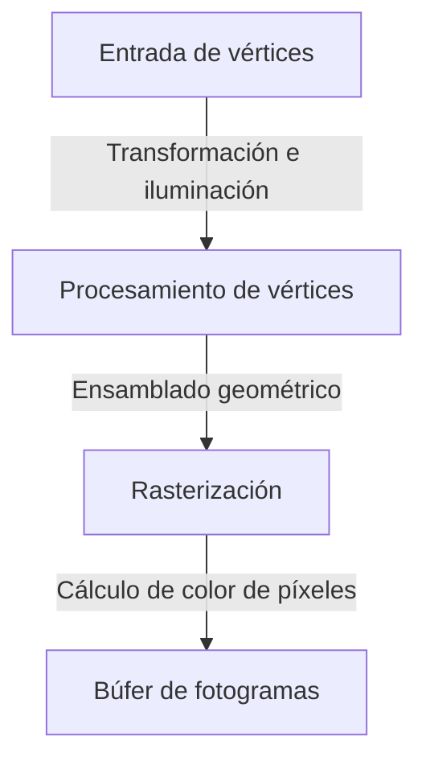
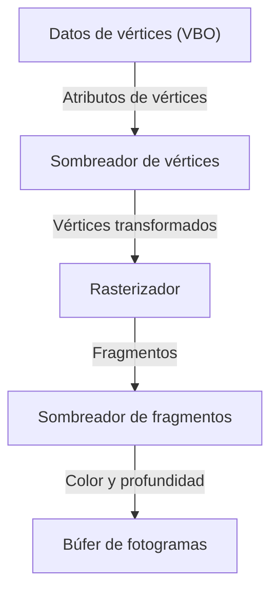

# 1. Introducción

En el entorno informático actual, los gráficos 3D se han convertido en un elemento indispensable. Desde videojuegos, efectos visuales (VFX) en el cine, CAD y aplicaciones para teléfonos inteligentes, hasta la visualización de datos en el navegador, nos beneficiamos a diario de la tecnología 3D. Sin embargo, el camino hacia la «estandarización» para ejecutar programas comunes en diferentes plataformas y, al mismo tiempo, aprovechar al máximo el rendimiento del hardware, estuvo lejos de ser sencillo.

En este artículo, exploraremos «OpenGL (Open Graphics Library)», que durante muchos años se mantuvo como el estándar de facto entre las API de gráficos 3D. Comenzando por el trasfondo histórico de cómo evolucionó desde el estándar propietario de una sola empresa hacia un estándar abierto, analizaremos exhaustivamente el funcionamiento de la canalización gráfica programable moderna, los fundamentos matemáticos de las operaciones matriciales para proyectar el espacio 3D en una pantalla 2D, e incluso ejemplos prácticos de implementación utilizando C/C++ y GLSL.

# 2. La historia de OpenGL: La transición desde un estándar propietario

## 2.1 El auge de SGI e IRIS GL

Entre las décadas de 1980 y 1990, Silicon Graphics, Inc. (SGI) gozaba de un dominio abrumador en el campo de los gráficos por computadora en 3D. Las estaciones de trabajo de SGI estaban equipadas con hardware gráfico dedicado y eran ampliamente adoptadas en la industria cinematográfica y en instituciones de investigación.

Desarrollada para el hardware de SGI, la API gráfica conocida como «IRIS GL» era sumamente potente y fácil de usar; sin embargo, tenía el grave inconveniente de depender fuertemente del hardware y del sistema de ventanas de SGI, lo que dificultaba enormemente su portabilidad a otros sistemas.

## 2.2 El nacimiento de un estándar abierto

Al entrar en la década de 1990, a medida que mejoraba el rendimiento de los PC y de las estaciones de trabajo de otros fabricantes, intensificando la competencia en el mercado gráfico, SGI dio un paso estratégico para popularizar ampliamente su tecnología. Dicho paso fue el anuncio (en 1992) de «OpenGL», rediseñada como una API abierta para renderizado 3D puro tras desacoplar las partes dependientes del hardware de IRIS GL.

La especificación de OpenGL pasó a estar gestionada por el «OpenGL Architecture Review Board (ARB)», compuesto por empresas líderes como SGI, IBM, DEC, Microsoft e Intel, consolidando así su posición como un estándar para toda la industria sin atarse a una plataforma específica.

## 2.3 El cambio de paradigma hacia lo programable

Las primeras versiones de OpenGL adoptaron una arquitectura conocida como «canalización de función fija» (fixed-function pipeline). En este enfoque, procesos como la iluminación y las transformaciones de coordenadas estaban predefinidos en el hardware (o controlador), y los desarrolladores realizaban el renderizado simplemente configurando parámetros.



Aunque este método resultaba sencillo de manejar para los principiantes, dificultaba enormemente la implementación de sombreados personalizados (como el renderizado tipo cómic o toon shading) y efectos avanzados. Para dar respuesta a esto, con OpenGL 2.0 (2004) se introdujo «GLSL (OpenGL Shading Language)», evolucionando hacia una «canalización programable» en la que los desarrolladores pueden programar directamente el comportamiento de la GPU. En la actualidad, las funciones fijas han quedado obsoletas o se han eliminado por completo, siendo indispensable el uso de shaders para un renderizado flexible.

# 3. La canalización en el OpenGL moderno

En el OpenGL moderno (Core Profile), los desarrolladores deben controlar detalladamente cada etapa de la canalización gráfica.



1. **Sombreador de vértices (Vertex Shader)**:
   Se ejecuta para cada vértice de entrada. Su función principal es transformar las coordenadas locales del modelo al sistema de coordenadas de recorte (clip space) vistas desde la cámara.
2. **Rasterizador (Rasterizer)**:
   Descompone e interpola los polígonos (como triángulos) formados por los vértices en «fragmentos», que se corresponden con los píxeles en pantalla.
3. **Sombreador de fragmentos (Fragment Shader)**:
   Calcula el color final (RGB) de cada fragmento. Aquí es donde se llevan a cabo principalmente el mapeo de texturas y los cálculos de iluminación.

# 4. Fundamentos de operaciones matriciales y transformaciones de coordenadas

Para renderizar correctamente un objeto del espacio 3D en un monitor 2D, es indispensable realizar transformaciones de coordenadas mediante matrices (Matrix). Por lo general, la transformación se realiza multiplicando las siguientes tres matrices, lo que comúnmente se conoce como matriz MVP (Model-View-Projection).

- **Matriz de modelo (Model Matrix)**:
  Ubica el objeto desde su propio espacio local hacia el sistema de coordenadas absoluto de toda la escena (espacio mundial o world space). Incluye traslación, rotación y escalado.
- **Matriz de vista (View Matrix)**:
  Transforma las coordenadas del espacio mundial al espacio observado desde la perspectiva de la cámara (espacio de vista o view space).
- **Matriz de proyección (Projection Matrix)**:
  Transforma las coordenadas del espacio de vista al espacio de recorte (clip space). Aquí se calcula la proyección en perspectiva, que aplica el efecto de profundidad (los objetos lejanos se ven más pequeños), entre otros tipos de proyección.

# 5. Ejemplos de implementación con GLSL y C/C++

A continuación, se muestra un ejemplo básico de código de shaders en GLSL para renderizar un triángulo utilizando OpenGL moderno.

## 5.1 Ejemplo de sombreador de vértices

```glsl
#version 330 core
layout (location = 0) in vec3 aPos;

uniform mat4 model;
uniform mat4 view;
uniform mat4 projection;

void main()
{
    gl_Position = projection * view * model * vec4(aPos, 1.0);
}
```

## 5.2 Ejemplo de sombreador de fragmentos

```glsl
#version 330 core
out vec4 FragColor;

void main()
{
    FragColor = vec4(1.0, 0.5, 0.2, 1.0); // Salida de color naranja
}
```

En el lado de C/C++, se utiliza una biblioteca como GLFW para crear la ventana y transferir a la GPU los datos de los vértices (VBO: Vertex Buffer Object) junto con la disposición de sus atributos (VAO: Vertex Array Object). Luego, dentro del bucle principal, se limpia la pantalla y se emite la orden de renderizado mediante funciones como `glDrawArrays` utilizando el programa de sombreado configurado.

# 6. El futuro de las API de gráficos

Aunque OpenGL ha sostenido a la industria durante muchos años, su filosofía de diseño clásica (una máquina de estados masiva) se ha convertido en un cuello de botella para aprovechar al máximo el rendimiento de las CPU multinúcleo y las GPU hiperparalelas contemporáneas.

Por este motivo, hoy en día se está migrando hacia API de próxima generación (como Vulkan, DirectX 12 y Metal) que permiten un control de bajo nivel mucho más cercano al hardware y están optimizadas para el renderizado multihilo. No obstante, dado que los procedimientos de inicialización de estas API modernas son sumamente complejos, OpenGL sigue conservando un enorme valor pedagógico como API introductoria y educativa para asimilar los conceptos fundamentales de los gráficos 3D (canalizaciones, transformaciones matriciales y sombreadores).

Dominar primero los fundamentos de la programación 3D con OpenGL para luego dar el salto a tecnologías como Vulkan según las necesidades sigue siendo una de las rutas de aprendizaje más recomendadas en la actualidad.
