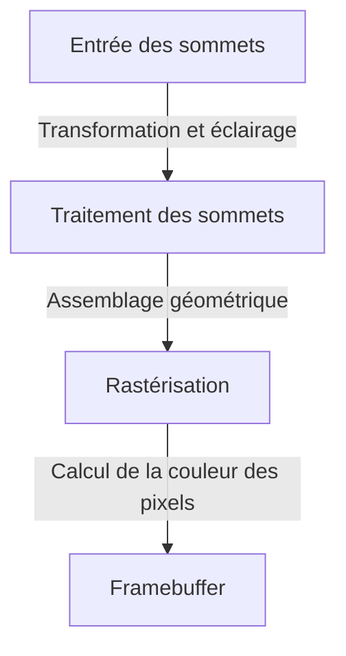
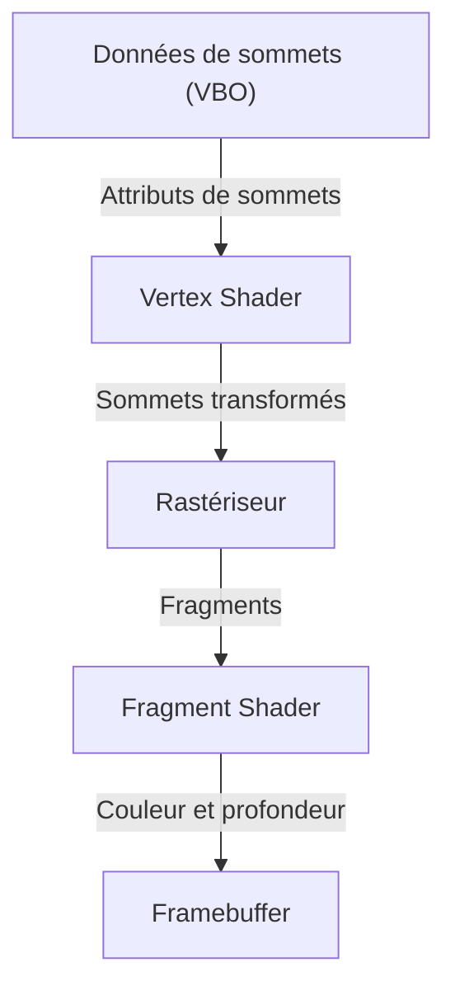

# 1. Introduction

Dans l'environnement informatique contemporain, les graphismes 3D sont devenus un élément incontournable. Des jeux vidéo aux effets visuels (VFX) du cinéma, en passant par la CAO, les applications mobiles et la visualisation de données dans les navigateurs web, nous bénéficions quotidiennement des technologies 3D. Cependant, la voie vers la « standardisation », visant à tirer le meilleur parti des performances matérielles tout en exécutant un programme commun sur différentes plateformes, n'a absolument pas été un long fleuve tranquille.

Cet article explore « OpenGL » (Open Graphics Library), qui a régné pendant de nombreuses années comme le standard de facto des API graphiques 3D. En partant du contexte historique qui a vu son évolution d'un format propriétaire vers un standard ouvert, nous aborderons le fonctionnement du pipeline graphique programmable moderne, les bases mathématiques des calculs matriciels nécessaires pour projeter un espace 3D sur un écran 2D, jusqu'à des exemples concrets d'implémentation en C/C++ et GLSL.

# 2. L'histoire d'OpenGL : s'émanciper des formats propriétaires

## 2.1 L'essor de SGI et d'IRIS GL

Dans les années 1980 et 1990, Silicon Graphics, Inc. (SGI) exerçait une domination écrasante dans le domaine de l'infographie 3D. Les stations de travail de SGI intégraient du matériel graphique dédié et étaient massivement adoptées par l'industrie cinématographique et les instituts de recherche.

C'est pour le matériel de SGI que l'API graphique « IRIS GL » a été développée. Bien qu'IRIS GL fût extrêmement puissante et conviviale, elle souffrait d'un défaut majeur : elle dépendait étroitement du matériel et du système de fenêtrage de SGI, ce qui rendait sa portabilité vers d'autres systèmes extrêmement limitée.

## 2.2 La naissance d'un standard ouvert

Au début des années 1990, avec la montée en puissance des PC et des stations de travail concurrentes ainsi que l'intensification de la concurrence sur le marché du graphisme, SGI prit une initiative stratégique pour démocratiser sa technologie : dissocier les composants dépendants du matériel d'IRIS GL et la repenser sous la forme d'une API ouverte purement dédiée au rendu 3D. C'est ainsi qu'est né « OpenGL », annoncé en 1992.

Les spécifications d'OpenGL ont été confiées à la gestion de l'« OpenGL Architecture Review Board (ARB) », un consortium regroupant des entreprises majeures telles que SGI, IBM, DEC, Microsoft et Intel. OpenGL a ainsi assis sa position de standard industriel indépendant de toute plateforme spécifique.

## 2.3 Le changement de paradigme vers le programmable

Les premières versions d'OpenGL utilisaient une architecture appelée « pipeline à fonctions fixes » (Fixed-Function Pipeline). Dans ce modèle, les opérations telles que l'éclairage et les transformations de coordonnées étaient figées du côté matériel (ou pilote), et le programmeur se contentait de configurer des paramètres pour effectuer le rendu.



Bien que cette méthode fût accessible aux débutants, il était difficile d'implémenter des rendus d'ombrage personnalisés (comme le cel-shading / toon rendering) ou des effets avancés. Pour surmonter cette limitation, OpenGL 2.0 (en 2004) a introduit « GLSL » (OpenGL Shading Language), amorçant l'évolution vers un « pipeline programmable » où les développeurs pouvaient programmer directement le fonctionnement du GPU. Aujourd'hui, les fonctions fixes sont dépréciées ou complètement supprimées, et le rendu s'appuie désormais systématiquement sur des shaders pour une flexibilité maximale.

# 3. Le pipeline moderne d'OpenGL

Avec l'OpenGL moderne (Core Profile), les développeurs doivent contrôler précisément chaque étape du pipeline graphique.



1. **Shader de sommets (Vertex Shader)** :
   Exécuté pour chaque sommet en entrée. Son rôle principal est de transformer les coordonnées locales du modèle en coordonnées d'écrêtage (clip coordinates) vues depuis la caméra.
2. **Rastériseur (Rasterizer)** :
   Décompose et interpole les polygones (comme les triangles) formés par les sommets en « fragments », qui correspondent aux pixels sur l'écran.
3. **Shader de fragments (Fragment Shader)** :
   Calcule la couleur finale (RVB) de chaque fragment. C'est principalement ici que sont appliquées les textures et calculés les éclairages.

# 4. Fondamentaux des opérations matricielles et des transformations de coordonnées

Pour afficher correctement un objet de l'espace 3D sur un moniteur 2D, les transformations de coordonnées à l'aide de matrices sont indispensables. En règle générale, la transformation s'effectue en multipliant les trois matrices suivantes, collectivement appelées matrice MVP (Model-View-Projection) :

- **Matrice de modèle (Model Matrix)** :
  Positionne l'objet depuis son espace local vers le système de coordonnées absolu du monde (espace monde). Elle englobe les translations, rotations et mises à l'échelle.
- **Matrice de vue (View Matrix)** :
  Transforme les coordonnées de l'espace monde vers l'espace vu depuis la caméra (espace vue).
- **Matrice de projection (Projection Matrix)** :
  Transforme les coordonnées de l'espace vue en espace d'écrêtage (clip space). C'est à ce niveau qu'est calculée la projection perspective (qui fait paraître plus petits les objets éloignés), entre autres.

# 5. Exemple d'implémentation en C/C++ et GLSL

Voici un exemple basique de code shader GLSL pour afficher un triangle avec l'OpenGL moderne.

## 5.1 Exemple de Vertex Shader

```glsl
#version 330 core
layout (location = 0) in vec3 aPos;

uniform mat4 model;
uniform mat4 view;
uniform mat4 projection;

void main()
{
    gl_Position = projection * view * model * vec4(aPos, 1.0);
}
```

## 5.2 Exemple de Fragment Shader

```glsl
#version 330 core
out vec4 FragColor;

void main()
{
    FragColor = vec4(1.0, 0.5, 0.2, 1.0); // Sortie : couleur orange
}
```

Du côté de C/C++, une bibliothèque comme GLFW est généralement utilisée pour créer la fenêtre et transférer les données de sommets (VBO : Vertex Buffer Object) ainsi que la disposition de leurs attributs (VAO : Vertex Array Object) vers le GPU. Ensuite, dans la boucle principale, l'écran est effacé et l'instruction de rendu est exécutée avec des fonctions telles que `glDrawArrays` en utilisant le programme de shader configuré.

# 6. L'avenir des API graphiques

Bien qu'OpenGL ait soutenu l'industrie pendant de nombreuses années, son paradigme de conception vieillissant (une énorme machine à états) devient un goulot d'étranglement pour exploiter pleinement la puissance des processeurs multicœurs et des GPU massivement parallèles actuels.

Par conséquent, la transition s'opère aujourd'hui vers des API de nouvelle génération (Vulkan, DirectX 12, Metal, etc.), optimisées pour le rendu multithread et offrant un contrôle de plus bas niveau, plus proche du matériel. Toutefois, ces API modernes requièrent une initialisation extrêmement complexe. C'est pourquoi OpenGL conserve une immense valeur éducative et introductive pour appréhender les concepts fondamentaux des graphismes 3D (le pipeline, les transformations matricielles, les shaders).

Maîtriser d'abord les bases de la programmation 3D avec OpenGL, puis évoluer vers Vulkan ou d'autres technologies selon les besoins du projet, reste aujourd'hui l'un des parcours d'apprentissage les plus recommandés.
