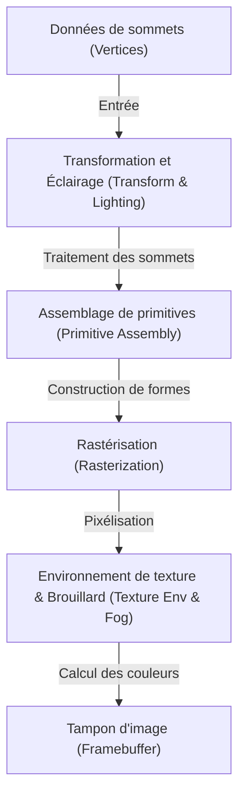
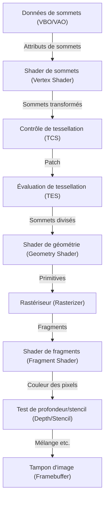
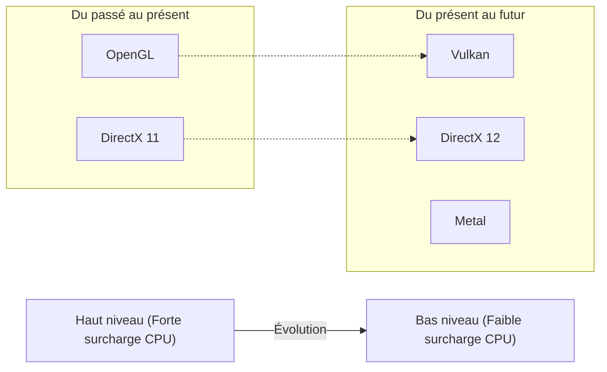

# 1. Introduction

Les graphismes 3D dans l'informatique moderne ne sont plus réservés à quelques experts. Les jeux sur smartphones, la visualisation de données dans les navigateurs web, les effets visuels (VFX) au cinéma, les logiciels de CAO, la réalité virtuelle/augmentée (VR/AR), etc. : les technologies de graphisme 3D sont utilisées partout. Cependant, avant que ces technologies ne se répandent aussi largement qu'aujourd'hui, il y a eu une longue bataille pour la standardisation des logiciels (API) en parallèle de l'évolution du matériel.

Dans cet article, nous nous concentrons sur « OpenGL (Open Graphics Library) », qui a régné pendant de nombreuses années comme la norme de facto des API de graphismes 3D. En commençant par le contexte historique de la naissance et de l'évolution d'OpenGL, nous plongerons en profondeur dans les mécanismes du pipeline graphique programmable moderne, le contexte mathématique à l'aide d'opérations matricielles, et enfin, des exemples concrets d'implémentation utilisant C/C++ et GLSL.

---

# 2. L'histoire d'OpenGL : de SGI et IRIS GL vers une norme standard

## 2.1 Silicon Graphics, Inc. (SGI) et la naissance d'IRIS GL

Des années 1980 aux années 1990, Silicon Graphics, Inc. (SGI), fondée par Jim Clark, régnait en maître absolu dans le domaine de l'infographie 3D (CG). Les stations de travail de SGI étaient équipées de matériel graphique dédié et offraient des performances de rendu 3D exceptionnelles pour l'époque. Il est bien connu que les ordinateurs SGI ont été utilisés pour la production d'images de synthèse de films tels que *Jurassic Park* et *Terminator 2*.

Afin de tirer le meilleur parti des performances du matériel de SGI, une API graphique propriétaire appelée « IRIS GL (Integrated Raster Imaging System Graphics Library) » a été développée. IRIS GL a été conçue pour permettre aux programmeurs de gérer facilement le dessin de polygones, l'éclairage et l'élimination des faces cachées par Z-buffer (tampon de profondeur) sans avoir à se soucier des détails matériels complexes.

Cependant, IRIS GL présentait un problème majeur : elle était « fortement dépendante du matériel SGI ». IRIS GL était devenue une API massive incluant même le contrôle du système de fenêtrage et des périphériques d'entrée, ce qui rendait son portage vers d'autres plateformes (par exemple, les stations de travail Sun Microsystems ou HP, ou les PC émergents) extrêmement difficile.

## 2.2 Transition vers un standard ouvert et la naissance d'OpenGL

Au début des années 1990, alors que la concurrence sur le marché des graphismes 3D s'intensifiait, SGI a pris la décision de réorganiser et d'abstraire IRIS GL afin de populariser sa technologie et de créer une API standard pour l'industrie qui pourrait également fonctionner sur le matériel d'autres sociétés.

En séparant les dépendances au système de fenêtrage et les fonctionnalités spécifiques à SGI d'IRIS GL, elle a été repensée comme une API ouverte purement dédiée au rendu de graphismes 3D sous le nom d'« OpenGL ». En 1992, OpenGL 1.0 a été officiellement annoncé.

Pour formuler et gérer les spécifications d'OpenGL, le « OpenGL Architecture Review Board (ARB) » a été créé avec la participation d'entreprises majeures telles que SGI, DEC, IBM, Intel et Microsoft. Grâce à cela, OpenGL est passé d'une technologie propriétaire d'une seule entreprise à une norme standard pour l'ensemble de l'industrie.

## 2.3 Du pipeline à fonctions fixes au pipeline programmable

Les premières versions d'OpenGL (1.x à la première moitié de 2.x) adoptaient une architecture appelée « Pipeline à fonctions fixes (Fixed-Function Pipeline) ». Dans celle-ci, des processus tels que l'éclairage, les transformations et le placage de texture étaient fixés au sein du matériel, et les programmeurs n'avaient qu'à définir des paramètres (comme la position et la couleur de la lumière, les propriétés des matériaux) pour effectuer le rendu.



Le pipeline à fonctions fixes était très facile à utiliser et idéal pour les débutants apprenant les graphismes 3D (beaucoup se souviennent probablement de fonctions telles que `glBegin()`, `glEnd()` et `glVertex3f()`).

Cependant, dans les années 2000, avec l'évolution rapide des processeurs graphiques (GPU), les développeurs ont commencé à exiger de pouvoir « effectuer leur propre ombrage personnalisé (shading) » et « traiter rapidement au niveau matériel des rendus irréalistes (NPR) comme le cel-shading ».

En réponse à cela, OpenGL 2.0 (2004) a introduit « GLSL (OpenGL Shading Language) », permettant de remplacer une partie du traitement du GPU par des programmes (shaders) écrits par les programmeurs. Ensuite, avec OpenGL 3.1 (2009) et le Core Profile d'OpenGL 3.2, le pipeline à fonctions fixes a été déprécié (puis supprimé), marquant la transition complète vers un « pipeline programmable ».

---

# 3. L'OpenGL moderne et les détails du pipeline graphique

Dans l'OpenGL moderne (Core Profile à partir de la version 3.3), les programmeurs doivent contrôler eux-mêmes chaque étape du pipeline graphique. Le flux du pipeline est illustré dans la figure ci-dessous.



## 3.1 Le rôle de chaque étape

1. **Shader de sommets (Vertex Shader)** : Obligatoire. Exécuté pour chaque sommet en entrée. Son rôle principal est de transformer les coordonnées locales du sommet en coordonnées à l'écran (espace de découpage).
2. **Shaders de tessellation (Tessellation Shaders)** : Optionnel. Divise les polygones en polygones plus petits pour générer des formes détaillées.
3. **Shader de géométrie (Geometry Shader)** : Optionnel. Reçoit un ensemble de sommets (point, ligne, triangle) et peut générer de nouvelles formes ou les supprimer.
4. **Rastériseur (Rasterizer)** : Fonction fixe. Convertit les formes mathématiques (polygones) en « fragments » correspondant aux pixels de l'écran. C'est ici que les attributs entre les sommets sont interpolés.
5. **Shader de fragments (Fragment Shader)** : Obligatoire. Exécuté pour chaque fragment afin de calculer la couleur finale du pixel (RGBA) et la valeur de profondeur. C'est ici qu'ont lieu l'échantillonnage des textures et les calculs d'éclairage.
6. **Tests divers et Mélange (Blending)** : Test de profondeur (donne la priorité à ce qui est au premier plan), test de stencil, mélange alpha (alpha blending), etc., avant l'écriture finale dans le tampon d'image.

---

# 4. Mathématiques des matrices et des transformations de coordonnées

Pour dessiner des objets d'un espace 3D sur un écran 2D, il est nécessaire de transformer séquentiellement plusieurs systèmes de coordonnées (espaces). Cela est réalisé via l'algèbre linéaire en utilisant des « Matrices (Matrix) ».

## 4.1 Transformation de l'espace local à l'espace de l'écran

Généralement, la transformation s'effectue en multipliant les trois matrices suivantes. C'est ce qu'on appelle la **matrice MVP (Model-View-Projection Matrix)**.

$$
V_{clip} = M_{projection} \cdot M_{view} \cdot M_{model} \cdot V_{local}
$$

1. **Matrice de Modèle ($M_{model}$)** :
   Place le système de coordonnées local (Local Space) de l'objet lui-même dans le système de coordonnées global (World Space). Elle gère la translation (Translation), la rotation (Rotation) et la mise à l'échelle (Scaling).
2. **Matrice de Vue ($M_{view}$)** :
   Transforme les coordonnées de l'espace global en un espace vu depuis la caméra/le point de vue (View Space / Camera Space). Reculer la caméra équivaut à avancer le monde entier.
3. **Matrice de Projection ($M_{projection}$)** :
   C'est la transformation de l'espace de vue vers l'espace de découpage (Clip Space). Il existe la projection perspective (Perspective Projection) et la projection orthogonale (Orthographic Projection). La projection perspective crée un effet où les objets éloignés semblent plus petits (perspective).

## 4.2 Structure de la matrice de projection perspective

La matrice de projection perspective est extrêmement importante. En utilisant l'angle de champ (FOV), le rapport d'aspect (Aspect), le plan rapproché (Near) et le plan éloigné (Far), une matrice 4x4 comme celle-ci est construite :

$$
\begin{bmatrix}
\frac{1}{\text{aspect} \cdot \tan(\text{fov}/2)} & 0 & 0 & 0 \\
0 & \frac{1}{\tan(\text{fov}/2)} & 0 & 0 \\
0 & 0 & -\frac{\text{far} + \text{near}}{\text{far} - \text{near}} & -\frac{2 \cdot \text{far} \cdot \text{near}}{\text{far} - \text{near}} \\
0 & 0 & -1 & 0
\end{bmatrix}
$$

Cette matrice modifie la composante W (coordonnées homogènes) des coordonnées du sommet, puis la « division perspective (Perspective Divide) » qui suit mappe les coordonnées x, y, z dans le système de coordonnées de périphérique normalisées (NDC : Normalized Device Coordinates) allant de -1.0 à 1.0.

---

# 5. Les bases de GLSL (OpenGL Shading Language)

Nous utilisons GLSL, dont la syntaxe est similaire à celle du langage C, pour écrire des programmes qui s'exécutent sur le GPU.

## 5.1 Shader de sommets (Vertex Shader)

```glsl
#version 330 core
layout (location = 0) in vec3 aPos;     // Position du sommet
layout (location = 1) in vec2 aTexCoord; // Coordonnées de texture

out vec2 TexCoord; // Variable passée au shader de fragments

uniform mat4 model;
uniform mat4 view;
uniform mat4 projection;

void main()
{
    // Multiplication par la matrice MVP pour la transformation vers l'espace de découpage
    gl_Position = projection * view * model * vec4(aPos, 1.0);
    TexCoord = aTexCoord;
}
```

## 5.2 Shader de fragments (Fragment Shader)

```glsl
#version 330 core
out vec4 FragColor;

in vec2 TexCoord; // Interpolé et transmis depuis le shader de sommets

uniform sampler2D texture1; // Unité de texture

void main()
{
    // Échantillonnage de la couleur depuis la texture
    FragColor = texture(texture1, TexCoord);
}
```

---

# 6. Configuration et implémentation de l'OpenGL moderne en C/C++

À partir d'ici, nous allons montrer le code de base pour créer une fenêtre et dessiner un triangle en utilisant réellement C++. Nous utiliserons **GLFW** pour la gestion des fenêtres et **GLAD** (ou GLEW) pour charger les pointeurs de fonctions d'OpenGL.

## 6.1 Initialisation et création de la fenêtre

```cpp
#include <glad/glad.h>
#include <GLFW/glfw3.h>
#include <iostream>

// Callback lors du redimensionnement de la fenêtre
void framebuffer_size_callback(GLFWwindow* window, int width, int height) {
    glViewport(0, 0, width, height);
}

int main() {
    // 1. Initialisation de GLFW
    glfwInit();
    // Spécification d'OpenGL 3.3 Core Profile
    glfwWindowHint(GLFW_CONTEXT_VERSION_MAJOR, 3);
    glfwWindowHint(GLFW_CONTEXT_VERSION_MINOR, 3);
    glfwWindowHint(GLFW_OPENGL_PROFILE, GLFW_OPENGL_CORE_PROFILE);

#ifdef __APPLE__
    glfwWindowHint(GLFW_OPENGL_FORWARD_COMPAT, GL_TRUE); // Pour macOS
#endif

    // 2. Création de la fenêtre
    GLFWwindow* window = glfwCreateWindow(800, 600, "LearnOpenGL", NULL, NULL);
    if (window == NULL) {
        std::cout << "Failed to create GLFW window" << std::endl;
        glfwTerminate();
        return -1;
    }
    glfwMakeContextCurrent(window);
    glfwSetFramebufferSizeCallback(window, framebuffer_size_callback);

    // 3. Initialisation de GLAD (chargement des pointeurs de fonctions OpenGL spécifiques à l'OS)
    if (!gladLoadGLLoader((GLADloadproc)glfwGetProcAddress)) {
        std::cout << "Failed to initialize GLAD" << std::endl;
        return -1;
    }

    // Suite...
```

## 6.2 Construction des données de sommets et des tampons (VAO, VBO)

Dans l'OpenGL moderne, il est nécessaire de transférer les données de sommets vers la mémoire du GPU (VRAM) et de définir la disposition de ces données.

```cpp
    // Données de sommets (X, Y, Z)
    float vertices[] = {
        -0.5f, -0.5f, 0.0f, // En bas à gauche
         0.5f, -0.5f, 0.0f, // En bas à droite
         0.0f,  0.5f, 0.0f  // En haut
    };

    unsigned int VBO, VAO;
    // Génération et liaison du VAO (Vertex Array Object)
    glGenVertexArrays(1, &VAO);
    glBindVertexArray(VAO);

    // Génération et liaison du VBO (Vertex Buffer Object)
    glGenBuffers(1, &VBO);
    glBindBuffer(GL_ARRAY_BUFFER, VBO);
    
    // Transfert des données vers le GPU
    glBufferData(GL_ARRAY_BUFFER, sizeof(vertices), vertices, GL_STATIC_DRAW);

    // Configuration du pointeur d'attributs de sommets (location = 0)
    glVertexAttribPointer(0, 3, GL_FLOAT, GL_FALSE, 3 * sizeof(float), (void*)0);
    glEnableVertexAttribArray(0);

    // Déliement (par sécurité)
    glBindBuffer(GL_ARRAY_BUFFER, 0); 
    glBindVertexArray(0);
```

## 6.3 Boucle principale (Rendu)

Après avoir géré la compilation et l'édition des liens des shaders (que l'on suppose encapsulées dans une fonction ici), nous entrons dans la boucle de rendu principale.

```cpp
    // Chargement et compilation du programme shader (implémentation omise)
    // unsigned int shaderProgram = LoadShaders("vertex.glsl", "fragment.glsl");

    // Boucle principale
    while (!glfwWindowShouldClose(window)) {
        // Gestion des entrées (Fermeture avec la touche Échap etc.)
        if (glfwGetKey(window, GLFW_KEY_ESCAPE) == GLFW_PRESS)
            glfwSetWindowShouldClose(window, true);

        // 1. Nettoyage de l'écran
        glClearColor(0.2f, 0.3f, 0.3f, 1.0f);
        glClear(GL_COLOR_BUFFER_BIT | GL_DEPTH_BUFFER_BIT);

        // 2. Activation du shader
        // glUseProgram(shaderProgram);

        // 3. Liaison du VAO et dessin
        glBindVertexArray(VAO);
        glDrawArrays(GL_TRIANGLES, 0, 3);

        // 4. Échange des tampons et scrutation des événements
        glfwSwapBuffers(window);
        glfwPollEvents();
    }

    // Libération des ressources
    glDeleteVertexArrays(1, &VAO);
    glDeleteBuffers(1, &VBO);
    // glDeleteProgram(shaderProgram);

    glfwTerminate();
    return 0;
}
```

---

# 7. État actuel et futur d'OpenGL (Vulkan, Metal, DirectX 12)

Partant d'une technologie propriétaire pour les stations de travail SGI et né en 1992, OpenGL a soutenu l'industrie en tant qu'API multiplateforme standard pendant plus d'un quart de siècle. Cependant, par rapport aux architectures matérielles modernes (processeurs multicœurs et énormes GPU spécialisés dans le traitement parallèle), la philosophie de conception d'OpenGL, celle d'une « unique machine à états globale », atteint ses limites.

Comme OpenGL possède de nombreux états globaux, il est difficile de générer des commandes de dessin de manière multithreadée, et l'API souffre du problème fondamental d'une surcharge (overhead) importante du CPU.

Pour résoudre ce problème, une nouvelle génération d'API a fait son apparition. Elles fournissent une couche d'abstraction plus fine et de plus bas niveau, permettant aux développeurs de contrôler précisément la mémoire du GPU et les processus de synchronisation.
* **Vulkan** : Une API multiplateforme qui peut être considérée comme le successeur d'OpenGL, développée par le Khronos Group qui gère OpenGL.
* **DirectX 12** : Une API bas niveau fournie par Microsoft pour Windows et Xbox.
* **Metal** : L'API propriétaire d'Apple pour macOS et iOS (Apple a déprécié OpenGL).



## 7.1 Pourquoi il est toujours pertinent d'apprendre OpenGL

Même si les nouvelles API de bas niveau deviennent la norme, l'intérêt d'apprendre OpenGL n'est en aucun cas perdu. Voici pourquoi :

1. **Faible coût d'apprentissage** : Avec Vulkan ou DirectX 12, dessiner le premier triangle à l'écran nécessite de centaines à des milliers de lignes de code et une configuration complexe. En revanche, OpenGL reste excellent comme point d'entrée pour apprendre « l'essence de l'infographie 3D », telle que les bases du pipeline graphique, les calculs matriciels et la programmation de shaders.
2. **Une immense quantité de ressources existantes et une communauté** : Il existe d'innombrables logiciels, moteurs et tutoriels écrits en OpenGL à travers le monde.
3. **WebGL** : WebGL, la norme standard pour le rendu de graphiques 3D dans un navigateur, est basé sur OpenGL ES. Dans le monde du Web, les connaissances en OpenGL sont encore très directement utiles.

# 8. Conclusion

Parti d'une technologie propriétaire pour les stations de travail de SGI, devenu une norme de l'industrie, et ayant soutenu tous les domaines, des jeux aux calculs scientifiques, OpenGL a une riche histoire. Revenir sur cette histoire et comprendre ses mécanismes fondamentaux constituera une base solide pour apprendre les technologies de nouvelle génération comme Vulkan ou WebGPU.

Le monde de la programmation graphique est profond, et le moment où les formules mathématiques et le code se transforment en magnifiques visuels à l'écran offre une émotion que l'on ne retrouve dans aucune autre forme de programmation. Nous espérons que cet article vous incitera à écrire réellement du code OpenGL et à construire votre propre monde en 3D.
