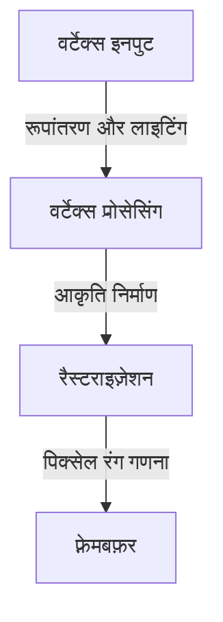
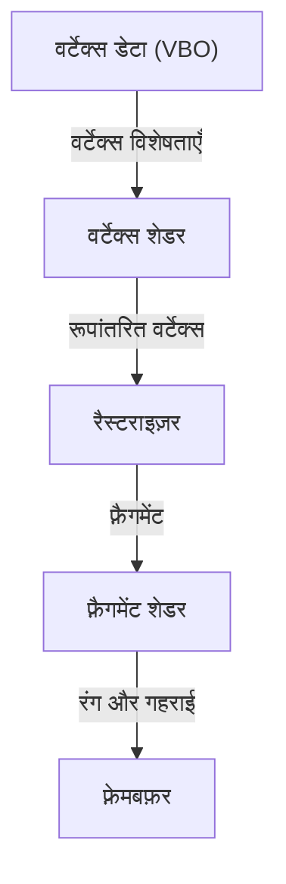

# 1. प्रस्तावना

आधुनिक कंप्यूटिंग परिवेश में, 3D ग्राफिक्स एक अनिवार्य हिस्सा बन चुका है। वीडियो गेम, फिल्मों के VFX, CAD, स्मार्टफोन ऐप्स से लेकर वेब ब्राउज़र में डेटा विज़ुअलाइज़ेशन तक, हम हर दिन 3D तकनीक से लाभान्वित होते हैं। हालांकि, हार्डवेयर के प्रदर्शन का अधिकतम लाभ उठाते हुए विभिन्न प्लेटफ़ॉर्मों पर एक ही प्रोग्राम को चलाने के लिए "मानकीकरण" की राह बिल्कुल भी आसान नहीं थी।

इस लेख में, हम "OpenGL (Open Graphics Library)" के बारे में विस्तार से चर्चा करेंगे, जो वर्षों से 3D ग्राफिक्स API के वास्तविक मानक (डी फैक्टो स्टैंडर्ड) के रूप में काबिज रहा है। किसी एक कंपनी के मालिकाना (proprietary) मानक से एक खुले मानक (open standard) के रूप में इसके विकास के ऐतिहासिक परिप्रेक्ष्य से लेकर, आधुनिक प्रोग्रामेबल ग्राफिक्स पाइपलाइन की कार्यप्रणाली, 3D स्पेस को 2D स्क्रीन पर प्रस्तुत करने के लिए मैट्रिक्स संचालन के गणितीय आधार, और C/C++ तथा GLSL के उपयोग से व्यावहारिक कार्यान्वयन के उदाहरणों तक को हम समग्र रूप से समझेंगे।

# 2. OpenGL का इतिहास: मालिकाना मानकों से मुक्ति

## 2.1 SGI और IRIS GL का उदय

1980 के दशक से 1990 के दशक तक, 3D कंप्यूटर ग्राफिक्स के क्षेत्र में Silicon Graphics, Inc. (SGI) का भारी दबदबा था। SGI के वर्कस्टेशन विशेष ग्राफिक्स हार्डवेयर से लैस थे, और फिल्म उद्योग तथा अनुसंधान संस्थानों में इनका व्यापक रूप से उपयोग किया जाता था।

SGI के इस हार्डवेयर के लिए "IRIS GL" नामक एक ग्राफिक्स API विकसित किया गया था। IRIS GL बेहद शक्तिशाली और उपयोग में आसान था, लेकिन यह SGI के हार्डवेयर और विंडो सिस्टम पर बहुत अधिक निर्भर था, जिसके कारण अन्य प्रणालियों में इसे पोर्ट करना अत्यंत कठिन था—यह इसकी एक गंभीर खामी थी।

## 2.2 ओपन स्टैंडर्ड का जन्म

1990 के दशक की शुरुआत में, PC और अन्य कंपनियों के वर्कस्टेशनों के प्रदर्शन में सुधार हुआ और ग्राफिक्स बाजार में प्रतिस्पर्धा तेज हो गई। ऐसे में SGI ने अपनी तकनीक को व्यापक रूप से लोकप्रिय बनाने के लिए एक बड़ा कदम उठाया। उन्होंने IRIS GL से हार्डवेयर-निर्भर हिस्से को अलग किया और विशुद्ध 3D रेंडरिंग के लिए एक ओपन API के रूप में इसे फिर से डिज़ाइन किया, जिसे 1992 में "OpenGL" के नाम से पेश किया गया।

OpenGL के विनिर्देशों का प्रबंधन "OpenGL Architecture Review Board (ARB)" द्वारा किया जाने लगा, जिसमें SGI, IBM, DEC, Microsoft और Intel जैसी प्रमुख कंपनियाँ शामिल थीं। इस प्रकार इसने किसी विशिष्ट प्लेटफ़ॉर्म से बंधे बिना पूरे उद्योग के लिए एक मानक के रूप में अपनी स्थिति मजबूत की।

## 2.3 प्रोग्रामेबल आर्किटेक्चर की ओर बदलाव

शुरुआती OpenGL ने "फिक्स्ड-फंक्शन पाइपलाइन" (Fixed-Function Pipeline) नामक आर्किटेक्चर का इस्तेमाल किया। इसमें लाइटिंग और निर्देशांक रूपांतरण जैसी प्रक्रियाएं हार्डवेयर (या ड्राइवर) स्तर पर तय होती थीं, और डेवलपर्स केवल पैरामीटर सेट करके रेंडरिंग करते थे।



यह तरीका शुरुआती उपयोगकर्ताओं के लिए आसान था, लेकिन कस्टम शेडिंग (जैसे तून रेंडरिंग) या उन्नत विज़ुअल इफेक्ट्स को लागू करना बेहद कठिन था। इस जरूरत को पूरा करने के लिए, OpenGL 2.0 (2004) में "GLSL (OpenGL Shading Language)" को शामिल किया गया, और यह एक "प्रोग्रामेबल पाइपलाइन" के रूप में विकसित हुआ जहाँ डेवलपर्स सीधे GPU के व्यवहार को प्रोग्राम कर सकते थे। आज, फिक्स्ड-फंक्शन को अप्रचलित (deprecated) या पूरी तरह से हटा दिया गया है, और शेडर्स का उपयोग करके लचीली रेंडरिंग करना ही मानक तरीका है।

# 3. आधुनिक OpenGL की पाइपलाइन

आधुनिक OpenGL (Core Profile) में, डेवलपर्स को ग्राफिक्स पाइपलाइन के प्रत्येक चरण (stage) को बारीकी से नियंत्रित करना होता है।



1. **वर्टेक्स शेडर (Vertex Shader)**:
   यह प्रत्येक इनपुट वर्टेक्स (शीर्ष) के लिए निष्पादित होता है। मॉडल के स्थानीय निर्देशांकों को कैमरा परिप्रेक्ष्य के क्लिप निर्देशांक प्रणाली में बदलना इसका मुख्य कार्य है।
2. **रैस्टराइज़र (Rasterizer)**:
   यह वर्टिसेस से बने बहुभुजों (जैसे त्रिकोण) को स्क्रीन के पिक्सल के अनुरूप "फ़्रैगमेंट" में विभाजित और इंटरपोलेट करता है।
3. **फ़्रैगमेंट शेडर (Fragment Shader)**:
   यह प्रत्येक फ़्रैगमेंट के अंतिम रंग (RGB) की गणना करता है। टेक्सचर मैपिंग और लाइटिंग की गणना मुख्य रूप से यहीं की जाती है।

# 4. मैट्रिक्स संचालन और निर्देशांक रूपांतरण की बुनियादी बातें

3D स्पेस में स्थित किसी वस्तु को 2D मॉनिटर पर सही ढंग से प्रदर्शित करने के लिए, मैट्रिक्स (Matrix) का उपयोग करके निर्देशांक रूपांतरण करना अनिवार्य है। आमतौर पर, निम्नलिखित तीन मैट्रिक्स को गुणा करके यह रूपांतरण किया जाता है। इसे MVP मैट्रिक्स (Model-View-Projection) कहा जाता है।

- **मॉडल मैट्रिक्स (Model Matrix)**:
  यह ऑब्जेक्ट को उसके स्थानीय स्पेस से पूरी दुनिया के निरपेक्ष निर्देशांक प्रणाली (world space) में रखता है। इसमें ट्रांसलेशन (स्थान परिवर्तन), रोटेशन (घूर्णन), और स्केलिंग (आकार बदलना) शामिल हैं।
- **व्यू मैट्रिक्स (View Matrix)**:
  यह वर्ल्ड स्पेस के निर्देशांकों को कैमरे के दृष्टिकोण से देखे जाने वाले स्पेस (view space) में परिवर्तित करता है।
- **प्रोजेक्शन मैट्रिक्स (Projection Matrix)**:
  यह व्यू स्पेस के निर्देशांकों को क्लिप स्पेस (clip space) में परिवर्तित करता है। यहीं पर परिप्रेक्ष्य (perspective projection), जिससे दूर की वस्तुएं छोटी दिखाई देती हैं, की गणना की जाती है।

# 5. GLSL और C/C++ के साथ कार्यान्वयन का उदाहरण

यहाँ आधुनिक OpenGL का उपयोग करके एक त्रिकोण (triangle) को रेंडर करने के लिए बुनियादी GLSL शेडर कोड का उदाहरण दिया गया है।

## 5.1 वर्टेक्स शेडर का उदाहरण

```glsl
#version 330 core
layout (location = 0) in vec3 aPos;

uniform mat4 model;
uniform mat4 view;
uniform mat4 projection;

void main()
{
    gl_Position = projection * view * model * vec4(aPos, 1.0);
}
```

## 5.2 फ़्रैगमेंट शेडर का उदाहरण

```glsl
#version 330 core
out vec4 FragColor;

void main()
{
    FragColor = vec4(1.0, 0.5, 0.2, 1.0); // नारंगी रंग आउटपुट करता है
}
```

C/C++ की ओर, GLFW जैसी लाइब्रेरी का उपयोग करके एक विंडो बनाई जाती है, और वर्टेक्स डेटा (VBO: Vertex Buffer Object) तथा वर्टेक्स एट्रिब्यूट लेआउट (VAO: Vertex Array Object) को GPU में स्थानांतरित किया जाता है। इसके बाद मुख्य लूप (main loop) के भीतर स्क्रीन को साफ़ किया जाता है, और कॉन्फ़िगर किए गए शेडर प्रोग्राम का उपयोग करके `glDrawArrays` जैसे फ़ंक्शन के साथ रेंडरिंग कमांड जारी किए जाते हैं।

# 6. ग्राफिक्स API का भविष्य

OpenGL ने कई वर्षों तक इस उद्योग का नेतृत्व किया है, लेकिन हाल के मल्टी-कोर CPU और बड़े पैमाने पर समानांतर (massively parallel) GPU के प्रदर्शन का पूरी तरह से लाभ उठाने में इसका पुराना डिज़ाइन दर्शन (एक विशाल स्टेट मशीन) एक बाधा (bottleneck) बनता जा रहा है।

इसी कारण से, आज अधिक हार्डवेयर-स्तरीय नियंत्रण प्रदान करने वाले और मल्टी-थ्रेडेड रेंडरिंग के लिए अनुकूलित अगली पीढ़ी के API (जैसे Vulkan, DirectX 12, Metal आदि) की ओर रुख किया जा रहा है। हालाँकि, इन आधुनिक API में इनिशियलाइज़ेशन प्रक्रिया बेहद जटिल होती है, इसलिए 3D ग्राफिक्स की मूलभूत अवधारणाओं (पाइपलाइन, मैट्रिक्स रूपांतरण, शेडर्स) को सीखने के लिए एक परिचयात्मक और शैक्षिक API के रूप में OpenGL का मूल्य आज भी बहुत अधिक है।

पहले OpenGL के माध्यम से 3D प्रोग्रामिंग की बुनियादी समझ हासिल करना और फिर अपनी आवश्यकताओं के आधार पर Vulkan जैसे आधुनिक API की ओर बढ़ना, आज भी सबसे अनुशंसित शिक्षण मार्गों में से एक है।
