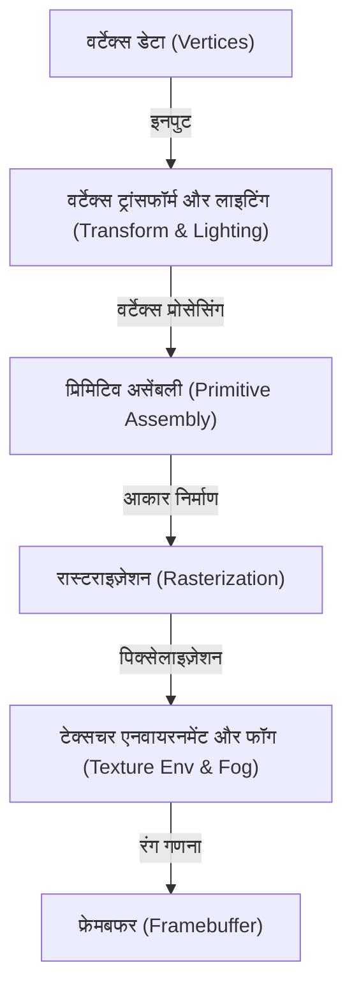
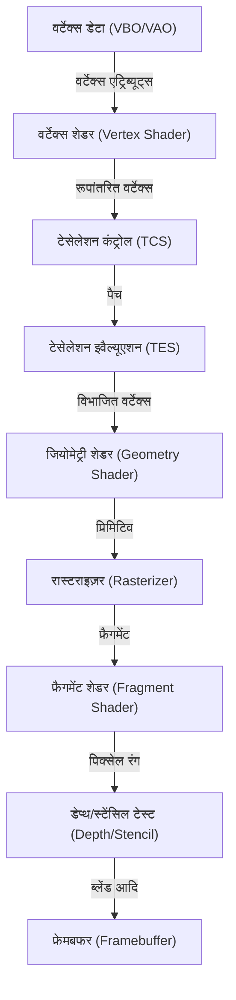

# 1. परिचय

आधुनिक कंप्यूटरों में 3D ग्राफिक्स अब केवल कुछ विशेषज्ञों तक सीमित नहीं है। स्मार्टफोन पर गेम, वेब ब्राउज़र में डेटा विज़ुअलाइज़ेशन, फिल्मों में VFX, CAD सॉफ्टवेयर, VR/AR आदि, 3D ग्राफिक्स तकनीक का उपयोग हर जगह किया जा रहा है। हालाँकि, इस तकनीक के आज की तरह व्यापक रूप से लोकप्रिय होने से पहले, हार्डवेयर के विकास के समानांतर, सॉफ्टवेयर (API) मानकीकरण की एक लंबी लड़ाई थी।

इस लेख में, हम "OpenGL (Open Graphics Library)" पर ध्यान केंद्रित करेंगे, जिसने लंबे समय तक 3D ग्राफिक्स API के वास्तविक मानक के रूप में राज किया है। OpenGL की उत्पत्ति कैसे हुई और यह कैसे विकसित हुआ, इस ऐतिहासिक पृष्ठभूमि से शुरू करते हुए, हम आधुनिक प्रोग्रामेबल ग्राफिक्स पाइपलाइन के तंत्र, मैट्रिक्स संचालन का उपयोग करने वाली गणितीय पृष्ठभूमि, और C/C++ व GLSL का उपयोग करके विशिष्ट कार्यान्वयन उदाहरणों पर गहराई से चर्चा करेंगे।

---

# 2. OpenGL का इतिहास: SGI और IRIS GL से एक मानक तक का सफर

## 2.1 Silicon Graphics, Inc. (SGI) और IRIS GL का जन्म

1980 और 1990 के दशक में, 3D कंप्यूटर ग्राफिक्स (CG) के क्षेत्र में निर्विवाद राजा जिम क्लार्क द्वारा स्थापित Silicon Graphics, Inc. (SGI) था। SGI के वर्कस्टेशन समर्पित ग्राफिक्स हार्डवेयर से लैस थे, जो उस समय के लिए अभूतपूर्व 3D रेंडरिंग प्रदर्शन का दावा करते थे। यह प्रसिद्ध है कि SGI कंप्यूटर का उपयोग 'जुरासिक पार्क' और 'टर्मिनेटर 2' जैसी फिल्मों के CG उत्पादन में किया गया था।

SGI के हार्डवेयर के प्रदर्शन को अधिकतम करने के लिए विकसित किया गया एक मालिकाना ग्राफिक्स API "IRIS GL (Integrated Raster Imaging System Graphics Library)" था। IRIS GL को इस तरह से डिज़ाइन किया गया था कि प्रोग्रामर हार्डवेयर के जटिल विवरणों की चिंता किए बिना आसानी से पॉलीगॉन ड्रॉइंग, लाइटिंग और Z-बफ़र हिडन-सरफेस रिमूवल को संभाल सकें।

हालाँकि, IRIS GL के साथ एक बड़ी समस्या थी। यह "SGI हार्डवेयर पर अत्यधिक निर्भर" था। IRIS GL एक विशाल API के रूप में विकसित हो गया था जिसमें विंडो सिस्टम और इनपुट डिवाइस नियंत्रण भी शामिल थे, जिससे इसे अन्य प्लेटफ़ॉर्म (जैसे Sun Microsystems या HP वर्कस्टेशन, या उभरते हुए PC) पर पोर्ट करना बेहद मुश्किल हो गया।

## 2.2 खुले मानकों की ओर संक्रमण और OpenGL का जन्म

1990 के दशक की शुरुआत में, जैसे-जैसे 3D ग्राफिक्स बाजार में प्रतिस्पर्धा तेज हुई, SGI ने अपनी तकनीक को लोकप्रिय बनाने और एक उद्योग-मानक API बनाने के लिए IRIS GL को सुव्यवस्थित और अमूर्त करने का निर्णय लिया जो अन्य कंपनियों के हार्डवेयर पर भी काम कर सके।

IRIS GL से विंडो सिस्टम निर्भरता और SGI-विशिष्ट सुविधाओं को अलग करके, "OpenGL" को शुद्ध 3D ग्राफिक्स रेंडरिंग के लिए एक खुले API के रूप में फिर से डिज़ाइन किया गया। 1992 में, OpenGL 1.0 को आधिकारिक तौर पर जारी किया गया।

OpenGL विनिर्देशों को विकसित और प्रबंधित करने के लिए "OpenGL Architecture Review Board (ARB)" की स्थापना की गई थी, जिसमें SGI, DEC, IBM, Intel और Microsoft जैसी प्रमुख कंपनियों ने भाग लिया। इसने OpenGL को एक कंपनी की मालिकाना तकनीक से संपूर्ण उद्योग के लिए एक मानक में बदल दिया।

## 2.3 फिक्स्ड-फंक्शन पाइपलाइन से प्रोग्रामेबल पाइपलाइन तक

शुरुआती OpenGL (1.x से 2.x के पहले भाग तक) ने "फिक्स्ड-फंक्शन पाइपलाइन (Fixed-Function Pipeline)" नामक एक आर्किटेक्चर का उपयोग किया। इसका मतलब था कि लाइटिंग, ट्रांसफ़ॉर्म और टेक्सचर मैपिंग जैसी प्रक्रियाएँ हार्डवेयर के भीतर तय थीं, और प्रोग्रामर केवल पैरामीटर (जैसे प्रकाश की स्थिति और रंग, सामग्री के गुण, आदि) सेट करके रेंडर कर सकते थे।



फिक्स्ड-फंक्शन पाइपलाइन का उपयोग करना बहुत आसान था, जो शुरुआती लोगों के लिए 3D ग्राफिक्स सीखने के लिए इसे आदर्श बनाता था। (आप में से बहुत से लोग `glBegin()`, `glEnd()`, `glVertex3f()` जैसे कार्यों को याद कर सकते हैं)।

हालाँकि, 2000 के दशक में GPU (Graphics Processing Unit) के विकास में काफी तेजी आई, और डेवलपर्स ने "अपनी खुद की शेडिंग (shading) करने" और "हार्डवेयर के साथ कार्टून रेंडरिंग जैसे अवास्तविक (NPR) भावों को तेजी से संसाधित करने" की मांग शुरू कर दी।

इसकी प्रतिक्रिया में, OpenGL 2.0 (2004) में "GLSL (OpenGL Shading Language)" पेश किया गया, जिससे GPU प्रसंस्करण के कुछ हिस्सों को प्रोग्रामर द्वारा लिखे गए प्रोग्राम (शेडर्स) से बदला जा सका। फिर, OpenGL 3.1 (2009) और OpenGL 3.2 के कोर प्रोफ़ाइल (Core Profile) के साथ, फिक्स्ड-फंक्शन पाइपलाइन को हटा दिया गया (और बाद में पूरी तरह से मिटा दिया गया), और यह पूरी तरह से "प्रोग्रामेबल पाइपलाइन" में बदल गया।

---

# 3. आधुनिक OpenGL और ग्राफिक्स पाइपलाइन का विवरण

आधुनिक OpenGL (संस्करण 3.3 और उसके बाद की कोर प्रोफ़ाइल) में, प्रोग्रामर को स्वयं ग्राफिक्स पाइपलाइन के प्रत्येक चरण को नियंत्रित करना होता है। पाइपलाइन का प्रवाह नीचे दिए गए चित्र में दिखाया गया है।



## 3.1 प्रत्येक चरण की भूमिका

1. **वर्टेक्स शेडर (Vertex Shader)**: अनिवार्य। यह इनपुट किए गए प्रत्येक वर्टेक्स के लिए निष्पादित होता है। मुख्य भूमिका वर्टेक्स के स्थानीय निर्देशांकों को स्क्रीन निर्देशांकों (क्लिप स्पेस) में बदलना है।
2. **टेसेलेशन शेडर (Tessellation Shaders)**: वैकल्पिक। यह विस्तृत आकार बनाने के लिए पॉलीगॉन को छोटे पॉलीगॉन में विभाजित करता है।
3. **जियोमेट्री शेडर (Geometry Shader)**: वैकल्पिक। यह वर्टेक्स के एक सेट (बिंदु, रेखाएं, त्रिकोण) को स्वीकार करता है, और नए आकार बना सकता है या उन्हें नष्ट कर सकता है।
4. **रास्टराइज़र (Rasterizer)**: फिक्स्ड-फंक्शन। यह गणितीय आकृतियों (पॉलीगॉन) को "फ्रैगमेंट" में परिवर्तित करता है जो स्क्रीन पिक्सेल के अनुरूप होते हैं। वर्टेक्स के बीच के गुण यहाँ इंटरपोलेट (Interpolated) किए जाते हैं।
5. **फ्रैगमेंट शेडर (Fragment Shader)**: अनिवार्य। यह प्रत्येक फ्रैगमेंट के लिए निष्पादित होता है और अंतिम पिक्सेल रंग (RGBA) और गहराई मूल्य की गणना करता है। टेक्सचर सैंपलिंग और लाइटिंग गणना यहीं की जाती है।
6. **विभिन्न परीक्षण और ब्लेंडिंग**: डेप्थ टेस्ट (सामने की वस्तुओं को प्राथमिकता से रेंडर करना), स्टेंसिल टेस्ट, अल्फा ब्लेंडिंग आदि किए जाते हैं, और अंत में उन्हें फ्रेमबफर में लिखा जाता है।

---

# 4. मैट्रिक्स और निर्देशांक परिवर्तन का गणित

3D स्पेस में किसी ऑब्जेक्ट को 2D स्क्रीन पर रेंडर करने के लिए, हमें कई समन्वय प्रणालियों (स्थानों) को क्रमिक रूप से बदलना होगा। यह "मैट्रिक्स (Matrix)" रेखीय बीजगणित (linear algebra) के माध्यम से प्राप्त किया जाता है।

## 4.1 स्थानीय स्थान से स्क्रीन स्थान में रूपांतरण

आमतौर पर, रूपांतरण करने के लिए निम्नलिखित तीन मैट्रिक्स को एक साथ गुणा किया जाता है। इसे **MVP मैट्रिक्स (Model-View-Projection Matrix)** कहा जाता है।

$$
V_{clip} = M_{projection} \cdot M_{view} \cdot M_{model} \cdot V_{local}
$$

1. **मॉडल मैट्रिक्स ($M_{model}$)**:
   ऑब्जेक्ट की अपनी स्थानीय समन्वय प्रणाली (Local Space) को संपूर्ण विश्व की समन्वय प्रणाली (World Space) में रखता है। यह समानांतर गति (Translation), रोटेशन (Rotation), और स्केलिंग (Scaling) करता है।
2. **व्यू मैट्रिक्स ($M_{view}$)**:
   वर्ल्ड स्पेस निर्देशांकों को कैमरे (दृष्टिकोण) से देखे जाने वाले स्थान (View Space / Camera Space) में परिवर्तित करता है। कैमरे को पीछे ले जाना पूरी दुनिया को आगे ले जाने के समान है।
3. **प्रोजेक्शन मैट्रिक्स ($M_{projection}$)**:
   व्यू स्पेस से क्लिप स्पेस (Clip Space) में रूपांतरण। पर्सपेक्टिव प्रोजेक्शन (Perspective Projection) और ऑर्थोग्राफिक प्रोजेक्शन (Orthographic Projection) होते हैं। पर्सपेक्टिव प्रोजेक्शन दूर की चीजों को छोटा दिखने (perspective) का प्रभाव बनाता है।

## 4.2 पर्सपेक्टिव प्रोजेक्शन मैट्रिक्स की संरचना

पर्सपेक्टिव प्रोजेक्शन मैट्रिक्स बहुत महत्वपूर्ण है। फील्ड ऑफ व्यू (FOV), आस्पेक्ट रेशियो (Aspect), नियर प्लेन (Near) और फार प्लेन (Far) का उपयोग करके एक 4x4 मैट्रिक्स इस प्रकार बनाया गया है:

$$
\begin{bmatrix}
\frac{1}{\text{aspect} \cdot \tan(\text{fov}/2)} & 0 & 0 & 0 \\
0 & \frac{1}{\tan(\text{fov}/2)} & 0 & 0 \\
0 & 0 & -\frac{\text{far} + \text{near}}{\text{far} - \text{near}} & -\frac{2 \cdot \text{far} \cdot \text{near}}{\text{far} - \text{near}} \\
0 & 0 & -1 & 0
\end{bmatrix}
$$

यह मैट्रिक्स वर्टेक्स निर्देशांक के W घटक (सजातीय निर्देशांक प्रणाली) को बदलता है, और बाद के "पर्सपेक्टिव डिवाइड (Perspective Divide)" द्वारा, x, y, z निर्देशांकों को -1.0 से 1.0 के सामान्यीकृत उपकरण निर्देशांक प्रणाली (NDC: Normalized Device Coordinates) में मैप किया जाता है।

---

# 5. GLSL (OpenGL Shading Language) की मूल बातें

GLSL का उपयोग करके, जिसका सिंटैक्स C भाषा के समान है, हम GPU पर चलने वाले प्रोग्राम लिखते हैं।

## 5.1 वर्टेक्स शेडर (Vertex Shader)

```glsl
#version 330 core
layout (location = 0) in vec3 aPos;     // वर्टेक्स पोजीशन
layout (location = 1) in vec2 aTexCoord; // टेक्सचर निर्देशांक

out vec2 TexCoord; // फ्रैगमेंट शेडर को पास करने के लिए चर

uniform mat4 model;
uniform mat4 view;
uniform mat4 projection;

void main()
{
    // क्लिप निर्देशांक प्रणाली में बदलने के लिए MVP मैट्रिक्स से गुणा करें
    gl_Position = projection * view * model * vec4(aPos, 1.0);
    TexCoord = aTexCoord;
}
```

## 5.2 फ्रैगमेंट शेडर (Fragment Shader)

```glsl
#version 330 core
out vec4 FragColor;

in vec2 TexCoord; // वर्टेक्स शेडर से इंटरपोलेट करके पास किया गया

uniform sampler2D texture1; // टेक्सचर यूनिट

void main()
{
    // टेक्सचर से रंग का सैंपल लें
    FragColor = texture(texture1, TexCoord);
}
```

---

# 6. C/C++ का उपयोग करके आधुनिक OpenGL का सेटअप और कार्यान्वयन

यहाँ से, हम वास्तव में C++ का उपयोग करके विंडो बनाने और एक त्रिकोण बनाने के लिए बुनियादी कोड दिखाएंगे। हम विंडो प्रबंधन के लिए **GLFW** और OpenGL फ़ंक्शन पॉइंटर्स को लोड करने के लिए **GLAD** (या GLEW) का उपयोग करेंगे।

## 6.1 प्रारंभिकरण और विंडो निर्माण

```cpp
#include <glad/glad.h>
#include <GLFW/glfw3.h>
#include <iostream>

// विंडो आकार बदलने पर कॉलबैक
void framebuffer_size_callback(GLFWwindow* window, int width, int height) {
    glViewport(0, 0, width, height);
}

int main() {
    // 1. GLFW को प्रारंभ करें
    glfwInit();
    // OpenGL 3.3 कोर प्रोफ़ाइल निर्दिष्ट करें
    glfwWindowHint(GLFW_CONTEXT_VERSION_MAJOR, 3);
    glfwWindowHint(GLFW_CONTEXT_VERSION_MINOR, 3);
    glfwWindowHint(GLFW_OPENGL_PROFILE, GLFW_OPENGL_CORE_PROFILE);

#ifdef __APPLE__
    glfwWindowHint(GLFW_OPENGL_FORWARD_COMPAT, GL_TRUE); // macOS के लिए
#endif

    // 2. विंडो बनाएं
    GLFWwindow* window = glfwCreateWindow(800, 600, "LearnOpenGL", NULL, NULL);
    if (window == NULL) {
        std::cout << "Failed to create GLFW window" << std::endl;
        glfwTerminate();
        return -1;
    }
    glfwMakeContextCurrent(window);
    glfwSetFramebufferSizeCallback(window, framebuffer_size_callback);

    // 3. GLAD को प्रारंभ करें (OS-विशिष्ट OpenGL फ़ंक्शन पॉइंटर्स लोड करें)
    if (!gladLoadGLLoader((GLADloadproc)glfwGetProcAddress)) {
        std::cout << "Failed to initialize GLAD" << std::endl;
        return -1;
    }

    // आगे जारी...
```

## 6.2 वर्टेक्स डेटा और बफ़र निर्माण (VAO, VBO)

आधुनिक OpenGL में, वर्टेक्स डेटा को GPU मेमोरी (VRAM) में स्थानांतरित किया जाना चाहिए, और उस डेटा के लेआउट को परिभाषित किया जाना चाहिए।

```cpp
    // वर्टेक्स डेटा (X, Y, Z)
    float vertices[] = {
        -0.5f, -0.5f, 0.0f, // नीचे बाएँ
         0.5f, -0.5f, 0.0f, // नीचे दाएँ
         0.0f,  0.5f, 0.0f  // ऊपर
    };

    unsigned int VBO, VAO;
    // VAO (Vertex Array Object) जनरेट और बाइंड करें
    glGenVertexArrays(1, &VAO);
    glBindVertexArray(VAO);

    // VBO (Vertex Buffer Object) जनरेट और बाइंड करें
    glGenBuffers(1, &VBO);
    glBindBuffer(GL_ARRAY_BUFFER, VBO);
    
    // डेटा को GPU में स्थानांतरित करें
    glBufferData(GL_ARRAY_BUFFER, sizeof(vertices), vertices, GL_STATIC_DRAW);

    // वर्टेक्स एट्रिब्यूट पॉइंटर सेट करें (location = 0)
    glVertexAttribPointer(0, 3, GL_FLOAT, GL_FALSE, 3 * sizeof(float), (void*)0);
    glEnableVertexAttribArray(0);

    // बाइंड हटाएँ (सुरक्षा के लिए)
    glBindBuffer(GL_ARRAY_BUFFER, 0); 
    glBindVertexArray(0);
```

## 6.3 मुख्य लूप (रेंडरिंग)

शेडर संकलन और लिंकिंग प्रक्रिया (यहां यह माना जाता है कि यह फ़ंक्शन में है) करने के बाद, हम मुख्य रेंडरिंग लूप में प्रवेश करते हैं।

```cpp
    // शेडर प्रोग्राम को लोड और संकलित करें (कार्यान्वयन छोड़ा गया)
    // unsigned int shaderProgram = LoadShaders("vertex.glsl", "fragment.glsl");

    // मुख्य लूप
    while (!glfwWindowShouldClose(window)) {
        // इनपुट प्रक्रिया (Escape कुंजी से बाहर निकलना आदि)
        if (glfwGetKey(window, GLFW_KEY_ESCAPE) == GLFW_PRESS)
            glfwSetWindowShouldClose(window, true);

        // 1. स्क्रीन साफ़ करें
        glClearColor(0.2f, 0.3f, 0.3f, 1.0f);
        glClear(GL_COLOR_BUFFER_BIT | GL_DEPTH_BUFFER_BIT);

        // 2. शेडर सक्रिय करें
        // glUseProgram(shaderProgram);

        // 3. VAO बाइंड करें और ड्रा करें
        glBindVertexArray(VAO);
        glDrawArrays(GL_TRIANGLES, 0, 3);

        // 4. बफ़र्स स्वैप करें और इवेंट्स पोल करें
        glfwSwapBuffers(window);
        glfwPollEvents();
    }

    // संसाधनों को मुक्त करें
    glDeleteVertexArrays(1, &VAO);
    glDeleteBuffers(1, &VBO);
    // glDeleteProgram(shaderProgram);

    glfwTerminate();
    return 0;
}
```

---

# 7. OpenGL की वर्तमान स्थिति और भविष्य (Vulkan, Metal, DirectX 12)

SGI के IRIS GL से शुरू होकर, और 1992 में पैदा हुए OpenGL ने एक चौथाई सदी से अधिक समय से क्रॉस-प्लेटफ़ॉर्म के लिए मानक API के रूप में उद्योग का समर्थन किया है। हालाँकि, आधुनिक हार्डवेयर आर्किटेक्चर (मल्टी-कोर CPU और बड़े GPU जो समानांतर प्रसंस्करण में विशिष्ट हैं) के विपरीत, OpenGL का "सिंगल विशाल स्टेट मशीन (state machine)" डिज़ाइन दर्शन अपनी सीमा तक पहुँच रहा है।

चूँकि OpenGL की कई वैश्विक अवस्थाएँ (global states) हैं, इसलिए मल्टी-थ्रेडिंग के साथ ड्रॉइंग कमांड उत्पन्न करना मुश्किल है, और इसमें CPU ओवरहेड के आसानी से बड़े होने की एक मूलभूत समस्या है।

इस समस्या को हल करने के लिए, नई पीढ़ी के API उभरे हैं जो निम्न-स्तरीय और पतली एब्स्ट्रेक्शन परतें प्रदान करते हैं, जिससे डेवलपर्स GPU मेमोरी और सिंक्रनाइज़ेशन प्रक्रियाओं को बारीक रूप से नियंत्रित कर सकते हैं।

* **Vulkan**: ख्रोनोस ग्रुप (Khronos Group) द्वारा विकसित एक क्रॉस-प्लेटफ़ॉर्म API जो OpenGL का प्रबंधन करता है। इसे OpenGL का उत्तराधिकारी कहा जा सकता है।
* **DirectX 12**: Windows और Xbox के लिए Microsoft द्वारा प्रदान किया गया निम्न-स्तरीय API।
* **Metal**: Apple द्वारा macOS और iOS के लिए प्रदान किया गया एक मालिकाना API (Apple ने OpenGL को पदावनत (deprecated) कर दिया है)।

```mermaid
graph LR
    A["उच्च-स्तरीय (High CPU Overhead)"]
    B["निम्न-स्तरीय (Low CPU Overhead)"]
    
    A -- "विकास" --> B
    
    subgraph अतीत से वर्तमान तक
    OGL["OpenGL"]
    DX11["DirectX 11"]
    end
    
    subgraph वर्तमान से भविष्य तक
    VK["Vulkan"]
    DX12["DirectX 12"]
    MTL["Metal"]
    end
    
    OGL -.-> VK
    DX11 -.-> DX12
```

## 7.1 फिर भी OpenGL सीखने का महत्व

यद्यपि नए निम्न-स्तरीय API मुख्यधारा बनते जा रहे हैं, लेकिन OpenGL सीखने का महत्व कभी कम नहीं हुआ है। इसके कारण इस प्रकार हैं:

1. **कम सीखने की लागत**: Vulkan और DirectX 12 को स्क्रीन पर पहला त्रिकोण बनाने के लिए भी सैकड़ों से हजारों लाइनों के कोड और जटिल सेटअप की आवश्यकता होती है। इसके विपरीत, OpenGL अभी भी "3D ग्राफिक्स के सार" जैसे ग्राफिक्स पाइपलाइन मूल बातें, मैट्रिक्स संचालन और शेडर प्रोग्रामिंग सीखने के लिए एक उत्कृष्ट प्रवेश द्वार है।
2. **विशाल मौजूदा संपत्ति और समुदाय**: दुनिया भर में अनगिनत सॉफ्टवेयर, इंजन और ट्यूटोरियल OpenGL में लिखे गए हैं।
3. **WebGL**: WebGL, ब्राउज़र में 3D ग्राफिक्स रेंडर करने का मानक, OpenGL ES पर आधारित है। वेब की दुनिया में, OpenGL का ज्ञान अभी भी सीधे तौर पर उपयोगी है।

# 8. निष्कर्ष

SGI के वर्कस्टेशन के लिए एक मालिकाना तकनीक के रूप में शुरू होकर, यह एक उद्योग मानक के रूप में विकसित हुआ है, और OpenGL ने गेम से लेकर वैज्ञानिक कंप्यूटिंग तक हर क्षेत्र का समर्थन किया है। इसके इतिहास को पीछे मुड़कर देखना और इसके मूल तंत्र को समझना Vulkan और WebGPU जैसी अगली पीढ़ी की तकनीकों को सीखने के लिए एक मजबूत आधार प्रदान करेगा।

ग्राफिक्स प्रोग्रामिंग की दुनिया गहरी है, और वह क्षण जब गणितीय सूत्र और कोड स्क्रीन पर सुंदर दृश्यों में बदल जाते हैं, अन्य प्रोग्रामिंग में अनुभव नहीं की जा सकने वाली भावना प्रदान करता है। कृपया इस लेख को एक अवसर के रूप में लें, वास्तव में OpenGL कोड लिखें, और अपनी खुद की 3D दुनिया बनाएं।
