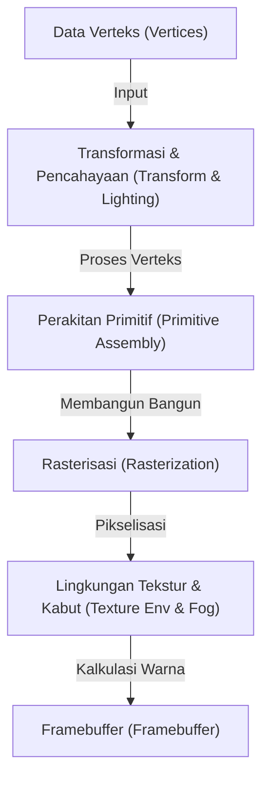
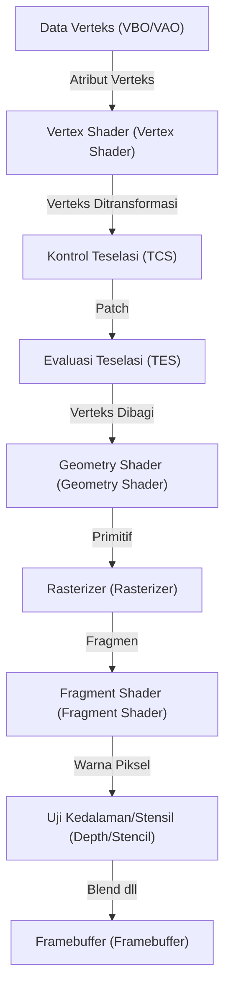
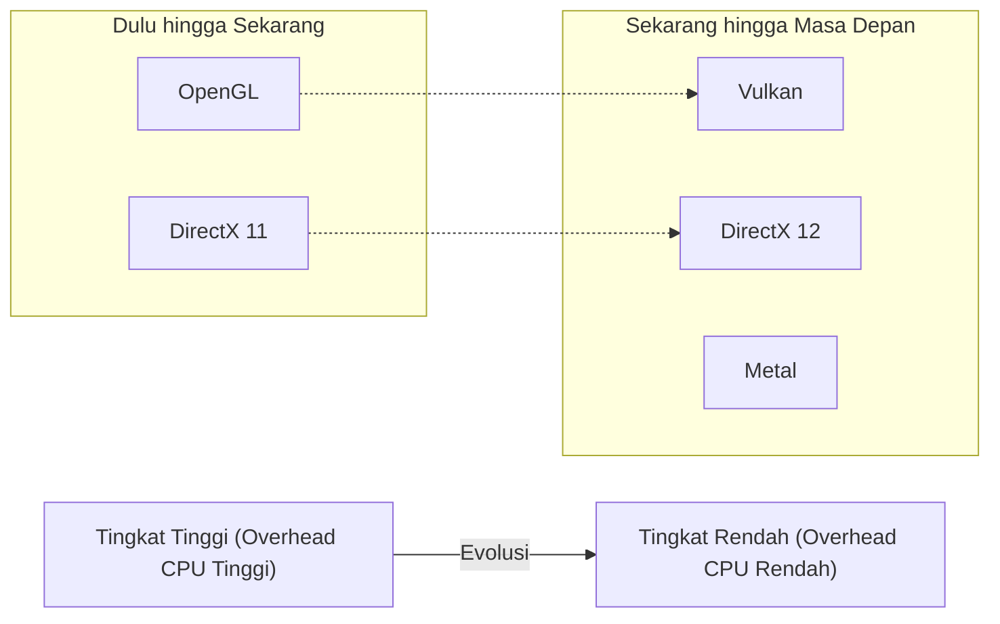

# 1. Pendahuluan

Grafik 3D dalam komputer modern tidak lagi hanya milik segelintir ahli. Teknologi grafik 3D digunakan di mana-mana, mulai dari game ponsel pintar, visualisasi data di browser web, VFX film, perangkat lunak CAD, hingga VR/AR. Namun, sebelum teknologi ini menyebar luas seperti sekarang, terdapat perjuangan panjang dalam standardisasi perangkat lunak (API) yang berjalan beriringan dengan evolusi perangkat keras.

Artikel ini akan berfokus pada "OpenGL (Open Graphics Library)", yang telah lama merajai sebagai standar de facto untuk API grafik 3D. Mulai dari latar belakang sejarah bagaimana OpenGL lahir dan berkembang, mekanisme pipeline grafik yang dapat diprogram secara modern, latar belakang matematis menggunakan operasi matriks, hingga contoh implementasi nyata dengan C/C++ dan GLSL akan dibahas secara mendalam dan tuntas.

---

# 2. Sejarah OpenGL: Jalan dari SGI dan IRIS GL menuju Standar

## 2.1 Silicon Graphics, Inc. (SGI) dan Lahirnya IRIS GL

Pada tahun 1980-an hingga 1990-an, Silicon Graphics, Inc. (SGI), yang didirikan oleh Jim Clark, berkuasa secara absolut di bidang komputer grafik (CG) 3D. Workstation SGI dilengkapi dengan perangkat keras grafis khusus, menawarkan kinerja rendering 3D yang belum pernah ada sebelumnya pada saat itu. Sudah menjadi rahasia umum bahwa komputer SGI digunakan dalam produksi CG untuk film-film seperti "Jurassic Park" dan "Terminator 2".

Untuk memaksimalkan kinerja perangkat keras SGI, API grafis berpemilik yang disebut "IRIS GL (Integrated Raster Imaging System Graphics Library)" dikembangkan. IRIS GL dirancang agar para programmer dapat dengan mudah menangani penggambaran poligon, pencahayaan, dan penghapusan permukaan tersembunyi menggunakan Z-buffer, tanpa harus memikirkan detail kompleks perangkat keras.

Namun, IRIS GL memiliki masalah besar. API ini "sangat bergantung pada perangkat keras SGI". IRIS GL telah berkembang menjadi API raksasa yang bahkan mencakup kontrol atas sistem jendela dan perangkat input, sehingga sangat sulit untuk melakukan porting ke platform lain (seperti workstation Sun Microsystems dan HP, atau PC yang sedang berkembang).

## 2.2 Transisi ke Standar Terbuka dan Lahirnya OpenGL

Pada awal tahun 1990-an, di tengah persaingan pasar grafis 3D yang semakin ketat, SGI memutuskan untuk mengatur ulang dan mengabstraksi IRIS GL agar teknologi mereka lebih luas dan untuk merumuskan API standar industri yang bisa beroperasi pada perangkat keras dari perusahaan lain.

Dengan memisahkan ketergantungan pada sistem jendela dan fitur khusus SGI dari IRIS GL, "OpenGL" didesain ulang sebagai API terbuka murni untuk rendering grafik 3D. Pada tahun 1992, OpenGL 1.0 resmi diumumkan.

Untuk merumuskan dan mengelola spesifikasi OpenGL, dibentuklah "OpenGL Architecture Review Board (ARB)" yang beranggotakan perusahaan besar seperti SGI, DEC, IBM, Intel, dan Microsoft. Hal ini memungkinkan OpenGL untuk berevolusi dari teknologi eksklusif satu perusahaan menjadi standar untuk seluruh industri.

## 2.3 Dari Pipeline Fungsi Tetap ke Pipeline yang Dapat Diprogram

Versi awal OpenGL (1.x hingga paruh pertama 2.x) mengadopsi arsitektur yang disebut "Pipeline Fungsi Tetap (Fixed-Function Pipeline)". Di sini, proses seperti pencahayaan, transformasi, dan pemetaan tekstur ditetapkan di dalam perangkat keras, dan programmer hanya perlu mengatur parameter (seperti posisi dan warna cahaya, karakteristik material, dll.) untuk melakukan rendering.



Pipeline fungsi tetap sangat mudah digunakan dan ideal bagi pemula untuk mempelajari grafik 3D. (Banyak dari Anda yang mungkin mengingat fungsi-fungsi seperti `glBegin()`, `glEnd()`, `glVertex3f()`).

Namun, memasuki tahun 2000-an, evolusi GPU (Graphics Processing Unit) menjadi sangat luar biasa, dan para pengembang mulai menuntut untuk melakukan "shading kustom mereka sendiri" atau memproses "ekspresi tidak realistis seperti toon rendering (NPR) dengan kecepatan tinggi di perangkat keras".

Untuk merespons hal ini, "GLSL (OpenGL Shading Language)" diperkenalkan di OpenGL 2.0 (2004), memungkinkan sebagian dari pemrosesan GPU diganti dengan program (shader) yang ditulis oleh programmer. Kemudian, dengan Profil Inti dari OpenGL 3.1 (2009) dan OpenGL 3.2, pipeline fungsi tetap tidak direkomendasikan lagi (nantinya dihapus), yang mengarah pada transisi penuh ke "Pipeline yang Dapat Diprogram".

---

# 3. Modern OpenGL dan Detail Pipeline Grafis

Dalam OpenGL modern (Profil Inti dari versi 3.3 dan lebih baru), programmer sendiri yang harus mengendalikan setiap tahap pada pipeline grafis. Alur dari pipeline ini ditunjukkan pada diagram berikut.



## 3.1 Peran Setiap Tahapan

1. **Vertex Shader (Vertex Shader)**: Wajib. Dijalankan untuk setiap verteks masukan. Peran utamanya adalah mengubah koordinat lokal verteks menjadi koordinat pada layar (clip space).
2. **Tessellation Shaders (Tessellation Shaders)**: Opsional. Memecah poligon menjadi poligon yang lebih kecil untuk menghasilkan bentuk yang lebih rinci.
3. **Geometry Shader (Geometry Shader)**: Opsional. Menerima kumpulan verteks (titik, garis, segitiga) dan dapat membuat bentuk baru atau membuangnya.
4. **Rasterizer (Rasterizer)**: Fungsi tetap. Mengubah bentuk matematis (poligon) menjadi "fragmen" yang sesuai dengan piksel di layar. Atribut antar verteks diinterpolasi di sini.
5. **Fragment Shader (Fragment Shader)**: Wajib. Dijalankan untuk setiap fragmen untuk menghitung warna akhir (RGBA) dan nilai kedalaman piksel. Pengambilan sampel tekstur dan kalkulasi pencahayaan dilakukan di sini.
6. **Berbagai Tes dan Blending**: Pengujian kedalaman (memprioritaskan menggambar objek yang berada di depan), pengujian stensil, alpha blending, dan lainnya dilakukan sebelum akhirnya ditulis ke framebuffer.

---

# 4. Matematika Matriks dan Transformasi Koordinat

Untuk menggambar objek di ruang 3D pada layar 2D, perlu dilakukan konversi secara berurutan melalui beberapa sistem koordinat (ruang). Ini dicapai dengan menggunakan aljabar linear melalui "Matriks (Matrix)".

## 4.1 Transformasi dari Ruang Lokal ke Ruang Layar

Umumnya, transformasi dilakukan dengan mengalikan ketiga matriks berikut. Ini disebut sebagai **Matriks MVP (Model-View-Projection Matrix)**.

$$
V_{clip} = M_{projection} \cdot M_{view} \cdot M_{model} \cdot V_{local}
$$

1. **Matriks Model ($M_{model}$)**:
   Menempatkan sistem koordinat lokal (Local Space) milik objek ke dalam sistem koordinat dunia (World Space). Melakukan proses translasi, rotasi, dan skala.
2. **Matriks View ($M_{view}$)**:
   Mengubah koordinat di ruang dunia ke ruang dari sudut pandang kamera (View Space / Camera Space). Menggerakkan kamera ke belakang sama dengan menggerakkan seluruh dunia ke depan.
3. **Matriks Proyeksi ($M_{projection}$)**:
   Mengubah koordinat dari ruang pandang ke ruang kliping (Clip Space). Terdapat proyeksi perspektif (Perspective Projection) dan proyeksi ortografi (Orthographic Projection). Pada proyeksi perspektif, efek di mana objek yang jauh terlihat lebih kecil (perspektif) akan dihasilkan.

## 4.2 Struktur Matriks Proyeksi Perspektif

Matriks proyeksi perspektif sangatlah penting. Menggunakan field of view (FOV), rasio aspek (Aspect), bidang dekat (Near), dan bidang jauh (Far), matriks berukuran 4x4 dibangun sebagai berikut.

$$
\begin{bmatrix}
\frac{1}{\text{aspect} \cdot \tan(\text{fov}/2)} & 0 & 0 & 0 \\
0 & \frac{1}{\tan(\text{fov}/2)} & 0 & 0 \\
0 & 0 & -\frac{\text{far} + \text{near}}{\text{far} - \text{near}} & -\frac{2 \cdot \text{far} \cdot \text{near}}{\text{far} - \text{near}} \\
0 & 0 & -1 & 0
\end{bmatrix}
$$

Matriks ini akan mengubah komponen W (koordinat homogen) dari koordinat verteks, dan melalui "Perspective Divide" setelahnya, koordinat x, y, z dipetakan ke sistem koordinat perangkat yang dinormalisasi (NDC: Normalized Device Coordinates) bernilai antara -1.0 hingga 1.0.

---

# 5. Dasar GLSL (OpenGL Shading Language)

Program yang berjalan di GPU ditulis menggunakan GLSL, yang memiliki sintaks mirip dengan bahasa C.

## 5.1 Vertex Shader

```glsl
#version 330 core
layout (location = 0) in vec3 aPos;     // 頂点位置
layout (location = 1) in vec2 aTexCoord; // テクスチャ座標

out vec2 TexCoord; // フラグメントシェーダーへ渡す変数

uniform mat4 model;
uniform mat4 view;
uniform mat4 projection;

void main()
{
    // MVP行列を掛けてクリップ座標系へ変換
    gl_Position = projection * view * model * vec4(aPos, 1.0);
    TexCoord = aTexCoord;
}
```

## 5.2 Fragment Shader

```glsl
#version 330 core
out vec4 FragColor;

in vec2 TexCoord; // 頂点シェーダーから補間されて渡される

uniform sampler2D texture1; // テクスチャユニット

void main()
{
    // テクスチャから色をサンプリング
    FragColor = texture(texture1, TexCoord);
}
```

---

# 6. Setup dan Implementasi Modern OpenGL dengan C/C++

Mulai dari sini, kita akan melihat kode dasar untuk membuat jendela dan menggambar segitiga menggunakan C++. Kita akan menggunakan **GLFW** untuk manajemen jendela, dan **GLAD** (atau GLEW) untuk memuat penunjuk fungsi OpenGL.

## 6.1 Inisialisasi dan Pembuatan Jendela

```cpp
#include <glad/glad.h>
#include <GLFW/glfw3.h>
#include <iostream>

// ウィンドウリサイズ時のコールバック
void framebuffer_size_callback(GLFWwindow* window, int width, int height) {
    glViewport(0, 0, width, height);
}

int main() {
    // 1. GLFWの初期化
    glfwInit();
    // OpenGL 3.3 Core Profileを指定
    glfwWindowHint(GLFW_CONTEXT_VERSION_MAJOR, 3);
    glfwWindowHint(GLFW_CONTEXT_VERSION_MINOR, 3);
    glfwWindowHint(GLFW_OPENGL_PROFILE, GLFW_OPENGL_CORE_PROFILE);

#ifdef __APPLE__
    glfwWindowHint(GLFW_OPENGL_FORWARD_COMPAT, GL_TRUE); // macOS用
#endif

    // 2. ウィンドウの作成
    GLFWwindow* window = glfwCreateWindow(800, 600, "LearnOpenGL", NULL, NULL);
    if (window == NULL) {
        std::cout << "Failed to create GLFW window" << std::endl;
        glfwTerminate();
        return -1;
    }
    glfwMakeContextCurrent(window);
    glfwSetFramebufferSizeCallback(window, framebuffer_size_callback);

    // 3. GLADの初期化 (OS固有のOpenGL関数ポインタをロード)
    if (!gladLoadGLLoader((GLADloadproc)glfwGetProcAddress)) {
        std::cout << "Failed to initialize GLAD" << std::endl;
        return -1;
    }

    // 続く...
```

## 6.2 Membangun Data Verteks dan Buffer (VAO, VBO)

Dalam OpenGL modern, kita perlu mentransfer data verteks ke memori GPU (VRAM) dan mendefinisikan tata letak data tersebut.

```cpp
    // 頂点データ (X, Y, Z)
    float vertices[] = {
        -0.5f, -0.5f, 0.0f, // 左下
         0.5f, -0.5f, 0.0f, // 右下
         0.0f,  0.5f, 0.0f  // 上部
    };

    unsigned int VBO, VAO;
    // VAO (Vertex Array Object) の生成とバインド
    glGenVertexArrays(1, &VAO);
    glBindVertexArray(VAO);

    // VBO (Vertex Buffer Object) の生成とバインド
    glGenBuffers(1, &VBO);
    glBindBuffer(GL_ARRAY_BUFFER, VBO);
    
    // データをGPUに転送
    glBufferData(GL_ARRAY_BUFFER, sizeof(vertices), vertices, GL_STATIC_DRAW);

    // 頂点属性ポインタの設定 (location = 0)
    glVertexAttribPointer(0, 3, GL_FLOAT, GL_FALSE, 3 * sizeof(float), (void*)0);
    glEnableVertexAttribArray(0);

    // バインド解除 (安全のため)
    glBindBuffer(GL_ARRAY_BUFFER, 0); 
    glBindVertexArray(0);
```

## 6.3 Loop Utama (Rendering)

Setelah proses kompilasi dan penautan shader (dengan asumsi telah dienkapsulasi dalam fungsi), kita memasuki loop rendering utama.

```cpp
    // シェーダープログラムのロードとコンパイル (実装省略)
    // unsigned int shaderProgram = LoadShaders("vertex.glsl", "fragment.glsl");

    // メインループ
    while (!glfwWindowShouldClose(window)) {
        // 入力処理 (Escapeキーで終了など)
        if (glfwGetKey(window, GLFW_KEY_ESCAPE) == GLFW_PRESS)
            glfwSetWindowShouldClose(window, true);

        // 1. 画面のクリア
        glClearColor(0.2f, 0.3f, 0.3f, 1.0f);
        glClear(GL_COLOR_BUFFER_BIT | GL_DEPTH_BUFFER_BIT);

        // 2. シェーダーの有効化
        // glUseProgram(shaderProgram);

        // 3. VAOをバインドして描画
        glBindVertexArray(VAO);
        glDrawArrays(GL_TRIANGLES, 0, 3);

        // 4. バッファのスワップとイベントのポーリング
        glfwSwapBuffers(window);
        glfwPollEvents();
    }

    // リソースの解放
    glDeleteVertexArrays(1, &VAO);
    glDeleteBuffers(1, &VBO);
    // glDeleteProgram(shaderProgram);

    glfwTerminate();
    return 0;
}
```

---

# 7. Kondisi Saat Ini dan Masa Depan OpenGL (Vulkan, Metal, DirectX 12)

Berawal dari teknologi eksklusif IRIS GL milik SGI yang lahir pada tahun 1992, OpenGL telah mendukung industri ini selama lebih dari seperempat abad sebagai standar API lintas platform. Namun, untuk arsitektur perangkat keras modern (CPU multi-core dan GPU raksasa yang disesuaikan untuk pemrosesan paralel), filosofi desain OpenGL sebagai "state machine global yang masif" telah mencapai batasnya.

Karena OpenGL memiliki banyak status global, pembuatan perintah rendering dalam multi-threading menjadi sulit, dan masalah fundamental berupa overhead CPU yang tinggi sering kali terjadi.

Untuk memecahkan masalah ini, generasi API baru bermunculan, menyediakan lapisan abstraksi yang lebih tipis di level yang lebih rendah, sehingga para pengembang dapat secara akurat mengontrol memori GPU dan pemrosesan sinkronisasi.
* **Vulkan**: API lintas platform penerus OpenGL, dirumuskan oleh Khronos Group yang mengelola OpenGL.
* **DirectX 12**: API tingkat rendah untuk Windows dan Xbox yang disediakan oleh Microsoft.
* **Metal**: API berpemilik yang disediakan oleh Apple untuk macOS dan iOS (Apple telah menyatakan tidak menyarankan penggunaan OpenGL).



## 7.1 Namun Demikian, Pentingnya Mempelajari OpenGL

Bahkan saat ini ketika API tingkat rendah yang baru mulai mendominasi, nilai dari mempelajari OpenGL sama sekali tidak hilang. Berikut adalah alasannya.

1. **Biaya Pembelajaran yang Rendah**: Vulkan dan DirectX 12 memerlukan ratusan hingga ribuan baris kode dan pengaturan yang kompleks hanya untuk menggambar segitiga pertama di layar. Sebaliknya, OpenGL masih unggul sebagai gerbang awal untuk mempelajari "esensi grafik 3D", seperti dasar-dasar pipeline grafis, operasi matriks, dan pemrograman shader.
2. **Aset dan Komunitas yang Sangat Besar**: Terdapat perangkat lunak, mesin render (engine), dan tutorial dalam jumlah tak terbatas yang ditulis dengan OpenGL di seluruh dunia.
3. **WebGL**: WebGL, standar untuk merender grafik 3D di browser, didasarkan pada OpenGL ES. Di dunia Web, pengetahuan tentang OpenGL secara langsung masih sangat berguna.

# 8. Penutup

Berawal dari teknologi eksklusif untuk workstation SGI, berkembang menjadi standar industri, dan mendukung berbagai bidang mulai dari game hingga komputasi ilmiah, itulah OpenGL. Dengan melihat kembali sejarahnya dan memahami dasar-dasar mekanismenya, akan tercipta landasan yang kuat untuk mempelajari teknologi generasi mendatang seperti Vulkan dan WebGPU.

Dunia pemrograman grafis sangatlah mendalam, dan momen ketika rumus matematika serta barisan kode bertransformasi menjadi visual indah di layar menghadirkan kegembiraan yang tidak dapat dialami di bidang pemrograman lainnya. Melalui artikel ini, saya sangat berharap Anda mencoba menulis kode OpenGL Anda sendiri dan membangun dunia 3D Anda sendiri.
