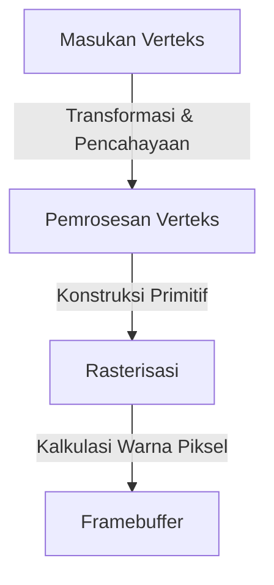
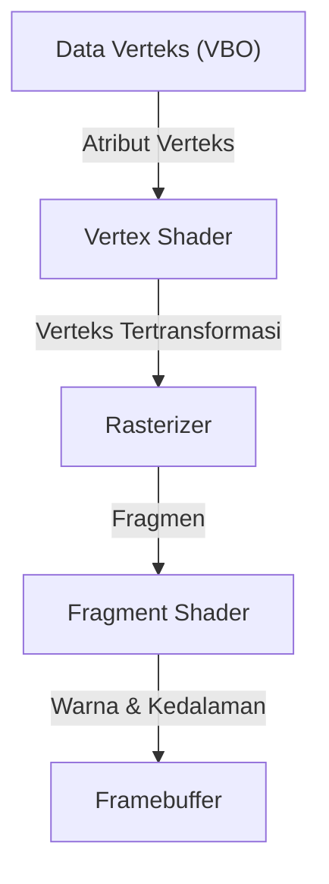

# 1. Pendahuluan

Dalam lingkungan komputasi modern, grafik 3D telah menjadi elemen yang tak terpisahkan. Mulai dari video game, efek visual (VFX) film, CAD, aplikasi ponsel pintar, hingga visualisasi data di peramban web, kita menikmati manfaat teknologi 3D setiap hari. Namun, perjalanan menuju "standardisasi" agar program yang sama dapat berjalan di berbagai platform berbeda sembari memaksimalkan performa perangkat keras tidaklah mudah.

Artikel ini akan membahas "OpenGL (Open Graphics Library)", yang selama bertahun-tahun merajai dunia grafis sebagai standar *de facto* untuk API grafik 3D. Pembahasan akan dimulai dari latar belakang sejarah evolusinya dari standar kepemilikan (proprietary) suatu perusahaan menjadi standar terbuka, cara kerja pipeline grafis modern yang dapat diprogram (programmable), dasar matematika operasi matriks untuk memproyeksikan ruang 3D ke layar 2D, hingga contoh implementasi konkret menggunakan C/C++ dan GLSL secara komprehensif.

# 2. Sejarah OpenGL: Lepas dari Standar Proprieter

## 2.1 Kebangkitan SGI dan IRIS GL

Dari era 1980-an hingga 1990-an, Silicon Graphics, Inc. (SGI) memiliki dominasi luar biasa di bidang grafik komputer 3D. Workstation buatan SGI dilengkapi dengan perangkat keras grafis khusus dan diadopsi secara luas di industri perfilman serta lembaga penelitian.

API grafis bernama "IRIS GL" dikembangkan khusus untuk perangkat keras SGI ini. IRIS GL sangat andal dan mudah digunakan, tetapi memiliki kelemahan fatal berupa ketergantungan yang sangat erat pada perangkat keras dan sistem jendela (window system) milik SGI, sehingga portabilitasnya ke sistem lain sangatlah rendah.

## 2.2 Lahirnya Standar Terbuka

Memasuki era 1990-an, seiring meningkatnya performa PC dan workstation buatan kompetitor serta semakin sengitnya persaingan di pasar grafis, SGI mengambil langkah strategis untuk mempopulerkan teknologinya secara luas. Langkah tersebut adalah merilis "OpenGL" (1992), yang memisahkan bagian yang bergantung pada perangkat keras dari IRIS GL dan mendesainnya kembali sebagai API terbuka murni untuk rendering 3D.

Spesifikasi OpenGL kemudian dikelola oleh "OpenGL Architecture Review Board (ARB)", sebuah konsorsium yang beranggotakan perusahaan-perusahaan besar seperti SGI, IBM, DEC, Microsoft, dan Intel. Hal ini mengukuhkan posisinya sebagai standar industri yang tidak terikat pada platform tertentu.

## 2.3 Pergeseran Paradigma Menuju Programmable

Pada awalnya, OpenGL mengadopsi arsitektur yang dikenal sebagai "pipeline fungsi tetap" (fixed-function pipeline). Dalam pendekatan ini, proses seperti pencahayaan dan transformasi koordinat telah ditetapkan secara permanen di sisi perangkat keras (atau driver), sehingga pemrogram hanya perlu mengatur parameter untuk melakukan rendering.



Pendekatan ini memang mudah dipahami bagi pemula, namun sulit untuk mengimplementasikan efek bayangan khusus (seperti toon shading) atau efek-efek visual tingkat lanjut. Untuk menjawab kebutuhan tersebut, OpenGL 2.0 (2004) memperkenalkan "GLSL (OpenGL Shading Language)", yang berevolusi menjadi "pipeline yang dapat diprogram" (programmable pipeline) di mana pengembang dapat memprogram perilaku GPU secara langsung. Saat ini, fungsi tetap (fixed-function) sudah ditinggalkan (deprecated) atau dihapus, dan rendering fleksibel berbasis shader telah menjadi standar utama.

# 3. Pipeline OpenGL Modern

Dalam OpenGL modern (Core Profile), pengembang dituntut untuk mengontrol setiap tahap pada pipeline grafis secara mendetail.



1. **Vertex Shader (Shader Verteks)**:
   Dijalankan untuk setiap verteks yang diinputkan. Peran utamanya adalah mengubah koordinat lokal model ke sistem koordinat klip (clip coordinates) dilihat dari sudut pandang kamera.
2. **Rasterizer**:
   Memecah dan menginterpolasi poligon (seperti segitiga) yang tersusun dari verteks menjadi "fragmen" yang mewakili piksel di layar.
3. **Fragment Shader (Shader Fragmen)**:
   Menghitung warna akhir (RGB) dari setiap fragmen. Pemetaan tekstur dan kalkulasi pencahayaan terutama dilakukan di sini.

# 4. Dasar-Dasar Operasi Matriks dan Transformasi Koordinat

Untuk merender objek dalam ruang 3D secara akurat ke monitor 2D, transformasi koordinat menggunakan matriks adalah hal yang mutlak diperlukan. Secara umum, transformasi dilakukan dengan mengalikan tiga matriks berikut. Rangkaian ini dikenal sebagai matriks MVP (Model-View-Projection).

- **Matriks Model (Model Matrix)**:
  Menempatkan objek dari ruang lokalnya sendiri ke dalam sistem koordinat absolut dunia (ruang dunia / world space). Mencakup translasi (pergeseran), rotasi, dan penskalaan.
- **Matriks View (View Matrix)**:
  Mengubah koordinat dari ruang dunia ke dalam ruang kamera (ruang pandang / view space) yang dilihat dari sudut pandang kamera.
- **Matriks Proyeksi (Projection Matrix)**:
  Mengubah koordinat ruang pandang ke dalam ruang klip (clip space). Di tahap inilah proyeksi perspektif (efek di mana objek yang jauh terlihat lebih kecil) atau proyeksi lainnya dihitung.

# 5. Contoh Implementasi dengan GLSL dan C/C++

Berikut adalah contoh kode shader GLSL dasar untuk menggambar sebuah segitiga menggunakan OpenGL modern.

## 5.1 Contoh Vertex Shader

```glsl
#version 330 core
layout (location = 0) in vec3 aPos;

uniform mat4 model;
uniform mat4 view;
uniform mat4 projection;

void main()
{
    gl_Position = projection * view * model * vec4(aPos, 1.0);
}
```

## 5.2 Contoh Fragment Shader

```glsl
#version 330 core
out vec4 FragColor;

void main()
{
    FragColor = vec4(1.0, 0.5, 0.2, 1.0); // Output warna oranye
}
```

Di sisi C/C++, pustaka seperti GLFW digunakan untuk membuat jendela, lalu data verteks (VBO: Vertex Buffer Object) serta tata letak atribut verteks (VAO: Vertex Array Object) dikirim ke GPU. Selanjutnya, di dalam perulangan utama (main loop), layar dibersihkan dan perintah penggambaran dijalankan melalui fungsi seperti `glDrawArrays` menggunakan program shader yang telah dikonfigurasi.

# 6. Masa Depan API Grafis

Meskipun OpenGL telah menopang industri grafis selama bertahun-tahun, filosofi desain lamanya (state machine berukuran masif) kini mulai menjadi hambatan (bottleneck) dalam memaksimalkan performa CPU multi-core dan GPU paralel modern.

Oleh karena itu, saat ini industri mulai beralih ke API generasi berikutnya (seperti Vulkan, DirectX 12, dan Metal) yang memungkinkan kontrol tingkat rendah (low-level) lebih dekat ke perangkat keras serta dioptimalkan untuk rendering multi-thread. Namun, karena API modern tersebut memiliki proses inisialisasi yang sangat rumit, OpenGL tetap memiliki nilai yang sangat besar sebagai API pengantar dan sarana edukasi untuk memahami konsep-konsep fundamental grafik 3D (seperti pipeline, transformasi matriks, dan shader).

Mempelajari dasar-dasar pemrograman 3D terlebih dahulu dengan OpenGL, kemudian melangkah ke API seperti Vulkan sesuai kebutuhan, hingga saat ini masih menjadi salah satu jalur pembelajaran yang paling direkomendasikan.
