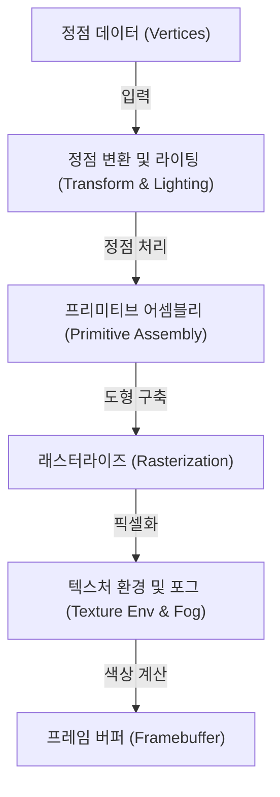
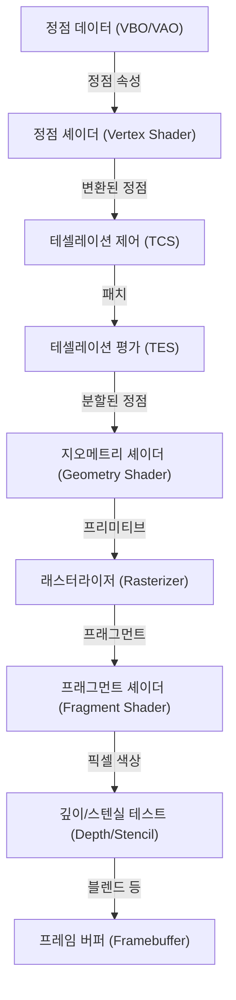
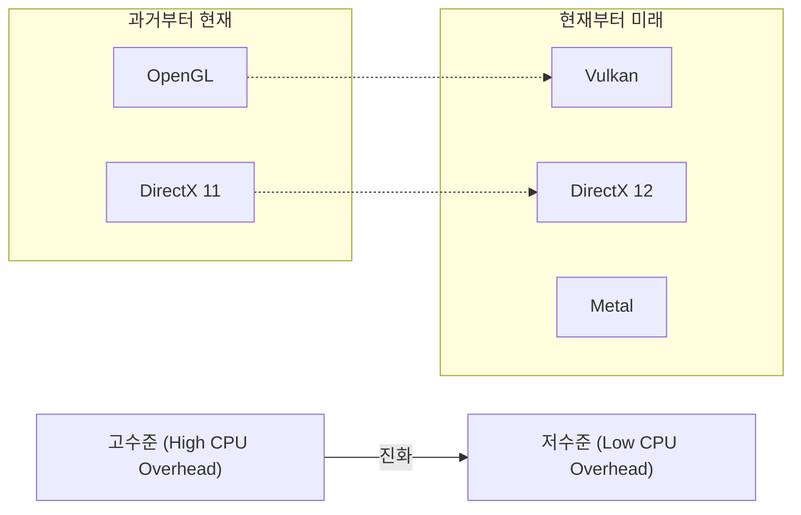

# 1. 서론

현대 컴퓨터의 3D 그래픽스는 더 이상 일부 전문가들만의 전유물이 아닙니다. 스마트폰 게임, 웹 브라우저의 데이터 시각화, 영화의 VFX, CAD 소프트웨어, VR/AR 등 모든 곳에서 3D 그래픽스 기술이 활용되고 있습니다. 하지만 이러한 기술이 오늘날처럼 널리 보급되기까지는 하드웨어의 진화와 더불어 소프트웨어(API)의 표준화라는 긴 싸움이 있었습니다.

이 글에서는 오랜 기간 3D 그래픽스 API의 사실상 표준으로 군림해 온 'OpenGL(Open Graphics Library)'에 초점을 맞춥니다. OpenGL이 어떻게 탄생하고 어떻게 진화해 왔는지에 대한 역사적 배경부터 시작하여, 현대적인 프로그래머블 그래픽스 파이프라인의 구조, 행렬 연산을 활용한 수학적 배경, 그리고 C/C++와 GLSL을 사용한 구체적인 구현 예제까지 철저하고 깊이 있게 해설합니다.

---

# 2. OpenGL의 역사: SGI와 IRIS GL에서 표준 규격으로의 길

## 2.1 Silicon Graphics, Inc. (SGI)와 IRIS GL의 탄생

1980년대부터 1990년대에 걸쳐 3D 컴퓨터 그래픽스(CG) 분야에서 절대적인 강자로 군림했던 기업은 짐 클라크가 설립한 Silicon Graphics, Inc.(SGI)입니다. SGI의 워크스테이션은 전용 그래픽 하드웨어를 탑재하고 있어 당시로서는 파격적인 3D 렌더링 성능을 자랑했습니다. 영화 '쥬라기 공원'이나 '터미네이터 2'의 CG 제작에도 SGI의 컴퓨터가 사용된 것은 유명한 사실입니다.

SGI 하드웨어의 성능을 극대화하기 위해 개발된 것이 'IRIS GL(Integrated Raster Imaging System Graphics Library)'이라는 독자적인 그래픽스 API였습니다. IRIS GL은 프로그래머가 하드웨어의 복잡한 세부 사항을 신경 쓰지 않고도 폴리곤 렌더링, 라이팅, Z 버퍼를 통한 은면 제거 등을 쉽게 다룰 수 있도록 설계되었습니다.

하지만 IRIS GL에는 큰 문제가 있었습니다. 바로 'SGI의 하드웨어에 강하게 의존하고 있다'는 점이었습니다. IRIS GL은 윈도우 시스템과 입력 장치 제어까지 포함하는 거대한 API로 성장해 있었고, 이로 인해 다른 플랫폼(예: Sun Microsystems나 HP의 워크스테이션, 혹은 부상하고 있던 PC)으로의 이식이 극히 어려웠습니다.

## 2.2 오픈 스탠다드로의 전환과 OpenGL의 탄생

1990년대 초반, 3D 그래픽스 시장의 경쟁이 격화되는 가운데, SGI는 자사의 기술을 보급하고 타사 하드웨어에서도 동작하는 업계 표준 API를 제정하기 위해 IRIS GL을 정리하고 추상화하기로 결정했습니다.

IRIS GL에서 윈도우 시스템에 대한 의존성이나 SGI 특유의 기능을 분리하고, 순수하게 3D 그래픽스 렌더링을 위한 오픈 API로 재설계된 것이 'OpenGL'입니다. 1992년, OpenGL 1.0이 공식 발표되었습니다.

OpenGL의 사양 제정과 관리를 위해 SGI, DEC, IBM, Intel, Microsoft 등 주요 기업이 참여하는 'OpenGL Architecture Review Board(ARB)'가 설립되었습니다. 이로써 OpenGL은 한 기업의 독자 기술에서 업계 전체의 표준 규격으로 승화되었습니다.

## 2.3 고정 기능 파이프라인에서 프로그래머블 파이프라인으로

초기 OpenGL(1.x~2.x 전반)은 '고정 기능 파이프라인(Fixed-Function Pipeline)'이라는 아키텍처를 채택했습니다. 이는 라이팅, 트랜스폼, 텍스처 매핑 등의 처리가 하드웨어 내부에 고정되어 있어, 프로그래머는 매개변수(빛의 위치와 색, 머티리얼의 특성 등)를 설정하는 것만으로 렌더링이 이루어지는 방식이었습니다.



고정 기능 파이프라인은 매우 사용하기 쉬웠고, 초보자가 3D 그래픽스를 배우기에 최적이었습니다. (`glBegin()`, `glEnd()`, `glVertex3f()`와 같은 함수를 기억하는 분들도 많을 것입니다).

하지만 2000년대에 들어서면서 GPU(Graphics Processing Unit)의 진화가 눈부시게 이루어졌고, 개발자들은 "더 독자적인 셰이딩(음영 처리)을 하고 싶다", "툰 렌더링과 같은 비현실적인 표현(NPR)을 하드웨어에서 고속으로 처리하고 싶다"고 요구하게 되었습니다.

이에 부응하기 위해 OpenGL 2.0(2004년)에서 'GLSL(OpenGL Shading Language)'이 도입되어, GPU 처리의 일부를 프로그래머가 작성한 프로그램(셰이더)으로 대체할 수 있게 되었습니다. 그리고 OpenGL 3.1(2009년)과 OpenGL 3.2의 Core Profile을 통해 고정 기능 파이프라인은 비권장(이후 삭제)되었고, 완전히 '프로그래머블 파이프라인'으로 전환되었습니다.

---

# 3. 모던 OpenGL과 그래픽스 파이프라인의 상세

현대의 OpenGL(버전 3.3 이후의 Core Profile)에서는 프로그래머가 직접 그래픽스 파이프라인의 각 단계를 제어해야 합니다. 파이프라인의 흐름을 다음 그림에 나타냅니다.



## 3.1 각 단계의 역할

1. **정점 셰이더 (Vertex Shader)**: 필수. 입력된 각 정점에 대해 실행됩니다. 주된 역할은 정점의 로컬 좌표를 화면 상의 좌표(클립 공간)로 변환하는 것입니다.
2. **테셀레이션 셰이더 (Tessellation Shaders)**: 선택. 폴리곤을 더 세밀한 폴리곤으로 분할하여 상세한 형태를 생성합니다.
3. **지오메트리 셰이더 (Geometry Shader)**: 선택. 정점들의 집합(점, 선, 삼각형)을 받아 새로운 도형을 생성하거나 폐기할 수 있습니다.
4. **래스터라이저 (Rasterizer)**: 고정 기능. 수학적인 도형(폴리곤)을 화면의 픽셀에 대응하는 '프래그먼트(단편)'로 변환합니다. 여기서 정점 간의 속성이 보간(Interpolation)됩니다.
5. **프래그먼트 셰이더 (Fragment Shader)**: 필수. 각 프래그먼트에 대해 실행되며, 최종적인 픽셀의 색상(RGBA)과 깊이 값을 계산합니다. 텍스처 샘플링이나 라이팅 계산이 이곳에서 이루어집니다.
6. **각종 테스트 및 블렌딩**: 깊이 테스트(앞에 있는 것을 우선적으로 렌더링), 스텐실 테스트, 알파 블렌딩 등이 수행되며 최종적으로 프레임 버퍼에 기록됩니다.

---

# 4. 행렬과 좌표 변환의 수학

3D 공간의 객체를 2D 화면에 렌더링하려면 몇 가지 좌표계(공간)를 순차적으로 변환해 나가야 합니다. 이를 실현하는 것이 '행렬(Matrix)'에 의한 선형 대수입니다.

## 4.1 로컬 공간에서 스크린 공간으로의 변환

일반적으로 다음의 세 가지 행렬을 곱하여 변환을 수행합니다. 이를 **MVP 행렬(Model-View-Projection Matrix)**이라고 부릅니다.

$$
V_{clip} = M_{projection} \cdot M_{view} \cdot M_{model} \cdot V_{local}
$$

1. **모델 행렬 ($M_{model}$)**:
   객체 자신의 로컬 좌표계(Local Space)를 세계 전체의 좌표계(World Space)에 배치합니다. 평행 이동(Translation), 회전(Rotation), 확대/축소(Scaling)를 수행합니다.
2. **뷰 행렬 ($M_{view}$)**:
   월드 공간의 좌표를 카메라(시점)에서 바라본 공간(View Space / Camera Space)으로 변환합니다. 카메라를 뒤로 움직이는 것은 세계 전체를 앞으로 움직이는 것과 같습니다.
3. **프로젝션 행렬 ($M_{projection}$)**:
   뷰 공간에서 클립 공간(Clip Space)으로의 변환입니다. 원근 투영(Perspective Projection)과 직교 투영(Orthographic Projection)이 있습니다. 원근 투영의 경우 멀리 있는 것이 작게 보이는 효과(원근법)를 만들어냅니다.

## 4.2 원근 투영 행렬의 구조

원근 투영 행렬은 매우 중요합니다. 시야각(FOV), 종횡비(Aspect), 근거리 평면(Near), 원거리 평면(Far)을 사용하여 다음과 같은 4x4 행렬이 구축됩니다.

$$
\begin{bmatrix}
\frac{1}{\text{aspect} \cdot \tan(\text{fov}/2)} & 0 & 0 & 0 \\
0 & \frac{1}{\tan(\text{fov}/2)} & 0 & 0 \\
0 & 0 & -\frac{\text{far} + \text{near}}{\text{far} - \text{near}} & -\frac{2 \cdot \text{far} \cdot \text{near}}{\text{far} - \text{near}} \\
0 & 0 & -1 & 0
\end{bmatrix}
$$

이 행렬에 의해 정점 좌표의 W 요소(동차 좌표계)가 변경되고, 이후의 '원근 나눗셈(Perspective Divide)'에 의해 x, y, z 좌표가 -1.0에서 1.0 사이의 정규화된 장치 좌표계(NDC: Normalized Device Coordinates)로 매핑됩니다.

---

# 5. GLSL (OpenGL Shading Language)의 기초

C 언어와 유사한 문법을 가진 GLSL을 사용하여 GPU 위에서 동작하는 프로그램을 작성합니다.

## 5.1 정점 셰이더 (Vertex Shader)

```glsl
#version 330 core
layout (location = 0) in vec3 aPos;     // 頂点位置
layout (location = 1) in vec2 aTexCoord; // テクスチャ座標

out vec2 TexCoord; // フラグメントシェーダーへ渡す変数

uniform mat4 model;
uniform mat4 view;
uniform mat4 projection;

void main()
{
    // MVP行列を掛けてクリップ座標系へ変換
    gl_Position = projection * view * model * vec4(aPos, 1.0);
    TexCoord = aTexCoord;
}
```

## 5.2 프래그먼트 셰이더 (Fragment Shader)

```glsl
#version 330 core
out vec4 FragColor;

in vec2 TexCoord; // 頂点シェーダーから補間されて渡される

uniform sampler2D texture1; // テクスチャユニット

void main()
{
    // テクスチャから色をサンプリング
    FragColor = texture(texture1, TexCoord);
}
```

---

# 6. C/C++를 이용한 모던 OpenGL 설정 및 구현

지금부터는 실제로 C++를 사용하여 창을 생성하고 삼각형을 그리기 위한 기본적인 코드를 살펴보겠습니다. 윈도우 관리에는 **GLFW**를, OpenGL의 함수 포인터를 로드하는 데는 **GLAD**(또는 GLEW)를 사용합니다.

## 6.1 초기화 및 창 생성

```cpp
#include <glad/glad.h>
#include <GLFW/glfw3.h>
#include <iostream>

// ウィンドウリサイズ時のコールバック
void framebuffer_size_callback(GLFWwindow* window, int width, int height) {
    glViewport(0, 0, width, height);
}

int main() {
    // 1. GLFWの初期化
    glfwInit();
    // OpenGL 3.3 Core Profileを指定
    glfwWindowHint(GLFW_CONTEXT_VERSION_MAJOR, 3);
    glfwWindowHint(GLFW_CONTEXT_VERSION_MINOR, 3);
    glfwWindowHint(GLFW_OPENGL_PROFILE, GLFW_OPENGL_CORE_PROFILE);

#ifdef __APPLE__
    glfwWindowHint(GLFW_OPENGL_FORWARD_COMPAT, GL_TRUE); // macOS用
#endif

    // 2. ウィンドウの作成
    GLFWwindow* window = glfwCreateWindow(800, 600, "LearnOpenGL", NULL, NULL);
    if (window == NULL) {
        std::cout << "Failed to create GLFW window" << std::endl;
        glfwTerminate();
        return -1;
    }
    glfwMakeContextCurrent(window);
    glfwSetFramebufferSizeCallback(window, framebuffer_size_callback);

    // 3. GLADの初期化 (OS固有のOpenGL関数ポインタをロード)
    if (!gladLoadGLLoader((GLADloadproc)glfwGetProcAddress)) {
        std::cout << "Failed to initialize GLAD" << std::endl;
        return -1;
    }

    // 続く...
```

## 6.2 정점 데이터와 버퍼 구축 (VAO, VBO)

모던 OpenGL에서는 정점 데이터를 GPU의 메모리(VRAM)로 전송하고, 그 데이터의 레이아웃을 정의해야 합니다.

```cpp
    // 頂点データ (X, Y, Z)
    float vertices[] = {
        -0.5f, -0.5f, 0.0f, // 左下
         0.5f, -0.5f, 0.0f, // 右下
         0.0f,  0.5f, 0.0f  // 上部
    };

    unsigned int VBO, VAO;
    // VAO (Vertex Array Object) の生成とバインド
    glGenVertexArrays(1, &VAO);
    glBindVertexArray(VAO);

    // VBO (Vertex Buffer Object) の生成とバインド
    glGenBuffers(1, &VBO);
    glBindBuffer(GL_ARRAY_BUFFER, VBO);
    
    // データをGPUに転送
    glBufferData(GL_ARRAY_BUFFER, sizeof(vertices), vertices, GL_STATIC_DRAW);

    // 頂点属性ポインタの設定 (location = 0)
    glVertexAttribPointer(0, 3, GL_FLOAT, GL_FALSE, 3 * sizeof(float), (void*)0);
    glEnableVertexAttribArray(0);

    // バインド解除 (安全のため)
    glBindBuffer(GL_ARRAY_BUFFER, 0); 
    glBindVertexArray(0);
```

## 6.3 메인 루프 (렌더링)

셰이더의 컴파일 및 링크 처리(여기서는 함수화되어 있다고 가정합니다)를 수행한 후 메인 렌더링 루프에 진입합니다.

```cpp
    // シェーダープログラムのロードとコンパイル (実装省略)
    // unsigned int shaderProgram = LoadShaders("vertex.glsl", "fragment.glsl");

    // メインループ
    while (!glfwWindowShouldClose(window)) {
        // 入力処理 (Escapeキーで終了など)
        if (glfwGetKey(window, GLFW_KEY_ESCAPE) == GLFW_PRESS)
            glfwSetWindowShouldClose(window, true);

        // 1. 画面のクリア
        glClearColor(0.2f, 0.3f, 0.3f, 1.0f);
        glClear(GL_COLOR_BUFFER_BIT | GL_DEPTH_BUFFER_BIT);

        // 2. シェーダーの有効化
        // glUseProgram(shaderProgram);

        // 3. VAOをバインドして描画
        glBindVertexArray(VAO);
        glDrawArrays(GL_TRIANGLES, 0, 3);

        // 4. バッファのスワップとイベントのポーリング
        glfwSwapBuffers(window);
        glfwPollEvents();
    }

    // リソースの解放
    glDeleteVertexArrays(1, &VAO);
    glDeleteBuffers(1, &VBO);
    // glDeleteProgram(shaderProgram);

    glfwTerminate();
    return 0;
}
```

---

# 7. OpenGL의 현황과 미래 (Vulkan, Metal, DirectX 12)

SGI의 IRIS GL에서 시작하여 1992년에 탄생한 OpenGL은 4반세기 이상에 걸쳐 크로스 플랫폼의 표준 API로서 업계를 지탱해 왔습니다. 하지만 현대의 하드웨어 아키텍처(멀티코어 CPU나 병렬 처리에 특화된 거대한 GPU)에 대해, OpenGL의 '단일의 거대한 상태 머신(State Machine)'이라는 설계 사상은 한계를 맞이하고 있습니다.

OpenGL은 전역 상태(Global State)를 많이 가지고 있기 때문에, 멀티 스레드에서 그리기 명령을 생성하기 어렵고 CPU 오버헤드가 커지기 쉽다는 근본적인 문제를 안고 있습니다.

이 문제를 해결하기 위해 더 저수준이고 얇은 추상화 계층을 제공하여, 개발자가 GPU의 메모리나 동기화 처리를 세밀하게 제어할 수 있는 새로운 세대의 API가 등장했습니다.
* **Vulkan**: OpenGL을 관리하고 있는 Khronos Group이 제정한, OpenGL의 후계자라고도 할 수 있는 크로스 플랫폼 API.
* **DirectX 12**: Microsoft가 제공하는 Windows 및 Xbox용 저수준 API.
* **Metal**: Apple이 macOS 및 iOS용으로 제공하는 독자적인 API (Apple은 OpenGL을 비권장으로 지정했습니다).



## 7.1 그럼에도 OpenGL을 배우는 의의

새로운 저수준 API가 주류가 되어가고 있는 현재에도 OpenGL을 배울 가치는 결코 사라지지 않았습니다. 그 이유는 다음과 같습니다.

1. **낮은 학습 비용**: Vulkan이나 DirectX 12는 첫 번째 삼각형을 화면에 그리기 위해서만 수백 줄에서 수천 줄의 코드와 복잡한 설정이 필요합니다. 반면 OpenGL은 그래픽스 파이프라인의 기초, 행렬 연산, 셰이더 프로그래밍과 같은 '3D 그래픽스의 본질'을 배우기 위한 입구로서 여전히 훌륭합니다.
2. **기존의 방대한 에셋과 커뮤니티**: 전 세계에는 OpenGL로 작성된 수많은 소프트웨어, 엔진, 튜토리얼이 존재합니다.
3. **WebGL**: 브라우저 상에서 3D 그래픽스를 렌더링하는 표준 규격인 WebGL은 OpenGL ES를 기반으로 하고 있습니다. 웹의 세계에서는 아직도 OpenGL 지식이 직접적으로 유용합니다.

# 8. 맺음말

SGI 워크스테이션용 독자 기술에서 시작하여 업계 표준으로 성장하고, 게임부터 과학 기술 계산까지 모든 분야를 지탱해 온 OpenGL. 그 역사를 되돌아보고 기초적인 원리를 이해하는 것은 Vulkan이나 WebGPU와 같은 차세대 기술을 배울 때에도 견고한 토대가 될 것입니다.

그래픽스 프로그래밍의 세계는 심오하며, 수식과 코드가 화면 상의 아름다운 비주얼로 변환되는 순간은 다른 프로그래밍에서는 맛볼 수 없는 감동이 있습니다. 부디 이 글을 계기로 OpenGL 코드를 직접 작성해 보며 나만의 3D 세계를 구축해 보시길 바랍니다.
