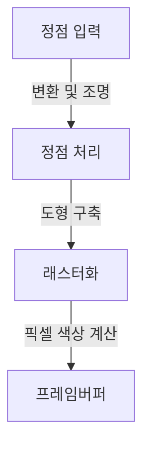
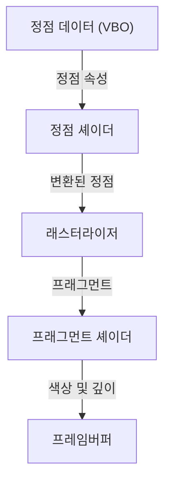

# 1. 들어가며

현대 컴퓨팅 환경에서 3D 그래픽스는 필수적인 요소로 자리 잡았습니다. 게임, 영화 VFX, CAD, 스마트폰 앱부터 웹 브라우저상의 데이터 시각화에 이르기까지, 우리는 일상적으로 3D 기술의 혜택을 누리고 있습니다. 하지만 하드웨어의 성능을 최대한으로 끌어내면서 서로 다른 플랫폼 간에 공통된 프로그램을 동작시키기 위한 '표준화'의 여정은 결코 순탄치 않았습니다.

본 글에서는 오랜 세월 동안 3D 그래픽스 API의 사실상 표준(de facto standard)으로 군림해 온 'OpenGL(Open Graphics Library)'에 대해 알아봅니다. 한 기업의 독자 규격에서 개방형 표준 규격으로 진화한 역사적 배경을 시작으로, 현대 프로그래머블 그래픽스 파이프라인의 구조, 3D 공간을 2D 화면으로 투영하기 위한 행렬 연산의 수학적 기초, 그리고 C/C++와 GLSL을 활용한 구체적인 구현 예제까지 포괄적으로 살펴봅니다.

# 2. OpenGL의 역사: 독자 규격에서의 탈피

## 2.1 SGI와 IRIS GL의 부상

1980년대부터 1990년대에 걸쳐 3D 컴퓨터 그래픽스 분야에서 압도적인 위상을 자랑했던 기업은 바로 Silicon Graphics, Inc.(SGI)였습니다. SGI의 워크스테이션은 전용 그래픽 하드웨어를 탑재하여 영화 산업과 연구 기관에서 널리 활용되었습니다.

이러한 SGI의 하드웨어를 위해 개발된 것이 바로 'IRIS GL'이라는 그래픽스 API였습니다. IRIS GL은 매우 강력하고 사용하기 편리했지만, SGI의 하드웨어와 윈도우 시스템에 강하게 종속되어 있어 다른 시스템으로의 이식성이 극히 떨어진다는 치명적인 단점을 지니고 있었습니다.

## 2.2 오픈 표준의 탄생

1990년대에 접어들며 PC 및 타사 워크스테이션의 성능이 향상되고 그래픽스 시장의 경쟁이 치열해지자, SGI는 자사의 기술을 널리 보급하기 위한 승부수를 던졌습니다. 바로 IRIS GL에서 하드웨어 종속적인 부분을 분리하고, 순수한 3D 렌더링을 위한 개방형 API로 재설계한 'OpenGL'을 발표(1992년)한 것입니다.

OpenGL의 사양은 SGI, IBM, DEC, Microsoft, Intel 등 주요 기업들로 구성된 'OpenGL Architecture Review Board (ARB)'를 통해 관리되기 시작했으며, 특정 플랫폼에 얽매이지 않는 업계 전반의 표준 규격으로서의 위상을 확립했습니다.

## 2.3 프로그래머블로의 패러다임 전환

초기 OpenGL은 '고정 기능 파이프라인(Fixed-Function Pipeline)'이라 불리는 아키텍처를 채택했습니다. 이는 조명이나 좌표 변환 등의 처리가 하드웨어(또는 드라이버) 단에 고정되어 있어, 프로그래머는 매개변수를 설정하는 것만으로 렌더링을 수행하는 방식이었습니다.



이 방식은 초심자가 다루기 쉽다는 장점이 있었던 반면, 독자적인 음영 처리(툰 렌더링 등)나 고급 시각 효과를 구현하기가 어렵다는 한계가 있었습니다. 이를 해결하기 위해 OpenGL 2.0(2004년)에서 'GLSL(OpenGL Shading Language)'이 도입되었으며, 개발자가 GPU 동작을 직접 프로그래밍할 수 있는 '프로그래머블 파이프라인'으로 진화했습니다. 오늘날 고정 기능은 사용 중단(deprecated)되거나 제거되었으며, 셰이더를 활용한 유연한 렌더링이 기본 전제가 되었습니다.

# 3. 모던 OpenGL 파이프라인

최신 OpenGL(Core Profile)에서는 개발자가 그래픽스 파이프라인의 각 단계를 세밀하게 제어해야 합니다.



1. **정점 셰이더 (Vertex Shader)**:
   입력된 각 정점에 대해 실행됩니다. 모델의 로컬 좌표를 카메라 시점에서 본 클립 좌표계로 변환하는 것이 주된 역할입니다.
2. **래스터라이저 (Rasterizer)**:
   정점으로 구성된 폴리곤(삼각형 등)을 화면상의 픽셀에 해당하는 '프래그먼트'로 분해하고 보간합니다.
3. **프래그먼트 셰이더 (Fragment Shader)**:
   각 프래그먼트의 최종 색상(RGB)을 계산합니다. 텍스처 매핑과 조명 계산 등이 주로 이 단계에서 수행됩니다.

# 4. 행렬 연산과 좌표 변환의 기초

3D 공간에 존재하는 물체를 2D 모니터에 정확하게 렌더링하려면 행렬(Matrix)을 이용한 좌표 변환이 필수적입니다. 일반적으로 다음 세 가지 행렬을 곱하여 변환을 수행하며, 이를 MVP 행렬(Model-View-Projection)이라고 부릅니다.

- **모델 행렬 (Model Matrix)**:
  오브젝트 자체의 로컬 공간에서 세상 전체의 절대적인 좌표계(월드 공간)로 배치합니다. 이동, 회전, 확대/축소를 포함합니다.
- **뷰 행렬 (View Matrix)**:
  월드 공간의 좌표를 카메라 시점에서 본 공간(뷰 공간)으로 변환합니다.
- **프로젝션 행렬 (Projection Matrix)**:
  뷰 공간의 좌표를 클립 공간으로 변환합니다. 여기서 원근법(멀리 있는 물체가 작게 보이는 효과)을 적용하는 투시 투영 등이 계산됩니다.

# 5. GLSL과 C/C++를 통한 구현 예제

여기서는 모던 OpenGL을 사용하여 삼각형을 렌더링하기 위한 기초적인 GLSL 셰이더 코드 예제를 살펴봅니다.

## 5.1 정점 셰이더 예제

```glsl
#version 330 core
layout (location = 0) in vec3 aPos;

uniform mat4 model;
uniform mat4 view;
uniform mat4 projection;

void main()
{
    gl_Position = projection * view * model * vec4(aPos, 1.0);
}
```

## 5.2 프래그먼트 셰이더 예제

```glsl
#version 330 core
out vec4 FragColor;

void main()
{
    FragColor = vec4(1.0, 0.5, 0.2, 1.0); // 주황색 출력
}
```

C/C++ 측에서는 GLFW 등의 라이브러리를 사용하여 창을 생성하고, 정점 데이터(VBO: Vertex Buffer Object)와 정점 속성 레이아웃(VAO: Vertex Array Object)을 GPU에 전송합니다. 그리고 메인 루프 안에서 화면을 초기화하고, 설정한 셰이더 프로그램을 사용하여 `glDrawArrays` 등의 함수로 렌더링 명령을 호출합니다.

# 6. 앞으로의 그래픽스 API

OpenGL은 오랜 세월 동안 업계를 지탱해 왔으나, 최근의 멀티코어 CPU 및 대규모 병렬 GPU의 성능을 온전히 이끌어내기에는 기존의 오래된 설계 사상(거대한 상태 머신)이 병목 현상을 유발하고 있습니다.

이에 따라 현재는 하드웨어에 더 가까운 저수준 제어가 가능하고 멀티스레드 렌더링에 최적화된 차세대 API(Vulkan, DirectX 12, Metal 등)로의 전환이 이루어지고 있습니다. 그러나 이러한 최신 API들은 초기화 과정이 매우 복잡하기 때문에, 3D 그래픽스의 근본적인 개념(파이프라인, 행렬 변환, 셰이더)을 배우기 위한 교육용·입문용 API로서 OpenGL은 여전히 큰 가치를 지니고 있습니다.

먼저 OpenGL을 통해 3D 프로그래밍의 기초를 다진 후, 요구 사항에 따라 Vulkan 등으로 발전해 나가는 것이 오늘날에도 가장 권장되는 학습 경로 중 하나입니다.
