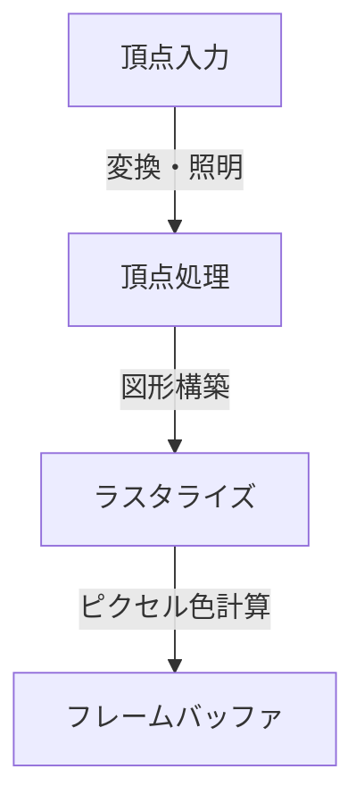
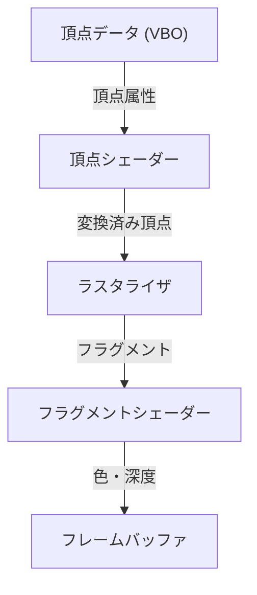

# 1. はじめに

現代のコンピュータ環境において、3Dグラフィックスは不可欠な要素となっています。ゲーム、映画のVFX、CAD、スマートフォンアプリからブラウザ上のデータビジュアライゼーションに至るまで、私たちは日々3D技術の恩恵を受けています。しかし、ハードウェアの性能を最大限に引き出しつつ、異なるプラットフォーム間で共通のプログラムを動作させるための「標準化」への道のりは、決して平坦なものではありませんでした。

本記事では、長年にわたり3DグラフィックスAPIの事実上の標準（デファクトスタンダード）として君臨し続けてきた「OpenGL（Open Graphics Library）」について解説します。一企業の独自規格からオープンな標準規格へと進化を遂げた歴史的背景から始まり、現代のプログラマブル・グラフィックス・パイプラインの仕組み、3D空間を2D画面に落とし込むための行列演算の数学的基礎、さらにはC/C++とGLSLを用いた具体的な実装例までを包括的に紐解いていきます。

# 2. OpenGLの歴史：独自規格からの脱却

## 2.1 SGIとIRIS GLの台頭

1980年代から90年代にかけて、3Dコンピュータグラフィックスの領域で圧倒的な強さを誇っていたのがSilicon Graphics, Inc.（SGI）です。SGIのワークステーションは専用のグラフィックスハードウェアを搭載し、映画産業や研究機関で広く採用されていました。

このSGIのハードウェア向けに開発されたのが「IRIS GL」というグラフィックスAPIです。IRIS GLは非常に強力で使いやすいものでしたが、SGIのハードウェアとウィンドウシステムに強く依存しており、他のシステムへの移植性が極めて低いという致命的な欠点を抱えていました。

## 2.2 オープンスタンダードの誕生

1990年代に入り、PCや他社製ワークステーションの性能が向上し、グラフィックス市場の競争が激化する中で、SGIは自社の技術を広く普及させるための一手を打ちます。それが、IRIS GLからハードウェア依存部分を切り離し、純粋な3D描画のためのオープンなAPIとして再設計した「OpenGL」の発表（1992年）でした。

OpenGLの仕様は、SGI、IBM、DEC、Microsoft、Intelなどの主要企業からなる「OpenGL Architecture Review Board (ARB)」によって管理されることになり、特定のプラットフォームに縛られない業界全体の標準規格としての地位を確立しました。

## 2.3 プログラマブルへのパラダイムシフト

初期のOpenGLは「固定機能パイプライン」と呼ばれるアーキテクチャを採用していました。これは、ライティングや座標変換などの処理がハードウェア（またはドライバ）側で固定されており、プログラマーはパラメータを設定するだけで描画を行う方式です。



この方式は初学者にとって扱いやすい反面、独自の陰影処理（トゥーンレンダリングなど）や高度なエフェクトを実装することが困難でした。これに応えるため、OpenGL 2.0（2004年）で「GLSL（OpenGL Shading Language）」が導入され、開発者がGPUの動作を直接プログラミングできる「プログラマブルパイプライン」へと進化しました。現在では、固定機能は非推奨または削除され、シェーダーを用いた柔軟な描画が前提となっています。

# 3. モダンOpenGLのパイプライン

現在のOpenGL（Core Profile）では、開発者がグラフィックスパイプラインの各ステージを細かく制御する必要があります。



1. **頂点シェーダー (Vertex Shader)**:
   入力された各頂点に対して実行されます。モデルのローカル座標を、カメラから見たクリップ座標系へと変換するのが主な役割です。
2. **ラスタライザ (Rasterizer)**:
   頂点から構成されるポリゴン（三角形など）を、画面上のピクセルに相当する「フラグメント」に分解・補間します。
3. **フラグメントシェーダー (Fragment Shader)**:
   各フラグメントの最終的な色（RGB）を計算します。テクスチャの貼り付けやライティングの計算は主にここで行われます。

# 4. 行列演算と座標変換の基礎

3D空間にある物体を2Dのモニターに正しく描画するには、行列（Matrix）を用いた座標変換が不可欠です。一般的に、以下の3つの行列を掛け合わせて変換を行います。これをMVP行列（Model-View-Projection）と呼びます。

- **モデル行列 (Model Matrix)**:
  オブジェクト自身のローカル空間から、世界全体の絶対的な座標系（ワールド空間）へ配置します。移動、回転、拡大縮小を含みます。
- **ビュー行列 (View Matrix)**:
  ワールド空間の座標を、カメラの視点から見た空間（ビュースペース）に変換します。
- **プロジェクション行列 (Projection Matrix)**:
  ビュースペースの座標をクリップ空間へ変換します。ここで遠近法（遠くのものが小さく見える効果）を適用する透視投影などが計算されます。

# 5. GLSLとC/C++による実装例

ここでは、モダンOpenGLを用いて三角形を描画するための基礎的なGLSLシェーダーコードの例を示します。

## 5.1 頂点シェーダーの例

```glsl
#version 330 core
layout (location = 0) in vec3 aPos;

uniform mat4 model;
uniform mat4 view;
uniform mat4 projection;

void main()
{
    gl_Position = projection * view * model * vec4(aPos, 1.0);
}
```

## 5.2 フラグメントシェーダーの例

```glsl
#version 330 core
out vec4 FragColor;

void main()
{
    FragColor = vec4(1.0, 0.5, 0.2, 1.0); // オレンジ色を出力
}
```

C/C++側では、GLFWなどのライブラリを用いてウィンドウを作成し、頂点データ（VBO: Vertex Buffer Object）と頂点属性のレイアウト（VAO: Vertex Array Object）をGPUに転送します。そしてメインループ内で画面をクリアし、設定したシェーダープログラムを使用して `glDrawArrays` 等の関数で描画命令を発行します。

# 6. これからのグラフィックスAPI

OpenGLは長年にわたり業界を支えてきましたが、近年のマルチコアCPUや超並列GPUの性能を完全に引き出すには、その古い設計思想（巨大なステートマシン）がボトルネックになりつつあります。

そのため、現在ではよりハードウェアに近い低レベルな制御が可能で、マルチスレッド描画に最適化された次世代API（Vulkan、DirectX 12、Metalなど）への移行が進んでいます。しかし、これらのモダンAPIは初期化処理が非常に複雑であるため、3Dグラフィックスの根本的な概念（パイプライン、行列変換、シェーダー）を学ぶための教育用・入門用APIとして、OpenGLは依然として大きな価値を持ち続けています。

まずはOpenGLで3Dプログラミングの基礎を身につけ、その後に要件に応じてVulkanなどにステップアップしていくのが、現在でも最も推奨される学習パスの一つです。
