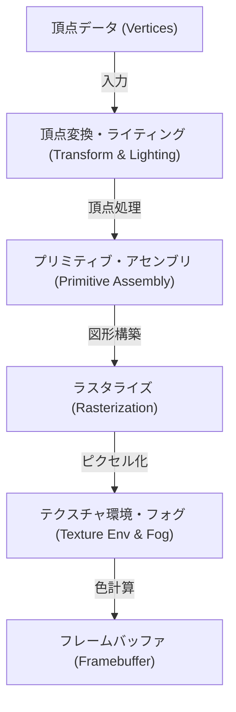
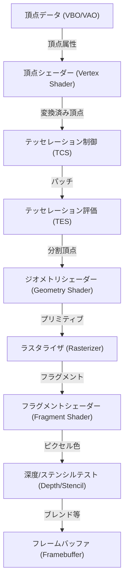
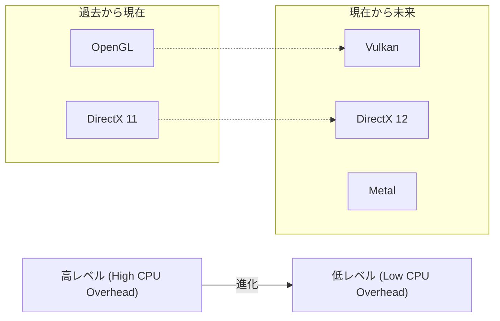

# 1. はじめに

現代のコンピュータにおける3Dグラフィックスは、もはや一部の専門家だけのものではありません。スマートフォンでのゲーム、ウェブブラウザでのデータビジュアライゼーション、映画のVFX、CADソフト、VR/ARなど、あらゆる場所で3Dグラフィックス技術が活用されています。しかし、これらの技術が現在のように広く普及するまでには、ハードウェアの進化と並行して、ソフトウェア（API）の標準化という長い戦いがありました。

本記事では、3DグラフィックスAPIの事実上の標準として長年君臨してきた「OpenGL（Open Graphics Library）」に焦点を当てます。OpenGLがいかにして生まれ、どのように進化してきたのかという歴史的背景から始まり、現代のプログラマブル・グラフィックス・パイプラインの仕組み、行列演算を用いた数学的背景、そしてC/C++とGLSLを用いた具体的な実装例までを、徹底的に深く掘り下げて解説します。

---

# 2. OpenGLの歴史：SGIとIRIS GLから標準規格への道

## 2.1 Silicon Graphics, Inc. (SGI) と IRIS GL の誕生

1980年代から1990年代にかけて、3Dコンピュータグラフィックス（CG）の分野で絶対的な王者に君臨していたのが、ジム・クラークによって設立されたSilicon Graphics, Inc.（SGI）です。SGIのワークステーションは、専用のグラフィックスハードウェアを搭載しており、当時としては破格の3D描画性能を誇っていました。映画『ジュラシック・パーク』や『ターミネーター2』のCG制作にもSGIのコンピュータが使われたことは有名です。

SGIのハードウェアの性能を最大限に引き出すために開発されたのが、「IRIS GL（Integrated Raster Imaging System Graphics Library）」と呼ばれる独自グラフィックスAPIでした。IRIS GLは、プログラマーがハードウェアの複雑な詳細を意識することなく、ポリゴンの描画、ライティング、Zバッファによる陰面消去などを簡単に扱えるように設計されていました。

しかし、IRIS GLには大きな問題がありました。それは「SGIのハードウェアに強く依存している」ということです。IRIS GLはウィンドウシステムや入力デバイスの制御までを含んだ巨大なAPIへと成長しており、他のプラットフォーム（例えばSun MicrosystemsやHPのワークステーション、あるいは台頭しつつあったPC）への移植が極めて困難だったのです。

## 2.2 オープンスタンダードへの移行とOpenGLの誕生

1990年代初頭、3Dグラフィックス市場の競争が激化する中、SGIは自社の技術を普及させるため、そして他社のハードウェアでも動作する業界標準のAPIを策定するために、IRIS GLを整理・抽象化する決断を下しました。

IRIS GLから、ウィンドウシステムへの依存やSGI特有の機能を切り離し、純粋な3Dグラフィックス描画のためのオープンなAPIとして再設計されたのが「OpenGL」です。1992年、OpenGL 1.0が正式に発表されました。

OpenGLの仕様策定と管理を行うため、SGI、DEC、IBM、Intel、Microsoftなどの主要企業が参加する「OpenGL Architecture Review Board（ARB）」が設立されました。これにより、OpenGLは一企業の独自技術から、業界全体の標準規格へと昇華したのです。

## 2.3 固定機能パイプラインからプログラマブルパイプラインへ

初期のOpenGL（1.x〜2.x前半）は、「固定機能パイプライン（Fixed-Function Pipeline）」と呼ばれるアーキテクチャを採用していました。これは、ライティング、トランスフォーム、テクスチャマッピングといった処理がハードウェア内部で固定されており、プログラマーはパラメータ（光の位置や色、マテリアルの特性など）を設定するだけで描画が行われるというものでした。



固定機能パイプラインは非常に使いやすく、初学者が3Dグラフィックスを学ぶには最適でした。（`glBegin()`, `glEnd()`, `glVertex3f()` といった関数を覚えている方も多いでしょう）。

しかし、2000年代に入ると、GPU（Graphics Processing Unit）の進化が著しくなり、開発者は「もっと独自のシェーディング（陰影処理）を行いたい」「トゥーンレンダリングのような非現実的な表現（NPR）をハードウェアで高速に処理したい」と求めるようになりました。

これに応えるため、OpenGL 2.0（2004年）で「GLSL（OpenGL Shading Language）」が導入され、GPUの処理の一部をプログラマーが記述したプログラム（シェーダー）で置き換えられるようになりました。そして、OpenGL 3.1（2009年）とOpenGL 3.2のCore Profileによって、固定機能パイプラインは非推奨（のちに削除）となり、完全に「プログラマブルパイプライン」へと移行したのです。

---

# 3. モダンOpenGLとグラフィックスパイプラインの詳細

現代のOpenGL（バージョン3.3以降のCore Profile）では、プログラマーが自らグラフィックスパイプラインの各ステージを制御する必要があります。パイプラインの流れを以下の図に示します。



## 3.1 各ステージの役割

1. **頂点シェーダー (Vertex Shader)**: 必須。入力された各頂点に対して実行されます。主な役割は、頂点のローカル座標を画面上の座標（クリップ空間）に変換することです。
2. **テッセレーションシェーダー (Tessellation Shaders)**: 任意。ポリゴンをより細かいポリゴンに分割し、詳細な形状を生成します。
3. **ジオメトリシェーダー (Geometry Shader)**: 任意。頂点の集合（点、線、三角形）を受け取り、新しい図形を生成したり、破棄したりできます。
4. **ラスタライザ (Rasterizer)**: 固定機能。数学的な図形（ポリゴン）を、画面のピクセルに対応する「フラグメント」に変換します。ここで頂点間の属性が補間（Interpolation）されます。
5. **フラグメントシェーダー (Fragment Shader)**: 必須。各フラグメントに対して実行され、最終的なピクセルの色（RGBA）と深度値を計算します。テクスチャのサンプリングやライティング計算はここで行われます。
6. **各種テストとブレンディング**: 深度テスト（手前にあるものを優先して描画）、ステンシルテスト、アルファブレンディングなどが行われ、最終的にフレームバッファに書き込まれます。

---

# 4. 行列と座標変換の数学

3D空間のオブジェクトを2Dの画面に描画するには、いくつかの座標系（空間）を順に変換していく必要があります。これを実現するのが「行列（Matrix）」による線形代数です。

## 4.1 ローカル空間からスクリーン空間への変換

一般的に、以下の3つの行列を掛け合わせて変換を行います。これを**MVP行列（Model-View-Projection Matrix）**と呼びます。

$$
V_{clip} = M_{projection} \cdot M_{view} \cdot M_{model} \cdot V_{local}
$$

1. **モデル行列 ($M_{model}$)**:
   オブジェクト自身のローカル座標系（Local Space）を、世界全体の座標系（World Space）に配置します。平行移動（Translation）、回転（Rotation）、拡大縮小（Scaling）を行います。
2. **ビュー行列 ($M_{view}$)**:
   ワールド空間の座標を、カメラ（視点）から見た空間（View Space / Camera Space）に変換します。カメラを後ろに動かすことは、世界全体を前に動かすことと同じです。
3. **プロジェクション行列 ($M_{projection}$)**:
   ビュースペースからクリップスペース（Clip Space）への変換です。透視投影（Perspective Projection）と直交投影（Orthographic Projection）があります。透視投影の場合、遠くのものが小さく見える効果（遠近法）を生み出します。

## 4.2 透視投影行列の構造

透視投影行列は非常に重要です。視野角（FOV）、アスペクト比（Aspect）、近平面（Near）、遠平面（Far）を用いて、次のような4x4行列が構築されます。

$$
\begin{bmatrix}
\frac{1}{\text{aspect} \cdot \tan(\text{fov}/2)} & 0 & 0 & 0 \\
0 & \frac{1}{\tan(\text{fov}/2)} & 0 & 0 \\
0 & 0 & -\frac{\text{far} + \text{near}}{\text{far} - \text{near}} & -\frac{2 \cdot \text{far} \cdot \text{near}}{\text{far} - \text{near}} \\
0 & 0 & -1 & 0
\end{bmatrix}
$$

この行列によって頂点座標のW要素（同次座標系）が変更され、後の「パースペクティブ除算（Perspective Divide）」によって、x, y, z座標が -1.0 から 1.0 の正規化デバイス座標系（NDC: Normalized Device Coordinates）にマッピングされます。

---

# 5. GLSL (OpenGL Shading Language) の基礎

C言語に似た文法を持つGLSLを用いて、GPU上で動作するプログラムを記述します。

## 5.1 頂点シェーダー (Vertex Shader)

```glsl
#version 330 core
layout (location = 0) in vec3 aPos;     // 頂点位置
layout (location = 1) in vec2 aTexCoord; // テクスチャ座標

out vec2 TexCoord; // フラグメントシェーダーへ渡す変数

uniform mat4 model;
uniform mat4 view;
uniform mat4 projection;

void main()
{
    // MVP行列を掛けてクリップ座標系へ変換
    gl_Position = projection * view * model * vec4(aPos, 1.0);
    TexCoord = aTexCoord;
}
```

## 5.2 フラグメントシェーダー (Fragment Shader)

```glsl
#version 330 core
out vec4 FragColor;

in vec2 TexCoord; // 頂点シェーダーから補間されて渡される

uniform sampler2D texture1; // テクスチャユニット

void main()
{
    // テクスチャから色をサンプリング
    FragColor = texture(texture1, TexCoord);
}
```

---

# 6. C/C++によるモダンOpenGLのセットアップと実装

ここからは、実際にC++を使用してウィンドウを作成し、三角形を描画するための基本的なコードを示します。ウィンドウ管理には **GLFW** を、OpenGLの関数ポインタのロードには **GLAD** (またはGLEW) を使用します。

## 6.1 初期化とウィンドウ生成

```cpp
#include <glad/glad.h>
#include <GLFW/glfw3.h>
#include <iostream>

// ウィンドウリサイズ時のコールバック
void framebuffer_size_callback(GLFWwindow* window, int width, int height) {
    glViewport(0, 0, width, height);
}

int main() {
    // 1. GLFWの初期化
    glfwInit();
    // OpenGL 3.3 Core Profileを指定
    glfwWindowHint(GLFW_CONTEXT_VERSION_MAJOR, 3);
    glfwWindowHint(GLFW_CONTEXT_VERSION_MINOR, 3);
    glfwWindowHint(GLFW_OPENGL_PROFILE, GLFW_OPENGL_CORE_PROFILE);

#ifdef __APPLE__
    glfwWindowHint(GLFW_OPENGL_FORWARD_COMPAT, GL_TRUE); // macOS用
#endif

    // 2. ウィンドウの作成
    GLFWwindow* window = glfwCreateWindow(800, 600, "LearnOpenGL", NULL, NULL);
    if (window == NULL) {
        std::cout << "Failed to create GLFW window" << std::endl;
        glfwTerminate();
        return -1;
    }
    glfwMakeContextCurrent(window);
    glfwSetFramebufferSizeCallback(window, framebuffer_size_callback);

    // 3. GLADの初期化 (OS固有のOpenGL関数ポインタをロード)
    if (!gladLoadGLLoader((GLADloadproc)glfwGetProcAddress)) {
        std::cout << "Failed to initialize GLAD" << std::endl;
        return -1;
    }

    // 続く...
```

## 6.2 頂点データとバッファの構築 (VAO, VBO)

モダンOpenGLでは、頂点データをGPUのメモリ（VRAM）に転送し、そのデータのレイアウトを定義する必要があります。

```cpp
    // 頂点データ (X, Y, Z)
    float vertices[] = {
        -0.5f, -0.5f, 0.0f, // 左下
         0.5f, -0.5f, 0.0f, // 右下
         0.0f,  0.5f, 0.0f  // 上部
    };

    unsigned int VBO, VAO;
    // VAO (Vertex Array Object) の生成とバインド
    glGenVertexArrays(1, &VAO);
    glBindVertexArray(VAO);

    // VBO (Vertex Buffer Object) の生成とバインド
    glGenBuffers(1, &VBO);
    glBindBuffer(GL_ARRAY_BUFFER, VBO);
    
    // データをGPUに転送
    glBufferData(GL_ARRAY_BUFFER, sizeof(vertices), vertices, GL_STATIC_DRAW);

    // 頂点属性ポインタの設定 (location = 0)
    glVertexAttribPointer(0, 3, GL_FLOAT, GL_FALSE, 3 * sizeof(float), (void*)0);
    glEnableVertexAttribArray(0);

    // バインド解除 (安全のため)
    glBindBuffer(GL_ARRAY_BUFFER, 0); 
    glBindVertexArray(0);
```

## 6.3 メインループ (レンダリング)

シェーダーのコンパイルとリンク処理（ここでは関数化されていると仮定します）を行った後、メインのレンダリングループに入ります。

```cpp
    // シェーダープログラムのロードとコンパイル (実装省略)
    // unsigned int shaderProgram = LoadShaders("vertex.glsl", "fragment.glsl");

    // メインループ
    while (!glfwWindowShouldClose(window)) {
        // 入力処理 (Escapeキーで終了など)
        if (glfwGetKey(window, GLFW_KEY_ESCAPE) == GLFW_PRESS)
            glfwSetWindowShouldClose(window, true);

        // 1. 画面のクリア
        glClearColor(0.2f, 0.3f, 0.3f, 1.0f);
        glClear(GL_COLOR_BUFFER_BIT | GL_DEPTH_BUFFER_BIT);

        // 2. シェーダーの有効化
        // glUseProgram(shaderProgram);

        // 3. VAOをバインドして描画
        glBindVertexArray(VAO);
        glDrawArrays(GL_TRIANGLES, 0, 3);

        // 4. バッファのスワップとイベントのポーリング
        glfwSwapBuffers(window);
        glfwPollEvents();
    }

    // リソースの解放
    glDeleteVertexArrays(1, &VAO);
    glDeleteBuffers(1, &VBO);
    // glDeleteProgram(shaderProgram);

    glfwTerminate();
    return 0;
}
```

---

# 7. OpenGLの現状と未来（Vulkan, Metal, DirectX 12）

SGIのIRIS GLから始まり、1992年に誕生したOpenGLは、四半世紀以上にわたってクロスプラットフォームの標準APIとして業界を支えてきました。しかし、現代のハードウェアアーキテクチャ（マルチコアCPUや並列処理に特化した巨大なGPU）に対して、OpenGLの「単一の巨大なステートマシン（状態保持機械）」という設計思想は限界を迎えつつあります。

OpenGLはグローバルな状態を多く持つため、マルチスレッドでの描画命令の生成が難しく、CPUのオーバーヘッドが大きくなりやすいという根本的な問題を抱えています。

この問題を解決するため、より低レベルで薄い抽象化層を提供し、開発者がGPUのメモリや同期処理を細かく制御できる新しい世代のAPIが登場しました。
* **Vulkan**: OpenGLを管理しているKhronos Groupが策定した、OpenGLの後継とも言えるクロスプラットフォームAPI。
* **DirectX 12**: Microsoftが提供するWindowsおよびXbox向けの低レベルAPI。
* **Metal**: AppleがmacOSおよびiOS向けに提供する独自API（AppleはOpenGLを非推奨にしました）。



## 7.1 それでもOpenGLを学ぶ意義

新しい低レベルAPIが主流になりつつある現在でも、OpenGLを学ぶ意義は決して失われていません。その理由は以下の通りです。

1. **学習コストの低さ**: VulkanやDirectX 12は、最初の三角形を画面に描画するだけでも数百行から数千行のコードと複雑なセットアップが必要です。対してOpenGLは、グラフィックスパイプラインの基礎や行列演算、シェーダープログラミングといった「3Dグラフィックスの本質」を学ぶための入り口として、依然として優れています。
2. **既存の膨大なアセットとコミュニティ**: 世界中にはOpenGLで書かれた無数のソフトウェア、エンジン、チュートリアルが存在します。
3. **WebGL**: ブラウザ上で3Dグラフィックスをレンダリングする標準規格であるWebGLは、OpenGL ESをベースにしています。Webの世界では、まだまだOpenGLの知識が直接役立ちます。

# 8. 結び

SGIのワークステーション向けの独自技術から始まり、業界標準として成長し、ゲームから科学技術計算まであらゆる分野を支えてきたOpenGL。その歴史を振り返り、基礎的な仕組みを理解することは、VulkanやWebGPUといった次世代のテクノロジーを学ぶ上でも強固な土台となるでしょう。

グラフィックスプログラミングの世界は奥深く、数式とコードが画面上の美しいビジュアルに変換される瞬間は、他のプログラミングでは味わえない感動があります。ぜひ、本記事をきっかけにOpenGLのコードを実際に書いて、独自の3D世界を構築してみてください。
