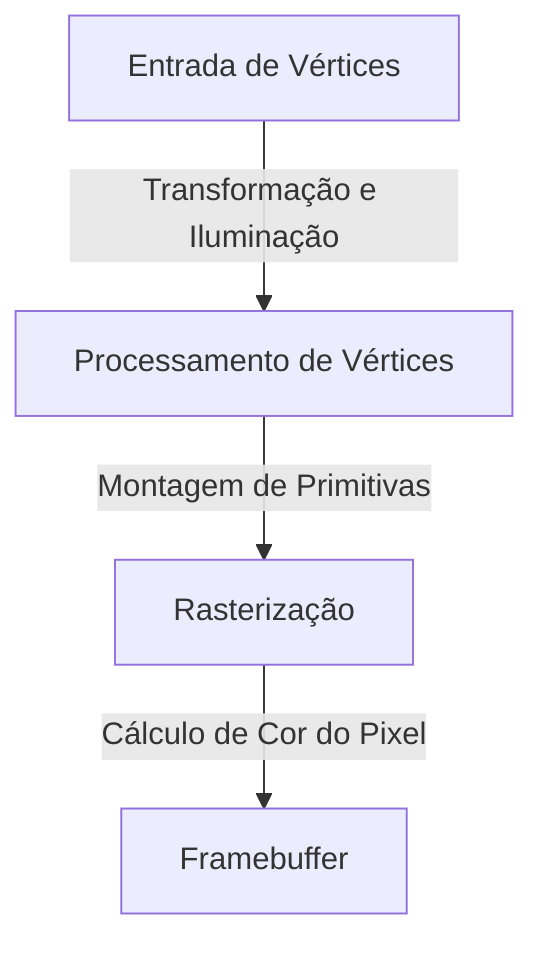
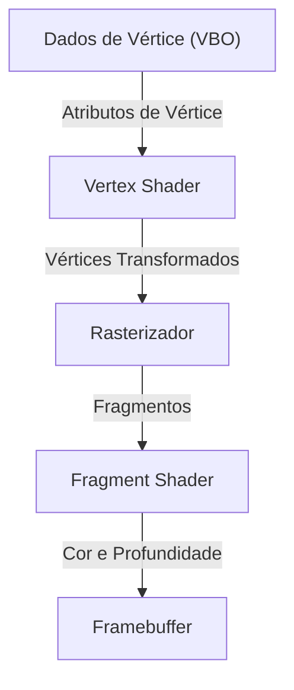

# 1. Introdução

No ambiente computacional moderno, os gráficos 3D tornaram-se um elemento indispensável. De jogos eletrônicos e efeitos visuais (VFX) no cinema a softwares de CAD, aplicativos móveis e visualizações de dados em navegadores web, nós nos beneficiamos diariamente da tecnologia 3D. No entanto, o caminho em direção à "padronização" — permitindo que programas comuns funcionem em diferentes plataformas ao mesmo tempo em que extraem o máximo de desempenho do hardware — não foi de modo algum simples.

Neste artigo, exploraremos o "OpenGL (Open Graphics Library)", que reinou durante muitos anos como o padrão de fato (de facto standard) para APIs de gráficos 3D. Começaremos pelo contexto histórico de sua evolução, passando de um formato proprietário de uma única empresa para um padrão aberto, abordaremos o funcionamento do moderno pipeline gráfico programável, os fundamentos matemáticos das operações matriciais necessárias para projetar o espaço 3D em uma tela 2D e concluiremos com exemplos concretos de implementação em C/C++ e GLSL.

# 2. A História do OpenGL: Libertando-se de Padrões Proprietários

## 2.1 A Ascensão da SGI e do IRIS GL

Durante as décadas de 1980 e 1990, a Silicon Graphics, Inc. (SGI) dominou de forma esmagadora o campo da computação gráfica 3D. As estações de trabalho da SGI contavam com hardware gráfico dedicado e eram amplamente utilizadas na indústria cinematográfica e em institutos de pesquisa.

Desenvolvida especialmente para o hardware da SGI, a API gráfica "IRIS GL" era extremamente poderosa e intuitiva. No entanto, ela apresentava uma desvantagem crítica: dependia fortemente do hardware e do sistema de janelas proprietários da SGI, o que tornava sua portabilidade para outros sistemas extremamente difícil.

## 2.2 O Nascimento de um Padrão Aberto

No início dos anos 1990, com o avanço do desempenho dos PCs e das estações de trabalho concorrentes e com a intensificação da competição no mercado gráfico, a SGI deu um passo estratégico para difundir amplamente a sua tecnologia. Esse movimento foi o anúncio do "OpenGL" (1992), reprojetado a partir do IRIS GL como uma API aberta voltada puramente para renderização 3D, desacoplando todos os componentes dependentes de hardware.

A especificação do OpenGL passou a ser gerenciada pelo "OpenGL Architecture Review Board (ARB)", formado por grandes corporações como SGI, IBM, DEC, Microsoft e Intel. Isso consolidou o OpenGL como um padrão para toda a indústria, livre das amarras de qualquer plataforma específica.

## 2.3 A Mudança de Paradigma para o Pipeline Programável

As primeiras versões do OpenGL adotavam uma arquitetura conhecida como "pipeline de função fixa" (Fixed-Function Pipeline). Nesse modelo, processos como iluminação e transformações de coordenadas eram fixados no hardware (ou no driver), e os desenvolvedores apenas definiam parâmetros para realizar a renderização.



Embora essa abordagem fosse acessível para iniciantes, era extremamente difícil implementar sombreamentos personalizados (como cel shading / toon rendering) ou efeitos visuais avançados. Para suprir essa demanda, o OpenGL 2.0 (2004) introduziu o "GLSL (OpenGL Shading Language)", evoluindo para um "pipeline programável" no qual os desenvolvedores podiam programar diretamente as operações da GPU. Hoje, as funções fixas foram descontinuadas ou completamente removidas, e a renderização flexível por meio de shaders tornou-se a norma absoluta.

# 3. O Pipeline do OpenGL Moderno

No OpenGL moderno (Core Profile), os desenvolvedores precisam controlar detalhadamente cada estágio do pipeline gráfico.



1. **Vertex Shader (Shader de Vértice)**:
   Executado para cada vértice de entrada. Sua função principal é transformar as coordenadas locais do modelo para o sistema de coordenadas de corte (clip coordinates) visto pela câmera.
2. **Rasterizador (Rasterizer)**:
   Decompõe e interpola os polígonos (como triângulos) compostos por vértices em "fragmentos", que correspondem a pixels na tela.
3. **Fragment Shader (Shader de Fragmento)**:
   Calcula a cor final (RGB) de cada fragmento. O mapeamento de texturas e os cálculos de iluminação são realizados predominantemente neste estágio.

# 4. Fundamentos de Operações Matriciais e Transformações de Coordenadas

Para desenhar corretamente objetos do espaço 3D em um monitor 2D, as transformações de coordenadas usando matrizes são indispensáveis. Geralmente, as transformações são realizadas multiplicando três matrizes entre si. Esse produto é conhecido como matriz MVP (Model-View-Projection).

- **Matriz de Modelo (Model Matrix)**:
  Posiciona o objeto a partir de seu espaço local no sistema de coordenadas absolutas do mundo (espaço global / world space). Inclui translação, rotação e escala.
- **Matriz de Visualização (View Matrix)**:
  Transforma as coordenadas do espaço do mundo para o espaço visto a partir da perspectiva da câmera (espaço da câmera / view space).
- **Matriz de Projeção (Projection Matrix)**:
  Converte as coordenadas do espaço de visualização para o espaço de corte (clip space). É aqui que a projeção em perspectiva (onde objetos distantes parecem menores) é calculada.

# 5. Exemplo de Implementação com C/C++ e GLSL

Abaixo está um exemplo de código básico de shader GLSL para renderizar um triângulo utilizando o OpenGL moderno.

## 5.1 Exemplo de Vertex Shader

```glsl
#version 330 core
layout (location = 0) in vec3 aPos;

uniform mat4 model;
uniform mat4 view;
uniform mat4 projection;

void main()
{
    gl_Position = projection * view * model * vec4(aPos, 1.0);
}
```

## 5.2 Exemplo de Fragment Shader

```glsl
#version 330 core
out vec4 FragColor;

void main()
{
    FragColor = vec4(1.0, 0.5, 0.2, 1.0); // Gera cor laranja
}
```

No lado do C/C++, bibliotecas como a GLFW são usadas para criar a janela e enviar os dados dos vértices (VBO: Vertex Buffer Object) juntamente com o layout dos atributos de vértice (VAO: Vertex Array Object) para a GPU. Em seguida, dentro do loop principal, a tela é limpa e as instruções de desenho são emitidas por meio de funções como `glDrawArrays`, utilizando o programa de shader configurado.

# 6. O Futuro das APIs Gráficas

Embora o OpenGL tenha sustentado a indústria gráfica por muitos anos, sua arquitetura legada — concebida como uma gigantesca máquina de estados — tornou-se um gargalo para extrair todo o potencial das CPUs multinúcleo e GPUs massivamente paralelas dos dias de hoje.

Por isso, a indústria tem migrado cada vez mais para APIs de última geração (como Vulkan, DirectX 12 e Metal), que oferecem controle de baixo nível próximo ao hardware e são otimizadas para renderização multithread. Contudo, devido à extrema complexidade dos processos de inicialização dessas APIs modernas, o OpenGL continua tendo um valor inestimável como uma API introdutória e educacional para aprender os conceitos fundamentais da computação gráfica 3D (pipelines, transformações matriciais e shaders).

Aprender primeiro os fundamentos da programação 3D com o OpenGL e, posteriormente, avançar para APIs como o Vulkan conforme as exigências do projeto, continua sendo uma das rotas de aprendizado mais recomendadas atualmente.
