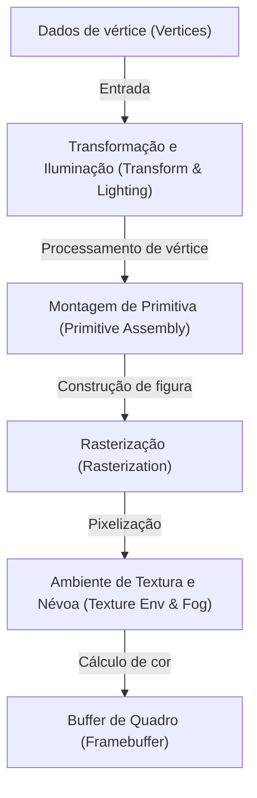
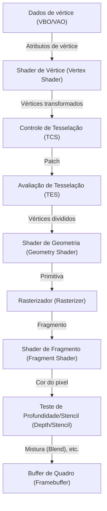
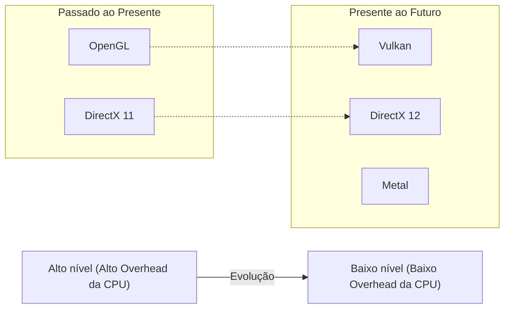

# 1. Introdução

Os gráficos 3D em computadores modernos não são mais restritos a apenas alguns especialistas. A tecnologia de gráficos 3D é usada em todos os lugares: jogos em smartphones, visualização de dados em navegadores da web, efeitos visuais (VFX) de filmes, software CAD, VR/AR e muito mais. No entanto, para que essas tecnologias se tornassem tão disseminadas quanto são hoje, houve uma longa batalha pela padronização de software (APIs) paralelamente à evolução do hardware.

Este artigo se concentrará no "OpenGL (Open Graphics Library)", que há muito reina como o padrão de fato para APIs de gráficos 3D. Começaremos com o contexto histórico de como o OpenGL nasceu e como evoluiu, e então nos aprofundaremos na mecânica do pipeline de gráficos programáveis moderno, o contexto matemático usando operações de matriz e exemplos de implementação específicos usando C/C++ e GLSL.

---

# 2. A História do OpenGL: Da SGI e IRIS GL a um Padrão

## 2.1 Silicon Graphics, Inc. (SGI) e o Nascimento do IRIS GL

Ao longo das décadas de 1980 e 1990, o rei indiscutível no campo de computação gráfica 3D (CG) era a Silicon Graphics, Inc. (SGI), fundada por Jim Clark. As estações de trabalho da SGI eram equipadas com hardware de gráficos dedicado e apresentavam desempenho de renderização 3D excepcional para a época. É famoso o fato de que os computadores SGI foram usados na produção de CG para filmes como "Jurassic Park" e "O Exterminador do Futuro 2".

Para maximizar o desempenho do hardware da SGI, uma API de gráficos proprietária chamada "IRIS GL (Integrated Raster Imaging System Graphics Library)" foi desenvolvida. O IRIS GL foi projetado para permitir que os programadores lidassem facilmente com o desenho de polígonos, iluminação, remoção de superfícies ocultas com Z-buffer, etc., sem terem que se preocupar com os detalhes complexos do hardware.

No entanto, o IRIS GL tinha um grande problema: era "fortemente dependente do hardware da SGI". O IRIS GL cresceu e se tornou uma API enorme que até incluía o controle do sistema de janelas e de dispositivos de entrada, o que tornava extremamente difícil a conversão para outras plataformas (por exemplo, estações de trabalho da Sun Microsystems e HP, ou os PCs emergentes).

## 2.2 A Transição para Padrões Abertos e o Nascimento do OpenGL

No início da década de 1990, à medida que a concorrência no mercado de gráficos 3D se intensificava, a SGI tomou a decisão de organizar e abstrair o IRIS GL para disseminar sua própria tecnologia e criar uma API padrão da indústria que funcionaria no hardware de outras empresas.

O "OpenGL" foi redesenhado do IRIS GL como uma API aberta puramente para renderização de gráficos 3D, desvinculada de dependências do sistema de janelas e recursos específicos da SGI. Em 1992, o OpenGL 1.0 foi anunciado oficialmente.

O "OpenGL Architecture Review Board (ARB)" foi formado por grandes empresas como SGI, DEC, IBM, Intel e Microsoft para desenvolver e gerenciar a especificação do OpenGL. Assim, o OpenGL passou de uma tecnologia proprietária de uma única empresa para um padrão em toda a indústria.

## 2.3 Do Pipeline de Função Fixa ao Pipeline Programável

As primeiras versões do OpenGL (1.x até o início do 2.x) usavam uma arquitetura chamada "Pipeline de Função Fixa (Fixed-Function Pipeline)". Nele, processos como iluminação, transformações e mapeamento de textura eram fixados dentro do hardware, e o programador só precisava configurar os parâmetros (posição e cor da luz, propriedades do material, etc.) para que o desenho fosse realizado.



O pipeline de função fixa era muito fácil de usar e perfeito para iniciantes aprenderem sobre gráficos 3D. (Muitos devem se lembrar de funções como `glBegin()`, `glEnd()` e `glVertex3f()`).

No entanto, nos anos 2000, com a rápida evolução das GPUs (Unidades de Processamento Gráfico), os desenvolvedores começaram a exigir "a capacidade de fazer sombreamento personalizado (shading)" e "processamento rápido de hardware de expressões não realistas (NPR) como renderização de desenho animado".

Em resposta a isso, o OpenGL 2.0 (2004) introduziu o "GLSL (OpenGL Shading Language)", que permitiu que algumas partes do processamento da GPU fossem substituídas por programas (shaders) escritos pelo programador. Então, com o OpenGL 3.1 (2009) e o Core Profile do OpenGL 3.2, o pipeline de função fixa foi depreciado (e depois removido), mudando inteiramente para um "pipeline programável".

---

# 3. O OpenGL Moderno e os Detalhes do Pipeline Gráfico

No OpenGL moderno (versão 3.3 Core Profile e superior), os programadores devem controlar cada estágio do pipeline gráfico por conta própria. O fluxo do pipeline é mostrado no diagrama abaixo.



## 3.1 Papel de Cada Estágio

1. **Shader de Vértice (Vertex Shader)**: Obrigatório. Executado para cada vértice de entrada. Seu papel principal é transformar as coordenadas locais do vértice em coordenadas na tela (espaço de clipe).
2. **Shader de Tesselação (Tessellation Shaders)**: Opcional. Subdivide polígonos em polígonos menores, gerando formas detalhadas.
3. **Shader de Geometria (Geometry Shader)**: Opcional. Recebe um conjunto de vértices (pontos, linhas, triângulos) e pode gerar ou descartar novas formas.
4. **Rasterizador (Rasterizer)**: Função fixa. Converte formas matemáticas (polígonos) em "fragmentos" correspondentes aos pixels na tela. É aqui que ocorre a interpolação de atributos entre os vértices.
5. **Shader de Fragmento (Fragment Shader)**: Obrigatório. Executado para cada fragmento para calcular a cor final do pixel (RGBA) e o valor de profundidade. É aqui que a amostragem de textura e os cálculos de iluminação são feitos.
6. **Vários Testes e Blending**: Teste de profundidade (priorizando o desenho do que está na frente), teste de stencil, mistura alfa, etc. são executados antes de finalmente gravar no framebuffer.

---

# 4. Matemática de Matrizes e Transformações de Coordenadas

Para desenhar objetos no espaço 3D em uma tela 2D, é necessário transformar por meio de vários sistemas de coordenadas (espaços) sequencialmente. Isso é alcançado através da álgebra linear com "Matrizes".

## 4.1 Transformação do Espaço Local para o Espaço de Tela

Normalmente, a transformação é feita pela multiplicação destas três matrizes. Isso é conhecido como a **Matriz MVP (Model-View-Projection Matrix)**.

$$
V_{clip} = M_{projection} \cdot M_{view} \cdot M_{model} \cdot V_{local}
$$

1. **Matriz de Modelo ($M_{model}$)**:
   Coloca o sistema de coordenadas locais do próprio objeto (Local Space) no sistema de coordenadas de todo o mundo (World Space). Ele realiza translação, rotação e escala (Scaling).
2. **Matriz de Visão ($M_{view}$)**:
   Transforma as coordenadas do espaço do mundo no espaço visto pela câmera (ponto de vista) (View Space / Camera Space). Mover a câmera para trás é o mesmo que mover o mundo inteiro para frente.
3. **Matriz de Projeção ($M_{projection}$)**:
   A transformação do espaço de visualização para o espaço de clipe (Clip Space). Existe a Projeção Perspectiva (Perspective Projection) e a Projeção Ortográfica (Orthographic Projection). A projeção perspectiva cria o efeito de objetos distantes parecerem menores (perspectiva).

## 4.2 Estrutura da Matriz de Projeção Perspectiva

A matriz de projeção perspectiva é muito importante. Uma matriz 4x4 como a seguinte é construída usando o Campo de Visão (FOV), a Proporção da Tela (Aspect), o Plano Próximo (Near) e o Plano Distante (Far).

$$
\begin{bmatrix}
\frac{1}{\text{aspect} \cdot \tan(\text{fov}/2)} & 0 & 0 & 0 \\
0 & \frac{1}{\tan(\text{fov}/2)} & 0 & 0 \\
0 & 0 & -\frac{\text{far} + \text{near}}{\text{far} - \text{near}} & -\frac{2 \cdot \text{far} \cdot \text{near}}{\text{far} - \text{near}} \\
0 & 0 & -1 & 0
\end{bmatrix}
$$

Essa matriz altera o componente W (coordenadas homogêneas) das coordenadas do vértice, e a subsequente "Divisão de Perspectiva (Perspective Divide)" mapeia as coordenadas x, y, z para o sistema de coordenadas normalizado do dispositivo (NDC: Normalized Device Coordinates) de -1.0 a 1.0.

---

# 5. Fundamentos da GLSL (OpenGL Shading Language)

A GLSL, que tem uma sintaxe semelhante a C, é usada para escrever programas que rodam na GPU.

## 5.1 Shader de Vértice (Vertex Shader)

```glsl
#version 330 core
layout (location = 0) in vec3 aPos;     // Posição do vértice
layout (location = 1) in vec2 aTexCoord; // Coordenada de textura

out vec2 TexCoord; // Variável passada para o fragment shader

uniform mat4 model;
uniform mat4 view;
uniform mat4 projection;

void main()
{
    // Multiplica pela matriz MVP para transformar para o sistema de coordenadas de clipe
    gl_Position = projection * view * model * vec4(aPos, 1.0);
    TexCoord = aTexCoord;
}
```

## 5.2 Shader de Fragmento (Fragment Shader)

```glsl
#version 330 core
out vec4 FragColor;

in vec2 TexCoord; // Passado e interpolado do vertex shader

uniform sampler2D texture1; // Unidade de textura

void main()
{
    // Amostra a cor da textura
    FragColor = texture(texture1, TexCoord);
}
```

---

# 6. Configuração e Implementação Moderna do OpenGL com C/C++

A partir daqui, mostraremos o código básico real para criar uma janela e desenhar um triângulo usando C++. O **GLFW** é usado para o gerenciamento de janelas e o **GLAD** (ou GLEW) é usado para carregar ponteiros de função OpenGL.

## 6.1 Inicialização e Criação de Janela

```cpp
#include <glad/glad.h>
#include <GLFW/glfw3.h>
#include <iostream>

// Callback para quando a janela é redimensionada
void framebuffer_size_callback(GLFWwindow* window, int width, int height) {
    glViewport(0, 0, width, height);
}

int main() {
    // 1. Inicializar o GLFW
    glfwInit();
    // Especificar o OpenGL 3.3 Core Profile
    glfwWindowHint(GLFW_CONTEXT_VERSION_MAJOR, 3);
    glfwWindowHint(GLFW_CONTEXT_VERSION_MINOR, 3);
    glfwWindowHint(GLFW_OPENGL_PROFILE, GLFW_OPENGL_CORE_PROFILE);

#ifdef __APPLE__
    glfwWindowHint(GLFW_OPENGL_FORWARD_COMPAT, GL_TRUE); // Para macOS
#endif

    // 2. Criar a janela
    GLFWwindow* window = glfwCreateWindow(800, 600, "LearnOpenGL", NULL, NULL);
    if (window == NULL) {
        std::cout << "Failed to create GLFW window" << std::endl;
        glfwTerminate();
        return -1;
    }
    glfwMakeContextCurrent(window);
    glfwSetFramebufferSizeCallback(window, framebuffer_size_callback);

    // 3. Inicializar o GLAD (Carregar ponteiros de função OpenGL específicos do SO)
    if (!gladLoadGLLoader((GLADloadproc)glfwGetProcAddress)) {
        std::cout << "Failed to initialize GLAD" << std::endl;
        return -1;
    }

    // Continua...
```

## 6.2 Construção de Dados de Vértice e Buffers (VAO, VBO)

No OpenGL moderno, os dados dos vértices precisam ser transferidos para a memória da GPU (VRAM), e o layout desses dados deve ser definido.

```cpp
    // Dados de vértice (X, Y, Z)
    float vertices[] = {
        -0.5f, -0.5f, 0.0f, // Inferior esquerdo
         0.5f, -0.5f, 0.0f, // Inferior direito
         0.0f,  0.5f, 0.0f  // Superior
    };

    unsigned int VBO, VAO;
    // Geração e vinculação do VAO (Vertex Array Object)
    glGenVertexArrays(1, &VAO);
    glBindVertexArray(VAO);

    // Geração e vinculação do VBO (Vertex Buffer Object)
    glGenBuffers(1, &VBO);
    glBindBuffer(GL_ARRAY_BUFFER, VBO);
    
    // Transferir dados para a GPU
    glBufferData(GL_ARRAY_BUFFER, sizeof(vertices), vertices, GL_STATIC_DRAW);

    // Configurar o ponteiro de atributo de vértice (location = 0)
    glVertexAttribPointer(0, 3, GL_FLOAT, GL_FALSE, 3 * sizeof(float), (void*)0);
    glEnableVertexAttribArray(0);

    // Desvincular (por segurança)
    glBindBuffer(GL_ARRAY_BUFFER, 0); 
    glBindVertexArray(0);
```

## 6.3 Loop Principal (Renderização)

Após processar a compilação e a ligação dos shaders (presumidos aqui como encapsulados em uma função), o loop de renderização principal é inserido.

```cpp
    // Carregar e compilar o programa de shader (implementação omitida)
    // unsigned int shaderProgram = LoadShaders("vertex.glsl", "fragment.glsl");

    // Loop principal
    while (!glfwWindowShouldClose(window)) {
        // Processamento de entrada (ex: sair ao pressionar Escape)
        if (glfwGetKey(window, GLFW_KEY_ESCAPE) == GLFW_PRESS)
            glfwSetWindowShouldClose(window, true);

        // 1. Limpar a tela
        glClearColor(0.2f, 0.3f, 0.3f, 1.0f);
        glClear(GL_COLOR_BUFFER_BIT | GL_DEPTH_BUFFER_BIT);

        // 2. Ativar o shader
        // glUseProgram(shaderProgram);

        // 3. Vincular o VAO e desenhar
        glBindVertexArray(VAO);
        glDrawArrays(GL_TRIANGLES, 0, 3);

        // 4. Trocar buffers (swap) e sondar eventos
        glfwSwapBuffers(window);
        glfwPollEvents();
    }

    // Liberar recursos
    glDeleteVertexArrays(1, &VAO);
    glDeleteBuffers(1, &VBO);
    // glDeleteProgram(shaderProgram);

    glfwTerminate();
    return 0;
}
```

---

# 7. Estado Atual e o Futuro do OpenGL (Vulkan, Metal, DirectX 12)

Originário da tecnologia proprietária IRIS GL da SGI e nascido em 1992, o OpenGL sustentou a indústria como a API de padrão cruzado por mais de um quarto de século. No entanto, sua filosofia de design de ser uma "enorme máquina de estados (state machine) única" atingiu o seu limite frente às arquiteturas de hardware modernas (como CPUs de múltiplos núcleos e GPUs enormes especializadas em processamento paralelo).

Como o OpenGL tem um grande estado global, é difícil gerar comandos de renderização em múltiplas threads (multithreading), levando ao problema fundamental do alto overhead na CPU.

Para resolver isso, surgiu uma nova geração de APIs que fornecem uma camada de abstração muito mais fina e de baixo nível, permitindo aos desenvolvedores controle minucioso sobre a memória e a sincronização da GPU.
* **Vulkan**: Desenvolvido pelo Khronos Group, os gerenciadores do OpenGL. É essencialmente a API multiplataforma sucessora do OpenGL.
* **DirectX 12**: A API de baixo nível da Microsoft para Windows e Xbox.
* **Metal**: A API proprietária da Apple para macOS e iOS (a Apple depreciou o OpenGL).



## 7.1 Por Que Ainda Vale a Pena Aprender o OpenGL

Mesmo com as novas APIs de baixo nível se tornando convencionais, aprender o OpenGL não perdeu seu valor. Os motivos incluem:

1. **Baixo Custo de Aprendizado**: Desenhar até mesmo o seu primeiro triângulo na tela no Vulkan ou DirectX 12 requer de centenas a milhares de linhas de código e uma configuração complexa. O OpenGL, por outro lado, continua a ser excelente como uma porta de entrada para aprender "a essência dos gráficos 3D", como o pipeline gráfico, matemática de matrizes e a programação de shaders.
2. **Grandes Recursos e Comunidades Existentes**: Existem inúmeros softwares, engines e tutoriais escritos em OpenGL em todo o mundo.
3. **WebGL**: A tecnologia WebGL padrão para renderizar gráficos 3D em navegadores é baseada no OpenGL ES. No mundo da web, o conhecimento sobre o OpenGL ainda é diretamente útil.

# 8. Conclusão

Começando como uma tecnologia proprietária para as estações de trabalho da SGI, crescendo para se tornar um padrão do setor e sustentando tudo, de jogos a cálculos científicos, a história e os mecanismos básicos por trás do OpenGL formam uma base formidável sobre a qual você pode aprender e usar a próxima geração de tecnologia, como o Vulkan ou WebGPU.

O mundo da programação gráfica é profundo. O momento no qual expressões matemáticas e código são transformados em belos elementos visuais na tela carrega consigo um encanto que é difícil de se encontrar em outras formas de programação. Espero que você seja inspirado a criar o seu próprio mundo em 3D, e tentar escrever alguns códigos em OpenGL usando este artigo como ponto de partida.
