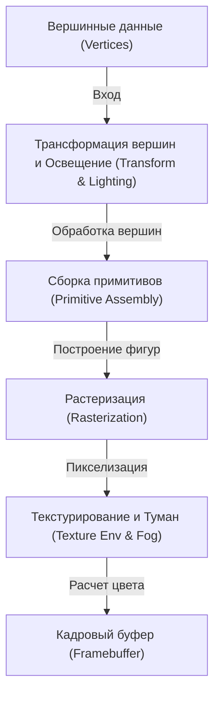
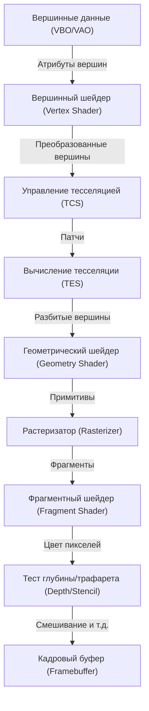
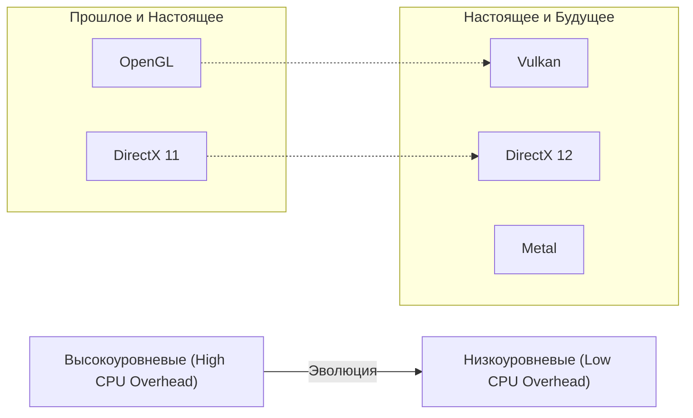

# 1. Введение

В современных компьютерах 3D-графика больше не является уделом лишь немногих специалистов. Игры на смартфонах, визуализация данных в веб-браузерах, визуальные эффекты в кино, CAD-программы, VR/AR — технологии 3D-графики используются повсеместно. Однако прежде чем эти технологии получили столь широкое распространение, параллельно с развитием аппаратного обеспечения шла долгая борьба за стандартизацию программного обеспечения (API).

В этой статье мы сосредоточимся на OpenGL (Open Graphics Library), который долгие годы был фактическим стандартом API для 3D-графики. Мы глубоко и детально рассмотрим исторический контекст — как появился и развивался OpenGL, принципы работы современного программируемого графического конвейера, математические основы с использованием матричных вычислений, а также конкретные примеры реализации с использованием C/C++ и GLSL.

---

# 2. История OpenGL: Путь от SGI и IRIS GL к стандарту

## 2.1 Silicon Graphics, Inc. (SGI) и рождение IRIS GL

В 1980-х и 1990-х годах абсолютным лидером в области трехмерной компьютерной графики (CG) была компания Silicon Graphics, Inc. (SGI), основанная Джимом Кларком. Рабочие станции SGI оснащались специализированным графическим оборудованием, обеспечивающим беспрецедентную для того времени производительность 3D-рендеринга. Компьютеры SGI знамениты тем, что использовались для создания компьютерной графики в фильмах «Парк Юрского периода» и «Терминатор 2».

Для максимального раскрытия потенциала оборудования SGI был разработан собственный графический API под названием «IRIS GL» (Integrated Raster Imaging System Graphics Library). IRIS GL был спроектирован так, чтобы программисты могли легко управлять рендерингом полигонов, освещением и удалением невидимых поверхностей с помощью Z-буфера, не задумываясь о сложных аппаратных деталях.

Однако у IRIS GL была одна серьезная проблема: сильная зависимость от аппаратного обеспечения SGI. IRIS GL разросся в огромный API, включающий даже управление оконной системой и устройствами ввода, что сделало его перенос на другие платформы (например, рабочие станции Sun Microsystems или HP, или набирающие популярность ПК) крайне затруднительным.

## 2.2 Переход к открытым стандартам и появление OpenGL

В начале 1990-х годов, в условиях растущей конкуренции на рынке 3D-графики, SGI решила очистить и абстрагировать IRIS GL. Целью было распространение собственных технологий и создание отраслевого стандарта API, который мог бы работать и на оборудовании других компаний.

IRIS GL был переработан: от него отделили зависимость от оконной системы и специфические функции SGI, оставив чистый открытый API для 3D-рендеринга — так появился OpenGL. В 1992 году была официально представлена версия OpenGL 1.0.

Для разработки спецификаций и управления OpenGL был создан «OpenGL Architecture Review Board (ARB)», в который вошли такие крупные компании, как SGI, DEC, IBM, Intel и Microsoft. Благодаря этому OpenGL превратился из проприетарной технологии одной компании в отраслевой стандарт.

## 2.3 От конвейера с фиксированными функциями к программируемому конвейеру

В ранних версиях OpenGL (с 1.x до первой половины 2.x) использовалась архитектура, называемая «Конвейер с фиксированными функциями» (Fixed-Function Pipeline). Это означало, что процессы освещения, трансформации и наложения текстур были жестко зафиксированы в оборудовании, а программисту нужно было лишь задать параметры (положение и цвет источника света, свойства материалов и т. д.) для выполнения рендеринга.



Конвейер с фиксированными функциями был очень прост в использовании, что делало его идеальным для новичков, изучающих 3D-графику. (Многие помнят такие функции, как `glBegin()`, `glEnd()` и `glVertex3f()`).

Однако в 2000-х годах произошел значительный скачок в развитии графических процессоров (GPU), и разработчики стали требовать возможности создавать собственное затенение (шейдинг) и аппаратно ускорять нереалистичный рендеринг (NPR), такой как сел-шейдинг.

В ответ на это в OpenGL 2.0 (2004 г.) был внедрен GLSL (OpenGL Shading Language), позволяющий заменять часть обработки на GPU программами (шейдерами), написанными программистом. А с выходом OpenGL 3.1 (2009 г.) и профиля Core Profile в OpenGL 3.2 конвейер с фиксированными функциями был объявлен устаревшим (и позже удален), что ознаменовало полный переход к «Программируемому конвейеру».

---

# 3. Современный OpenGL и детали графического конвейера

В современном OpenGL (начиная с версии 3.3 Core Profile) программист должен самостоятельно контролировать каждый этап графического конвейера. Схема конвейера представлена ниже:



## 3.1 Роли каждого этапа

1. **Вершинный шейдер (Vertex Shader)**: Обязателен. Выполняется для каждой входной вершины. Основная задача — преобразование локальных координат вершины в экранные координаты (пространство отсечения).
2. **Шейдеры тесселяции (Tessellation Shaders)**: Опционально. Разбивают полигоны на более мелкие, генерируя более детализированную геометрию.
3. **Геометрический шейдер (Geometry Shader)**: Опционально. Принимает набор вершин (точка, линия, треугольник) и может генерировать новые примитивы или уничтожать их.
4. **Растеризатор (Rasterizer)**: Фиксированная функция. Преобразует математические фигуры (полигоны) во «фрагменты», соответствующие пикселям на экране. Здесь происходит интерполяция атрибутов между вершинами.
5. **Фрагментный шейдер (Fragment Shader)**: Обязателен. Выполняется для каждого фрагмента, вычисляет итоговый цвет пикселя (RGBA) и значение глубины. Здесь же происходит выборка из текстур и расчет освещения.
6. **Тесты и смешивание**: Выполняются тест глубины (отрисовка объектов на переднем плане), тест трафарета, альфа-смешивание и т. д., после чего результат записывается в кадровый буфер.

---

# 4. Математика матриц и преобразования координат

Чтобы отобразить 3D-объект на 2D-экране, необходимо последовательно преобразовать несколько систем координат (пространств). Это достигается с помощью линейной алгебры и матриц.

## 4.1 Преобразование из локального пространства в экранное

Обычно преобразование выполняется путем перемножения трех матриц. Это называется **MVP-матрицей (Model-View-Projection Matrix)**.

$$
V_{clip} = M_{projection} \cdot M_{view} \cdot M_{model} \cdot V_{local}
$$

1. **Модельная матрица ($M_{model}$)**:
   Размещает объект из его локальной системы координат (Local Space) в глобальную систему координат (World Space). Выполняет перенос (Translation), вращение (Rotation) и масштабирование (Scaling).
2. **Видовая матрица ($M_{view}$)**:
   Преобразует координаты мирового пространства в пространство относительно камеры (View Space / Camera Space). Отодвинуть камеру назад — то же самое, что подвинуть весь мир вперед.
3. **Проекционная матрица ($M_{projection}$)**:
   Преобразование из видового пространства в пространство отсечения (Clip Space). Бывает перспективная (Perspective Projection) и ортографическая (Orthographic Projection) проекция. Перспективная проекция создает эффект отдаления (перспективы), когда дальние объекты кажутся меньше.

## 4.2 Структура матрицы перспективной проекции

Матрица перспективной проекции крайне важна. С использованием угла обзора (FOV), соотношения сторон (Aspect), ближней плоскости отсечения (Near) и дальней плоскости отсечения (Far) строится следующая матрица 4x4:

$$
\begin{bmatrix}
\frac{1}{\text{aspect} \cdot \tan(\text{fov}/2)} & 0 & 0 & 0 \\
0 & \frac{1}{\tan(\text{fov}/2)} & 0 & 0 \\
0 & 0 & -\frac{\text{far} + \text{near}}{\text{far} - \text{near}} & -\frac{2 \cdot \text{far} \cdot \text{near}}{\text{far} - \text{near}} \\
0 & 0 & -1 & 0
\end{bmatrix}
$$

Эта матрица изменяет компоненту W координат вершины (в однородных координатах), и после последующего «перспективного деления» (Perspective Divide) координаты x, y, z проецируются в нормализованные координаты устройства (NDC: Normalized Device Coordinates) в диапазоне от -1.0 до 1.0.

---

# 5. Основы GLSL (OpenGL Shading Language)

Для написания программ, работающих на GPU, используется GLSL, синтаксис которого похож на язык C.

## 5.1 Вершинный шейдер (Vertex Shader)

```glsl
#version 330 core
layout (location = 0) in vec3 aPos;     // 頂点位置
layout (location = 1) in vec2 aTexCoord; // テクスチャ座標

out vec2 TexCoord; // フラグメントシェーダーへ渡す変数

uniform mat4 model;
uniform mat4 view;
uniform mat4 projection;

void main()
{
    // MVP行列を掛けてクリップ座標系へ変換
    gl_Position = projection * view * model * vec4(aPos, 1.0);
    TexCoord = aTexCoord;
}
```

## 5.2 Фрагментный шейдер (Fragment Shader)

```glsl
#version 330 core
out vec4 FragColor;

in vec2 TexCoord; // 頂点シェーダーから補間されて渡される

uniform sampler2D texture1; // テクスチャユニット

void main()
{
    // テクスチャから色をサンプリング
    FragColor = texture(texture1, TexCoord);
}
```

---

# 6. Настройка и реализация современного OpenGL на C/C++

Здесь мы покажем базовый код для создания окна и отрисовки треугольника с использованием C++. Для управления окнами будет использоваться **GLFW**, а для загрузки указателей на функции OpenGL — **GLAD** (или GLEW).

## 6.1 Инициализация и создание окна

```cpp
#include <glad/glad.h>
#include <GLFW/glfw3.h>
#include <iostream>

// ウィンドウリサイズ時のコールバック
void framebuffer_size_callback(GLFWwindow* window, int width, int height) {
    glViewport(0, 0, width, height);
}

int main() {
    // 1. GLFWの初期化
    glfwInit();
    // OpenGL 3.3 Core Profileを指定
    glfwWindowHint(GLFW_CONTEXT_VERSION_MAJOR, 3);
    glfwWindowHint(GLFW_CONTEXT_VERSION_MINOR, 3);
    glfwWindowHint(GLFW_OPENGL_PROFILE, GLFW_OPENGL_CORE_PROFILE);

#ifdef __APPLE__
    glfwWindowHint(GLFW_OPENGL_FORWARD_COMPAT, GL_TRUE); // macOS用
#endif

    // 2. ウィンドウの作成
    GLFWwindow* window = glfwCreateWindow(800, 600, "LearnOpenGL", NULL, NULL);
    if (window == NULL) {
        std::cout << "Failed to create GLFW window" << std::endl;
        glfwTerminate();
        return -1;
    }
    glfwMakeContextCurrent(window);
    glfwSetFramebufferSizeCallback(window, framebuffer_size_callback);

    // 3. GLADの初期化 (OS固有のOpenGL関数ポインタをロード)
    if (!gladLoadGLLoader((GLADloadproc)glfwGetProcAddress)) {
        std::cout << "Failed to initialize GLAD" << std::endl;
        return -1;
    }

    // 続く...
```

## 6.2 Создание вершинных данных и буферов (VAO, VBO)

В современном OpenGL необходимо передать вершинные данные в память GPU (VRAM) и определить разметку этих данных.

```cpp
    // 頂点データ (X, Y, Z)
    float vertices[] = {
        -0.5f, -0.5f, 0.0f, // 左下
         0.5f, -0.5f, 0.0f, // 右下
         0.0f,  0.5f, 0.0f  // 上部
    };

    unsigned int VBO, VAO;
    // VAO (Vertex Array Object) の生成とバインド
    glGenVertexArrays(1, &VAO);
    glBindVertexArray(VAO);

    // VBO (Vertex Buffer Object) の生成とバインド
    glGenBuffers(1, &VBO);
    glBindBuffer(GL_ARRAY_BUFFER, VBO);
    
    // データをGPUに転送
    glBufferData(GL_ARRAY_BUFFER, sizeof(vertices), vertices, GL_STATIC_DRAW);

    // 頂点属性ポインタの設定 (location = 0)
    glVertexAttribPointer(0, 3, GL_FLOAT, GL_FALSE, 3 * sizeof(float), (void*)0);
    glEnableVertexAttribArray(0);

    // バインド解除 (安全のため)
    glBindBuffer(GL_ARRAY_BUFFER, 0); 
    glBindVertexArray(0);
```

## 6.3 Главный цикл (Рендеринг)

После компиляции и линковки шейдеров (предположим, что это вынесено в отдельную функцию) начинается главный цикл рендеринга.

```cpp
    // シェーダープログラムのロードとコンパイル (実装省略)
    // unsigned int shaderProgram = LoadShaders("vertex.glsl", "fragment.glsl");

    // メインループ
    while (!glfwWindowShouldClose(window)) {
        // 入力処理 (Escapeキーで終了など)
        if (glfwGetKey(window, GLFW_KEY_ESCAPE) == GLFW_PRESS)
            glfwSetWindowShouldClose(window, true);

        // 1. 画面のクリア
        glClearColor(0.2f, 0.3f, 0.3f, 1.0f);
        glClear(GL_COLOR_BUFFER_BIT | GL_DEPTH_BUFFER_BIT);

        // 2. シェーダーの有効化
        // glUseProgram(shaderProgram);

        // 3. VAOをバインドして描画
        glBindVertexArray(VAO);
        glDrawArrays(GL_TRIANGLES, 0, 3);

        // 4. バッファのスワップとイベントのポーリング
        glfwSwapBuffers(window);
        glfwPollEvents();
    }

    // リソースの解放
    glDeleteVertexArrays(1, &VAO);
    glDeleteBuffers(1, &VBO);
    // glDeleteProgram(shaderProgram);

    glfwTerminate();
    return 0;
}
```

---

# 7. Настоящее и будущее OpenGL (Vulkan, Metal, DirectX 12)

Зародившись как проприетарная технология для рабочих станций SGI и став стандартом в 1992 году, OpenGL более четверти века служил отраслевым стандартом для кроссплатформенной разработки. Однако в условиях современной архитектуры оборудования (многоядерные CPU и гигантские GPU, специализированные на параллельных вычислениях) концепция OpenGL как «огромной единой машины состояний» (state machine) начала достигать своего предела.

Поскольку OpenGL имеет большое количество глобальных состояний, создание команд отрисовки в многопоточной среде затруднено, что приводит к фундаментальной проблеме — высоким накладным расходам CPU.

Для решения этой проблемы появилось новое поколение API, предлагающее более низкоуровневый и тонкий слой абстракции, позволяющий разработчикам детально контролировать память GPU и процессы синхронизации.
* **Vulkan**: Кроссплатформенный API, разработанный группой Khronos, курирующей OpenGL, и являющийся, по сути, его преемником.
* **DirectX 12**: Низкоуровневый API от Microsoft для Windows и Xbox.
* **Metal**: Собственный API Apple для macOS и iOS (Apple объявила OpenGL устаревшим).



## 7.1 Зачем все еще изучать OpenGL?

Несмотря на то что новые низкоуровневые API становятся мейнстримом, смысл в изучении OpenGL никуда не исчез. На то есть несколько причин:

1. **Низкий порог входа**: Чтобы вывести на экран первый треугольник в Vulkan или DirectX 12, потребуются сотни или тысячи строк кода и сложная настройка. Напротив, OpenGL по-прежнему остается отличной отправной точкой для изучения «основ 3D-графики», таких как графический конвейер, матричные вычисления и программирование шейдеров.
2. **Огромное количество существующих материалов и развитое сообщество**: В мире существует бесчисленное множество программ, движков и обучающих материалов, написанных на OpenGL.
3. **WebGL**: Стандарт рендеринга 3D-графики в браузере, WebGL, основан на OpenGL ES. В мире веб-разработки знания OpenGL все еще очень полезны.

# 8. Заключение

Начав свой путь с проприетарной технологии для рабочих станций SGI, OpenGL вырос в индустриальный стандарт, поддерживающий все — от игр до научных вычислений. Знакомство с его историей и понимание базовых механизмов работы послужат надежным фундаментом для изучения технологий следующего поколения, таких как Vulkan и WebGPU.

Мир графического программирования глубок, и момент, когда математические формулы и код превращаются в красивые визуальные образы на экране, вызывает ни с чем не сравнимый восторг. Надеемся, что эта статья вдохновит вас написать собственный код на OpenGL и создать свой собственный 3D-мир.
