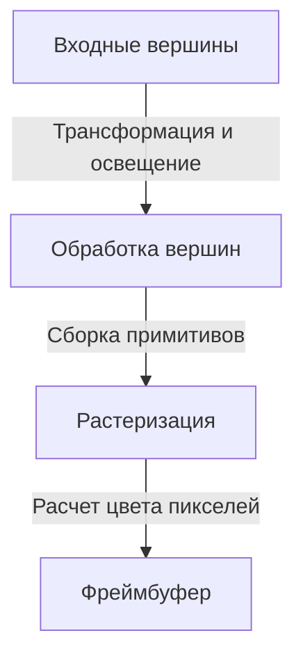
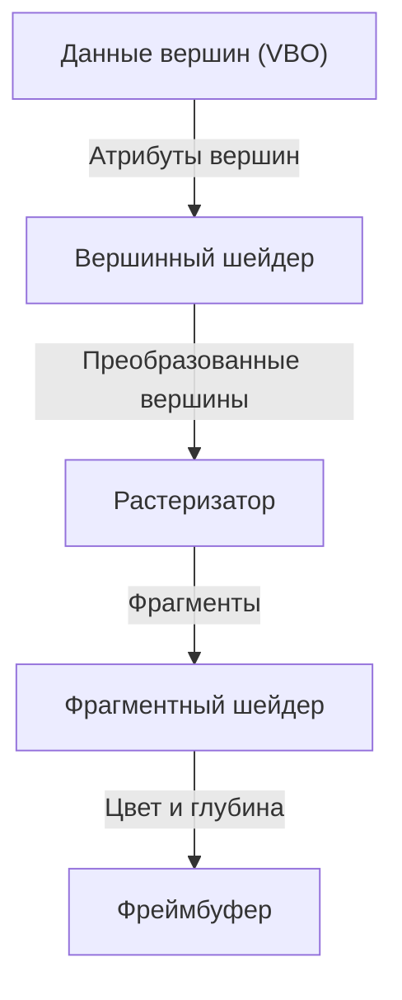

# 1. Введение

В современной компьютерной среде 3D-графика стала неотъемлемой частью нашей жизни. От видеоигр, визуальных эффектов (VFX) в кино и систем CAD до мобильных приложений и визуализации данных в веб-браузерах — мы ежедневно пользуемся преимуществами 3D-технологий. Однако путь к «стандартизации», позволяющей раскрыть максимальную производительность оборудования и одновременно запускать одинаковые программы на разных платформах, отнюдь не был простым.

В этой статье мы подробно рассмотрим OpenGL (Open Graphics Library) — графический API, который на протяжении многих лет оставался фактическим стандартом (де-факто) в области 3D-графики. Мы начнем с исторического контекста его эволюции от проприетарного решения одной компании до открытого отраслевого стандарта, разберем устройство современного программируемого графического конвейера, математические основы матричных преобразований для проецирования 3D-пространства на 2D-экран, а также приведем конкретные примеры реализации с использованием C/C++ и GLSL.

# 2. История OpenGL: отказ от проприетарных решений

## 2.1 Взлет SGI и появление IRIS GL

В 1980-х и 1990-х годах компания Silicon Graphics, Inc. (SGI) обладала подавляющим преимуществом в области трехмерной компьютерной графики. Рабочие станции SGI оснащались специализированным графическим оборудованием и широко использовались в киноиндустрии и научно-исследовательских институтах.

Специально для аппаратных платформ SGI был разработан графический API «IRIS GL». Хотя IRIS GL был чрезвычайно мощным и удобным в использовании, он имел критический недостаток: он был жестко привязан к «железу» и оконной системе SGI, из-за чего перенос программ на другие платформы был крайне затруднен.

## 2.2 Рождение открытого стандарта

С наступлением 1990-х годов производительность персональных компьютеров и рабочих станций других производителей выросла, а конкуренция на рынке графических решений обострилась. В этих условиях SGI предприняла стратегический шаг для популяризации своих технологий: компания отделила аппаратно-зависимые части от IRIS GL и переработала его в открытый API для чистого трехмерного рендеринга. Так в 1992 году был представлен OpenGL.

Спецификация OpenGL была передана под управление консорциума OpenGL Architecture Review Board (ARB), в который вошли ведущие технологические компании того времени — SGI, IBM, DEC, Microsoft, Intel и другие. Это позволило закрепить за OpenGL статус общеотраслевого стандарта, не привязанного к какой-либо конкретной платформе.

## 2.3 Смена парадигмы: переход к программируемому конвейеру

Ранние версии OpenGL использовали архитектуру, известную как «конвейер с фиксированной функциональностью» (fixed-function pipeline). При таком подходе операции освещения и преобразования координат были жестко зашиты в оборудовании (или драйвере), а разработчику оставалось лишь настраивать параметры и вызывать функции отрисовки.



Такой подход был удобен [для начинающих](/ru/p/%D0%B8%D0%B7%D0%B4%D0%B5%D0%BB%D0%B8%D1%8F-%D0%B8%D0%B7-%D0%BA%D0%BE%D0%B6%D0%B8%E3%81%AE%E3%83%A1%E3%83%B3%E3%83%86%E3%83%8A%E3%83%B3%E3%82%B9/), однако реализация нестандартных алгоритмов затенения (например, сел-шейдинга или тонового рендеринга) и сложных визуальных эффектов была крайне затруднительна. В ответ на эти ограничения в OpenGL 2.0 (2004 год) был представлен язык шейдеров GLSL (OpenGL Shading Language), ознаменовавший переход к «программируемому конвейеру», в котором разработчики могут напрямую программировать вычисления на GPU. В современном OpenGL фиксированная функциональность объявлена устаревшей (deprecated) или вовсе удалена, а гибкий рендеринг с использованием шейдеров стал стандартом.

# 3. Конвейер современного OpenGL

В современном OpenGL (Core Profile) разработчик должен детально контролировать каждый этап графического конвейера.



1. **Вершинный шейдер (Vertex Shader)**:
   Выполняется для каждой входной вершины. Его главная задача — преобразовать локальные координаты модели в пространство отсечения (clip space) с точки зрения камеры.
2. **Растеризатор (Rasterizer)**:
   Разбивает полигоны (например, треугольники), состоящие из вершин, на отдельные «фрагменты», соответствующие пикселям на экране, и интерполирует значения между вершинами.
3. **Фрагментный шейдер (Fragment Shader)**:
   Вычисляет итоговый цвет (RGB) для каждого фрагмента. Именно здесь в основном выполняются наложение текстур и расчет освещения.

# 4. Основы матричных вычислений и преобразования координат

Для корректного отображения трехмерного объекта на двумерном экране монитора необходимы координатные преобразования с помощью матриц. Как правило, трансформация выполняется путем перемножения трех ключевых матриц. Эту комбинацию называют матрицей MVP (Model-View-Projection).

- **Матрица модели (Model Matrix)**:
  Размещает объект из его локальной системы координат в глобальную систему координат сцены (мировое пространство). Включает в себя перемещение (translation), вращение (rotation) и масштабирование (scaling).
- **Матрица вида (View Matrix)**:
  Преобразует координаты из мирового пространства в пространство наблюдателя / камеры (view space).
- **Матрица проекции (Projection Matrix)**:
  Переводит координаты из пространства вида в пространство отсечения (clip space). Именно на этом этапе рассчитывается перспективная проекция, создающая эффект удаления (далекие объекты кажутся меньше), либо ортографическая проекция.

# 5. Пример реализации на GLSL и C/C++

Ниже приведен базовый пример шейдеров на языке GLSL для отрисовки треугольника в современном OpenGL.

## 5.1 Пример вершинного шейдера

```glsl
#version 330 core
layout (location = 0) in vec3 aPos;

uniform mat4 model;
uniform mat4 view;
uniform mat4 projection;

void main()
{
    gl_Position = projection * view * model * vec4(aPos, 1.0);
}
```

## 5.2 Пример фрагментного шейдера

```glsl
#version 330 core
out vec4 FragColor;

void main()
{
    FragColor = vec4(1.0, 0.5, 0.2, 1.0); // Вывод оранжевого цвета
}
```

На стороне C/C++ с помощью таких библиотек, как GLFW, создается окно приложения, а данные вершин (VBO: Vertex Buffer Object) и разметка атрибутов вершин (VAO: Vertex Array Object) передаются на GPU. Затем внутри главного цикла (main loop) экран очищается, активируется скомпилированная шейдерная программа и с помощью функций вроде `glDrawArrays` отправляется команда отрисовки.

# 6. Будущее графических API

OpenGL служил надежной опорой индустрии на протяжении десятилетий, однако для раскрытия полного потенциала современных многоядерных процессоров и массивно-параллельных GPU его классическая архитектура (представляющая собой гигантский конечный автомат состояний) постепенно становится узким местом.

По этой причине сегодня происходит активный переход к низкоуровневым API нового поколения (таким как Vulkan, DirectX 12 и Metal), которые обеспечивают более близкое к «железу» управление и оптимизированы для многопоточной отрисовки. Тем не менее, инициализация этих современных API сопряжена с высокой сложностью, поэтому OpenGL по-прежнему сохраняет огромную ценность в качестве образовательного инструмента для освоения фундаментальных концепций 3D-графики (конвейер, матричные преобразования, шейдеры).

Освоить основы 3D-программирования на OpenGL, а затем при необходимости перейти к Vulkan или другим передовым технологиям — и сегодня один из наиболее рекомендуемых и эффективных путей обучения.
