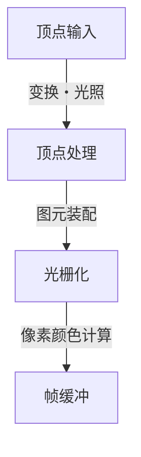
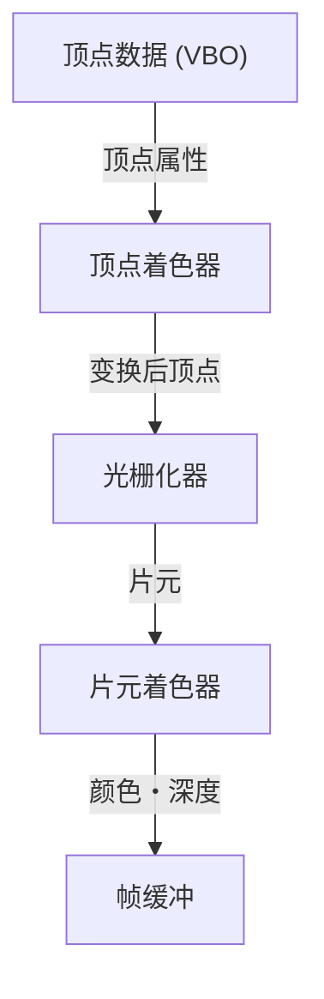

# 1. 前言

在现代计算环境中，3D图形已成为不可或缺的要素。从游戏、电影视觉特效（VFX）、CAD、智能手机应用程序到浏览器上的数据可视化，我们每天都在受益于3D技术。然而，在充分发挥硬件性能的同时，让通用程序在不同平台之间运行的“标准化”之路，绝非一帆风顺。

本文将深入解析多年来一直稳居3D图形API事实标准（De Facto Standard）宝座的“OpenGL（Open Graphics Library）”。我们将从单一企业的专有规格演变为开放标准的历史背景讲起，全面梳理现代可编程图形管线的工作机制、将3D空间投射到2D屏幕所需的矩阵运算数学基础，以及使用C/C++与GLSL的具体实现示例。

# 2. OpenGL的历史：摆脱专有规格

## 2.1 SGI与IRIS GL的崛起

在20世纪80年代至90年代，Silicon Graphics, Inc.（SGI）在3D计算机图形领域拥有压倒性的优势。SGI的工作站配备了专用图形硬件，并在电影工业和科研机构中得到了广泛采用。

为SGI硬件量身开发的图形API名为“IRIS GL”。IRIS GL功能极其强大且易于使用，但它严重依赖SGI的硬件和窗口系统，存在向其他系统移植性极差这一致命弱点。

## 2.2 开放标准的诞生

进入1990年代，随着PC和其他厂商工作站性能的提升，图形市场的竞争日益激烈，SGI采取了推广自身技术的关键举措。那就是剥离IRIS GL中对硬件的依赖部分，将其重新设计为用于纯粹3D渲染的开放API——“OpenGL”，并于1992年正式发布。

OpenGL的规范由SGI、IBM、DEC、Microsoft、Intel等主要企业组成的“OpenGL架构审查委员会（OpenGL Architecture Review Board，简称 ARB）”进行管理，确立了其作为不受特定平台约束的全行业标准的地位。

## 2.3 迈向可编程的范式转变

早期的OpenGL采用了被称为“固定功能管线”的架构。在这种模式下，光照和坐标变换等处理都在硬件（或驱动程序）端固定，程序员只需设置参数即可完成渲染。



这种方式虽然对初学者非常友好，但难以实现自定义的着色处理（例如卡通渲染等）以及高级特效。为了解决这一问题，OpenGL 2.0（2004年）引入了“GLSL（OpenGL着色语言，OpenGL Shading Language）”，演变为允许开发者直接对GPU行为进行编程的“可编程管线”。如今，固定功能已被废弃或移除，基于着色器的灵活渲染已成为基本前提。

# 3. 现代OpenGL图形管线

在现代OpenGL（Core Profile）中，开发者需要精细控制图形管线的各个阶段。



1. **顶点着色器 (Vertex Shader)**:
   对输入的每个顶点执行。主要任务是将模型的局部坐标转换为摄像机视角的裁剪坐标系。
2. **光栅化器 (Rasterizer)**:
   将由顶点组成的多边形（如三角形）分解并插值为对应屏幕像素的“片元”。
3. **片元着色器 (Fragment Shader)**:
   计算每个片元的最终颜色（RGB）。纹理映射和光照计算主要在此阶段完成。

# 4. 矩阵运算与坐标变换基础

要将3D空间中的物体正确渲染到2D显示器上，使用矩阵（Matrix）进行坐标变换是必不可少的。通常，我们通过相乘以下三个矩阵来完成变换，这被称为MVP矩阵（Model-View-Projection）。

- **模型矩阵 (Model Matrix)**:
  将对象自身的局部空间定位到整个世界的绝对坐标系（世界空间）。包括平移、旋转和缩放。
- **视图矩阵 (View Matrix)**:
  将世界空间的坐标转换为从摄像机视角观察的空间（视图空间）。
- **投影矩阵 (Projection Matrix)**:
  将视图空间的坐标转换为裁剪空间。在此计算应用透视效果（近大远小的视觉效果）的透视投影等。

# 5. 基于GLSL与C/C++的实现示例

下面展示使用现代OpenGL绘制三角形的基础GLSL着色器代码示例。

## 5.1 顶点着色器示例

```glsl
#version 330 core
layout (location = 0) in vec3 aPos;

uniform mat4 model;
uniform mat4 view;
uniform mat4 projection;

void main()
{
    gl_Position = projection * view * model * vec4(aPos, 1.0);
}
```

## 5.2 片元着色器示例

```glsl
#version 330 core
out vec4 FragColor;

void main()
{
    FragColor = vec4(1.0, 0.5, 0.2, 1.0); // 输出橙色
}
```

在C/C++端，通常使用GLFW等库创建窗口，将顶点数据（VBO: Vertex Buffer Object）与顶点属性布局（VAO: Vertex Array Object）传输至GPU。然后在主循环中清空屏幕，使用配置好的着色器程序，并通过 `glDrawArrays` 等函数发出绘制指令。

# 6. 未来的图形API

OpenGL多年来一直支撑着整个行业，但要充分发挥近年来多核CPU和超并行GPU的性能，其原有的设计理念（庞大的状态机）逐渐成为了瓶颈。

因此，如今正加速向具备更贴近硬件的底层控制能力、且针对多线程渲染进行了优化的新一代API（如Vulkan、DirectX 12、Metal等）迁移。然而，这些现代API的初始化处理极其复杂，因此作为学习3D图形根本概念（管线、矩阵变换、着色器）的教学与入门API，OpenGL依然具有不可替代的巨大价值。

首先通过OpenGL掌握3D编程的基础，之后再根据实际需求进阶到Vulkan等API，这在今天仍然是最值得推荐的学习路径之一。
