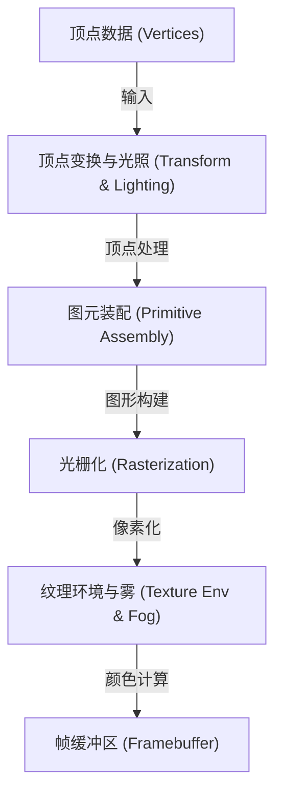
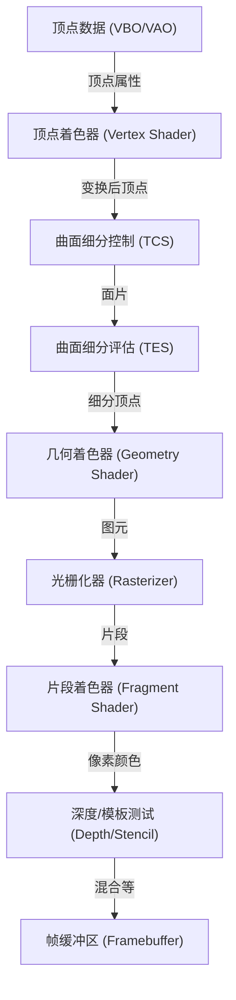
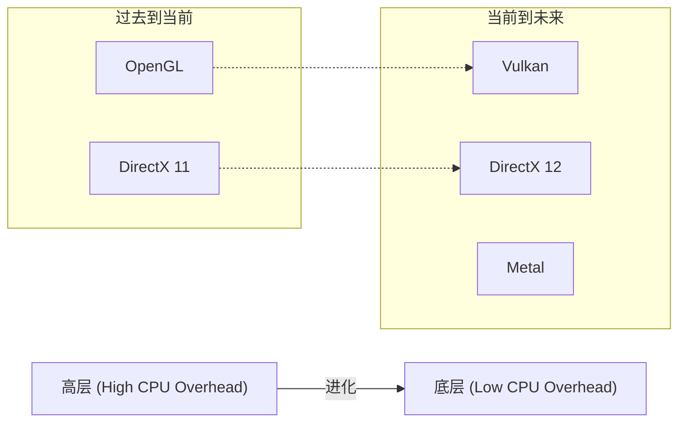

# 1. 引言

在现代计算机中，3D图形早已不再只是少数专家的专属。智能手机上的游戏、网页浏览器中的数据可视化、电影的视觉特效（VFX）、CAD软件、VR/AR等，3D图形技术几乎无处不在。然而，在这些技术像如今这样广泛普及之前，伴随着硬件的进化，软件（API）标准化经历了一场漫长的斗争。

本文将聚焦于多年来作为3D图形API事实标准的“OpenGL（Open Graphics Library）”。我们将从OpenGL是如何诞生、如何进化的历史背景开始，深入探讨现代可编程图形管线的机制、基于矩阵运算的数学背景，以及使用C/C++和GLSL的具体实现示例。

---

# 2. OpenGL的历史：从SGI与IRIS GL到标准的道路

## 2.1 Silicon Graphics, Inc. (SGI) 与 IRIS GL 的诞生

在20世纪80年代到90年代的3D计算机图形（CG）领域，由Jim Clark创立的Silicon Graphics, Inc.（SGI）是绝对的王者。SGI的工作站搭载了专用的图形硬件，拥有当时破格的3D渲染性能。著名的电影《侏罗纪公园》和《终结者2》的CG制作也使用了SGI的计算机。

为了最大限度地发挥SGI硬件的性能而开发的，正是被称为“IRIS GL（Integrated Raster Imaging System Graphics Library）”的专有图形API。IRIS GL的设计理念是，让程序员无需关注硬件的复杂细节，就能轻松处理多边形绘制、光照、以及使用Z缓冲区的隐藏面消除等操作。

然而，IRIS GL存在一个巨大的问题。那就是“过度依赖SGI的硬件”。IRIS GL成长为一个庞大的API，甚至包含了窗口系统和输入设备的控制，将其移植到其他平台（例如Sun Microsystems或HP的工作站，或是正在崛起的PC）是极其困难的。

## 2.2 向开放标准的过渡与OpenGL的诞生

20世纪90年代初，随着3D图形市场竞争的加剧，SGI为了普及自家的技术，并制定能够在其他公司硬件上运行的行业标准API，做出了整理和抽象IRIS GL的决定。

从IRIS GL中剥离了对窗口系统的依赖以及SGI特有的功能，作为纯粹用于3D图形绘制的开放API进行重新设计的结果，就是“OpenGL”。1992年，OpenGL 1.0正式发布。

为了制定和管理OpenGL的规范，成立了由SGI、DEC、IBM、Intel、Microsoft等主要企业参与的“OpenGL Architecture Review Board（ARB）”。由此，OpenGL从一家企业的专有技术升华为整个行业的标准规范。

## 2.3 从固定功能管线到可编程管线

早期的OpenGL（1.x到2.x前半部分）采用了被称为“固定功能管线（Fixed-Function Pipeline）”的架构。这意味着光照、变换、纹理映射等处理在硬件内部是固定的，程序员只需设置参数（如光源位置、颜色、材质特性等）即可进行渲染。



固定功能管线非常易于使用，是初学者学习3D图形的最佳选择。（也许很多人还记得 `glBegin()`, `glEnd()`, `glVertex3f()` 这些函数）。

然而，进入21世纪后，GPU（Graphics Processing Unit）的进化显著加快，开发者开始要求“想要进行更多自定义的着色处理（Shading）”、“想要在硬件上高速处理卡通渲染等非真实感表现（NPR）”。

为了响应这一需求，OpenGL 2.0（2004年）引入了“GLSL（OpenGL Shading Language）”，使得GPU的一部分处理可以被程序员编写的程序（着色器）所替代。接着，通过OpenGL 3.1（2009年）和OpenGL 3.2的核心模式（Core Profile），固定功能管线被标记为弃用（随后被移除），完全过渡到了“可编程管线”。

---

# 3. 现代OpenGL与图形管线细节

在现代的OpenGL（版本3.3及以后的核心模式）中，程序员必须亲自控制图形管线的各个阶段。管线的流程如下图所示。



## 3.1 各阶段的作用

1. **顶点着色器 (Vertex Shader)**: 必需。对输入的每个顶点执行。主要作用是将顶点的局部坐标转换为屏幕上的坐标（裁剪空间）。
2. **曲面细分着色器 (Tessellation Shaders)**: 可选。将多边形细分为更小的多边形，生成更详细的形状。
3. **几何着色器 (Geometry Shader)**: 可选。接收顶点的集合（点、线、三角形），可以生成新的图形或将其丢弃。
4. **光栅化器 (Rasterizer)**: 固定功能。将数学图形（多边形）转换为对应屏幕像素的“片段”。这里会对顶点之间的属性进行插值（Interpolation）。
5. **片段着色器 (Fragment Shader)**: 必需。对每个片段执行，计算最终像素的颜色（RGBA）和深度值。纹理采样和光照计算在此进行。
6. **各种测试与混合 (Tests and Blending)**: 进行深度测试（优先绘制前面的物体）、模板测试、Alpha混合等，最终写入帧缓冲区。

---

# 4. 矩阵与坐标变换的数学

要将3D空间的对象绘制到2D屏幕上，需要依次进行多个坐标系（空间）的变换。实现这一点的是基于“矩阵（Matrix）”的线性代数。

## 4.1 从局部空间到屏幕空间的变换

通常，通过将以下三个矩阵相乘来进行变换。这被称为**MVP矩阵（Model-View-Projection Matrix）**。

$$
V_{clip} = M_{projection} \cdot M_{view} \cdot M_{model} \cdot V_{local}
$$

1. **模型矩阵 ($M_{model}$)**:
   将对象自身的局部坐标系（Local Space）放置到整个世界的坐标系（World Space）中。进行平移（Translation）、旋转（Rotation）和缩放（Scaling）。
2. **视图矩阵 ($M_{view}$)**:
   将世界空间的坐标转换为从相机（视点）观察的空间（View Space / Camera Space）。将相机向后移动等同于将整个世界向前移动。
3. **投影矩阵 ($M_{projection}$)**:
   从视图空间到裁剪空间（Clip Space）的变换。有透视投影（Perspective Projection）和正交投影（Orthographic Projection）。透视投影能产生远处物体看起来更小的效果（透视法）。

## 4.2 透视投影矩阵的结构

透视投影矩阵非常重要。使用视野角（FOV）、宽高比（Aspect）、近裁剪面（Near）和远裁剪面（Far），构建如下的4x4矩阵。

$$
\begin{bmatrix}
\frac{1}{\text{aspect} \cdot \tan(\text{fov}/2)} & 0 & 0 & 0 \\
0 & \frac{1}{\tan(\text{fov}/2)} & 0 & 0 \\
0 & 0 & -\frac{\text{far} + \text{near}}{\text{far} - \text{near}} & -\frac{2 \cdot \text{far} \cdot \text{near}}{\text{far} - \text{near}} \\
0 & 0 & -1 & 0
\end{bmatrix}
$$

该矩阵会改变顶点坐标的W分量（齐次坐标系），通过后续的“透视除法（Perspective Divide）”，x, y, z坐标会被映射到 -1.0 到 1.0 的标准化设备坐标系（NDC: Normalized Device Coordinates）。

---

# 5. GLSL (OpenGL Shading Language) 基础

使用语法类似于C语言的GLSL，编写在GPU上运行的程序。

## 5.1 顶点着色器 (Vertex Shader)

```glsl
#version 330 core
layout (location = 0) in vec3 aPos;     // 顶点位置
layout (location = 1) in vec2 aTexCoord; // 纹理坐标

out vec2 TexCoord; // 传递给片段着色器的变量

uniform mat4 model;
uniform mat4 view;
uniform mat4 projection;

void main()
{
    // 乘以MVP矩阵转换为裁剪坐标系
    gl_Position = projection * view * model * vec4(aPos, 1.0);
    TexCoord = aTexCoord;
}
```

## 5.2 片段着色器 (Fragment Shader)

```glsl
#version 330 core
out vec4 FragColor;

in vec2 TexCoord; // 从顶点着色器插值传递过来

uniform sampler2D texture1; // 纹理单元

void main()
{
    // 从纹理中采样颜色
    FragColor = texture(texture1, TexCoord);
}
```

---

# 6. 使用C/C++设置和实现现代OpenGL

从这里开始，展示实际使用C++创建窗口并绘制三角形的基础代码。窗口管理使用 **GLFW**，OpenGL函数指针的加载使用 **GLAD**（或GLEW）。

## 6.1 初始化与窗口创建

```cpp
#include <glad/glad.h>
#include <GLFW/glfw3.h>
#include <iostream>

// 窗口调整大小时的回调函数
void framebuffer_size_callback(GLFWwindow* window, int width, int height) {
    glViewport(0, 0, width, height);
}

int main() {
    // 1. 初始化GLFW
    glfwInit();
    // 指定OpenGL 3.3核心模式
    glfwWindowHint(GLFW_CONTEXT_VERSION_MAJOR, 3);
    glfwWindowHint(GLFW_CONTEXT_VERSION_MINOR, 3);
    glfwWindowHint(GLFW_OPENGL_PROFILE, GLFW_OPENGL_CORE_PROFILE);

#ifdef __APPLE__
    glfwWindowHint(GLFW_OPENGL_FORWARD_COMPAT, GL_TRUE); // 用于macOS
#endif

    // 2. 创建窗口
    GLFWwindow* window = glfwCreateWindow(800, 600, "LearnOpenGL", NULL, NULL);
    if (window == NULL) {
        std::cout << "Failed to create GLFW window" << std::endl;
        glfwTerminate();
        return -1;
    }
    glfwMakeContextCurrent(window);
    glfwSetFramebufferSizeCallback(window, framebuffer_size_callback);

    // 3. 初始化GLAD (加载操作系统特定的OpenGL函数指针)
    if (!gladLoadGLLoader((GLADloadproc)glfwGetProcAddress)) {
        std::cout << "Failed to initialize GLAD" << std::endl;
        return -1;
    }

    // 待续...
```

## 6.2 构建顶点数据与缓冲区 (VAO, VBO)

在现代OpenGL中，必须将顶点数据传输到GPU内存（VRAM）中，并定义该数据的布局。

```cpp
    // 顶点数据 (X, Y, Z)
    float vertices[] = {
        -0.5f, -0.5f, 0.0f, // 左下
         0.5f, -0.5f, 0.0f, // 右下
         0.0f,  0.5f, 0.0f  // 顶部
    };

    unsigned int VBO, VAO;
    // 生成并绑定 VAO (Vertex Array Object)
    glGenVertexArrays(1, &VAO);
    glBindVertexArray(VAO);

    // 生成并绑定 VBO (Vertex Buffer Object)
    glGenBuffers(1, &VBO);
    glBindBuffer(GL_ARRAY_BUFFER, VBO);
    
    // 将数据传输到GPU
    glBufferData(GL_ARRAY_BUFFER, sizeof(vertices), vertices, GL_STATIC_DRAW);

    // 设置顶点属性指针 (location = 0)
    glVertexAttribPointer(0, 3, GL_FLOAT, GL_FALSE, 3 * sizeof(float), (void*)0);
    glEnableVertexAttribArray(0);

    // 解除绑定 (为了安全)
    glBindBuffer(GL_ARRAY_BUFFER, 0); 
    glBindVertexArray(0);
```

## 6.3 主循环 (渲染)

在处理完着色器的编译和链接（假设这里已封装成函数）之后，进入主渲染循环。

```cpp
    // 加载并编译着色器程序 (省略实现细节)
    // unsigned int shaderProgram = LoadShaders("vertex.glsl", "fragment.glsl");

    // 主循环
    while (!glfwWindowShouldClose(window)) {
        // 输入处理 (例如按Escape键退出)
        if (glfwGetKey(window, GLFW_KEY_ESCAPE) == GLFW_PRESS)
            glfwSetWindowShouldClose(window, true);

        // 1. 清除屏幕
        glClearColor(0.2f, 0.3f, 0.3f, 1.0f);
        glClear(GL_COLOR_BUFFER_BIT | GL_DEPTH_BUFFER_BIT);

        // 2. 启用着色器
        // glUseProgram(shaderProgram);

        // 3. 绑定VAO并绘制
        glBindVertexArray(VAO);
        glDrawArrays(GL_TRIANGLES, 0, 3);

        // 4. 交换缓冲区并轮询事件
        glfwSwapBuffers(window);
        glfwPollEvents();
    }

    // 释放资源
    glDeleteVertexArrays(1, &VAO);
    glDeleteBuffers(1, &VBO);
    // glDeleteProgram(shaderProgram);

    glfwTerminate();
    return 0;
}
```

---

# 7. OpenGL的现状与未来（Vulkan, Metal, DirectX 12）

从SGI的IRIS GL开始，诞生于1992年的OpenGL在超过四分之一个世纪的时间里，作为跨平台的标准API支撑着整个行业。然而，面对现代的硬件架构（多核CPU和擅长并行处理的庞大GPU），OpenGL作为“单一庞大状态机”的设计理念正逐渐达到极限。

由于OpenGL拥有大量的全局状态，多线程下的绘制命令生成非常困难，这也带来了CPU开销容易变大这一根本性问题。

为了解决这个问题，新一代的API应运而生，它们提供了更低层、更薄的抽象层，允许开发者精细地控制GPU内存和同步处理。
* **Vulkan**: 由管理OpenGL的Khronos Group制定的跨平台API，可以说是OpenGL的继任者。
* **DirectX 12**: 微软提供的面向Windows和Xbox的底层API。
* **Metal**: 苹果面向macOS和iOS提供的专有API（苹果已将OpenGL标记为废弃）。



## 7.1 学习OpenGL的意义

即使在新的底层API逐渐成为主流的今天，学习OpenGL的意义也并未丧失。理由如下：

1. **学习成本低**: Vulkan或DirectX 12仅仅是为了在屏幕上绘制第一个三角形，就需要几百到上千行的代码和复杂的设置。相比之下，OpenGL作为学习图形管线基础、矩阵运算、着色器编程等“3D图形本质”的入口，依然非常优秀。
2. **庞大的现有资产和社区**: 世界上存在着无数用OpenGL编写的软件、引擎和教程。
3. **WebGL**: 在浏览器上渲染3D图形的标准规范WebGL就是基于OpenGL ES的。在Web领域，OpenGL的知识依然可以直接派上用场。

# 8. 结语

从面向SGI工作站的专有技术开始，成长为行业标准，并支撑着从游戏到科学计算的各个领域，这就是OpenGL。回顾它的历史并理解其基础机制，对于学习Vulkan和WebGPU等下一代技术来说，将成为坚实的基础。

图形编程的世界深奥无比，数学公式和代码转化为屏幕上美丽视觉效果的那一瞬间，能体会到其他编程领域无法比拟的感动。希望你能以本文为契机，亲自编写OpenGL代码，构建属于你自己的3D世界。
