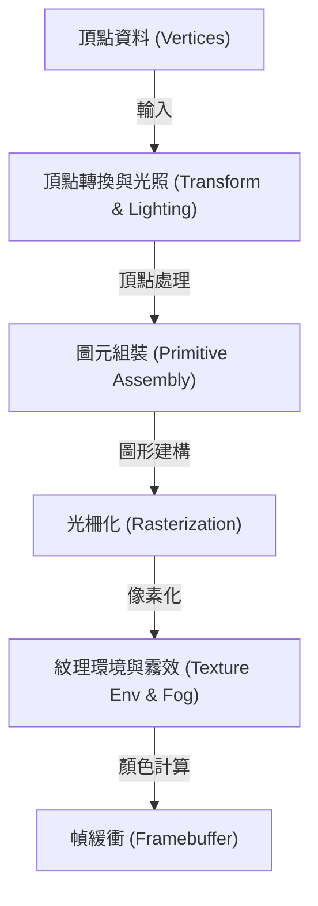
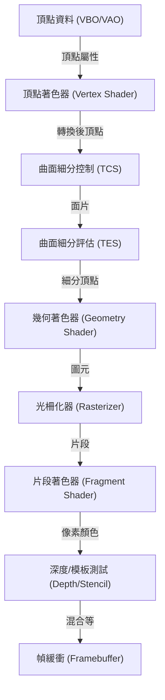
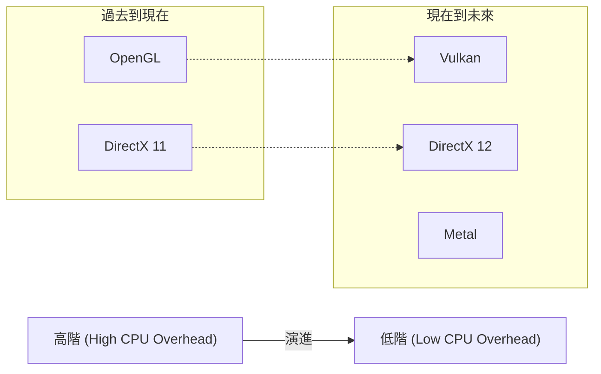

# 1. 前言

現代電腦中的3D圖形，已經不再只是一部分專家的專利。智慧型手機上的遊戲、網頁瀏覽器中的資料視覺化、電影的VFX、CAD軟體、VR/AR等，3D圖形技術在各個領域中都被廣泛應用。然而，在這些技術像現在這樣普及之前，伴隨著硬體的進步，軟體（API）的標準化經歷了一場漫長的戰鬥。

本文將聚焦於長期以來作為3D圖形API事實標準的「OpenGL（Open Graphics Library）」。從OpenGL是如何誕生、如何演進的歷史背景開始，深入探討現代可程式化圖形管線（Programmable Graphics Pipeline）的機制、使用矩陣運算的數學背景，以及使用C/C++與GLSL的具體實作範例。

---

# 2. OpenGL的歷史：從SGI與IRIS GL到標準規格之路

## 2.1 Silicon Graphics, Inc. (SGI) 與 IRIS GL 的誕生

在1980年代到1990年代之間，在3D電腦圖形（CG）領域佔據絕對王者地位的，是由吉姆·克拉克（Jim Clark）所創立的Silicon Graphics, Inc. (SGI)。SGI的工作站搭載了專用的圖形硬體，在當時擁有破格的3D渲染性能。電影《侏羅紀公園》和《魔鬼終結者2》的CG製作也是使用了SGI的電腦，這非常有名。

為了最大化發揮SGI硬體性能而開發的，是被稱為「IRIS GL（Integrated Raster Imaging System Graphics Library）」的專有圖形API。IRIS GL的設計，讓程式設計師在不需要了解硬體複雜細節的情況下，就能輕鬆處理多邊形的繪製、光照（Lighting）、以及使用Z緩衝（Z-buffer）進行隱藏面消除（Hidden surface removal）等操作。

然而，IRIS GL有一個很大的問題。那就是「強烈依賴於SGI的硬體」。IRIS GL已經成長為一個包含視窗系統和輸入設備控制在內的巨大API，這使得將其移植到其他平台（例如Sun Microsystems或HP的工作站，甚至是正在崛起的PC）變得極其困難。

## 2.2 向開放標準轉型與OpenGL的誕生

1990年代初期，隨著3D圖形市場競爭的加劇，SGI為了普及自家的技術，並制定一個能在其他公司硬體上運作的業界標準API，決定對IRIS GL進行重整與抽象化。

將依賴於視窗系統以及SGI特有功能的部分從IRIS GL中分離出來，重新設計成一個純粹用於3D圖形繪製的開放API，這就是「OpenGL」。1992年，OpenGL 1.0正式發表。

為了制定和管理OpenGL的規格，成立了由SGI、DEC、IBM、Intel、Microsoft等主要企業參與的「OpenGL Architecture Review Board（ARB）」。藉此，OpenGL從一家企業的獨有技術，昇華為整個業界的標準規格。

## 2.3 從固定功能管線到可程式化管線

早期的OpenGL（1.x〜2.x前半）採用了被稱為「固定功能管線（Fixed-Function Pipeline）」的架構。在這種架構中，光照、轉換（Transform）、紋理貼圖（Texture Mapping）等處理被固定在硬體內部，程式設計師只需要設定參數（如光源位置和顏色、材質特性等）就能進行繪製。



固定功能管線非常容易使用，對於初學者學習3D圖形來說是最棒的。（或許還有很多人記得 `glBegin()`, `glEnd()`, `glVertex3f()` 這些函數）。

然而進入2000年代後，GPU（Graphics Processing Unit）的進化非常顯著，開發者們開始要求「想要進行更獨特的著色（Shading）處理」、「想要在硬體上高速處理像卡通渲染這種非寫實的表現（NPR）」。

為了解決這些需求，OpenGL 2.0（2004年）引入了「GLSL（OpenGL Shading Language）」，讓GPU的一部分處理可以被程式設計師編寫的程式（著色器，Shader）所取代。隨後，透過OpenGL 3.1（2009年）和OpenGL 3.2的Core Profile，固定功能管線被標記為不建議使用（隨後被移除），完全轉向了「可程式化管線」。

---

# 3. 現代OpenGL與圖形管線的細節

在現代的OpenGL中（版本3.3以後的Core Profile），程式設計師必須親自控制圖形管線的各個階段。管線的流程如下圖所示：



## 3.1 各階段的角色

1. **頂點著色器 (Vertex Shader)**: 必須。對輸入的每個頂點執行。主要的作用是將頂點的局部座標轉換為螢幕上的座標（裁剪空間）。
2. **曲面細分著色器 (Tessellation Shaders)**: 選擇性。將多邊形細分為更小的多邊形，生成更細緻的形狀。
3. **幾何著色器 (Geometry Shader)**: 選擇性。接收頂點集合（點、線、三角形），可以生成新的圖形或將其捨棄。
4. **光柵化器 (Rasterizer)**: 固定功能。將數學圖形（多邊形）轉換為對應螢幕像素的「片段（Fragment）」。在這裡會進行頂點間屬性的插值（Interpolation）。
5. **片段著色器 (Fragment Shader)**: 必須。對每個片段執行，計算最終的像素顏色（RGBA）與深度值。紋理採樣和光照計算都在這裡進行。
6. **各種測試與混合 (Testing and Blending)**: 進行深度測試（優先繪製較近的物體）、模板測試、Alpha混合等，最終寫入幀緩衝中。

---

# 4. 矩陣與座標轉換的數學

要將3D空間的物件繪製到2D螢幕上，需要依序進行幾個座標系（空間）的轉換。實現這一點的是基於「矩陣（Matrix）」的線性代數。

## 4.1 從局部空間到螢幕空間的轉換

一般來說，透過相乘以下三個矩陣來進行轉換。這被稱為**MVP矩陣（Model-View-Projection Matrix）**。

$$
V_{clip} = M_{projection} \cdot M_{view} \cdot M_{model} \cdot V_{local}
$$

1. **模型矩陣 ($M_{model}$)**:
   將物件本身的局部座標系（Local Space）放置到整個世界的座標系（World Space）中。包含平移（Translation）、旋轉（Rotation）和縮放（Scaling）。
2. **視圖矩陣 ($M_{view}$)**:
   將世界空間的座標轉換為從相機（視角）看出去的空間（View Space / Camera Space）。將相機向後移動，等同於將整個世界向前移動。
3. **投影矩陣 ($M_{projection}$)**:
   從視圖空間到裁剪空間（Clip Space）的轉換。有透視投影（Perspective Projection）與正交投影（Orthographic Projection）。在透視投影的情況下，會產生遠處物體看起來較小（透視感）的效果。

## 4.2 透視投影矩陣的結構

透視投影矩陣非常重要。使用視野角（FOV）、長寬比（Aspect）、近平面（Near）和遠平面（Far），建構出以下的4x4矩陣：

$$
\begin{bmatrix}
\frac{1}{\text{aspect} \cdot \tan(\text{fov}/2)} & 0 & 0 & 0 \\
0 & \frac{1}{\tan(\text{fov}/2)} & 0 & 0 \\
0 & 0 & -\frac{\text{far} + \text{near}}{\text{far} - \text{near}} & -\frac{2 \cdot \text{far} \cdot \text{near}}{\text{far} - \text{near}} \\
0 & 0 & -1 & 0
\end{bmatrix}
$$

這個矩陣會改變頂點座標的W分量（齊次座標系），並在隨後的「透視除法（Perspective Divide）」中，將x, y, z座標映射到 -1.0 到 1.0 的標準化設備座標系（NDC: Normalized Device Coordinates）。

---

# 5. GLSL (OpenGL Shading Language) 的基礎

使用語法類似C語言的GLSL，來編寫在GPU上執行的程式。

## 5.1 頂點著色器 (Vertex Shader)

```glsl
#version 330 core
layout (location = 0) in vec3 aPos;     // 頂點位置
layout (location = 1) in vec2 aTexCoord; // 紋理座標

out vec2 TexCoord; // 傳遞給片段著色器的變數

uniform mat4 model;
uniform mat4 view;
uniform mat4 projection;

void main()
{
    // 乘以MVP矩陣轉換至裁剪座標系
    gl_Position = projection * view * model * vec4(aPos, 1.0);
    TexCoord = aTexCoord;
}
```

## 5.2 片段著色器 (Fragment Shader)

```glsl
#version 330 core
out vec4 FragColor;

in vec2 TexCoord; // 從頂點著色器插值傳遞過來

uniform sampler2D texture1; // 紋理單元

void main()
{
    // 從紋理中採樣顏色
    FragColor = texture(texture1, TexCoord);
}
```

---

# 6. 使用C/C++設定與實作現代OpenGL

接下來，我們展示使用C++建立視窗並繪製三角形的基本程式碼。視窗管理使用 **GLFW**，而載入OpenGL函數指標則使用 **GLAD**（或GLEW）。

## 6.1 初始化與視窗建立

```cpp
#include <glad/glad.h>
#include <GLFW/glfw3.h>
#include <iostream>

// 視窗大小改變時的回呼函數
void framebuffer_size_callback(GLFWwindow* window, int width, int height) {
    glViewport(0, 0, width, height);
}

int main() {
    // 1. 初始化GLFW
    glfwInit();
    // 指定OpenGL 3.3 Core Profile
    glfwWindowHint(GLFW_CONTEXT_VERSION_MAJOR, 3);
    glfwWindowHint(GLFW_CONTEXT_VERSION_MINOR, 3);
    glfwWindowHint(GLFW_OPENGL_PROFILE, GLFW_OPENGL_CORE_PROFILE);

#ifdef __APPLE__
    glfwWindowHint(GLFW_OPENGL_FORWARD_COMPAT, GL_TRUE); // macOS專用
#endif

    // 2. 建立視窗
    GLFWwindow* window = glfwCreateWindow(800, 600, "LearnOpenGL", NULL, NULL);
    if (window == NULL) {
        std::cout << "Failed to create GLFW window" << std::endl;
        glfwTerminate();
        return -1;
    }
    glfwMakeContextCurrent(window);
    glfwSetFramebufferSizeCallback(window, framebuffer_size_callback);

    // 3. 初始化GLAD (載入作業系統特定的OpenGL函數指標)
    if (!gladLoadGLLoader((GLADloadproc)glfwGetProcAddress)) {
        std::cout << "Failed to initialize GLAD" << std::endl;
        return -1;
    }

    // 繼續...
```

## 6.2 頂點資料與緩衝區建構 (VAO, VBO)

在現代OpenGL中，必須將頂點資料傳輸到GPU記憶體（VRAM）中，並定義這些資料的佈局。

```cpp
    // 頂點資料 (X, Y, Z)
    float vertices[] = {
        -0.5f, -0.5f, 0.0f, // 左下
         0.5f, -0.5f, 0.0f, // 右下
         0.0f,  0.5f, 0.0f  // 頂部
    };

    unsigned int VBO, VAO;
    // 生成並綁定VAO (Vertex Array Object)
    glGenVertexArrays(1, &VAO);
    glBindVertexArray(VAO);

    // 生成並綁定VBO (Vertex Buffer Object)
    glGenBuffers(1, &VBO);
    glBindBuffer(GL_ARRAY_BUFFER, VBO);
    
    // 將資料傳輸到GPU
    glBufferData(GL_ARRAY_BUFFER, sizeof(vertices), vertices, GL_STATIC_DRAW);

    // 設定頂點屬性指標 (location = 0)
    glVertexAttribPointer(0, 3, GL_FLOAT, GL_FALSE, 3 * sizeof(float), (void*)0);
    glEnableVertexAttribArray(0);

    // 解除綁定 (為了安全起見)
    glBindBuffer(GL_ARRAY_BUFFER, 0); 
    glBindVertexArray(0);
```

## 6.3 主迴圈 (渲染)

在編譯與連結著色器（這裡假設已經被封裝成函數）之後，進入主要的渲染迴圈。

```cpp
    // 載入與編譯著色器程式 (省略實作)
    // unsigned int shaderProgram = LoadShaders("vertex.glsl", "fragment.glsl");

    // 主迴圈
    while (!glfwWindowShouldClose(window)) {
        // 輸入處理 (例如按下Escape鍵退出)
        if (glfwGetKey(window, GLFW_KEY_ESCAPE) == GLFW_PRESS)
            glfwSetWindowShouldClose(window, true);

        // 1. 清除畫面
        glClearColor(0.2f, 0.3f, 0.3f, 1.0f);
        glClear(GL_COLOR_BUFFER_BIT | GL_DEPTH_BUFFER_BIT);

        // 2. 啟用著色器
        // glUseProgram(shaderProgram);

        // 3. 綁定VAO並繪製
        glBindVertexArray(VAO);
        glDrawArrays(GL_TRIANGLES, 0, 3);

        // 4. 交換緩衝區與事件輪詢
        glfwSwapBuffers(window);
        glfwPollEvents();
    }

    // 釋放資源
    glDeleteVertexArrays(1, &VAO);
    glDeleteBuffers(1, &VBO);
    // glDeleteProgram(shaderProgram);

    glfwTerminate();
    return 0;
}
```

---

# 7. OpenGL的現狀與未來（Vulkan, Metal, DirectX 12）

從SGI的IRIS GL開始，於1992年誕生的OpenGL，在超過四分之一個世紀的時間裡，作為跨平台的標準API支撐著整個業界。然而，對於現代的硬體架構（多核心CPU和專注於平行處理的巨大GPU），OpenGL「單一巨大狀態機（State Machine）」的設計思想已經面臨極限。

由於OpenGL擁有許多全域狀態，這導致很難在多執行緒下生成繪製指令，這也帶來了CPU負擔（Overhead）容易過大的根本性問題。

為了解決這個問題，新一代的API應運而生，它們提供更低階、更薄的抽象層，讓開發者能細微地控制GPU的記憶體和同步處理。
* **Vulkan**: 由管理OpenGL的Khronos Group所制定，可以說是OpenGL後繼者的跨平台API。
* **DirectX 12**: Microsoft提供給Windows和Xbox的低階API。
* **Metal**: Apple提供給macOS和iOS的專有API（Apple已經將OpenGL標記為不建議使用）。



## 7.1 即便如此，學習OpenGL的意義

即使在新的低階API正成為主流的現在，學習OpenGL的意義也絕未消失。其原因如下：

1. **學習成本低**: Vulkan或DirectX 12光是要在畫面上畫出第一個三角形，就需要數百到數千行的程式碼以及複雜的設定。相比之下，OpenGL作為學習圖形管線基礎、矩陣運算、著色器程式設計等「3D圖形本質」的入門，依然非常出色。
2. **龐大的既有資源與社群**: 世界上存在著無數用OpenGL編寫的軟體、引擎與教學。
3. **WebGL**: 在瀏覽器上渲染3D圖形的標準規格WebGL，就是以OpenGL ES為基礎。在Web的世界裡，OpenGL的知識依然能直接派上用場。

# 8. 結語

從SGI工作站的專有技術開始，成長為業界標準，並支撐從遊戲到科學運算等各個領域的OpenGL。回顧它的歷史，並理解其基礎機制，將為學習Vulkan或WebGPU等次世代技術打下堅實的基礎。

圖形程式設計的世界非常深奧，當數學公式和程式碼轉化為畫面上美麗的視覺效果的那一瞬間，有著其他程式設計無法體會的感動。請務必以本文為契機，實際編寫OpenGL的程式碼，建構屬於你自己的3D世界。
