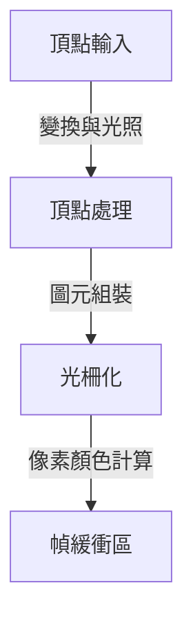
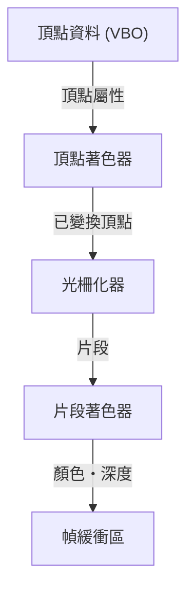

# 1. 前言

在現代電腦環境中，3D 圖形已成為不可或缺的要素。從遊戲、電影視覺特效（VFX）、CAD、智慧型手機應用程式到瀏覽器上的資料視覺化，我們每天都在享受 3D 技術帶來的成果。然而，在充分發揮硬體效能的同時，讓相同的程式能夠跨不同平台運作的「標準化」之路，絕非一帆風順。

本篇文章將深入介紹長年來作為 3D 圖形 API 實質標準（de facto standard）的「OpenGL（Open Graphics Library）」。我們將從單一企業的專有規格演進為開放標準規格的歷史背景談起，全面探討現代可程式化圖形管線（Programmable Graphics Pipeline）的運作機制、將 3D 空間轉換至 2D 螢幕的矩陣運算數學基礎，以及使用 C/C++ 與 GLSL 的具體實作範例。

# 2. OpenGL 的歷史：擺脫專有規格

## 2.1 SGI 與 IRIS GL 的崛起

在 1980 年代至 1990 年代期間，Silicon Graphics, Inc.（SGI）在 3D 電腦圖形領域擁有壓倒性的優勢。SGI 的工作站搭載了專屬的圖形硬體，廣泛應用於電影產業與研究機構中。

針對 SGI 硬體所開發的圖形 API 正是「IRIS GL」。雖然 IRIS GL 功能強大且易於使用，但它高度依賴 SGI 的硬體與視窗系統，存在著難以移植至其他系統的致命缺點。

## 2.2 開放標準的誕生

進入 1990 年代後，隨著個人電腦（PC）與其他廠商工作站的效能提升，圖形市場的競爭日益白熱化，SGI 採取了一項舉措以推廣自身技術。這便是將硬體相依的部分從 IRIS GL 中抽離，重新設計為純粹用於 3D 繪圖的開放式 API——「OpenGL」並於 1992 年正式發表。

OpenGL 的規格改由 SGI、IBM、DEC、Microsoft、Intel 等主要企業組成的「OpenGL 架構審查委員會（OpenGL Architecture Review Board，簡稱 ARB）」共同管理，進而確立了不綁定於特定平台的整個產業標準規格地位。

## 2.3 邁向可程式化的典範轉移

早期的 OpenGL 採用了被稱為「固定功能管線（Fixed-Function Pipeline）」的架構。在此架構下，光照與座標變換等處理皆由硬體（或驅動程式）固定實作，程式設計師只需設定參數即可進行繪圖。



這種方式雖然對初學者而言容易上手，但難以實作自訂的著色效果（例如賽璐珞風格渲染 / 卡通渲染）或進階特效。為了解決這個問題，OpenGL 2.0（2004 年）引入了「GLSL（OpenGL Shading Language）」，讓開發者能夠直接對 GPU 的運作進行程式設計，演進為「可程式化管線（Programmable Pipeline）」。時至今日，固定功能已被廢棄或移除，使用著色器進行彈性繪圖已成為基本前提。

# 3. 現代 OpenGL 的管線

在現今的 OpenGL（Core Profile）中，開發者必須精細控制圖形管線的各個階段。



1. **頂點著色器 (Vertex Shader)**:
   針對輸入的每個頂點執行。主要職責是將模型的區域座標轉換為從攝影機視角所見的裁切座標系。
2. **光柵化器 (Rasterizer)**:
   將頂點構成的多邊形（如三角形）分解並插值為對應螢幕像素的「片段」。
3. **片段著色器 (Fragment Shader)**:
   計算每個片段的最終顏色（RGB）。材質貼圖與光照計算主要在此階段進行。

# 4. 矩陣運算與座標轉換基礎

要將 3D 空間中的物體正確繪製到 2D 螢幕上，使用矩陣（Matrix）進行座標轉換是不可或缺的。一般來說，是透過相乘以下三個矩陣來完成轉換，這被稱為 MVP 矩陣（Model-View-Projection）。

- **模型矩陣 (Model Matrix)**:
  將物件從其本身的區域空間配置到整個世界的絕對座標系（世界空間）。包含平移、旋轉與縮放。
- **視圖矩陣 (View Matrix)**:
  將世界空間的座標轉換為從攝影機視角所見的空間（視圖空間）。
- **投影矩陣 (Projection Matrix)**:
  將視圖空間的座標轉換為裁切空間。在此計算透視投影（產生遠小近大的效果）等。

# 5. GLSL 與 C/C++ 的實作範例

這裡展示使用現代 OpenGL 繪製三角形的基礎 GLSL 著色器程式碼範例。

## 5.1 頂點著色器範例

```glsl
#version 330 core
layout (location = 0) in vec3 aPos;

uniform mat4 model;
uniform mat4 view;
uniform mat4 projection;

void main()
{
    gl_Position = projection * view * model * vec4(aPos, 1.0);
}
```

## 5.2 片段著色器範例

```glsl
#version 330 core
out vec4 FragColor;

void main()
{
    FragColor = vec4(1.0, 0.5, 0.2, 1.0); // 輸出橘色
}
```

在 C/C++ 端，會使用 GLFW 等函式庫建立視窗，並將頂點資料（VBO: Vertex Buffer Object）與頂點屬性配置（VAO: Vertex Array Object）傳輸至 GPU。接著在主迴圈中清除畫面，並使用配置好的著色器程式透過 `glDrawArrays` 等函式發出繪圖指令。

# 6. 未來的圖形 API

雖然 OpenGL 長年以來支撐著整個產業，但若要完全發揮近年多核心 CPU 與大規模平行 GPU 的效能，其舊有的設計理念（龐大的狀態機）已逐漸成為瓶頸。

因此，現今產業正逐步轉向能夠進行更貼近硬體的低階控制、且針對多執行緒繪圖進行最佳化的次世代 API（如 Vulkan、DirectX 12、Metal 等）。然而，由於這些現代 API 的初始化流程極為繁瑣複雜，作為學習 3D 圖形根本概念（管線、矩陣轉換、著色器）的教學與入門 API，OpenGL 依然具備極大的價值。

先透過 OpenGL 掌握 3D 程式設計的基礎，之後再依需求進階至 Vulkan 等技術，至今仍是最受推薦的學習途徑之一。
