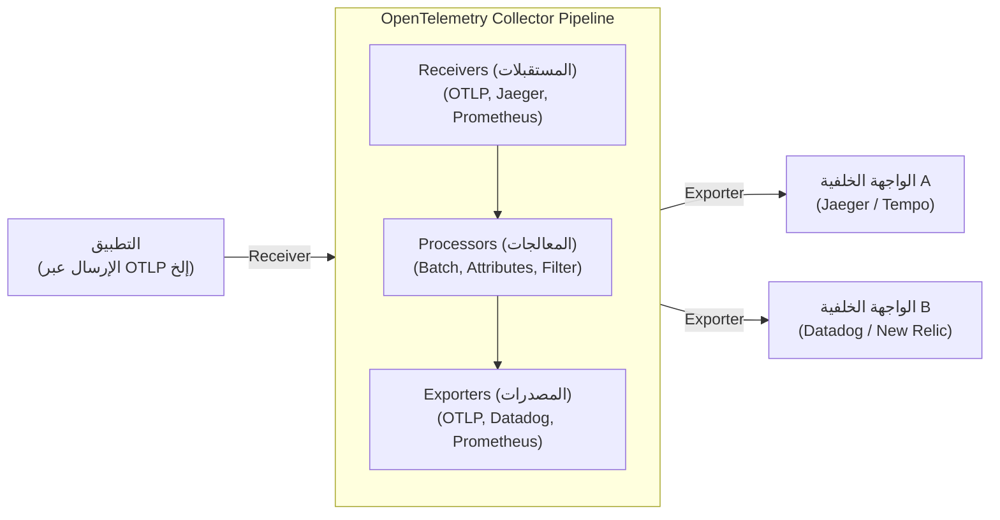

في بنية البرمجيات الحديثة، لم تعد الأنظمة الموزعة مثل الخدمات المصغرة (Microservices) والبنية بدون خادم (Serverless) شيئًا استثنائيًا. ومع ذلك، في حين أصبحت الأنظمة لامركزية وأسهل في التوسع، أصبح الطلب الواحد يُعالج عبر خدمات متعددة، مما يجعل من الصعب للغاية الفهم الدقيق لحالة "الآن" في النظام وتحديد السبب الجذري عند حدوث مشكلة.

من هذه الخلفية، أصبح مفهوم "قابلية المراقبة" (Observability) يُعتبر ذو أهمية كبيرة. وكإطار عمل قياسي لتحقيق هذه القابلية للمراقبة، فإن ما يكتسح الصناعة حاليًا هو **OpenTelemetry** (يُختصر غالباً بـ: OTel).

في هذا المقال، سنقدم شرحًا فنيًا لتعميق الفهم حول OpenTelemetry، بدءًا من الخلفية التاريخية للتتبع الموزع، ودمج الركائز الثلاث التي تشكل قابلية المراقبة (السجلات، والمقاييس، والتتبعات)، وبنية OpenTelemetry Collector، ونشر السياق عبر W3C Trace Context، وصولاً إلى أمثلة برمجية ملموسة للقياس (Instrumentation) باستخدام بايثون (Python) وجو (Go).

## 1. الخلفية التاريخية للتتبع الموزع: من Dapper إلى OpenTelemetry

إن النظر في التاريخ الذي أدى إلى ولادة OpenTelemetry مفيد جدًا لفهم سبب أهمية هذا المشروع بهذا القدر.

### 1.1 تأثير ورقة Google Dapper
أصبح مفهوم "التتبع الموزع" (Distributed Tracing)، الذي يهدف إلى تحليل الأداء واستكشاف الأخطاء وإصلاحها في الأنظمة الموزعة، معروفًا على نطاق واسع من خلال الورقة البحثية **"Dapper, a Large-Scale Distributed Systems Tracing Infrastructure"** التي نشرتها شركة Google في عام 2010.

كان Dapper عبارة عن بنية تحتية لتتبع الطلبات التي تتدفق عبر مجموعة ضخمة من الخدمات المصغرة داخل Google، مع الحفاظ على النفقات العامة (overhead) عند الحد الأدنى. قدمت هذه الورقة المفاهيم الهامة التالية:
- **Trace (التتبع)**: التدفق الكامل للمعالجة عبر طلب واحد بأكمله.
- **Span (الامتداد أو النطاق)**: وحدة العمل الفردية التي يتكون منها التتبع (على سبيل المثال، استعلام لقاعدة بيانات أو استدعاء واجهة برمجة تطبيقات خارجية).
- **Context Propagation (نشر السياق)**: الآلية التي يتم من خلالها نشر معرّف الطلب ومعرّف النطاق عبر حدود الشبكة.

أثرت مفاهيم Dapper بشكل كبير على المشاريع مفتوحة المصدر اللاحقة (مثل Zipkin من Twitter و Jaeger من Uber).

### 1.2 صعود OpenTracing و OpenCensus
منذ ورقة Dapper، ظهرت أدوات تتبع مختلفة، ولكن نظرًا لأن كل منها كان يمتلك واجهة برمجة تطبيقات (API) وتنسيق بيانات خاص به، واجه المطورون مشكلة التقيد بمورد أو أداة معينة (Vendor Lock-in) (مثل Datadog، و New Relic، و AWS X-Ray، إلخ).

لحل هذه المشكلة، وُلد مشروعان رئيسيان مفتوحا المصدر:
1. **OpenTracing**: مشروع استضافته مؤسسة الحوسبة السحابية الأصلية (CNCF). تخصص في صياغة مواصفات واجهة برمجة تطبيقات محايدة للموردين من أجل التتبع الموزع.
2. **OpenCensus**: مشروع بقيادة Google و Microsoft. لم يوفر التتبع فحسب، بل وفر أيضًا وظائف جمع المقاييس، ووفر مكتبات يمكنها إرسال البيانات إلى واجهات خلفية (backends) متنوعة.

### 1.3 ولادة OpenTelemetry
أصبح كل من OpenTracing و OpenCensus مستخدمين على نطاق واسع، لكن وظائفهما كانت متداخلة، مما أدى إلى انقسام المجتمع. لذلك، في عام 2019، وُلد **OpenTelemetry** لدمج هذين المشروعين وإنشاء معيار قياسي واحد.

اليوم، تطور OpenTelemetry ليصبح مشروعًا ضخمًا تحت مظلة CNCF، في المرتبة الثانية بعد Kubernetes، وأصبح المعيار الفعلي (de facto standard) في هذه الصناعة.

---

## 2. دمج الركائز الثلاث لقابلية المراقبة (Observability)

لتحقيق قابلية المراقبة، نحتاج إلى بيانات (بيانات القياس عن بُعد - Telemetry Data) لاستنتاج الحالة الداخلية للنظام من الخارج. وتُعرف هذه بشكل عام باسم "الركائز الثلاث لقابلية المراقبة" (Three Pillars of Observability).

1. **Metrics (المقاييس)**:
   - هي مجموعة من البيانات الرقمية التي تشير إلى حالة النظام (مثل استخدام وحدة المعالجة المركزية، واستخدام الذاكرة، وعدد الطلبات، ومعدل الخطأ، وما إلى ذلك).
   - مثالية للتخزين طويل الأجل، وتحليل الاتجاهات على لوحات المعلومات (Dashboards)، وإطلاق التنبيهات.
2. **Logs (السجلات)**:
   - بيانات نصية أو مهيكلة تسجل أحداثًا فردية وقعت في النظام.
   - توفر سياقًا مفصلاً حول "ماذا حدث".
3. **Traces (التتبعات)**:
   - بيانات توضح كيف وأين تمت معالجة الطلب عبر الخدمات المختلفة في النظام الموزع.
   - مفيدة في تحديد عنق الزجاجة (Bottlenecks) وفهم التبعيات بين الخدمات.

### قيمة الدمج عبر OpenTelemetry
في الماضي، كان يجب إدخال وكلاء أو مكتبات منفصلة لكل ركيزة؛ على سبيل المثال، Prometheus للمقاييس، و Fluentd + Elasticsearch للسجلات، و Jaeger للتتبعات.

يقوم OpenTelemetry بـ **دمج عملية توليد وجمع ومعالجة وتصدير "المقاييس والسجلات والتتبعات" من خلال واجهة برمجة تطبيقات / حزمة تطوير البرمجيات / مُجمّع (API / SDK / Collector) واحد**. يؤدي هذا إلى الفوائد التالية:

- **دمج الوكلاء (Agents)**: يلغي الحاجة إلى تحميل مكتبات متعددة على جانب التطبيق أو نشر وكلاء متعددين على جانب البنية التحتية.
- **ضمان الارتباط (Correlation)**: يسهل تضمين معرّف التتبع (Trace ID) في السجلات، أو الانتقال من مقاييس أخطاء معينة إلى التتبعات ذات الصلة.
- **الاستقلال عن الموردين**: عند تغيير وجهة إرسال البيانات (الواجهة الخلفية)، لا حاجة لإعادة كتابة كود التطبيق؛ يكفي فقط تعديل الإعدادات.

---

## 3. W3C Trace Context ونشر السياق

الآلية الأهم لجعل التتبع يعمل في الأنظمة الموزعة هي **نشر السياق (Context Propagation)**.

عندما تستدعي الخدمة A الخدمة B، يجب على الخدمة A أن تنقل المعلومات حول التتبع (الطلب) الذي تقوم بمعالجته حاليًا (مثل معرّف التتبع ومعرّف النطاق الخاص بها) إلى الخدمة B. يتيح هذا للخدمة B التعرف على العملية الكبيرة التي يشكل الطلب المستلم جزءًا منها، وربط بيانات القياس عن بُعد بشكل صحيح.

### W3C Trace Context
في الماضي، استخدمت كل أداة ترويسات HTTP الخاصة بها (مثل `X-B3-TraceId`، و `X-Amzn-Trace-Id`، وما إلى ذلك) لنشر السياق. لم يحافظ هذا على قابلية التشغيل البيني بين أنظمة التتبع المختلفة.

ولذلك، تم توحيد مواصفات **W3C Trace Context**. يستخدم OpenTelemetry افتراضيًا مواصفات W3C Trace Context هذه لنشر السياق.

يستخدم W3C Trace Context بشكل أساسي ترويستي HTTP التاليتين:

1. **ترويسة `traceparent`**:
   - تقوم بتشفير معرّف التتبع (Trace ID)، ومعرّف النطاق الأصل (Parent Span ID)، وعلامات أخذ العينات (Sampling Flags) في سلسلة نصية واحدة.
   - مثال على التنسيق: `00-4bf92f3577b34da6a3ce929d0e0e4736-00f067aa0ba902b7-01`
     - `00`: الإصدار
     - `4bf92f3577b34da6a3ce929d0e0e4736`: معرّف التتبع (Trace ID)
     - `00f067aa0ba902b7`: معرّف النطاق الأصل (Parent Span ID)
     - `01`: علامات التتبع (Trace Flags - يشير 01 إلى أنه سيتم أخذ عينة منه)
2. **ترويسة `tracestate`**:
   - منطقة امتداد لنشر معلومات التتبع الخاصة بالموردين كأزواج مفتاح-قيمة (Key-Value pairs).

تمتلك مكتبات OpenTelemetry وظيفة حقن (Inject) هذه الترويسات تلقائيًا عند إرسال طلب HTTP، واستخراجها (Extract) من الترويسات عند استقبال الطلب.

---

## 4. بنية OpenTelemetry Collector

إن OpenTelemetry Collector عبارة عن وكيل/بروكسي محايد للموردين لاستقبال، ومعالجة، وتصدير بيانات القياس عن بُعد (التتبعات، والمقاييس، والسجلات). من خلال تقديم Collector، بدلاً من إرسال البيانات مباشرة من التطبيق إلى الواجهة الخلفية (مثل Datadog أو New Relic)، يمكنك تجميع البيانات فيه.

يتميز المجمع ببنية خط أنابيب (Pipeline) تتكون بشكل أساسي من المكونات الثلاثة التالية.



### 4.1 Receiver (المُستقبِل)
يلعب دور استقبال البيانات من التطبيقات أو الوكلاء الآخرين.
يدعم كلاً من النماذج القائمة على الدفع (Push) (مثل OTLP Receiver و Jaeger Receiver) والنماذج القائمة على السحب (Pull) (مثل Prometheus Receiver و Host Metrics Receiver).

### 4.2 Processor (المُعالِج)
يلعب دور تحويل البيانات وتعديلها وتصفيتها قبل تصديرها.
- **Batch Processor**: يجمّع البيانات على دفعات بكمية معينة أو لوقت معين لتقليل النفقات العامة للشبكة (هذا المعالج مطلوب وموصى به).
- **Attributes Processor**: يضيف علامات (Tags) معينة (مثل اسم البيئة أو الإصدار) إلى النطاقات أو المقاييس، أو يقوم بإخفاء المعلومات الحساسة (مثل كلمات المرور أو أرقام بطاقات الائتمان).
- **Memory Limiter Processor**: يمنع تعطل العملية (Crash) عن طريق التخلص من البيانات (Drop) إذا وصل استخدام ذاكرة الـ Collector إلى حد أعلى معين.

### 4.3 Exporter (المُصَدِّر)
يلعب دور إرسال البيانات المعالجة إلى الواجهة الخلفية (منصة الرصد).
نظرًا لأنه يمكن إرسال البيانات من خط أنابيب واحد إلى مُصدرين متعددين، يمكنك تنفيذ توجيه مرن، مثل "إرسال المقاييس إلى Prometheus، والتتبعات إلى كل من Jaeger و Datadog"، وذلك بمجرد تغيير ملف التكوين.

---

## 5. قياس التطبيقات (Instrumentation)

لتوليد بيانات القياس عن بُعد من أحد التطبيقات، يتطلب الأمر "القياس" (Instrumentation). يحتوي OpenTelemetry بشكل رئيسي على نهجين:

1. **القياس التلقائي (Auto-Instrumentation)**:
   - يتضمن دمج القياس تلقائيًا في المكتبات القياسية وأطر العمل (عملاء HTTP، وبرامج تشغيل قواعد البيانات، وما إلى ذلك) باستخدام وكيل وقت التشغيل الخاص باللغة (Java، و Python، و Node.js، إلخ) أو باستخدام eBPF، دون تعديل كود التطبيق.
2. **القياس اليدوي (Manual Instrumentation)**:
   - يستدعي المطورون واجهة برمجة تطبيقات OpenTelemetry SDK بشكل صريح داخل الكود، ويضيفون نطاقات مخصصة (Custom Spans) وخصائص (Attributes) خاصة بمنطق العمل (Business Logic).

دعونا نلقي نظرة على أمثلة التنفيذ في Python و Go والتي تجمع بين القياس التلقائي واليدوي.

### 5.1 مثال على القياس في Python

في Python، يمكن إجراء القياس التلقائي بسهولة باستخدام أمر `opentelemetry-instrument`. علاوة على ذلك، يوضح المثال التالي كيفية إنشاء نطاقات مخصصة داخل الكود.

```python
from opentelemetry import trace
from opentelemetry.sdk.trace import TracerProvider
from opentelemetry.sdk.trace.export import BatchSpanProcessor
from opentelemetry.exporter.otlp.proto.grpc.trace_exporter import OTLPSpanExporter
from opentelemetry.sdk.resources import Resource
import time
import random

# 1. إعداد الموارد (مثل اسم الخدمة)
resource = Resource(attributes={
    "service.name": "python-payment-service",
    "service.version": "1.0.0"
})

# 2. تهيئة وتكوين TracerProvider
provider = TracerProvider(resource=resource)
otlp_exporter = OTLPSpanExporter(endpoint="http://otel-collector:4317", insecure=True)
processor = BatchSpanProcessor(otlp_exporter)
provider.add_span_processor(processor)
trace.set_tracer_provider(provider)

# 3. الحصول على المتتبع (Tracer)
tracer = trace.get_tracer(__name__)

def process_payment(user_id: str, amount: float):
    # بدء النطاق يدويا
    with tracer.start_as_current_span("process_payment_task") as span:
        # إضافة خصائص إلى النطاق
        span.set_attribute("payment.user_id", user_id)
        span.set_attribute("payment.amount", amount)
        
        try:
            # محاكاة منطق العمل
            time.sleep(random.uniform(0.1, 0.5))
            if amount > 10000:
                raise ValueError("Amount exceeds limit")
            
            span.add_event("Payment processed successfully")
            span.set_status(trace.StatusCode.OK)
            return True
            
        except Exception as e:
            # تسجيل معلومات الاستثناء في النطاق عند حدوث خطأ
            span.record_exception(e)
            span.set_status(trace.StatusCode.ERROR, str(e))
            raise

if __name__ == "__main__":
    try:
        process_payment("user-1234", 5000)
    except Exception:
        pass
```

في حالة Python، يتم توفير إضافات للقياس التلقائي للمكتبات الرئيسية مثل Flask و FastAPI و Requests، مما يتيح التكامل السلس مع القياس اليدوي.

### 5.2 مثال على القياس في Go

نظرًا لأن لغة Go (Golang) هي لغة ذات كتابة ثابتة (Statically Typed)، فمن الصعب إجراء قياس تلقائي كامل باستخدام "السحر" مثل ما يحدث في Python (مثل التعديلات الديناميكية أثناء وقت التشغيل - dynamic patching)، ويصبح من الضروري تمرير `context.Context` بشكل صريح داخل الكود. هذا يجعل المطورين واعين جداً بـ "نشر السياق" (Context Propagation).

فيما يلي مثال بلغة Go حيث يتم بدء التتبع داخل معالج HTTP واستدعاء وظيفة داخلية.

```go
package main

import (
	"context"
	"fmt"
	"log"
	"net/http"
	"time"

	"go.opentelemetry.io/otel"
	"go.opentelemetry.io/otel/attribute"
	"go.opentelemetry.io/otel/exporters/otlp/otlptrace/otlptracegrpc"
	"go.opentelemetry.io/otel/sdk/resource"
	sdktrace "go.opentelemetry.io/otel/sdk/trace"
	semconv "go.opentelemetry.io/otel/semconv/v1.17.0"
	"go.opentelemetry.io/otel/trace"
)

// وظيفة التهيئة
func initProvider() (*sdktrace.TracerProvider, error) {
	ctx := context.Background()
	
	// إنشاء مصدر OTLP (لإرساله إلى Collector)
	exp, err := otlptracegrpc.New(ctx, otlptracegrpc.WithInsecure(), otlptracegrpc.WithEndpoint("otel-collector:4317"))
	if err != nil {
		return nil, err
	}

	res := resource.NewWithAttributes(
		semconv.SchemaURL,
		semconv.ServiceName("go-inventory-service"),
		semconv.ServiceVersion("1.0.0"),
	)

	tp := sdktrace.NewTracerProvider(
		sdktrace.WithBatcher(exp),
		sdktrace.WithResource(res),
	)
	
	// تعيين مزود المتتبع العام
	otel.SetTracerProvider(tp)
	return tp, nil
}

func checkInventory(ctx context.Context, itemID string) error {
	// الحصول على المتتبع من السياق وإنشاء نطاق فرعي
	tracer := otel.Tracer("inventory-module")
	ctx, span := tracer.Start(ctx, "checkInventory_operation")
	defer span.End() // إغلاق النطاق عند انتهاء الوظيفة

	span.SetAttributes(attribute.String("item.id", itemID))

	// استعلام قاعدة بيانات وهمي
	time.Sleep(200 * time.Millisecond)
	
	span.AddEvent("Inventory check completed")
	return nil
}

func inventoryHandler(w http.ResponseWriter, r *http.Request) {
	// الحصول على السياق من طلب HTTP وإنشاء نطاق الجذر
	tracer := otel.Tracer("http-server")
	ctx, span := tracer.Start(r.Context(), "HTTP GET /inventory")
	defer span.End()

	itemID := r.URL.Query().Get("id")
	if itemID == "" {
		span.SetStatus(trace.StatusCodeError, "missing item id")
		http.Error(w, "missing item id", http.StatusBadRequest)
		return
	}

	// تمرير السياق (ctx) إلى الوظيفة الداخلية
	err := checkInventory(ctx, itemID)
	if err != nil {
		span.RecordError(err)
		span.SetStatus(trace.StatusCodeError, err.Error())
		http.Error(w, "internal error", http.StatusInternalServerError)
		return
	}

	span.SetStatus(trace.StatusCodeOk, "")
	w.WriteHeader(http.StatusOK)
	fmt.Fprintf(w, "Item %s is in stock", itemID)
}

func main() {
	tp, err := initProvider()
	if err != nil {
		log.Fatal(err)
	}
	// مسح (Flush) النطاقات المعلقة عند إنهاء التطبيق
	defer func() {
		if err := tp.Shutdown(context.Background()); err != nil {
			log.Fatal(err)
		}
	}()

	http.HandleFunc("/inventory", inventoryHandler)
	log.Println("Server listening on :8080")
	log.Fatal(http.ListenAndServe(":8080", nil))
}
```

أهم نقطة في القياس بلغة Go هي استلام `ctx context.Context` كمتغير أول في توقيع الوظيفة وتمريره بشكل موثوق إلى الوظيفة التالية (نشر السياق). هذا يربط استدعاءات الوظائف المتعددة معًا كشجرة تتبع واحدة.

---

## 6. أفضل الممارسات والاستراتيجيات التشغيلية في اعتماد OpenTelemetry

على الرغم من أن OpenTelemetry أداة قوية، إلا أن هناك بعض التحديات والاعتبارات عند إدخالها في بيئات الإنتاج.

### 6.1 نهج التبني التدريجي
إذا حاولت إدخال جميع الخدمات وكل بيانات القياس عن بُعد (المقاييس والسجلات والتتبعات) مرة واحدة، فستكون تكلفة الانتقال عالية وهناك خطر الفشل.
النهج الموصى به هو **"البدء أولاً بالتتبع الموزع"**. في كثير من الحالات، تعمل البنى التحتية الحالية (مثل Prometheus أو ELK Stack) للمقاييس والسجلات، ولكن التتبع في الأنظمة الموزعة هو المجال الذي يستفيد بشكل مباشر أكثر من OTel. بمجرد أن يعمل التتبع باستقرار، سيكون من الأفضل الانتقال إلى المقاييس، وأخيراً السجلات (وصلت مواصفات التسجيل الخاصة بـ OTel حاليًا إلى التوفر العام GA وأصبحت شائعة بشكل متزايد).

### 6.2 استراتيجية أخذ العينات (Sampling Strategy)
في الأنظمة ذات حركة المرور (Traffic) العالية، إذا قمت بتسجيل وإرسال جميع الطلبات (100٪) كتتبعات، فستصبح التكلفة هائلة من حيث عرض النطاق الترددي للشبكة وتخزين الواجهة الخلفية. لتجنب ذلك، هناك طريقتان رئيسيتان لاستراتيجيات أخذ العينات:

- **أخذ العينات المستند إلى الرأس (Head-based Sampling)**:
  - عند نقطة بداية التتبع (وقت استلام الطلب الأول)، يتم اتخاذ قرار بشأن ما إذا كان سيتم تسجيل هذا التتبع أم لا (مثال: احتمال 10٪ للتسجيل).
  - إنه سهل التنفيذ وذو نفقات عامة (Overhead) منخفضة، ولكنه لا يسمح بـ "الاحتفاظ بالطلبات التي بها أخطاء فقط" (لأنك لا تعرف ما إذا كان سينتج خطأ عند نقطة البداية).
- **أخذ العينات المستند إلى الذيل (Tail-based Sampling)**:
  - في هذه الطريقة، يتخذ الـ Collector القرار بعد اكتمال معالجة الطلب بالكامل.
  - يتم تخزين التتبع بالكامل مؤقتًا في الذاكرة، ويتم تقييم ما إذا كان "يحتوي على أخطاء" أو "إذا كان وقت المعالجة طويلاً بشكل غير طبيعي" قبل اتخاذ قرار بالإرسال أو التجاهل.
  - على الرغم من إمكانية استخراج التتبعات ذات القيمة العالية فقط، إلا أن هذا يتطلب من الـ Collector ذاكرة كبيرة وقدرة معالجة عالية (موارد حوسبة).

### 6.3 أنماط نشر الـ Collector

يمكن تقسيم نشر الـ Collector بشكل واسع إلى "نمط الوكيل" (Agent Pattern) و "نمط البوابة" (Gateway Pattern). من الشائع الجمع بين هذين النمطين في العمليات.

1. **نمط الوكيل (Agent Pattern)**:
   - يتم نشر Collector صغير الحجم في كل عقدة (Node) (مثل DaemonSet في Kubernetes أو مثيلات EC2).
   - يتم تقليل تعقيد الشبكة لأن التطبيقات تحتاج دائمًا فقط إلى دفع البيانات إلى `localhost`. كما يلعب دور جمع مقاييس المضيف (وحدة المعالجة المركزية/الذاكرة).
2. **نمط البوابة (Gateway Pattern)**:
   - يتم وضع مجموعة مستقلة من مجمعات Collectors قابلة للتوسع أمام الاتصالات الخارجة من المجموعة (Cluster).
   - هنا يتم تجميع البيانات المرسلة من الوكيل، وإجراء أخذ العينات المستند إلى الذيل وإزالة المعلومات الحساسة (تصفية)، قبل إرسالها إلى مزود الواجهة الخلفية النهائي (SaaS).
   - نظرًا لأنه يمكن مركزية إدارة مفاتيح API للواجهة الخلفية والتحكم في حركة المرور في هذه الطبقة، فهي ممتازة من منظور الأمان والتشغيل.

---

## 7. الخلاصة

يعد OpenTelemetry معيارًا مفتوحًا في غاية الأهمية لضمان "قابلية المراقبة" (Observability) في الأنظمة الموزعة. من خلال القضاء على التقيد بالموردين (Vendor Lock-in) ودمج بيانات القياس الثلاثة - المقاييس والسجلات والتتبعات - بسلاسة باستخدام مواصفات مشتركة (OTLP)، فإنه يحسن كفاءة التحقيق في الأعطال بشكل كبير ويزيد من شفافية النظام.

- **الخلفية التاريخية**: بدأ بـ Google Dapper، وتم دمجه مع OpenTracing و OpenCensus ليصبح معيار الصناعة.
- **تكامل البيانات**: SDK مركزي على جانب التطبيق، وخط أنابيب بيانات مرن بواسطة الـ Collector.
- **نشر السياق**: نشر قياسي للترويسات باستخدام W3C Trace Context.
- **القياس والتشغيل**: التنفيذ التدريجي، والتصميم المناسب لأخذ العينات، واعتماد بنية البوابة هي المفاتيح.

بالنسبة للفرق التي تتبنى بنية الخدمات المصغرة، أو التي تفكر في الانتقال إليها، فإن الاستثمار في OpenTelemetry سيوفر عائدًا مرتفعًا جدًا على الاستثمار (ROI) في عمليات تشغيل النظام المستقبلية. نوصيك بشدة بالبدء في تنفيذ القياس باستخدام OTel بدءًا من خدمة صغيرة في بيئتك الخاصة.
