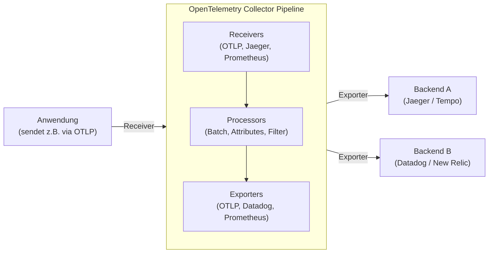

In modernen Softwarearchitekturen sind verteilte Systeme wie Microservices und Serverless keine Besonderheit mehr. Während Systeme jedoch dezentralisiert und leichter skalierbar werden, wird eine einzige Anfrage nun oft über mehrere Dienste hinweg verarbeitet. Das macht es äußerst schwierig, den „aktuellen Zustand“ des Systems genau zu erfassen und bei Problemen die zugrunde liegende Ursache (Root Cause) zu identifizieren.

Vor diesem Hintergrund hat das Konzept der „Observability“ (Beobachtbarkeit) stark an Bedeutung gewonnen. Das derzeit in der Branche dominierende Standard-Framework zur Umsetzung dieser Observability ist **OpenTelemetry** (kurz: OTel).

In diesem Artikel bieten wir eine detaillierte technische Erklärung, um OpenTelemetry tiefgreifend zu verstehen. Angefangen bei den historischen Hintergründen des Distributed Tracings über die Integration der drei Säulen der Observability (Logs, Metriken, Traces), die Architektur des OpenTelemetry Collectors, die Kontextausbreitung (Context Propagation) durch den W3C Trace Context bis hin zu konkreten Codebeispielen für die Instrumentierung in Python und Go.

## 1. Historischer Hintergrund des Distributed Tracings: Von Dapper zu OpenTelemetry

Ein Rückblick auf die Geschichte, die zur Entstehung von OpenTelemetry führte, ist sehr hilfreich, um zu verstehen, warum dieses Projekt so enorm wichtig ist.

### 1.1 Der Einfluss des Google Dapper Papers
Das Konzept des „Distributed Tracings“ (verteiltes Tracing) zur Leistungsanalyse und Fehlerbehebung in verteilten Systemen wurde durch das 2010 von Google veröffentlichte Paper **"Dapper, a Large-Scale Distributed Systems Tracing Infrastructure"** weithin bekannt.

Dapper war eine Infrastruktur, um Anfragen, die durch Googles riesige Microservice-Landschaft flossen, mit minimalem Overhead nachzuverfolgen. In diesem Paper wurden folgende wichtige Konzepte vorgestellt:
- **Trace**: Der Ablauf der Verarbeitung einer gesamten Anfrage.
- **Span**: Einzelne Arbeitseinheiten, aus denen ein Trace besteht (z. B. Datenbankabfragen oder externe API-Aufrufe).
- **Context Propagation (Kontextausbreitung)**: Ein Mechanismus, um Trace-IDs oder Span-IDs über Netzwerkgrenzen hinweg weiterzugeben.

Der Ansatz von Dapper hatte massiven Einfluss auf spätere Open-Source-Projekte (wie Zipkin von Twitter und Jaeger von Uber).

### 1.2 Der Aufstieg von OpenTracing und OpenCensus
Nach dem Dapper-Paper erschienen verschiedene Tracing-Tools, die jedoch alle eigene APIs und Datenformate besaßen. Entwickler standen vor dem Problem des Vendor Lock-ins durch bestimmte Anbieter (Datadog, New Relic, AWS X-Ray etc.) oder Tools.

Zur Lösung dieses Problems entstanden zwei große Open-Source-Projekte:
1. **OpenTracing**: Ein von der CNCF (Cloud Native Computing Foundation) gehostetes Projekt. Es spezialisierte sich auf die Spezifikation einer herstellerneutralen API für Distributed Tracing.
2. **OpenCensus**: Ein von Google und Microsoft geleitetes Projekt. Es bot nicht nur Tracing, sondern auch Funktionen zur Metrikerfassung und stellte Bibliotheken bereit, um Daten an verschiedene Backends zu senden.

### 1.3 Die Geburt von OpenTelemetry
Obwohl sowohl OpenTracing als auch OpenCensus weit verbreitet waren, überschnitten sich ihre Funktionen, was zu einer Spaltung der Community führte. Um diese beiden Projekte zu vereinen und einen einzigen Standard zu schaffen, wurde 2019 **OpenTelemetry** ins Leben gerufen.

Heute ist OpenTelemetry zu einem riesigen CNCF-Projekt herangewachsen – das zweitgrößte nach Kubernetes – und hat sich als De-facto-Standard der Branche etabliert.

---

## 2. Integration der 3 Säulen der Observability

Um Observability zu erreichen, werden Daten (Telemetriedaten) benötigt, mit denen der interne Zustand eines Systems von außen abgeleitet werden kann. Diese werden allgemein als die „Drei Säulen der Observability“ (Three Pillars of Observability) bezeichnet.

1. **Metriken (Metrics)**: 
   - Eine Sammlung numerischer Daten, die den Zustand des Systems anzeigen (CPU-Auslastung, Speicherverbrauch, Anzahl der Anfragen, Fehlerrate usw.).
   - Ideal für die langfristige Speicherung, Trendanalysen in Dashboards und das Auslösen von Warnmeldungen (Alerts).
2. **Logs**: 
   - Text oder strukturierte Daten, die spezifische Ereignisse aufzeichnen, die im System aufgetreten sind.
   - Bieten detaillierten Kontext darüber, „was passiert ist“.
3. **Traces**: 
   - Daten, die zeigen, wie eine Anfrage verarbeitet wurde und welche Dienste innerhalb des verteilten Systems sie durchlaufen hat.
   - Helfen bei der Identifizierung von Engpässen und dem Verständnis von Abhängigkeiten zwischen Diensten.

### Der Wert der Integration durch OpenTelemetry
Bisher war es erforderlich, für jede Säule separate Agenten oder Bibliotheken einzuführen, wie z. B. Prometheus für Metriken, Fluentd + Elasticsearch für Logs und Jaeger für Traces.

OpenTelemetry **integriert die Generierung, Sammlung, Verarbeitung und den Export dieser „Metriken, Logs und Traces“ über eine einzige API / ein SDK / einen Collector**. Dies bringt folgende Vorteile mit sich:

- **Konsolidierung von Agenten**: Es ist nicht mehr notwendig, auf Anwendungsseite mehrere Bibliotheken zu laden oder in der Infrastruktur mehrere Agenten zu implementieren.
- **Sicherstellung der Korrelation**: Es wird wesentlich einfacher, Trace-IDs in Logs einzubetten oder von einer spezifischen Fehlermetrik zu den zugehörigen Traces zu springen.
- **Herstellerunabhängigkeit**: Wenn das Ziel für das Senden von Daten (Backend) geändert wird, muss der Anwendungscode nicht neu geschrieben werden; eine einfache Änderung der Konfiguration reicht aus.

---

## 3. W3C Trace Context und Context Propagation

Der wichtigste Mechanismus für die Funktionsweise von Traces in verteilten Systemen ist die **Kontextausbreitung (Context Propagation)**.

Wenn Service A Service B aufruft, muss Service A Informationen darüber (Trace-ID und seine eigene Span-ID) an Service B weitergeben, welchen Trace (welche Anfrage) er gerade verarbeitet. Dadurch erkennt Service B, zu welchem größeren Prozess die empfangene Anfrage gehört, und kann die Telemetriedaten korrekt verknüpfen.

### W3C Trace Context
In der Vergangenheit nutzte jedes Tool eigene HTTP-Header (z. B. `X-B3-TraceId`, `X-Amzn-Trace-Id` usw.), um den Kontext weiterzugeben. Dies verhinderte eine Interoperabilität zwischen verschiedenen Tracing-Systemen.

Aus diesem Grund wurde die **W3C Trace Context**-Spezifikation standardisiert. OpenTelemetry verwendet standardmäßig diesen W3C Trace Context für die Kontextausbreitung.

Der W3C Trace Context verwendet hauptsächlich die folgenden zwei HTTP-Header:

1. **`traceparent` Header**: 
   - Kodiert die Trace-ID, die Parent-Span-ID und Sampling-Flags als einen einzigen String.
   - Format-Beispiel: `00-4bf92f3577b34da6a3ce929d0e0e4736-00f067aa0ba902b7-01`
     - `00`: Version
     - `4bf92f3577b34da6a3ce929d0e0e4736`: Trace ID
     - `00f067aa0ba902b7`: Parent Span ID
     - `01`: Trace Flags (01 bedeutet, dass es gesampelt wird)
2. **`tracestate` Header**: 
   - Ein Erweiterungsbereich, um anbieterspezifische Trace-Informationen in Form von Key-Value-Paaren weiterzugeben.

OpenTelemetry-Bibliotheken verfügen über die Funktionalität, diese Header automatisch zu injizieren (Inject), wenn eine HTTP-Anfrage gesendet wird, und sie aus dem Header zu extrahieren (Extract), wenn eine Anfrage empfangen wird.

---

## 4. Architektur des OpenTelemetry Collectors

Der OpenTelemetry Collector ist ein herstellerneutraler Proxy/Agent zum Empfangen, Verarbeiten und Exportieren von Telemetriedaten (Traces, Metriken, Logs). Durch die Einführung des Collectors können Daten in diesem gebündelt werden, anstatt sie direkt von der Anwendung an das Backend (wie Datadog oder New Relic) zu senden.

Der Collector verfügt über eine Pipeline-Architektur, die hauptsächlich aus den folgenden drei Komponenten besteht:



### 4.1 Receiver (Empfänger)
Ist dafür zuständig, Daten von Anwendungen oder anderen Agenten zu empfangen.
Er unterstützt sowohl Push-Modelle (z. B. OTLP Receiver, Jaeger Receiver) als auch Pull-Modelle (z. B. Prometheus Receiver, Host Metrics Receiver).

### 4.2 Processor (Verarbeiter)
Hat die Aufgabe, die empfangenen Daten zu konvertieren, zu modifizieren und zu filtern, bevor sie exportiert werden.
- **Batch Processor**: Bündelt Daten in bestimmten Mengen oder Zeitintervallen (Batches), um den Netzwerk-Overhead zu reduzieren (dieser Prozessor ist erforderlich und wird dringend empfohlen).
- **Attributes Processor**: Fügt Spans oder Metriken bestimmte Tags (wie Umgebungsname oder Version) hinzu oder maskiert sensible Informationen (wie Passwörter oder Kreditkartennummern).
- **Memory Limiter Processor**: Verhindert, dass der Prozess abstürzt, indem Daten verworfen werden, wenn die Speichernutzung des Collectors eine bestimmte Obergrenze erreicht.

### 4.3 Exporter
Ist verantwortlich für das Senden der verarbeiteten Daten an das Backend (Observability-Infrastruktur).
Da Daten aus einer einzigen Pipeline an mehrere Exporter gesendet werden können, lässt sich eine flexible Weiterleitung (Routing) – wie z. B. „Metriken an Prometheus senden und Traces an Jaeger und Datadog“ – allein durch Konfigurationsdateien realisieren.

---

## 5. Instrumentierung (Instrumentation) der Anwendung

Um Telemetriedaten von einer Anwendung zu generieren, ist eine „Instrumentierung“ erforderlich. OpenTelemetry bietet dafür hauptsächlich zwei Ansätze:

1. **Automatische Instrumentierung (Auto-Instrumentation)**:
   - Integriert die Instrumentierung automatisch in Standardbibliotheken oder Frameworks (wie HTTP-Clients, Datenbanktreiber) unter Verwendung von sprachspezifischen Runtime-Agenten (Java, Python, Node.js usw.) oder eBPF, ohne dass der Anwendungscode geändert werden muss.
2. **Manuelle Instrumentierung (Manual Instrumentation)**:
   - Der Entwickler ruft explizit die OpenTelemetry SDK API im Code auf und fügt benutzerdefinierte Spans oder Attribute (Attributes) hinzu, die spezifisch für die Geschäftslogik sind.

Schauen wir uns Implementierungsbeispiele in Python und Go an, die automatische und manuelle Instrumentierung kombinieren.

### 5.1 Beispiel für Instrumentierung in Python

In Python kann die automatische Instrumentierung ganz einfach mit dem Befehl `opentelemetry-instrument` durchgeführt werden. Darüber hinaus zeigen wir ein Beispiel für die Erstellung benutzerdefinierter Spans im Code.

```python
from opentelemetry import trace
from opentelemetry.sdk.trace import TracerProvider
from opentelemetry.sdk.trace.export import BatchSpanProcessor
from opentelemetry.exporter.otlp.proto.grpc.trace_exporter import OTLPSpanExporter
from opentelemetry.sdk.resources import Resource
import time
import random

# 1. Ressourcen-Konfiguration (Dienstname etc.)
resource = Resource(attributes={
    "service.name": "python-payment-service",
    "service.version": "1.0.0"
})

# 2. Initialisierung und Konfiguration des TracerProviders
provider = TracerProvider(resource=resource)
otlp_exporter = OTLPSpanExporter(endpoint="http://otel-collector:4317", insecure=True)
processor = BatchSpanProcessor(otlp_exporter)
provider.add_span_processor(processor)
trace.set_tracer_provider(provider)

# 3. Abrufen des Tracers
tracer = trace.get_tracer(__name__)

def process_payment(user_id: str, amount: float):
    # Span manuell starten
    with tracer.start_as_current_span("process_payment_task") as span:
        # Attribute zum Span hinzufügen
        span.set_attribute("payment.user_id", user_id)
        span.set_attribute("payment.amount", amount)
        
        try:
            # Simulation der Geschäftslogik
            time.sleep(random.uniform(0.1, 0.5))
            if amount > 10000:
                raise ValueError("Amount exceeds limit")
            
            span.add_event("Payment processed successfully")
            span.set_status(trace.StatusCode.OK)
            return True
            
        except Exception as e:
            # Ausnahmeinformationen im Fehlerfall im Span aufzeichnen
            span.record_exception(e)
            span.set_status(trace.StatusCode.ERROR, str(e))
            raise

if __name__ == "__main__":
    try:
        process_payment("user-1234", 5000)
    except Exception:
        pass
```

Für Python werden Auto-Instrumentation-Plugins für wichtige Bibliotheken wie Flask, FastAPI und Requests bereitgestellt, die nahtlos mit der manuellen Instrumentierung verknüpft werden können.

### 5.2 Beispiel für Instrumentierung in Go

Da Go (Golang) eine statisch typisierte Sprache ist, ist eine vollständig automatische Instrumentierung durch Magie (wie dynamisches Patchen zur Laufzeit) wie in Python schwierig. Stattdessen ist es erforderlich, den `context.Context` explizit im Code weiterzugeben. Dies führt dazu, dass man sich der „Context Propagation“ sehr bewusst wird.

Das folgende Beispiel in Go zeigt, wie ein Trace innerhalb eines HTTP-Handlers gestartet und eine interne Funktion aufgerufen wird.

```go
package main

import (
	"context"
	"fmt"
	"log"
	"net/http"
	"time"

	"go.opentelemetry.io/otel"
	"go.opentelemetry.io/otel/attribute"
	"go.opentelemetry.io/otel/exporters/otlp/otlptrace/otlptracegrpc"
	"go.opentelemetry.io/otel/sdk/resource"
	sdktrace "go.opentelemetry.io/otel/sdk/trace"
	semconv "go.opentelemetry.io/otel/semconv/v1.17.0"
	"go.opentelemetry.io/otel/trace"
)

// Initialisierungsfunktion
func initProvider() (*sdktrace.TracerProvider, error) {
	ctx := context.Background()
	
	// OTLP-Exporter erstellen (Senden an den Collector)
	exp, err := otlptracegrpc.New(ctx, otlptracegrpc.WithInsecure(), otlptracegrpc.WithEndpoint("otel-collector:4317"))
	if err != nil {
		return nil, err
	}

	res := resource.NewWithAttributes(
		semconv.SchemaURL,
		semconv.ServiceName("go-inventory-service"),
		semconv.ServiceVersion("1.0.0"),
	)

	tp := sdktrace.NewTracerProvider(
		sdktrace.WithBatcher(exp),
		sdktrace.WithResource(res),
	)
	
	// Globalen Tracer-Provider setzen
	otel.SetTracerProvider(tp)
	return tp, nil
}

func checkInventory(ctx context.Context, itemID string) error {
	// Tracer aus dem Kontext abrufen und einen Child-Span erstellen
	tracer := otel.Tracer("inventory-module")
	ctx, span := tracer.Start(ctx, "checkInventory_operation")
	defer span.End() // Span schließen, wenn die Funktion beendet ist

	span.SetAttributes(attribute.String("item.id", itemID))

	// Simulierte Datenbankabfrage
	time.Sleep(200 * time.Millisecond)
	
	span.AddEvent("Inventory check completed")
	return nil
}

func inventoryHandler(w http.ResponseWriter, r *http.Request) {
	// Kontext aus dem HTTP-Request abrufen und Root-Span erstellen
	tracer := otel.Tracer("http-server")
	ctx, span := tracer.Start(r.Context(), "HTTP GET /inventory")
	defer span.End()

	itemID := r.URL.Query().Get("id")
	if itemID == "" {
		span.SetStatus(trace.StatusCodeError, "missing item id")
		http.Error(w, "missing item id", http.StatusBadRequest)
		return
	}

	// Kontext (ctx) an die interne Funktion weitergeben
	err := checkInventory(ctx, itemID)
	if err != nil {
		span.RecordError(err)
		span.SetStatus(trace.StatusCodeError, err.Error())
		http.Error(w, "internal error", http.StatusInternalServerError)
		return
	}

	span.SetStatus(trace.StatusCodeOk, "")
	w.WriteHeader(http.StatusOK)
	fmt.Fprintf(w, "Item %s is in stock", itemID)
}

func main() {
	tp, err := initProvider()
	if err != nil {
		log.Fatal(err)
	}
	// Ausstehende Spans (Flush) beim Beenden der Anwendung leeren
	defer func() {
		if err := tp.Shutdown(context.Background()); err != nil {
			log.Fatal(err)
		}
	}()

	http.HandleFunc("/inventory", inventoryHandler)
	log.Println("Server listening on :8080")
	log.Fatal(http.ListenAndServe(":8080", nil))
}
```

Der wichtigste Punkt bei der Instrumentierung in Go ist es, `ctx context.Context` als erstes Argument in der Funktionssignatur zu empfangen und zuverlässig an die nächste Funktion weiterzugeben (Context Propagation). Dadurch werden mehrere Funktionsaufrufe als ein einziger Trace-Baum (Trace-Tree) miteinander verbunden.

---

## 6. Best Practices und Betriebsstrategien für die Einführung von OpenTelemetry

OpenTelemetry ist ein leistungsstarkes Tool, jedoch gibt es einige Herausforderungen und Überlegungen bei der Einführung in Produktionsumgebungen.

### 6.1 Schrittweiser Einführungsansatz
Wenn man versucht, alle Dienste und die gesamte Telemetrie (Metriken, Logs, Traces) auf einmal einzuführen, steigen die Migrationskosten und das Risiko eines Scheiterns.
Der empfohlene Ansatz lautet: **„Beginnen Sie zuerst mit dem Distributed Tracing.“** In vielen Fällen funktionieren Metriken und Logs bereits mit bestehenden Infrastrukturen (wie Prometheus oder dem ELK-Stack), aber Tracing in verteilten Systemen ist der Bereich, der am direktesten von OTel profitiert. Nachdem das Tracing stabil läuft, ist es am besten, danach die Metriken und zuletzt die Logs (derzeit ist die OTel-Logging-Spezifikation GA (General Availability) und wird zunehmend übernommen) zu migrieren.

### 6.2 Sampling-Strategie (Sampling Strategy)
In Systemen mit hohem Datenverkehr würde das Aufzeichnen und Senden aller Anfragen (100 %) als Traces zu enormen Netzwerkbandbreiten- und Backend-Speicherkosten führen. Um dies zu verhindern, gibt es hauptsächlich zwei Methoden für Sampling-Strategien:

- **Head-based Sampling**:
  - Zu Beginn eines Traces (wenn die erste Anfrage empfangen wird) wird entschieden, ob dieser Trace aufgezeichnet wird oder nicht (z. B. mit einer Wahrscheinlichkeit von 10 %).
  - Es ist einfach zu implementieren und hat einen geringen Overhead, kann aber Dinge wie „nur Anfragen aufbewahren, bei denen ein Fehler aufgetreten ist“ nicht garantieren (da zu Beginn noch nicht bekannt ist, ob ein Fehler auftreten wird).
- **Tail-based Sampling**:
  - Dies ist eine Methode, bei der die Entscheidung auf der Seite des Collectors getroffen wird, nachdem die Anfrageverarbeitung vollständig abgeschlossen ist.
  - Der gesamte Trace wird temporär im Speicher gepuffert und auf Fragen wie „Enthält er Fehler?“ oder „Dauert die Verarbeitung ungewöhnlich lange?“ ausgewertet, bevor über das Senden oder Verwerfen entschieden wird.
  - Es können nur die wertvollsten Traces extrahiert werden, allerdings benötigt der Collector dafür viel Speicherplatz und eine hohe Verarbeitungsleistung (Rechenressourcen).

### 6.3 Deployment-Muster des Collectors
Deployments des Collectors können grob in das „Agent-Muster“ und das „Gateway-Muster“ unterteilt werden. Es ist üblich, diese im Betrieb zu kombinieren.

1. **Agent-Muster**:
   - Ein kleiner Collector wird auf jedem Node (z. B. als Kubernetes DaemonSet oder innerhalb einer EC2-Instanz) bereitgestellt.
   - Anwendungen müssen die Daten immer nur an `localhost` pushen, was die Netzwerkkomplexität reduziert. Er ist auch für das Sammeln von Host-Metriken (CPU/Speicher) zuständig.
2. **Gateway-Muster**:
   - Ein skalierbarer Collector-Cluster wird unabhängig vorgeschaltet, bevor die Kommunikation nach außen (außerhalb des Clusters) stattfindet.
   - Die vom Agenten gesendeten Daten werden hier aggregiert. Nachdem Tail-based Sampling und das Entfernen sensibler Informationen (Scrubbing/Filtering) durchgeführt wurden, werden sie an den endgültigen Backend-Provider (SaaS) gesendet.
   - Es ist aus Sicherheits- und Betriebsgesichtspunkten hervorragend geeignet, da die Verwaltung von API-Schlüsseln für das Backend und die Traffic-Kontrolle auf dieser Ebene zentralisiert werden können.

---

## 7. Zusammenfassung

OpenTelemetry ist ein enorm wichtiger offener Standard zur Sicherstellung der „Observability“ in verteilten Systemen. Durch die Eliminierung von Vendor Lock-in und die nahtlose Integration der drei Telemetriedaten (Metriken, Logs und Traces) unter einer gemeinsamen Spezifikation (OTLP) bringt es erhebliche Effizienzsteigerungen bei der Fehleruntersuchung und verbessert die Transparenz des Systems.

- **Historischer Hintergrund**: Begann mit Google Dapper und wurde durch die Integration von OpenTracing und OpenCensus zum Industriestandard.
- **Datenintegration**: Ein zentrales SDK auf Anwendungsseite und eine flexible Datenpipeline durch den Collector.
- **Context Propagation**: Standardisierte Header-Ausbreitung (Context Propagation) durch den W3C Trace Context.
- **Instrumentierung und Betrieb**: Die Schlüssel sind ein schrittweiser Einführungsansatz, ein passendes Sampling-Design und die Übernahme der Gateway-Architektur.

Für Teams, die eine Microservice-Architektur einsetzen oder eine Migration dahin in Erwägung ziehen, dürfte eine Investition in OpenTelemetry einen sehr hohen ROI (Return on Investment) für den künftigen Systembetrieb bringen. Versuchen Sie auf jeden Fall, in Ihrer eigenen Umgebung mit der OTel-Instrumentierung bei einem kleinen Dienst zu beginnen.
