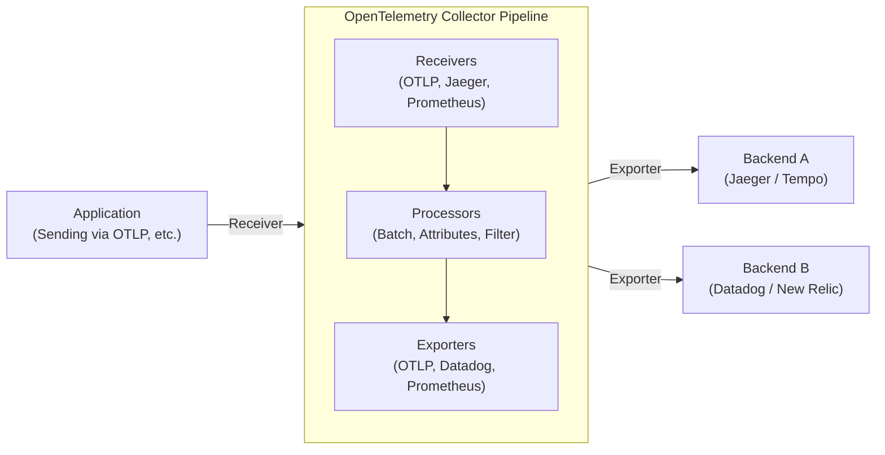

Modern software architectures like microservices and serverless distributed systems are no longer special. However, while systems become decentralized and easier to scale out, a single request is now processed across multiple services, making it extremely difficult to accurately grasp the "now" of the system and identify the root cause when problems occur.

Against this background, the concept of "Observability" has gained importance. And the standard framework for realizing this observability that is currently sweeping the industry is **OpenTelemetry** (OTel).

In this article, we will provide a technical explanation for deeply understanding OpenTelemetry, ranging from the historical background of distributed tracing, the integration of the three pillars of observability (logs, metrics, traces), the architecture of the OpenTelemetry Collector, context propagation using W3C Trace Context, to concrete instrumentation code examples in Python and Go.

## 1. Historical Background of Distributed Tracing: From Dapper to OpenTelemetry

Looking back at the history leading up to the birth of OpenTelemetry is very useful for understanding why this project is so important.

### 1.1 The Impact of the Google Dapper Paper
The concept of "Distributed Tracing" for the purpose of analyzing performance and troubleshooting distributed systems became widely known with the publication of the paper **"Dapper, a Large-Scale Distributed Systems Tracing Infrastructure"** by Google in 2010.

Dapper was an infrastructure for tracking requests flowing through Google's massive internal microservices with minimal overhead. This paper presented the following important concepts:
- **Trace**: The overall flow of processing for a single request.
- **Span**: Individual units of work that make up a trace (for example, queries to a database or external API calls).
- **Context Propagation**: The mechanism of propagating request IDs and span IDs across network boundaries.

Dapper's concepts heavily influenced later open-source projects (such as Twitter's Zipkin and Uber's Jaeger).

### 1.2 The Rise of OpenTracing and OpenCensus
Following the Dapper paper, various tracing tools emerged, but because each had its own unique APIs and data formats, developers faced the problem of vendor lock-in to specific vendors (Datadog, New Relic, AWS X-Ray, etc.) or tools.

To solve this problem, two major open-source projects were born:
1. **OpenTracing**: A project hosted by CNCF (Cloud Native Computing Foundation). It specialized in formulating vendor-neutral API specifications for distributed tracing.
2. **OpenCensus**: A project led by Google and Microsoft. It provided not only tracing but also metrics collection features, and offered libraries that could send data to various backends.

### 1.3 The Birth of OpenTelemetry
Both OpenTracing and OpenCensus became widely used, but their features overlapped, resulting in a fragmented community. Therefore, in 2019, **OpenTelemetry** was born to integrate these two projects and create a single standard.

Today, OpenTelemetry has grown into CNCF's second largest project after Kubernetes, becoming the de facto standard of the industry.

---

## 2. Integration of the Three Pillars of Observability

To achieve observability, data (telemetry data) is required to infer the internal state of the system from the outside. These are generally referred to as the "Three Pillars of Observability."

1. **Metrics**: 
   - A collection of numerical data indicating the state of the system (CPU usage, memory usage, request counts, error rates, etc.).
   - Ideal for long-term storage, trend analysis on dashboards, and triggering alerts.
2. **Logs**: 
   - Text or structured data recording individual events that occurred in the system.
   - Provides detailed context on "what happened."
3. **Traces**: 
   - Data indicating how a request was processed and which services it passed through in a distributed system.
   - Useful for identifying bottlenecks and understanding dependencies between services.

### The Value of Integration by OpenTelemetry
Previously, it was necessary to introduce separate agents and libraries for each pillar, such as Prometheus for metrics, Fluentd + Elasticsearch for logs, and Jaeger for traces.

OpenTelemetry **integrates the generation, collection, processing, and exporting of these "metrics, logs, and traces" with a single API / SDK / Collector**. This brings the following benefits:

- **Agent Integration**: There is no longer a need to load multiple libraries on the application side or deploy multiple agents on the infrastructure side.
- **Ensuring Correlation**: It becomes easy to embed trace IDs into logs or jump from specific error metrics to related traces.
- **Vendor Agnostic**: When changing the destination (backend) for data, there is no need to rewrite the application code; changing the configuration is sufficient.

---

## 3. W3C Trace Context and Context Propagation

The most important mechanism for traces to function in a distributed system is **Context Propagation**.

When Service A calls Service B, Service A must communicate to Service B the information about which trace (request) it is currently processing (trace ID and its own span ID). This allows Service B to recognize which larger process the received request is a part of and correctly associate telemetry data.

### W3C Trace Context
In the past, each tool used its own HTTP headers (e.g., `X-B3-TraceId`, `X-Amzn-Trace-Id`) to propagate context. This prevented interoperability between different tracing systems.

Therefore, the **W3C Trace Context** specification was standardized. OpenTelemetry uses this W3C Trace Context by default for context propagation.

W3C Trace Context primarily uses the following two HTTP headers:

1. **`traceparent` Header**: 
   - Encodes the trace ID, parent span ID, sampling flags, etc., as a single string.
   - Format Example: `00-4bf92f3577b34da6a3ce929d0e0e4736-00f067aa0ba902b7-01`
     - `00`: Version
     - `4bf92f3577b34da6a3ce929d0e0e4736`: Trace ID
     - `00f067aa0ba902b7`: Parent Span ID
     - `01`: Trace Flags (01 indicates it is sampled)
2. **`tracestate` Header**: 
   - An extension area for propagating vendor-specific trace information as key-value pairs.

OpenTelemetry libraries have the capability to automatically inject these headers when sending HTTP requests and extract them from headers when receiving requests.

---

## 4. OpenTelemetry Collector Architecture

The OpenTelemetry Collector is a vendor-neutral proxy/agent for receiving, processing, and exporting telemetry data (traces, metrics, logs). By introducing a Collector, you can aggregate data at the Collector rather than sending it directly from the application to the backend (like Datadog or New Relic).

The Collector has a pipeline architecture consisting mainly of the following three components:



### 4.1 Receiver
Has the role of receiving data from applications or other agents.
It supports both push-based (e.g., OTLP receiver, Jaeger receiver) and pull-based (e.g., Prometheus receiver, host metrics receiver) models.

### 4.2 Processor
Has the role of transforming, modifying, and filtering received data before exporting it.
- **Batch Processor**: Batches data by amount or time to reduce network overhead (this is a mandatory and recommended processor).
- **Attributes Processor**: Adds specific tags (environment name, version, etc.) to spans and metrics, or masks sensitive information (passwords, credit card numbers).
- **Memory Limiter Processor**: Drops data to prevent process crashes if the Collector's memory usage reaches a certain upper limit.

### 4.3 Exporter
Has the role of sending processed data to the backend (observability platform).
Since data can be sent from a single pipeline to multiple exporters, flexible routing such as "send metrics to Prometheus, and traces to both Jaeger and Datadog" can be achieved simply through configuration files.

---

## 5. Application Instrumentation

"Instrumentation" is required to generate telemetry data from an application. OpenTelemetry mainly offers two approaches:

1. **Auto-Instrumentation**:
   - Automatically injects instrumentation into standard libraries and frameworks (HTTP clients, database drivers, etc.) using language runtime agents (Java, Python, Node.js, etc.) or eBPF without changing the application code.
2. **Manual Instrumentation**:
   - Developers explicitly call the OpenTelemetry SDK API in the code to add custom spans and attributes specific to the business logic.

Here, let's look at implementation examples in Python and Go combining auto and manual instrumentation.

### 5.1 Instrumentation Example in Python

In Python, auto-instrumentation can be easily done using the `opentelemetry-instrument` command. Furthermore, here is an example of creating custom spans in the code.

```python
from opentelemetry import trace
from opentelemetry.sdk.trace import TracerProvider
from opentelemetry.sdk.trace.export import BatchSpanProcessor
from opentelemetry.exporter.otlp.proto.grpc.trace_exporter import OTLPSpanExporter
from opentelemetry.sdk.resources import Resource
import time
import random

# 1. Resource configuration (service name, etc.)
resource = Resource(attributes={
    "service.name": "python-payment-service",
    "service.version": "1.0.0"
})

# 2. TracerProvider initialization and configuration
provider = TracerProvider(resource=resource)
otlp_exporter = OTLPSpanExporter(endpoint="http://otel-collector:4317", insecure=True)
processor = BatchSpanProcessor(otlp_exporter)
provider.add_span_processor(processor)
trace.set_tracer_provider(provider)

# 3. Getting the tracer
tracer = trace.get_tracer(__name__)

def process_payment(user_id: str, amount: float):
    # Manually start a span
    with tracer.start_as_current_span("process_payment_task") as span:
        # Add attributes to the span
        span.set_attribute("payment.user_id", user_id)
        span.set_attribute("payment.amount", amount)
        
        try:
            # Simulate business logic
            time.sleep(random.uniform(0.1, 0.5))
            if amount > 10000:
                raise ValueError("Amount exceeds limit")
            
            span.add_event("Payment processed successfully")
            span.set_status(trace.StatusCode.OK)
            return True
            
        except Exception as e:
            # Record exception information in the span on error
            span.record_exception(e)
            span.set_status(trace.StatusCode.ERROR, str(e))
            raise

if __name__ == "__main__":
    try:
        process_payment("user-1234", 5000)
    except Exception:
        pass
```

For Python, auto-instrumentation plugins are provided for major libraries like Flask, FastAPI, and Requests, which can be seamlessly integrated with manual instrumentation.

### 5.2 Instrumentation Example in Go

Since Go (Golang) is a statically typed language, complete auto-instrumentation through magic (such as dynamic patching at runtime) like in Python is difficult, and it is necessary to explicitly pass around `context.Context` in the code. This makes the design highly conscious of "Context Propagation".

Below is an example in Go where a trace is started within an HTTP handler, and an internal function is called.

```go
package main

import (
	"context"
	"fmt"
	"log"
	"net/http"
	"time"

	"go.opentelemetry.io/otel"
	"go.opentelemetry.io/otel/attribute"
	"go.opentelemetry.io/otel/exporters/otlp/otlptrace/otlptracegrpc"
	"go.opentelemetry.io/otel/sdk/resource"
	sdktrace "go.opentelemetry.io/otel/sdk/trace"
	semconv "go.opentelemetry.io/otel/semconv/v1.17.0"
	"go.opentelemetry.io/otel/trace"
)

// Initialization function
func initProvider() (*sdktrace.TracerProvider, error) {
	ctx := context.Background()
	
	// Create OTLP exporter (Sends to Collector)
	exp, err := otlptracegrpc.New(ctx, otlptracegrpc.WithInsecure(), otlptracegrpc.WithEndpoint("otel-collector:4317"))
	if err != nil {
		return nil, err
	}

	res := resource.NewWithAttributes(
		semconv.SchemaURL,
		semconv.ServiceName("go-inventory-service"),
		semconv.ServiceVersion("1.0.0"),
	)

	tp := sdktrace.NewTracerProvider(
		sdktrace.WithBatcher(exp),
		sdktrace.WithResource(res),
	)
	
	// Set the global tracer provider
	otel.SetTracerProvider(tp)
	return tp, nil
}

func checkInventory(ctx context.Context, itemID string) error {
	// Get the tracer from the context and create a child span
	tracer := otel.Tracer("inventory-module")
	ctx, span := tracer.Start(ctx, "checkInventory_operation")
	defer span.End() // Close the span when the function ends

	span.SetAttributes(attribute.String("item.id", itemID))

	// Pseudo database query
	time.Sleep(200 * time.Millisecond)
	
	span.AddEvent("Inventory check completed")
	return nil
}

func inventoryHandler(w http.ResponseWriter, r *http.Request) {
	// Get the context from the HTTP request and create a root span
	tracer := otel.Tracer("http-server")
	ctx, span := tracer.Start(r.Context(), "HTTP GET /inventory")
	defer span.End()

	itemID := r.URL.Query().Get("id")
	if itemID == "" {
		span.SetStatus(trace.StatusCodeError, "missing item id")
		http.Error(w, "missing item id", http.StatusBadRequest)
		return
	}

	// Pass the context (ctx) to the internal function
	err := checkInventory(ctx, itemID)
	if err != nil {
		span.RecordError(err)
		span.SetStatus(trace.StatusCodeError, err.Error())
		http.Error(w, "internal error", http.StatusInternalServerError)
		return
	}

	span.SetStatus(trace.StatusCodeOk, "")
	w.WriteHeader(http.StatusOK)
	fmt.Fprintf(w, "Item %s is in stock", itemID)
}

func main() {
	tp, err := initProvider()
	if err != nil {
		log.Fatal(err)
	}
	// Flush pending spans when the application exits
	defer func() {
		if err := tp.Shutdown(context.Background()); err != nil {
			log.Fatal(err)
		}
	}()

	http.HandleFunc("/inventory", inventoryHandler)
	log.Println("Server listening on :8080")
	log.Fatal(http.ListenAndServe(":8080", nil))
}
```

The most important point in Go instrumentation is taking `ctx context.Context` as the first argument in the function signature and reliably passing it to the next function (Context Propagation). This connects multiple function calls as a single trace tree.

---

## 6. Best Practices and Operational Strategies in Introducing OpenTelemetry

OpenTelemetry is a powerful tool, but there are several challenges and considerations when introducing it into production environments.

### 6.1 Phased Implementation Approach
Trying to introduce all telemetry (metrics, logs, traces) to all services at once poses a high migration cost and risk of failure.
The recommended approach is to **"start with distributed tracing."** Metrics and logs often have existing foundations (Prometheus or the ELK stack) functioning, but tracing in a distributed system is the area that most directly benefits from OTel. After tracing is operating stably, it is best to migrate metrics, and finally logs (currently, the OTel logging specification is generally available and gaining adoption) in that order.

### 6.2 Sampling Strategy
In a high-traffic system, recording and sending all requests (100%) as traces will result in enormous network bandwidth and backend storage costs. There are mainly two methods for sampling strategies to prevent this:

- **Head-based Sampling**:
  - Decides whether to record the trace (e.g., with a 10% probability) at the start of the trace (when the first request is received).
  - It is easy to implement and has low overhead, but you cannot do things like "only retain requests where an error occurred without fail" (since it is unknown if it will be an error at the start).
- **Tail-based Sampling**:
  - A method where the decision is made on the Collector side after all request processing is complete.
  - Temporarily buffers the entire trace in memory, evaluates whether "an error is included" or "the processing time is unusually long," and then decides to send or discard it.
  - Can extract only high-value traces, but requires a lot of memory and high processing power (compute resources) on the Collector.

### 6.3 Collector Deployment Patterns
Collector deployments are broadly divided into the "Agent pattern" and the "Gateway pattern." It is common to operate by combining these.

1. **Agent Pattern**:
   - Deploys a small Collector to each node (e.g., as a DaemonSet in Kubernetes or within an EC2 instance).
   - The application only needs to constantly push data to `localhost`, reducing network complexity. It also plays a role in collecting host metrics (CPU/Memory).
2. **Gateway Pattern**:
   - Places a scalable cluster of Collectors independently in front of communications going outside the cluster.
   - Aggregates data sent from Agents here, performs tail-based sampling or scrubbing (filtering) of sensitive information, and then sends it to the final backend provider (SaaS).
   - This is superior from a security and operational standpoint because backend API key management and traffic control can be centralized in this layer.

---

## 7. Conclusion

OpenTelemetry is a critically important open standard for ensuring "Observability" in distributed systems. By eliminating vendor lock-in and seamlessly integrating the three telemetry data types of metrics, logs, and traces through a common specification (OTLP), it brings significant efficiency to troubleshooting and improved system transparency.

- **Historical Background**: Starting with Google Dapper, going through the integration of OpenTracing and OpenCensus, to becoming an industry standard.
- **Data Integration**: A centralized SDK on the application side and flexible data pipelines with the Collector.
- **Context Propagation**: Standardized header propagation through W3C Trace Context.
- **Instrumentation and Operations**: Key are a phased implementation, appropriate sampling design, and adopting a Gateway architecture.

For teams adopting a microservices architecture or considering a migration to one, an investment in OpenTelemetry should bring a very high ROI (Return on Investment) for future system operations. By all means, try starting OTel instrumentation from a small service in your own environment.
