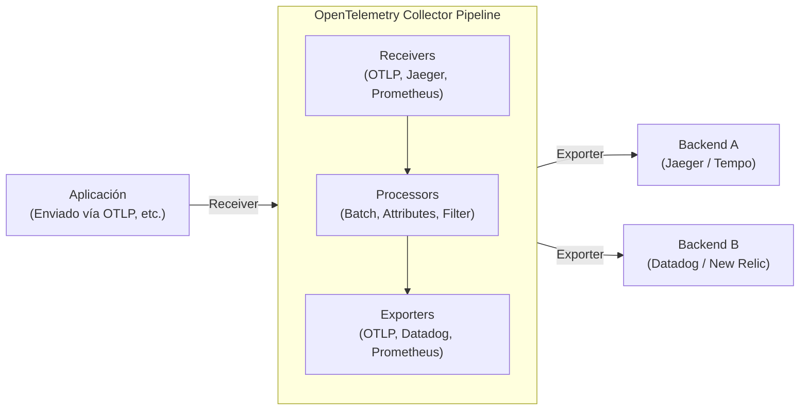

En la arquitectura de software moderna, los sistemas distribuidos como microservicios y serverless ya no son algo especial. Sin embargo, a medida que los sistemas se distribuyen y se vuelven más fáciles de escalar horizontalmente, una sola solicitud pasa a ser procesada a través de múltiples servicios, lo que hace extremadamente difícil comprender con precisión el "ahora" del sistema y, cuando ocurre un problema, identificar su causa raíz.

Ante estos antecedentes, el concepto de "Observabilidad (Observability)" ha cobrado gran importancia. Y como marco estándar para lograr dicha observabilidad, el que domina actualmente la industria es **OpenTelemetry** (abreviado: OTel).

En este artículo, ofreceremos una explicación técnica para comprender profundamente OpenTelemetry, abarcando desde los antecedentes históricos del rastreo distribuido (distributed tracing), la integración de los 3 pilares que componen la observabilidad (logs, métricas y trazas), la arquitectura de OpenTelemetry Collector, la propagación de contexto mediante W3C Trace Context, hasta llegar a ejemplos concretos de código de instrumentación en Python y Go.

## 1. Antecedentes históricos del rastreo distribuido: De Dapper a OpenTelemetry

Mirar atrás en la historia de cómo surgió OpenTelemetry es sumamente útil para comprender por qué este proyecto es tan importante.

### 1.1 El impacto del paper de Google Dapper
El concepto de "rastreo distribuido (Distributed Tracing)" con el objetivo de analizar el rendimiento y solucionar problemas en sistemas distribuidos se dio a conocer ampliamente a través del paper publicado por Google en 2010: **"Dapper, a Large-Scale Distributed Systems Tracing Infrastructure"**.

Dapper era una infraestructura para rastrear las solicitudes que fluían a través del gigantesco conjunto de microservicios dentro de Google, manteniendo la sobrecarga (overhead) al mínimo. En este artículo se presentaron conceptos clave como los siguientes:
- **Trace (Traza)**: El flujo completo de procesamiento a lo largo de una sola solicitud.
- **Span**: Unidades individuales de trabajo que componen una traza (por ejemplo, una consulta a la base de datos o una llamada a una API externa).
- **Context Propagation (Propagación de contexto)**: El mecanismo para propagar el ID de la solicitud o el ID del span a través de los límites de la red.

La filosofía de Dapper tuvo una enorme influencia en proyectos posteriores de código abierto (como Zipkin de Twitter y Jaeger de Uber).

### 1.2 El surgimiento de OpenTracing y OpenCensus
A partir del paper de Dapper, surgieron diversas herramientas de rastreo, pero como cada una tenía su propia API y formato de datos, los desarrolladores se enfrentaron al problema de quedar atados (vendor lock-in) a un proveedor específico (Datadog, New Relic, AWS X-Ray, etc.) o a una herramienta concreta.

Para resolver este problema, nacieron dos grandes proyectos de código abierto:
1. **OpenTracing**: Un proyecto alojado por la CNCF (Cloud Native Computing Foundation). Se especializaba en establecer una especificación de API neutral al proveedor para el rastreo distribuido.
2. **OpenCensus**: Un proyecto liderado por Google y Microsoft. No solo ofrecía rastreo, sino también funciones de recolección de métricas, proporcionando bibliotecas capaces de enviar datos a diversos backends.

### 1.3 El nacimiento de OpenTelemetry
Aunque tanto OpenTracing como OpenCensus llegaron a ser ampliamente utilizados, sus funcionalidades se superponían, lo que resultó en la fragmentación de la comunidad. Para unificar estos dos proyectos y crear un único estándar, nació en 2019 **OpenTelemetry**.

Actualmente, OpenTelemetry ha crecido hasta convertirse en un gigantesco proyecto de la CNCF, solo superado por Kubernetes, estableciéndose como el estándar de facto de la industria.

---

## 2. Integración de los 3 pilares de la observabilidad (Observability)

Para lograr la observabilidad, se necesitan datos (datos de telemetría) que permitan inferir el estado interno del sistema desde el exterior. A estos generalmente se les llama "Los 3 pilares de la observabilidad (Three Pillars of Observability)".

1. **Metrics (Métricas)**: 
   - Un conjunto de datos numéricos que indican el estado del sistema (uso de CPU, uso de memoria, cantidad de solicitudes, tasa de errores, etc.).
   - Son ideales para el almacenamiento a largo plazo, el análisis de tendencias en paneles de control (dashboards) y la emisión de alertas.
2. **Logs (Registros)**: 
   - Texto o datos estructurados que registran eventos individuales ocurridos en el sistema.
   - Proporcionan un contexto detallado sobre "qué sucedió".
3. **Traces (Trazas)**: 
   - Datos que muestran a través de qué servicios dentro del sistema distribuido pasó una solicitud y cómo fue procesada.
   - Son útiles para identificar cuellos de botella y comprender las dependencias entre servicios.

### El valor de la integración mediante OpenTelemetry
Hasta ahora, era necesario implementar diferentes agentes o bibliotecas para cada pilar; por ejemplo, Prometheus para métricas, Fluentd + Elasticsearch para logs, y Jaeger para trazas.

OpenTelemetry **integra la generación, recolección, procesamiento y exportación de estas "métricas, logs y trazas" en una sola API / SDK / Colector**. Esto genera las siguientes ventajas:

- **Unificación de agentes**: Ya no es necesario cargar múltiples bibliotecas en el lado de la aplicación ni desplegar múltiples agentes en la infraestructura.
- **Aseguramiento de la correlación (Correlation)**: Resulta más sencillo incrustar IDs de traza en los logs o saltar desde una métrica de error específica a la traza relacionada.
- **Independencia del proveedor**: Al cambiar el destino (backend) al que se envían los datos, ya no es necesario reescribir el código de la aplicación; basta con modificar la configuración.

---

## 3. W3C Trace Context y la propagación de contexto

El mecanismo más importante para que el rastreo funcione en un sistema distribuido es la **propagación de contexto (Context Propagation)**.

Cuando el Servicio A llama al Servicio B, el Servicio A necesita informarle al Servicio B en qué traza (solicitud) está trabajando actualmente (su ID de traza o su propio ID de span). De este modo, el Servicio B puede reconocer de qué gran proceso forma parte la solicitud que ha recibido y vincular correctamente los datos de telemetría.

### W3C Trace Context
Antiguamente, cada herramienta utilizaba sus propios encabezados HTTP (ej. `X-B3-TraceId`, `X-Amzn-Trace-Id`, etc.) para propagar el contexto. Esto impedía mantener la interoperabilidad entre diferentes sistemas de rastreo.

Por ello, se estandarizó la especificación **W3C Trace Context**. OpenTelemetry utiliza de forma predeterminada este W3C Trace Context para realizar la propagación del contexto.

W3C Trace Context utiliza principalmente los dos siguientes encabezados HTTP:

1. **Encabezado `traceparent`**: 
   - Codifica el ID de la traza, el ID del span padre y los indicadores (flags) de muestreo como una sola cadena de texto.
   - Ejemplo de formato: `00-4bf92f3577b34da6a3ce929d0e0e4736-00f067aa0ba902b7-01`
     - `00`: Versión
     - `4bf92f3577b34da6a3ce929d0e0e4736`: Trace ID
     - `00f067aa0ba902b7`: Parent Span ID
     - `01`: Trace Flags (`01` indica que se realiza el muestreo)
2. **Encabezado `tracestate`**: 
   - Una zona de extensión para propagar información de rastreo específica del proveedor en forma de pares clave-valor (Key-Value).

Las bibliotecas de OpenTelemetry tienen la capacidad de inyectar (Inject) estos encabezados automáticamente al enviar una solicitud HTTP, y de extraerlos (Extract) al recibir una solicitud.

---

## 4. Arquitectura de OpenTelemetry Collector

El OpenTelemetry Collector es un proxy/agente neutral respecto al proveedor diseñado para recibir, procesar y exportar datos de telemetría (trazas, métricas y logs). Al introducir el Collector, en lugar de enviar los datos directamente desde la aplicación hacia el backend (como Datadog o New Relic), se pueden centralizar en él.

El Collector posee una arquitectura de pipeline compuesta principalmente por los 3 componentes siguientes.



### 4.1 Receiver (Receptor)
Tiene la función de recibir datos provenientes de la aplicación o de otros agentes.
Soporta tanto modelos basados en push (ej. OTLP Receiver, Jaeger Receiver) como modelos basados en pull (ej. Prometheus Receiver, Host Metrics Receiver).

### 4.2 Processor (Procesador)
Tiene el rol de transformar, modificar o filtrar los datos recibidos antes de exportarlos.
- **Batch Processor**: Agrupa los datos en lotes basándose en una cantidad o un tiempo determinados, reduciendo la sobrecarga de la red (es un procesador obligatorio y recomendado).
- **Attributes Processor**: Añade etiquetas específicas (como el nombre del entorno o la versión) a los spans y métricas, u oculta (mask) información confidencial (como contraseñas o números de tarjetas de crédito).
- **Memory Limiter Processor**: Si el uso de memoria del Collector alcanza un límite máximo, descarta datos para prevenir que el proceso colapse.

### 4.3 Exporter (Exportador)
Tiene la responsabilidad de enviar los datos procesados al backend (infraestructura de observabilidad).
Dado que es posible enviar datos a múltiples exportadores desde un mismo pipeline, se puede lograr fácilmente, solo mediante archivos de configuración, un enrutamiento flexible como: "enviar las métricas a Prometheus y las trazas tanto a Jaeger como a Datadog".

---

## 5. Instrumentación de la aplicación (Instrumentation)

Para generar datos de telemetría desde una aplicación, se requiere de "Instrumentación (Instrumentation)". En OpenTelemetry existen principalmente 2 enfoques.

1. **Instrumentación automática (Auto-Instrumentation)**:
   - Sin necesidad de modificar el código de la aplicación, integra automáticamente la instrumentación en las bibliotecas estándar y frameworks (clientes HTTP, controladores de bases de datos, etc.) utilizando agentes del entorno de ejecución del lenguaje (Java, Python, Node.js, etc.) o mediante eBPF.
2. **Instrumentación manual (Manual Instrumentation)**:
   - El desarrollador llama explícitamente a la API del SDK de OpenTelemetry dentro del código y añade spans personalizados o atributos (Attributes) especializados en la lógica de negocio.

A continuación, veremos ejemplos de implementación en Python y Go combinando la instrumentación automática con la manual.

### 5.1 Ejemplo de instrumentación en Python

En Python, la instrumentación automática se puede realizar fácilmente utilizando el comando `opentelemetry-instrument`. Además, a continuación se muestra un ejemplo de cómo crear un span personalizado dentro del código.

```python
from opentelemetry import trace
from opentelemetry.sdk.trace import TracerProvider
from opentelemetry.sdk.trace.export import BatchSpanProcessor
from opentelemetry.exporter.otlp.proto.grpc.trace_exporter import OTLPSpanExporter
from opentelemetry.sdk.resources import Resource
import time
import random

# 1. Configuración de recursos (nombre del servicio, etc.)
resource = Resource(attributes={
    "service.name": "python-payment-service",
    "service.version": "1.0.0"
})

# 2. Inicialización y configuración del TracerProvider
provider = TracerProvider(resource=resource)
otlp_exporter = OTLPSpanExporter(endpoint="http://otel-collector:4317", insecure=True)
processor = BatchSpanProcessor(otlp_exporter)
provider.add_span_processor(processor)
trace.set_tracer_provider(provider)

# 3. Obtención del Tracer
tracer = trace.get_tracer(__name__)

def process_payment(user_id: str, amount: float):
    # Iniciar un span manualmente
    with tracer.start_as_current_span("process_payment_task") as span:
        # Añadir atributos al span
        span.set_attribute("payment.user_id", user_id)
        span.set_attribute("payment.amount", amount)
        
        try:
            # Simulación de la lógica de negocio
            time.sleep(random.uniform(0.1, 0.5))
            if amount > 10000:
                raise ValueError("Amount exceeds limit")
            
            span.add_event("Payment processed successfully")
            span.set_status(trace.StatusCode.OK)
            return True
            
        except Exception as e:
            # Registrar información de la excepción en el span en caso de error
            span.record_exception(e)
            span.set_status(trace.StatusCode.ERROR, str(e))
            raise

if __name__ == "__main__":
    try:
        process_payment("user-1234", 5000)
    except Exception:
        pass
```

Para Python, existen plugins de instrumentación automática para las bibliotecas principales como Flask, FastAPI o Requests, que se pueden integrar sin problemas con la instrumentación manual.

### 5.2 Ejemplo de instrumentación en Go

Dado que Go (Golang) es un lenguaje de tipado estático, es difícil lograr una instrumentación totalmente automática mediante "magia" (como parches dinámicos en tiempo de ejecución) como ocurre en Python. Por ello, es necesario arrastrar explícitamente el `context.Context` en el código. Esto crea un diseño que nos hace ser muy conscientes de la propagación de contexto ("Context Propagation").

El siguiente es un ejemplo en Go donde se inicia una traza dentro de un manejador (handler) HTTP y se llama a una función interna.

```go
package main

import (
	"context"
	"fmt"
	"log"
	"net/http"
	"time"

	"go.opentelemetry.io/otel"
	"go.opentelemetry.io/otel/attribute"
	"go.opentelemetry.io/otel/exporters/otlp/otlptrace/otlptracegrpc"
	"go.opentelemetry.io/otel/sdk/resource"
	sdktrace "go.opentelemetry.io/otel/sdk/trace"
	semconv "go.opentelemetry.io/otel/semconv/v1.17.0"
	"go.opentelemetry.io/otel/trace"
)

// Función de inicialización
func initProvider() (*sdktrace.TracerProvider, error) {
	ctx := context.Background()
	
	// Creación del exportador OTLP (envío al Collector)
	exp, err := otlptracegrpc.New(ctx, otlptracegrpc.WithInsecure(), otlptracegrpc.WithEndpoint("otel-collector:4317"))
	if err != nil {
		return nil, err
	}

	res := resource.NewWithAttributes(
		semconv.SchemaURL,
		semconv.ServiceName("go-inventory-service"),
		semconv.ServiceVersion("1.0.0"),
	)

	tp := sdktrace.NewTracerProvider(
		sdktrace.WithBatcher(exp),
		sdktrace.WithResource(res),
	)
	
	// Establecer el proveedor de Tracer global
	otel.SetTracerProvider(tp)
	return tp, nil
}

func checkInventory(ctx context.Context, itemID string) error {
	// Obtener el tracer desde el contexto y crear un span hijo
	tracer := otel.Tracer("inventory-module")
	ctx, span := tracer.Start(ctx, "checkInventory_operation")
	defer span.End() // Finalizar el span cuando acabe la función

	span.SetAttributes(attribute.String("item.id", itemID))

	// Consulta a la base de datos simulada
	time.Sleep(200 * time.Millisecond)
	
	span.AddEvent("Inventory check completed")
	return nil
}

func inventoryHandler(w http.ResponseWriter, r *http.Request) {
	// Obtener el contexto de la solicitud HTTP y crear un span raíz
	tracer := otel.Tracer("http-server")
	ctx, span := tracer.Start(r.Context(), "HTTP GET /inventory")
	defer span.End()

	itemID := r.URL.Query().Get("id")
	if itemID == "" {
		span.SetStatus(trace.StatusCodeError, "missing item id")
		http.Error(w, "missing item id", http.StatusBadRequest)
		return
	}

	// Arrastrar el contexto (ctx) hacia la función interna
	err := checkInventory(ctx, itemID)
	if err != nil {
		span.RecordError(err)
		span.SetStatus(trace.StatusCodeError, err.Error())
		http.Error(w, "internal error", http.StatusInternalServerError)
		return
	}

	span.SetStatus(trace.StatusCodeOk, "")
	w.WriteHeader(http.StatusOK)
	fmt.Fprintf(w, "Item %s is in stock", itemID)
}

func main() {
	tp, err := initProvider()
	if err != nil {
		log.Fatal(err)
	}
	// Vaciar los spans pendientes al finalizar la aplicación
	defer func() {
		if err := tp.Shutdown(context.Background()); err != nil {
			log.Fatal(err)
		}
	}()

	http.HandleFunc("/inventory", inventoryHandler)
	log.Println("Server listening on :8080")
	log.Fatal(http.ListenAndServe(":8080", nil))
}
```

El punto más importante en la instrumentación en Go es recibir un `ctx context.Context` como primer argumento en la firma de la función, y asegurarse de pasarlo a la siguiente función (Context Propagation). De esta forma, múltiples llamadas a funciones se concatenan como un único árbol de traza.

---

## 6. Mejores prácticas y estrategias operativas para implementar OpenTelemetry

OpenTelemetry es una herramienta poderosa, pero al introducirla en un entorno de producción surgen ciertos desafíos y consideraciones.

### 6.1 Enfoque de implementación gradual
Intentar implementar toda la telemetría (métricas, logs y trazas) en todos los servicios a la vez conlleva un alto costo de migración y el riesgo de fracasar.
El enfoque recomendado es **"empezar primero con el rastreo distribuido"**. Para métricas y logs, a menudo ya existe una infraestructura en funcionamiento (como Prometheus o el stack ELK), pero el rastreo en sistemas distribuidos es el área que recibe beneficios más directos de OTel. Una vez que las trazas funcionen de manera estable, lo mejor es migrar las métricas y finalmente los logs (actualmente, las especificaciones de registro de OTel han alcanzado GA y su adopción está avanzando).

### 6.2 Estrategia de muestreo (Sampling Strategy)
En sistemas con mucho tráfico, si se registra y envía el 100% de las solicitudes como trazas, los costos de ancho de banda y de almacenamiento en el backend se vuelven enormes. Para prevenir esto, existen principalmente dos estrategias de muestreo.

- **Head-based Sampling (Muestreo basado en el inicio)**:
  - En el punto de inicio de la traza (cuando se recibe la primera solicitud), se decide si se registrará o no la traza (por ejemplo: probabilidad de registrar del 10%).
  - Es fácil de implementar y tiene poca sobrecarga, pero es imposible "conservar únicamente las solicitudes en las que ocurrió un error" (puesto que en el momento inicial no se sabe si fallará).
- **Tail-based Sampling (Muestreo basado en el final)**:
  - En este método, la decisión se toma del lado del Collector una vez que se ha completado todo el procesamiento de la solicitud.
  - La traza completa se almacena temporalmente en el búfer de memoria, y se evalúa "si contiene errores" o "si el tiempo de procesamiento fue inusualmente largo" antes de decidir si se envía o se descarta.
  - Permite extraer solo las trazas de alto valor, pero requiere que el Collector disponga de mucha memoria y alta capacidad de procesamiento (recursos computacionales).

### 6.3 Patrones de despliegue del Collector
Los despliegues del Collector se dividen a grandes rasgos en "Patrón Agent (Agente)" y "Patrón Gateway (Puerta de enlace)". Es común operar combinando ambos.

1. **Patrón Agent**:
   - Se despliega un Collector de pequeña escala en cada nodo (ej. como DaemonSet en Kubernetes o dentro de una instancia EC2).
   - Como la aplicación solo necesita enviar los datos (push) a `localhost`, se reduce la complejidad de la red. También asume el rol de recolectar métricas del host (CPU/memoria).
2. **Patrón Gateway**:
   - Se sitúa un clúster de Collectors escalable de forma independiente antes de que ocurra la comunicación hacia fuera del clúster (hacia el exterior).
   - Los datos enviados desde los Agents se agrupan aquí y, tras realizar un muestreo Tail-based y la limpieza (filtrado) de información confidencial, se envían finalmente al proveedor backend (SaaS).
   - Es excelente desde el punto de vista de seguridad y operaciones, ya que permite centralizar la gestión de las claves de API del backend y el control de tráfico en esta capa.

---

## 7. Conclusión

OpenTelemetry es un estándar abierto de extrema importancia para garantizar la "Observabilidad (Observability)" en sistemas distribuidos. Al eliminar el bloqueo de proveedores (vendor lock-in) e integrar de manera perfecta los tres tipos de datos de telemetría (métricas, logs y trazas) mediante una especificación común (OTLP), proporciona una enorme mejora en la eficiencia de investigación de fallos y una mayor transparencia del sistema.

- **Antecedentes históricos**: Comenzó con Google Dapper, pasó por la fusión de OpenTracing y OpenCensus, hasta convertirse en un estándar de la industria.
- **Integración de datos**: SDK unificado del lado de la aplicación y pipelines de datos flexibles a través del Collector.
- **Propagación de contexto**: Propagación estandarizada de encabezados a través de W3C Trace Context.
- **Instrumentación y operaciones**: La clave está en una introducción gradual, un diseño de muestreo adecuado y la adopción de una arquitectura Gateway.

Para los equipos que han adoptado la arquitectura de microservicios, o aquellos que están considerando migrar a ella, la inversión en OpenTelemetry sin duda proporcionará un altísimo ROI (Retorno de Inversión) en las futuras operaciones de sus sistemas. Les invitamos a que comiencen a instrumentar OTel en sus entornos locales, empezando por los servicios más pequeños.
