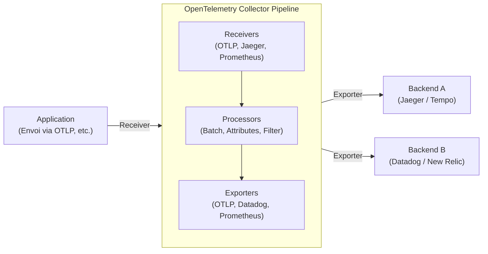

Dans l'architecture logicielle moderne, les systèmes distribués tels que les microservices et le serverless ne sont plus des exceptions. Cependant, bien que la décentralisation facilite la mise à l'échelle (scale-out) des systèmes, le fait qu'une seule requête soit traitée par de multiples services rend extrêmement difficile de connaître précisément l'état actuel ("maintenant") du système et d'identifier la cause première lorsqu'un problème survient.

Dans ce contexte, le concept d'"Observabilité" (Observability) a pris une importance capitale. Et pour concrétiser cette observabilité, c'est **OpenTelemetry** (souvent abrégé OTel) qui domine aujourd'hui l'industrie en tant que framework standard.

Cet article propose une explication technique approfondie pour comprendre OpenTelemetry, allant du contexte historique du traçage distribué à l'intégration des trois piliers de l'observabilité (logs, métriques, traces), en passant par l'architecture de l'OpenTelemetry Collector, la propagation de contexte avec W3C Trace Context, jusqu'à des exemples concrets de code d'instrumentation en Python et Go.

## 1. Contexte historique du traçage distribué : De Dapper à OpenTelemetry

Retracer l'histoire jusqu'à la naissance d'OpenTelemetry est extrêmement utile pour comprendre pourquoi ce projet est si important.

### 1.1 Le choc de l'article sur Google Dapper
Le concept de "Traçage Distribué" (Distributed Tracing), visant l'analyse des performances et le dépannage des systèmes distribués, a été largement popularisé par l'article de Google publié en 2010 intitulé **"Dapper, a Large-Scale Distributed Systems Tracing Infrastructure"**.

Dapper était une infrastructure permettant de suivre les requêtes circulant à travers l'immense flotte de microservices de Google, tout en minimisant la surcharge (overhead). Cet article a introduit des concepts clés :
- **Trace** : Le flux de traitement complet à travers l'ensemble d'une requête.
- **Span** : Chaque unité de travail individuelle constituant une trace (par exemple, une requête à une base de données ou un appel à une API externe).
- **Context Propagation (Propagation de contexte)** : Le mécanisme permettant de propager l'ID de requête (Request ID) ou l'ID de span à travers les frontières du réseau.

Les concepts de Dapper ont eu une influence considérable sur les projets open source ultérieurs (comme Zipkin de Twitter ou Jaeger d'Uber).

### 1.2 L'essor d'OpenTracing et OpenCensus
Après l'article sur Dapper, divers outils de traçage sont apparus. Cependant, comme chacun possédait sa propre API et son propre format de données, les développeurs étaient confrontés au problème d'enfermement propriétaire (vendor lock-in) avec des fournisseurs spécifiques (Datadog, New Relic, AWS X-Ray, etc.) ou certains outils.

Pour résoudre ce problème, deux grands projets open source ont vu le jour :
1. **OpenTracing** : Un projet hébergé par la CNCF (Cloud Native Computing Foundation). Il se concentrait sur la définition d'une spécification d'API indépendante des fournisseurs pour le traçage distribué.
2. **OpenCensus** : Un projet dirigé par Google et Microsoft. En plus du traçage, il offrait des capacités de collecte de métriques et fournissait des bibliothèques capables d'envoyer des données à divers backends.

### 1.3 La naissance d'OpenTelemetry
Bien qu'OpenTracing et OpenCensus aient tous deux été largement utilisés, leurs fonctionnalités se chevauchaient, ce qui a entraîné une fragmentation de la communauté. Ainsi, pour fusionner ces deux projets et créer un standard unique, **OpenTelemetry** est né en 2019.

Aujourd'hui, OpenTelemetry s'est développé pour devenir le plus grand projet de la CNCF après Kubernetes, s'imposant comme le standard de facto de l'industrie.

---

## 2. Intégration des 3 piliers de l'Observabilité (Observability)

Pour atteindre l'observabilité, il est nécessaire de disposer de données (données de télémétrie) permettant de déduire l'état interne du système depuis l'extérieur. Celles-ci sont généralement appelées les "Trois piliers de l'observabilité" (Three Pillars of Observability).

1. **Metrics (Métriques)** : 
   - Un ensemble de données numériques indiquant l'état du système (utilisation du processeur, utilisation de la mémoire, nombre de requêtes, taux d'erreur, etc.).
   - Idéal pour le stockage à long terme, l'analyse des tendances sur des tableaux de bord et le déclenchement d'alertes.
2. **Logs** : 
   - Des textes ou des données structurées enregistrant les événements individuels survenus dans le système.
   - Fournissent le contexte détaillé de "ce qui s'est passé".
3. **Traces** : 
   - Des données montrant comment une requête a été traitée et quels services elle a traversés dans le système distribué.
   - Utiles pour identifier les goulots d'étranglement et comprendre les dépendances entre les services.

### La valeur de l'intégration par OpenTelemetry
Auparavant, il fallait introduire des agents et des bibliothèques distincts pour chaque pilier, par exemple Prometheus pour les métriques, Fluentd + Elasticsearch pour les logs, et Jaeger pour les traces.

OpenTelemetry **intègre la génération, la collecte, le traitement et l'exportation de ces "métriques, logs et traces" dans une seule API / un seul SDK / un seul collecteur**. Cela offre les avantages suivants :

- **Consolidation des agents** : Plus besoin de charger plusieurs bibliothèques côté application ni de déployer de multiples agents côté infrastructure.
- **Garantie de la corrélation (Correlation)** : Il devient facile d'intégrer des ID de trace dans les logs ou de passer d'une métrique d'erreur spécifique à la trace associée.
- **Indépendance vis-à-vis des fournisseurs (Vendor Agnostic)** : Lors du changement de la destination des données (backend), il n'est plus nécessaire de réécrire le code de l'application, une simple modification de la configuration suffit.

---

## 3. W3C Trace Context et propagation de contexte

Dans un système distribué, le mécanisme le plus important pour faire fonctionner le traçage est la **propagation de contexte (Context Propagation)**.

Lorsque le Service A appelle le Service B, le Service A doit transmettre au Service B des informations sur la trace (requête) qu'il traite actuellement (comme l'ID de trace et son propre ID de span). Cela permet au Service B de reconnaître à quel grand processus appartient la requête reçue, et de lier correctement les données de télémétrie.

### W3C Trace Context
Autrefois, chaque outil utilisait ses propres en-têtes HTTP (ex: `X-B3-TraceId`, `X-Amzn-Trace-Id`, etc.) pour propager le contexte. Cela empêchait l'interopérabilité entre les différents systèmes de traçage.

C'est pourquoi la spécification **W3C Trace Context** a été standardisée. Par défaut, OpenTelemetry utilise ce W3C Trace Context pour la propagation du contexte.

Le W3C Trace Context utilise principalement les deux en-têtes HTTP suivants :

1. **En-tête `traceparent`** : 
   - Encode l'ID de trace, l'ID du span parent, les drapeaux d'échantillonnage (sampling flags), etc., en une seule chaîne de caractères.
   - Exemple de format : `00-4bf92f3577b34da6a3ce929d0e0e4736-00f067aa0ba902b7-01`
     - `00` : Version
     - `4bf92f3577b34da6a3ce929d0e0e4736` : Trace ID
     - `00f067aa0ba902b7` : Parent Span ID
     - `01` : Trace Flags (01 indique que la trace est échantillonnée)
2. **En-tête `tracestate`** : 
   - Une zone d'extension permettant de propager des informations de traçage spécifiques au fournisseur sous forme de paires clé-valeur (Key-Value).

Les bibliothèques d'OpenTelemetry possèdent la fonctionnalité d'injecter (Inject) automatiquement ces en-têtes lors de l'envoi d'une requête HTTP, et de les extraire (Extract) à partir des en-têtes lors de la réception d'une requête.

---

## 4. L'architecture de l'OpenTelemetry Collector

L'OpenTelemetry Collector est un proxy/agent neutre vis-à-vis des fournisseurs permettant de recevoir, traiter et exporter les données de télémétrie (traces, métriques, logs). L'introduction du Collector permet d'agréger les données avant de les envoyer, plutôt que de les envoyer directement de l'application vers un backend (comme Datadog ou New Relic).

Le Collector possède une architecture de pipeline principalement composée des 3 éléments suivants :



### 4.1 Receiver (Récepteur)
Il a pour rôle de recevoir les données depuis les applications ou d'autres agents.
Il prend en charge à la fois le modèle push (ex: OTLP receiver, Jaeger receiver) et le modèle pull (ex: Prometheus receiver, host metrics receiver).

### 4.2 Processor (Processeur)
Il a pour rôle de transformer, modifier ou filtrer les données reçues avant de les exporter.
- **Batch Processor** : Regroupe les données par lots selon un volume ou un intervalle de temps, réduisant ainsi la surcharge réseau (c'est un processeur requis et recommandé).
- **Attributes Processor** : Ajoute des balises spécifiques (comme le nom de l'environnement ou la version) aux spans et métriques, ou masque des informations sensibles (mots de passe, numéros de carte de crédit).
- **Memory Limiter Processor** : Protège le processus contre les plantages en supprimant (dropping) des données lorsque l'utilisation de la mémoire du Collector atteint une certaine limite.

### 4.3 Exporter (Exportateur)
Il a pour rôle d'envoyer les données traitées vers un backend (plateforme d'observabilité).
Puisqu'un seul pipeline peut envoyer des données à de multiples exportateurs, il est possible de configurer un routage flexible, comme par exemple "envoyer les métriques à Prometheus, et les traces à la fois à Jaeger et Datadog", le tout via un simple fichier de configuration.

---

## 5. Instrumentation de l'application (Instrumentation)

Pour générer des données de télémétrie à partir d'une application, l'"Instrumentation" est nécessaire. OpenTelemetry propose principalement deux approches.

1. **Instrumentation automatique (Auto-Instrumentation)** :
   - Intègre automatiquement l'instrumentation dans les bibliothèques standards et les frameworks (clients HTTP, pilotes de base de données, etc.) sans modifier le code de l'application, en utilisant des agents d'exécution du langage (Java, Python, Node.js, etc.) ou eBPF.
2. **Instrumentation manuelle (Manual Instrumentation)** :
   - Les développeurs appellent explicitement l'API du SDK OpenTelemetry dans leur code pour ajouter des spans personnalisés et des attributs (Attributes) spécifiques à leur logique métier.

Regardons ici des exemples d'implémentation en Python et Go combinant instrumentation automatique et manuelle.

### 5.1 Exemple d'instrumentation en Python

En Python, l'instrumentation automatique est facilitée par l'utilisation de la commande `opentelemetry-instrument`. L'exemple suivant montre en outre comment créer des spans personnalisés dans le code.

```python
from opentelemetry import trace
from opentelemetry.sdk.trace import TracerProvider
from opentelemetry.sdk.trace.export import BatchSpanProcessor
from opentelemetry.exporter.otlp.proto.grpc.trace_exporter import OTLPSpanExporter
from opentelemetry.sdk.resources import Resource
import time
import random

# 1. Configuration des ressources (nom du service, etc.)
resource = Resource(attributes={
    "service.name": "python-payment-service",
    "service.version": "1.0.0"
})

# 2. Initialisation et configuration du TracerProvider
provider = TracerProvider(resource=resource)
otlp_exporter = OTLPSpanExporter(endpoint="http://otel-collector:4317", insecure=True)
processor = BatchSpanProcessor(otlp_exporter)
provider.add_span_processor(processor)
trace.set_tracer_provider(provider)

# 3. Obtention du traceur
tracer = trace.get_tracer(__name__)

def process_payment(user_id: str, amount: float):
    # Démarrage manuel d'un span
    with tracer.start_as_current_span("process_payment_task") as span:
        # Ajout d'attributs au span
        span.set_attribute("payment.user_id", user_id)
        span.set_attribute("payment.amount", amount)
        
        try:
            # Simulation d'une logique métier
            time.sleep(random.uniform(0.1, 0.5))
            if amount > 10000:
                raise ValueError("Amount exceeds limit")
            
            span.add_event("Payment processed successfully")
            span.set_status(trace.StatusCode.OK)
            return True
            
        except Exception as e:
            # Enregistrement des informations de l'exception dans le span en cas d'erreur
            span.record_exception(e)
            span.set_status(trace.StatusCode.ERROR, str(e))
            raise

if __name__ == "__main__":
    try:
        process_payment("user-1234", 5000)
    except Exception:
        pass
```

Dans le cas de Python, des plugins d'instrumentation automatique sont fournis pour les bibliothèques majeures telles que Flask, FastAPI ou Requests, permettant de les intégrer de manière transparente avec l'instrumentation manuelle.

### 5.2 Exemple d'instrumentation en Go

Comme Go (Golang) est un langage à typage statique, une instrumentation entièrement automatique via des méthodes magiques (comme le patching dynamique à l'exécution en Python) est difficile, et il est nécessaire de faire transiter explicitement `context.Context` dans le code. Cela nécessite une grande attention portée à la "Propagation de Contexte" (Context Propagation).

Voici un exemple en Go montrant le démarrage d'une trace dans un gestionnaire (handler) HTTP et l'appel d'une fonction interne.

```go
package main

import (
	"context"
	"fmt"
	"log"
	"net/http"
	"time"

	"go.opentelemetry.io/otel"
	"go.opentelemetry.io/otel/attribute"
	"go.opentelemetry.io/otel/exporters/otlp/otlptrace/otlptracegrpc"
	"go.opentelemetry.io/otel/sdk/resource"
	sdktrace "go.opentelemetry.io/otel/sdk/trace"
	semconv "go.opentelemetry.io/otel/semconv/v1.17.0"
	"go.opentelemetry.io/otel/trace"
)

// Fonction d'initialisation
func initProvider() (*sdktrace.TracerProvider, error) {
	ctx := context.Background()
	
	// Création de l'exportateur OTLP (envoi vers le Collector)
	exp, err := otlptracegrpc.New(ctx, otlptracegrpc.WithInsecure(), otlptracegrpc.WithEndpoint("otel-collector:4317"))
	if err != nil {
		return nil, err
	}

	res := resource.NewWithAttributes(
		semconv.SchemaURL,
		semconv.ServiceName("go-inventory-service"),
		semconv.ServiceVersion("1.0.0"),
	)

	tp := sdktrace.NewTracerProvider(
		sdktrace.WithBatcher(exp),
		sdktrace.WithResource(res),
	)
	
	// Définition du fournisseur de traceur (tracer provider) global
	otel.SetTracerProvider(tp)
	return tp, nil
}

func checkInventory(ctx context.Context, itemID string) error {
	// Obtention du traceur depuis le contexte et création d'un span enfant
	tracer := otel.Tracer("inventory-module")
	ctx, span := tracer.Start(ctx, "checkInventory_operation")
	defer span.End() // Fermeture du span à la fin de la fonction

	span.SetAttributes(attribute.String("item.id", itemID))

	// Pseudo-requête à la base de données
	time.Sleep(200 * time.Millisecond)
	
	span.AddEvent("Inventory check completed")
	return nil
}

func inventoryHandler(w http.ResponseWriter, r *http.Request) {
	// Obtention du contexte depuis la requête HTTP et création du span racine (root)
	tracer := otel.Tracer("http-server")
	ctx, span := tracer.Start(r.Context(), "HTTP GET /inventory")
	defer span.End()

	itemID := r.URL.Query().Get("id")
	if itemID == "" {
		span.SetStatus(trace.StatusCodeError, "missing item id")
		http.Error(w, "missing item id", http.StatusBadRequest)
		return
	}

	// Transmission du contexte (ctx) à la fonction interne
	err := checkInventory(ctx, itemID)
	if err != nil {
		span.RecordError(err)
		span.SetStatus(trace.StatusCodeError, err.Error())
		http.Error(w, "internal error", http.StatusInternalServerError)
		return
	}

	span.SetStatus(trace.StatusCodeOk, "")
	w.WriteHeader(http.StatusOK)
	fmt.Fprintf(w, "Item %s is in stock", itemID)
}

func main() {
	tp, err := initProvider()
	if err != nil {
		log.Fatal(err)
	}
	// Vidage (flush) des spans en attente lors de l'arrêt de l'application
	defer func() {
		if err := tp.Shutdown(context.Background()); err != nil {
			log.Fatal(err)
		}
	}()

	http.HandleFunc("/inventory", inventoryHandler)
	log.Println("Server listening on :8080")
	log.Fatal(http.ListenAndServe(":8080", nil))
}
```

Le point le plus important dans l'instrumentation en Go est de recevoir `ctx context.Context` comme premier argument de la signature de la fonction et de s'assurer qu'il soit transmis à la fonction suivante (Context Propagation). Cela permet à de multiples appels de fonctions d'être liés en un seul arbre de trace (trace tree).

---

## 6. Bonnes pratiques et stratégies opérationnelles pour l'adoption d'OpenTelemetry

OpenTelemetry est un outil puissant, mais son introduction dans un environnement de production présente quelques défis et nécessite certaines considérations.

### 6.1 Approche d'adoption progressive
Tenter d'instrumenter d'un coup tous les services pour toutes les télémétries (métriques, logs, traces) risque d'entraîner des coûts de migration élevés et un fort risque d'échec.
L'approche recommandée est de **"commencer d'abord par le traçage distribué"**. Bien souvent, des infrastructures existantes (comme Prometheus ou la stack ELK) sont déjà fonctionnelles pour les métriques et les logs, mais c'est dans le domaine du traçage dans les systèmes distribués que l'on bénéficie le plus directement d'OTel. Une fois que le traçage est stable en production, il convient de migrer les métriques, puis enfin les logs (la spécification de journalisation d'OTel est désormais en disponibilité générale (GA) et se répand).

### 6.2 Stratégie d'échantillonnage (Sampling Strategy)
Dans les systèmes à fort trafic, enregistrer et envoyer 100 % des requêtes en tant que traces entraînerait des coûts de bande passante réseau et de stockage backend astronomiques. Pour éviter cela, il existe principalement deux méthodes d'échantillonnage.

- **Head-based Sampling (Échantillonnage en tête)** :
  - Dès le début de la trace (à la réception de la première requête), la décision d'enregistrer ou non cette trace (ex: 10 % de probabilité d'enregistrement) est prise.
  - C'est facile à mettre en œuvre et génère peu de surcharge, mais il est impossible de garantir que "seules les requêtes avec des erreurs soient conservées" (car on ne sait pas au départ si une erreur se produira).
- **Tail-based Sampling (Échantillonnage en fin)** :
  - La décision est prise du côté du Collector une fois que le traitement de la requête est entièrement terminé.
  - La trace complète est temporairement stockée en mémoire (buffer), évaluée pour vérifier "si elle contient une erreur" ou "si le temps de traitement est anormalement long", avant de décider de l'envoyer ou de la rejeter.
  - Permet d'extraire uniquement les traces à forte valeur ajoutée, mais nécessite beaucoup de mémoire et une forte puissance de traitement (ressources de calcul) côté Collector.

### 6.3 Modèles de déploiement du Collector
Le déploiement du Collector se divise généralement en deux catégories : le "modèle Agent" et le "modèle Gateway". En pratique, on combine souvent ces deux approches.

1. **Modèle Agent** :
   - Un petit Collector est déployé sur chaque nœud (ex: en tant que DaemonSet dans Kubernetes ou dans une instance EC2).
   - L'application n'a qu'à envoyer ses données en mode push à `localhost`, ce qui réduit la complexité du réseau. Il joue également le rôle de collecter les métriques de l'hôte (CPU/mémoire).
2. **Modèle Gateway** :
   - Un cluster indépendant et évolutif de Collectors est placé en amont de toute communication vers l'extérieur du cluster.
   - Les données envoyées par les Agents y sont agrégées. Des opérations telles que l'échantillonnage Tail-based et le nettoyage (scrubbing/filtrage) des données confidentielles y sont effectuées, avant d'envoyer les données au fournisseur backend final (SaaS).
   - D'un point de vue de la sécurité et des opérations, c'est très avantageux car la gestion des clés API du backend et le contrôle du trafic sont centralisés à ce niveau.

---

## 7. Conclusion

OpenTelemetry est un standard ouvert extrêmement important pour garantir l'"Observabilité" dans les systèmes distribués. En éliminant la dépendance vis-à-vis d'un seul fournisseur (vendor lock-in) et en intégrant de manière transparente les trois données de télémétrie que sont les métriques, les logs et les traces via une spécification commune (OTLP), il améliore grandement l'efficacité de l'investigation des pannes ainsi que la transparence du système.

- **Contexte historique** : Initié par Google Dapper, et devenu un standard de l'industrie suite à la fusion d'OpenTracing et OpenCensus.
- **Intégration des données** : Un SDK unifié côté application, et un pipeline de données flexible via le Collector.
- **Propagation de contexte** : Propagation standardisée des en-têtes grâce au W3C Trace Context.
- **Instrumentation et exploitation** : Une introduction progressive, une conception d'échantillonnage appropriée et l'adoption d'une architecture Gateway en sont les clés.

Pour les équipes qui adoptent ou envisagent de migrer vers une architecture en microservices, l'investissement dans OpenTelemetry offrira certainement un très bon retour sur investissement (ROI) pour les opérations futures du système. Nous vous encourageons à démarrer l'instrumentation avec OTel sur un petit service dans votre propre environnement.
