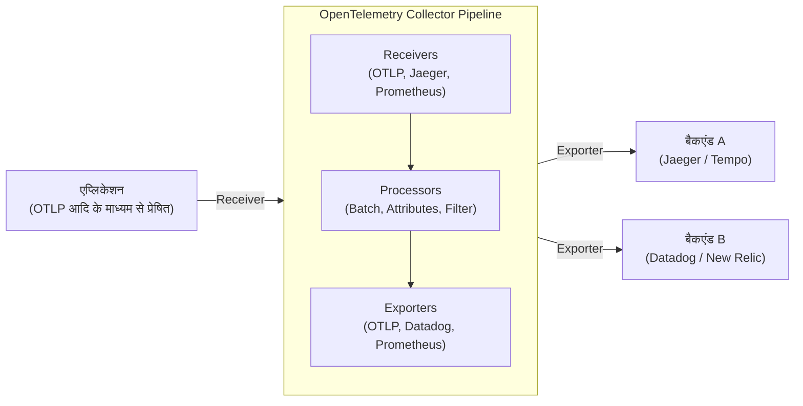

आधुनिक सॉफ्टवेयर आर्किटेक्चर में, माइक्रोसर्विसेज और सर्वरलेस जैसे डिस्ट्रिब्यूटेड (distributed) सिस्टम अब कोई असामान्य बात नहीं रह गए हैं। हालांकि, जबकि सिस्टम डिस्ट्रिब्यूटेड हो गए हैं और स्केल आउट करना आसान हो गया है, एक सिंगल रिक्वेस्ट अब कई सर्विसेज से होकर गुजरती है, जिससे सिस्टम की "वर्तमान" स्थिति को सटीक रूप से समझना और समस्या उत्पन्न होने पर उसके मूल कारण (root cause) का पता लगाना बहुत कठिन हो गया है।

इस पृष्ठभूमि के कारण, "ऑब्जर्वेबिलिटी (Observability)" की अवधारणा को महत्वपूर्ण माना जाने लगा है। और इस ऑब्जर्वेबिलिटी को प्राप्त करने के लिए एक मानक फ्रेमवर्क के रूप में, जो वर्तमान में उद्योग (industry) पर हावी है, वह **OpenTelemetry** (ओपनटेलीमेट्री, संक्षेप में: OTel) है।

इस लेख में, हम OpenTelemetry को गहराई से समझने के लिए एक तकनीकी व्याख्या प्रदान करेंगे, जो डिस्ट्रिब्यूटेड ट्रेसिंग (distributed tracing) की ऐतिहासिक पृष्ठभूमि से लेकर ऑब्जर्वेबिलिटी के 3 स्तंभों (लॉग, मेट्रिक्स, ट्रेस) के एकीकरण, OpenTelemetry Collector के आर्किटेक्चर, W3C Trace Context के माध्यम से कॉन्टेक्स्ट प्रोपेगेशन (context propagation), और Python व Go का उपयोग करके विशिष्ट इंस्ट्रूमेंटेशन (Instrumentation) के कोड उदाहरणों तक विस्तृत है।

## 1. डिस्ट्रिब्यूटेड ट्रेसिंग की ऐतिहासिक पृष्ठभूमि: Dapper से OpenTelemetry तक

OpenTelemetry के निर्माण के इतिहास को पीछे मुड़कर देखना यह समझने के लिए बहुत उपयोगी है कि यह प्रोजेक्ट इतना महत्वपूर्ण क्यों है।

### 1.1 Google Dapper पेपर का प्रभाव
डिस्ट्रिब्यूटेड सिस्टम के प्रदर्शन विश्लेषण (performance analysis) और ट्रबलशूटिंग के उद्देश्य से "डिस्ट्रिब्यूटेड ट्रेसिंग (Distributed Tracing)" की अवधारणा 2010 में Google द्वारा प्रकाशित पेपर **"Dapper, a Large-Scale Distributed Systems Tracing Infrastructure"** के माध्यम से व्यापक रूप से जानी जाने लगी।

Dapper एक ऐसा इंफ्रास्ट्रक्चर था जिसे Google के आंतरिक विशाल माइक्रोसर्विसेज के माध्यम से बहने वाले रिक्वेस्ट्स को न्यूनतम ओवरहेड के साथ ट्रैक करने के लिए डिज़ाइन किया गया था। इस पेपर में निम्नलिखित महत्वपूर्ण अवधारणाएं प्रस्तुत की गईं:
- **Trace (ट्रेस)**: एक संपूर्ण रिक्वेस्ट के दौरान प्रोसेसिंग का पूरा प्रवाह।
- **Span (स्पैन)**: ट्रेस को बनाने वाली व्यक्तिगत कार्य इकाइयां (उदाहरण के लिए, डेटाबेस क्वेरी या बाहरी API कॉल)।
- **Context Propagation (कॉन्टेक्स्ट प्रोपेगेशन)**: नेटवर्क सीमाओं के पार रिक्वेस्ट ID या स्पैन ID को प्रोपेगेट (प्रसारित) करने का तंत्र।

Dapper के विचारों का बाद के ओपन-सोर्स प्रोजेक्ट्स (जैसे Twitter का Zipkin और Uber का Jaeger) पर गहरा प्रभाव पड़ा।

### 1.2 OpenTracing और OpenCensus का उदय
Dapper पेपर के बाद, विभिन्न ट्रेसिंग टूल उभरे, लेकिन चूंकि प्रत्येक का अपना अनूठा API और डेटा फॉर्मेट था, इसलिए डेवलपर्स को विशिष्ट वेंडरों (जैसे Datadog, New Relic, AWS X-Ray, आदि) या टूल्स में लॉक-इन (lock-in) होने की समस्या का सामना करना पड़ा।

इस समस्या को हल करने के लिए, 2 प्रमुख ओपन-सोर्स प्रोजेक्ट्स का जन्म हुआ:
1. **OpenTracing**: CNCF (Cloud Native Computing Foundation) द्वारा होस्ट किया जाने वाला एक प्रोजेक्ट। यह डिस्ट्रिब्यूटेड ट्रेसिंग के लिए एक वेंडर-न्यूट्रल API स्पेसिफिकेशन बनाने पर केंद्रित था।
2. **OpenCensus**: Google और Microsoft के नेतृत्व वाला प्रोजेक्ट। इसने न केवल ट्रेसिंग, बल्कि मेट्रिक्स संग्रह (metrics collection) सुविधाएँ भी प्रदान कीं, और विभिन्न बैकएंड पर डेटा भेजने में सक्षम लाइब्रेरीज़ (libraries) प्रदान कीं।

### 1.3 OpenTelemetry का जन्म
हालाँकि OpenTracing और OpenCensus दोनों का व्यापक रूप से उपयोग किया जाने लगा, लेकिन उनके कार्य अतिव्यापी (overlapping) थे, जिसके परिणामस्वरूप कम्युनिटी विभाजित हो गई। इसलिए, इन दो प्रोजेक्ट्स को एक ही मानक में एकीकृत करने के लिए 2019 में **OpenTelemetry** का जन्म हुआ।

आज, OpenTelemetry Kubernetes के बाद CNCF के एक विशाल प्रोजेक्ट के रूप में विकसित हो गया है, और उद्योग का वास्तविक (de facto) मानक बन गया है।

---

## 2. ऑब्जर्वेबिलिटी (Observability) के 3 स्तंभों का एकीकरण

ऑब्जर्वेबिलिटी प्राप्त करने के लिए, बाहर से सिस्टम की आंतरिक स्थिति का अनुमान लगाने के लिए डेटा (टेलीमेट्री डेटा) की आवश्यकता होती है। इन्हें आम तौर पर "ऑब्जर्वेबिलिटी के 3 स्तंभ (Three Pillars of Observability)" कहा जाता है।

1. **Metrics (मेट्रिक्स)**: 
   - सिस्टम की स्थिति को दर्शाने वाले संख्यात्मक डेटा का एक संग्रह (CPU उपयोग, मेमोरी उपयोग, रिक्वेस्ट की संख्या, एरर रेट, आदि)।
   - यह लॉन्ग-टर्म स्टोरेज, डैशबोर्ड पर ट्रेंड एनालिसिस, और अलर्ट जनरेट करने के लिए आदर्श है।
2. **Logs (लॉग)**: 
   - सिस्टम में होने वाले व्यक्तिगत इवेंट्स का रिकॉर्ड किया गया टेक्स्ट या स्ट्रक्चर्ड (संरचित) डेटा।
   - यह "क्या हुआ" का विस्तृत कॉन्टेक्स्ट (संदर्भ) प्रदान करता है।
3. **Traces (ट्रेस)**: 
   - यह डेटा दिखाता है कि एक रिक्वेस्ट डिस्ट्रिब्यूटेड सिस्टम के भीतर किन सर्विसेज से होकर गुजरी और उसे कैसे प्रोसेस किया गया।
   - बॉटलनेक (bottlenecks) की पहचान करने और सर्विसेज के बीच निर्भरता (dependencies) को समझने में मदद करता है।

### OpenTelemetry के माध्यम से एकीकरण का मूल्य
अतीत में, प्रत्येक स्तंभ के लिए अलग-अलग एजेंट या लाइब्रेरी का उपयोग करना आवश्यक था, जैसे मेट्रिक्स के लिए Prometheus, लॉग के लिए Fluentd + Elasticsearch, और ट्रेस के लिए Jaeger।

OpenTelemetry इन **"मेट्रिक्स, लॉग और ट्रेस" के निर्माण, संग्रह, प्रोसेसिंग और एक्सपोर्ट को एक ही API / SDK / Collector के साथ एकीकृत** करता है। यह निम्नलिखित लाभ प्रदान करता है:

- **एजेंट एकीकरण**: एप्लिकेशन साइड पर कई लाइब्रेरीज़ लोड करने या इंफ्रास्ट्रक्चर साइड पर कई एजेंट डिप्लॉय करने की आवश्यकता समाप्त हो जाती है।
- **सहसंबंध (Correlation) सुनिश्चित करना**: लॉग में ट्रेस ID को एम्बेड (embed) करना या विशिष्ट एरर मेट्रिक्स से संबंधित ट्रेस पर जंप करना आसान हो जाता है।
- **वेंडर-स्वतंत्र**: डेटा के गंतव्य (बैकएंड) को बदलते समय, एप्लिकेशन कोड को फिर से लिखने की आवश्यकता नहीं होती है; केवल कॉन्फ़िगरेशन बदलना ही पर्याप्त होता है।

---

## 3. W3C Trace Context और कॉन्टेक्स्ट प्रोपेगेशन

डिस्ट्रिब्यूटेड सिस्टम में ट्रेसिंग को काम करने के लिए सबसे महत्वपूर्ण तंत्र (मैकेनिज्म) **कॉन्टेक्स्ट प्रोपेगेशन (Context Propagation)** है।

जब सर्विस A, सर्विस B को कॉल करती है, तो सर्विस A को यह जानकारी सर्विस B को देनी होती है कि वह वर्तमान में किस ट्रेस (रिक्वेस्ट) को प्रोसेस कर रही है (ट्रेस ID और अपनी स्पैन ID)। यह सर्विस B को यह पहचानने में सक्षम बनाता है कि प्राप्त रिक्वेस्ट किस बड़ी प्रोसेसिंग का हिस्सा है, और टेलीमेट्री डेटा को सही ढंग से लिंक करने की अनुमति देता है।

### W3C Trace Context
अतीत में, प्रत्येक टूल कॉन्टेक्स्ट को प्रोपेगेट करने के लिए अपने स्वयं के HTTP हेडर्स (उदा. `X-B3-TraceId`, `X-Amzn-Trace-Id`, आदि) का उपयोग करता था। इससे विभिन्न ट्रेसिंग सिस्टम के बीच इंटरऑपरेबिलिटी (interoperability) नहीं बन पाती थी।

इसे मानकीकृत करने के लिए **W3C Trace Context** स्पेसिफिकेशन बनाया गया। OpenTelemetry डिफ़ॉल्ट रूप से इस W3C Trace Context का उपयोग करके कॉन्टेक्स्ट प्रोपेगेशन करता है।

W3C Trace Context मुख्य रूप से निम्नलिखित 2 HTTP हेडर्स का उपयोग करता है:

1. **`traceparent` हेडर**: 
   - ट्रेस ID, पैरेंट स्पैन ID, और सैंपलिंग फ्लैग्स को एक सिंगल स्ट्रिंग के रूप में एन्कोड (encode) करता है।
   - फॉर्मेट का उदाहरण: `00-4bf92f3577b34da6a3ce929d0e0e4736-00f067aa0ba902b7-01`
     - `00`: संस्करण (Version)
     - `4bf92f3577b34da6a3ce929d0e0e4736`: Trace ID
     - `00f067aa0ba902b7`: Parent Span ID
     - `01`: Trace Flags (01 दर्शाता है कि इसे सैंपल किया गया है)
2. **`tracestate` हेडर**: 
   - यह वेंडर-विशिष्ट ट्रेस जानकारी को की-वैल्यू (Key-Value) पेयर के रूप में प्रोपेगेट करने के लिए एक एक्सटेंशन क्षेत्र है।

OpenTelemetry लाइब्रेरीज़ में HTTP रिक्वेस्ट भेजते समय स्वचालित रूप से इन हेडर्स को इंजेक्ट (Inject) करने, और रिक्वेस्ट प्राप्त करते समय हेडर्स से इन्हें निकालने (Extract) की कार्यक्षमता (functionality) होती है।

---

## 4. OpenTelemetry Collector का आर्किटेक्चर

OpenTelemetry Collector टेलीमेट्री डेटा (ट्रेस, मेट्रिक्स, लॉग) प्राप्त करने, संसाधित (process) करने और एक्सपोर्ट करने के लिए एक वेंडर-न्यूट्रल प्रॉक्सी/एजेंट है। Collector को पेश करके, एप्लिकेशन सीधे बैकएंड (जैसे Datadog या New Relic) को डेटा भेजने के बजाय, डेटा को Collector में केंद्रित कर सकते हैं।

Collector में मुख्य रूप से एक पाइपलाइन आर्किटेक्चर होता है जिसमें 3 कंपोनेंट्स (components) शामिल होते हैं:



### 4.1 Receiver (रिसीवर)
इसका काम एप्लिकेशन या अन्य एजेंटों से डेटा प्राप्त करना है।
यह पुश (Push) मॉडल (उदा. OTLP रिसीवर, Jaeger रिसीवर) और पुल (Pull) मॉडल (उदा. Prometheus रिसीवर, होस्ट मेट्रिक्स रिसीवर) दोनों का समर्थन करता है।

### 4.2 Processor (प्रोसेसर)
इसका काम प्राप्त डेटा को एक्सपोर्ट करने से पहले रूपांतरित (transform), प्रोसेस और फ़िल्टर करना है।
- **Batch Processor**: नेटवर्क ओवरहेड को कम करने के लिए डेटा को एक निश्चित मात्रा या समय के आधार पर बैच करता है (यह एक आवश्यक और अनुशंसित प्रोसेसर है)।
- **Attributes Processor**: स्पैन या मेट्रिक्स में विशिष्ट टैग (जैसे पर्यावरण का नाम या संस्करण) जोड़ता है, या संवेदनशील जानकारी (पासवर्ड या क्रेडिट कार्ड नंबर) को मास्क करता है।
- **Memory Limiter Processor**: यदि Collector का मेमोरी उपयोग एक निश्चित सीमा तक पहुंच जाता है, तो यह डेटा को ड्रॉप (drop) कर देता है ताकि प्रोसेस को क्रैश होने से बचाया जा सके।

### 4.3 Exporter (एक्सपोर्टर)
इसका काम प्रोसेस किए गए डेटा को बैकएंड (ऑब्जर्वेबिलिटी प्लेटफॉर्म) पर भेजना है।
चूंकि एक ही पाइपलाइन से कई एक्सपोर्टर्स को डेटा भेजा जा सकता है, लचीली राउटिंग (flexible routing) जैसे "मेट्रिक्स को Prometheus में भेजें, और ट्रेस को Jaeger और Datadog दोनों में भेजें" केवल कॉन्फ़िगरेशन फ़ाइलों के साथ प्राप्त की जा सकती है।

---

## 5. एप्लिकेशन इंस्ट्रूमेंटेशन (Instrumentation)

एप्लिकेशन से टेलीमेट्री डेटा उत्पन्न करने के लिए "इंस्ट्रूमेंटेशन (Instrumentation)" की आवश्यकता होती है। OpenTelemetry में मुख्य रूप से दो दृष्टिकोण (approaches) हैं:

1. **ऑटो-इंस्ट्रूमेंटेशन (Auto-Instrumentation)**:
   - एप्लिकेशन कोड में कोई बदलाव किए बिना, भाषा के रनटाइम एजेंट (Java, Python, Node.js, आदि) या eBPF का उपयोग करके स्वचालित रूप से मानक लाइब्रेरीज़ या फ्रेमवर्क (HTTP क्लाइंट, डेटाबेस ड्राइवर, आदि) में इंस्ट्रूमेंटेशन जोड़ देता है।
2. **मैनुअल इंस्ट्रूमेंटेशन (Manual Instrumentation)**:
   - डेवलपर्स स्पष्ट (explicitly) रूप से कोड में OpenTelemetry SDK के API को कॉल करते हैं और व्यावसायिक तर्क (business logic) के लिए विशिष्ट कस्टम स्पैन और एट्रिब्यूट्स (Attributes) जोड़ते हैं।

यहां, हम Python और Go के इम्प्लीमेंटेशन उदाहरण देखेंगे जो ऑटो-इंस्ट्रूमेंटेशन और मैनुअल इंस्ट्रूमेंटेशन को जोड़ते हैं।

### 5.1 Python का उपयोग करके इंस्ट्रूमेंटेशन का उदाहरण

Python में, `opentelemetry-instrument` कमांड का उपयोग करके ऑटो-इंस्ट्रूमेंटेशन आसानी से किया जा सकता है। इसके अलावा, नीचे कोड में कस्टम स्पैन बनाने का एक उदाहरण दिया गया है।

```python
from opentelemetry import trace
from opentelemetry.sdk.trace import TracerProvider
from opentelemetry.sdk.trace.export import BatchSpanProcessor
from opentelemetry.exporter.otlp.proto.grpc.trace_exporter import OTLPSpanExporter
from opentelemetry.sdk.resources import Resource
import time
import random

# 1. संसाधन कॉन्फ़िगरेशन (जैसे सेवा का नाम)
resource = Resource(attributes={
    "service.name": "python-payment-service",
    "service.version": "1.0.0"
})

# 2. TracerProvider को इनिशियलाइज़ (initialize) और कॉन्फ़िगर करना
provider = TracerProvider(resource=resource)
otlp_exporter = OTLPSpanExporter(endpoint="http://otel-collector:4317", insecure=True)
processor = BatchSpanProcessor(otlp_exporter)
provider.add_span_processor(processor)
trace.set_tracer_provider(provider)

# 3. ट्रेसर प्राप्त करना
tracer = trace.get_tracer(__name__)

def process_payment(user_id: str, amount: float):
    # मैन्युअल रूप से एक स्पैन शुरू करें
    with tracer.start_as_current_span("process_payment_task") as span:
        # स्पैन में एट्रिब्यूट्स जोड़ें
        span.set_attribute("payment.user_id", user_id)
        span.set_attribute("payment.amount", amount)
        
        try:
            # बिजनेस लॉजिक का सिमुलेशन
            time.sleep(random.uniform(0.1, 0.5))
            if amount > 10000:
                raise ValueError("Amount exceeds limit")
            
            span.add_event("Payment processed successfully")
            span.set_status(trace.StatusCode.OK)
            return True
            
        except Exception as e:
            # एरर होने पर स्पैन में एक्सेप्शन की जानकारी रिकॉर्ड करें
            span.record_exception(e)
            span.set_status(trace.StatusCode.ERROR, str(e))
            raise

if __name__ == "__main__":
    try:
        process_payment("user-1234", 5000)
    except Exception:
        pass
```

Python के मामले में, Flask, FastAPI और Requests जैसी प्रमुख लाइब्रेरीज़ के लिए ऑटो-इंस्ट्रूमेंटेशन प्लगइन्स उपलब्ध हैं, जिन्हें मैनुअल इंस्ट्रूमेंटेशन के साथ निर्बाध रूप से (seamlessly) एकीकृत किया जा सकता है।

### 5.2 Go का उपयोग करके इंस्ट्रूमेंटेशन का उदाहरण

चूंकि Go (Golang) एक स्टैटिक-टाइप्ड (statically-typed) भाषा है, इसलिए Python के जैसे मैजिक (रनटाइम डायनेमिक पैचिंग आदि) के माध्यम से पूर्ण ऑटो-इंस्ट्रूमेंटेशन मुश्किल है, और कोड में स्पष्ट रूप से `context.Context` को पास करना आवश्यक है। यह डिज़ाइन हमें "Context Propagation" के प्रति बहुत सचेत करता है।

नीचे Go का एक उदाहरण दिया गया है जो HTTP हैंडलर के भीतर एक ट्रेस शुरू करता है और एक आंतरिक फ़ंक्शन को कॉल करता है।

```go
package main

import (
	"context"
	"fmt"
	"log"
	"net/http"
	"time"

	"go.opentelemetry.io/otel"
	"go.opentelemetry.io/otel/attribute"
	"go.opentelemetry.io/otel/exporters/otlp/otlptrace/otlptracegrpc"
	"go.opentelemetry.io/otel/sdk/resource"
	sdktrace "go.opentelemetry.io/otel/sdk/trace"
	semconv "go.opentelemetry.io/otel/semconv/v1.17.0"
	"go.opentelemetry.io/otel/trace"
)

// इनिशियलाइज़ेशन फ़ंक्शन
func initProvider() (*sdktrace.TracerProvider, error) {
	ctx := context.Background()
	
	// OTLP एक्सपोर्टर बनाएँ (Collector को भेजें)
	exp, err := otlptracegrpc.New(ctx, otlptracegrpc.WithInsecure(), otlptracegrpc.WithEndpoint("otel-collector:4317"))
	if err != nil {
		return nil, err
	}

	res := resource.NewWithAttributes(
		semconv.SchemaURL,
		semconv.ServiceName("go-inventory-service"),
		semconv.ServiceVersion("1.0.0"),
	)

	tp := sdktrace.NewTracerProvider(
		sdktrace.WithBatcher(exp),
		sdktrace.WithResource(res),
	)
	
	// ग्लोबल ट्रेसर प्रोवाइडर सेट करें
	otel.SetTracerProvider(tp)
	return tp, nil
}

func checkInventory(ctx context.Context, itemID string) error {
	// कॉन्टेक्स्ट से ट्रेसर प्राप्त करें और एक चाइल्ड स्पैन बनाएँ
	tracer := otel.Tracer("inventory-module")
	ctx, span := tracer.Start(ctx, "checkInventory_operation")
	defer span.End() // फ़ंक्शन के अंत में स्पैन बंद करें

	span.SetAttributes(attribute.String("item.id", itemID))

	// स्यूडो-डेटाबेस (pseudo-database) क्वेरी
	time.Sleep(200 * time.Millisecond)
	
	span.AddEvent("Inventory check completed")
	return nil
}

func inventoryHandler(w http.ResponseWriter, r *http.Request) {
	// HTTP रिक्वेस्ट से कॉन्टेक्स्ट प्राप्त करें और रूट स्पैन बनाएँ
	tracer := otel.Tracer("http-server")
	ctx, span := tracer.Start(r.Context(), "HTTP GET /inventory")
	defer span.End()

	itemID := r.URL.Query().Get("id")
	if itemID == "" {
		span.SetStatus(trace.StatusCodeError, "missing item id")
		http.Error(w, "missing item id", http.StatusBadRequest)
		return
	}

	// आंतरिक फ़ंक्शन को कॉन्टेक्स्ट (ctx) पास करें
	err := checkInventory(ctx, itemID)
	if err != nil {
		span.RecordError(err)
		span.SetStatus(trace.StatusCodeError, err.Error())
		http.Error(w, "internal error", http.StatusInternalServerError)
		return
	}

	span.SetStatus(trace.StatusCodeOk, "")
	w.WriteHeader(http.StatusOK)
	fmt.Fprintf(w, "Item %s is in stock", itemID)
}

func main() {
	tp, err := initProvider()
	if err != nil {
		log.Fatal(err)
	}
	// एप्लिकेशन के बंद होने पर पेंडिंग स्पैन को फ्लश (flush) करें
	defer func() {
		if err := tp.Shutdown(context.Background()); err != nil {
			log.Fatal(err)
		}
	}()

	http.HandleFunc("/inventory", inventoryHandler)
	log.Println("Server listening on :8080")
	log.Fatal(http.ListenAndServe(":8080", nil))
}
```

Go के इंस्ट्रूमेंटेशन में सबसे महत्वपूर्ण बात यह है कि फ़ंक्शन सिग्नेचर के पहले आर्गुमेंट के रूप में `ctx context.Context` प्राप्त करें और सुनिश्चित करें कि इसे अगले फ़ंक्शन को पास किया जाए (Context Propagation)। इसके द्वारा, कई फ़ंक्शन कॉल्स एक सिंगल ट्रेस ट्री (trace tree) के रूप में जुड़ जाते हैं।

---

## 6. OpenTelemetry को अपनाने के लिए बेस्ट प्रैक्टिसेस और परिचालन रणनीतियाँ

OpenTelemetry एक शक्तिशाली टूल है, लेकिन इसे प्रोडक्शन वातावरण (production environment) में पेश करते समय कुछ चुनौतियां और विचार होते हैं।

### 6.1 चरणबद्ध (Phased) अपनाने का दृष्टिकोण
यदि आप एक ही बार में सभी सेवाओं और सभी टेलीमेट्री (मेट्रिक्स, लॉग, ट्रेस) को अपनाने का प्रयास करते हैं, तो माइग्रेशन लागत अधिक होगी और विफलता का जोखिम रहेगा।
अनुशंसित दृष्टिकोण यह है कि **"पहले डिस्ट्रिब्यूटेड ट्रेसिंग से शुरुआत करें"**। कई मामलों में, मेट्रिक्स और लॉग्स के लिए मौजूदा सिस्टम (Prometheus या ELK स्टैक) पहले से ही काम कर रहे होते हैं, लेकिन डिस्ट्रिब्यूटेड सिस्टम में ट्रेसिंग वह क्षेत्र है जहाँ OTel के लाभ सबसे अधिक प्रत्यक्ष रूप से प्राप्त किए जा सकते हैं। एक बार जब ट्रेसिंग स्थिर रूप से चलने लगे, तो मेट्रिक्स पर जाएँ, और अंततः लॉग (वर्तमान में OTel का लॉगिंग स्पेसिफिकेशन GA बन गया है और लोकप्रिय हो रहा है) को माइग्रेट करें।

### 6.2 सैंपलिंग रणनीति (Sampling Strategy)
उच्च ट्रैफ़िक वाले सिस्टम में, यदि आप सभी रिक्वेस्ट्स (100%) को ट्रेस के रूप में रिकॉर्ड और भेजते हैं, तो नेटवर्क बैंडविड्थ और बैकएंड स्टोरेज की लागत बहुत बड़ी होगी। इसे रोकने के लिए मुख्य रूप से दो सैंपलिंग रणनीतियाँ हैं:

- **Head-based Sampling (हेड-बेस्ड सैंपलिंग)**:
  - ट्रेस की शुरुआत में (जब पहली रिक्वेस्ट प्राप्त होती है), यह तय किया जाता है कि उस ट्रेस को रिकॉर्ड करना है या नहीं (उदा: 10% संभावना के साथ रिकॉर्ड करें)।
  - इसे लागू करना आसान है और इसमें कम ओवरहेड होता है, लेकिन आप "केवल एरर वाली रिक्वेस्ट्स को सुरक्षित रखें" जैसा कुछ नहीं कर सकते (क्योंकि शुरुआत में यह नहीं पता होता है कि एरर आएगा या नहीं)।
- **Tail-based Sampling (टेल-बेस्ड सैंपलिंग)**:
  - इस पद्धति में निर्णय Collector की तरफ से तब लिया जाता है जब सारी रिक्वेस्ट प्रोसेसिंग पूरी हो जाती है।
  - यह संपूर्ण ट्रेस को अस्थायी (temporarily) रूप से मेमोरी में बफर (buffer) करता है और भेजने या छोड़ने (drop) का निर्णय लेने से पहले मूल्यांकन करता है कि "क्या इसमें कोई एरर शामिल है?" या "क्या प्रोसेसिंग का समय असामान्य रूप से लंबा है?"
  - आप केवल उच्च-मूल्य वाले ट्रेस (high-value traces) ही निकाल सकते हैं, लेकिन Collector को बहुत अधिक मेमोरी और उच्च प्रोसेसिंग शक्ति (compute resources) की आवश्यकता होती है।

### 6.3 Collector के डिप्लॉयमेंट पैटर्न्स
Collector के डिप्लॉयमेंट को मोटे तौर पर "Agent (एजेंट) पैटर्न" और "Gateway (गेटवे) पैटर्न" में विभाजित किया जा सकता है। आम तौर पर इन्हें एक साथ मिलाकर उपयोग किया जाता है।

1. **Agent पैटर्न**:
   - प्रत्येक नोड पर एक छोटा Collector डिप्लॉय किया जाता है (उदा: Kubernetes DaemonSet या EC2 इंस्टेंस के भीतर)।
   - एप्लिकेशन हमेशा डेटा को `localhost` पर पुश (push) कर सकता है, जिससे नेटवर्क की जटिलता कम हो जाती है। यह होस्ट मेट्रिक्स (CPU/मेमोरी) एकत्र करने की भूमिका भी निभाता है।
2. **Gateway पैटर्न**:
   - क्लस्टर के बाहर संचार करने से पहले, एक स्केलेबल (scalable) Collector क्लस्टर को स्वतंत्र रूप से रखा जाता है।
   - Agent से भेजा गया डेटा यहां एकत्र किया जाता है, Tail-based सैंपलिंग या संवेदनशील जानकारी की स्क्रबिंग (फ़िल्टरिंग) की जाती है, और फिर इसे अंतिम बैकएंड प्रदाता (SaaS) को भेजा जाता है।
   - सुरक्षा और परिचालन के दृष्टिकोण से यह बेहतर है, क्योंकि बैकएंड API कुंजियों (keys) का प्रबंधन और ट्रैफ़िक नियंत्रण (traffic control) को इस लेयर पर केंद्रित किया जा सकता है।

---

## 7. निष्कर्ष

OpenTelemetry डिस्ट्रिब्यूटेड सिस्टम में "ऑब्जर्वेबिलिटी (Observability)" सुनिश्चित करने के लिए एक अत्यंत महत्वपूर्ण ओपन स्टैंडर्ड है। वेंडर लॉक-इन को खत्म करके और एक सामान्य स्पेसिफिकेशन (OTLP) के साथ मेट्रिक्स, लॉग और ट्रेस के 3 टेलीमेट्री डेटा को निर्बाध (seamlessly) रूप से एकीकृत करके, यह ट्रबलशूटिंग (troubleshooting) की दक्षता (efficiency) में बहुत सुधार करता है और सिस्टम पारदर्शिता (transparency) बढ़ाता है।

- **ऐतिहासिक पृष्ठभूमि**: Google Dapper से शुरू होकर, OpenTracing और OpenCensus के एकीकरण के माध्यम से एक उद्योग मानक (industry standard) बना।
- **डेटा एकीकरण**: एप्लिकेशन साइड पर एक यूनिफाइड SDK, और Collector द्वारा लचीली डेटा पाइपलाइन।
- **कॉन्टेक्स्ट प्रोपेगेशन**: W3C Trace Context के माध्यम से मानकीकृत हेडर प्रोपेगेशन।
- **इंस्ट्रूमेंटेशन और संचालन**: चरणबद्ध (phased) डिप्लॉयमेंट, उचित सैंपलिंग डिज़ाइन और Gateway आर्किटेक्चर को अपनाना इसकी कुंजी है।

उन टीमों के लिए जो माइक्रोसर्विसेज आर्किटेक्चर को अपना रही हैं या माइग्रेट करने पर विचार कर रही हैं, OpenTelemetry में निवेश भविष्य के सिस्टम संचालन में बहुत अधिक ROI (रिटर्न ऑन इन्वेस्टमेंट) लाएगा। कृपया अपने पर्यावरण में एक छोटी सेवा से OTel इंस्ट्रूमेंटेशन शुरू करने का प्रयास करें।
