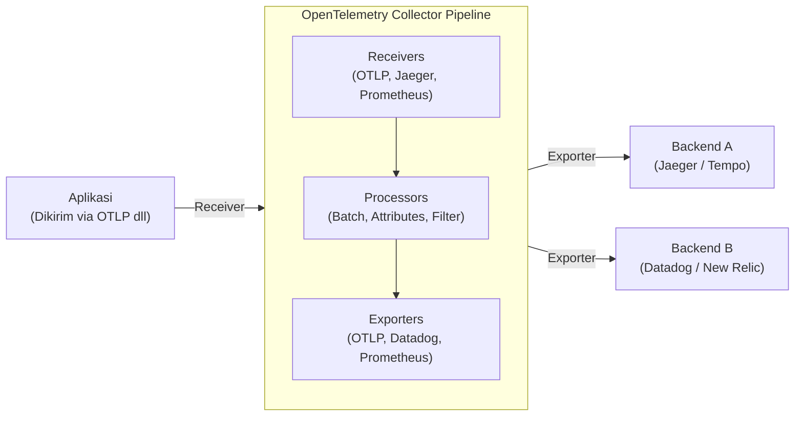

Dalam arsitektur perangkat lunak modern, sistem terdistribusi seperti layanan mikro (microservices) dan tanpa server (serverless) bukan lagi hal yang istimewa. Namun, sementara sistem menjadi terdistribusi dan lebih mudah untuk diskalakan ke luar (scale-out), satu permintaan (request) kini diproses melintasi berbagai layanan. Hal ini membuat sangat sulit untuk secara akurat memahami "keadaan saat ini" dari sistem dan mengidentifikasi akar penyebab saat masalah terjadi.

Dengan latar belakang ini, konsep "Observabilitas (Observability)" menjadi semakin penting. Dan sebagai kerangka kerja standar untuk mewujudkan observabilitas tersebut, **OpenTelemetry** (disingkat: OTel) saat ini mendominasi industri.

Dalam artikel ini, kita akan membahas secara mendalam penjelasan teknis untuk memahami OpenTelemetry, mulai dari latar belakang sejarah *distributed tracing* (penelusuran terdistribusi), integrasi tiga pilar observabilitas (log, metrik, trace), arsitektur OpenTelemetry Collector, propagasi konteks (context propagation) dengan W3C Trace Context, hingga contoh kode instrumentasi konkret menggunakan Python dan Go.

## 1. Latar Belakang Sejarah Distributed Tracing: Dari Dapper ke OpenTelemetry

Melihat kembali sejarah hingga lahirnya OpenTelemetry sangat bermanfaat untuk memahami mengapa proyek ini begitu penting.

### 1.1 Dampak Makalah Google Dapper
Konsep "Distributed Tracing" yang ditujukan untuk analisis kinerja sistem terdistribusi dan pemecahan masalah (troubleshooting) mulai dikenal luas berkat makalah yang diterbitkan oleh Google pada tahun 2010 berjudul **"Dapper, a Large-Scale Distributed Systems Tracing Infrastructure"**.

Dapper adalah infrastruktur untuk menelusuri permintaan (request) yang mengalir melalui sekumpulan layanan mikro raksasa di dalam Google, sambil meminimalkan overhead. Makalah ini menyajikan konsep-konsep penting berikut:
- **Trace**: Aliran pemrosesan keseluruhan dari satu permintaan.
- **Span**: Unit kerja individu yang membentuk trace (misalnya, kueri ke basis data atau panggilan API eksternal).
- **Context Propagation (Propagasi Konteks)**: Mekanisme penyebaran ID Trace dan ID Span melintasi batas jaringan.

Konsep Dapper memberikan pengaruh yang sangat besar terhadap proyek-proyek open-source di kemudian hari (seperti Zipkin dari Twitter dan Jaeger dari Uber).

### 1.2 Kebangkitan OpenTracing dan OpenCensus
Setelah makalah Dapper, muncul berbagai alat penelusuran (tracing tools), namun masing-masing memiliki API dan format datanya sendiri, sehingga para pengembang menghadapi masalah keterkaitan (lock-in) pada vendor tertentu (seperti Datadog, New Relic, AWS X-Ray, dll) atau alat tertentu.

Untuk menyelesaikan masalah ini, lahirlah dua proyek open-source besar:
1. **OpenTracing**: Sebuah proyek yang dihosting oleh CNCF (Cloud Native Computing Foundation). Proyek ini berfokus pada perumusan spesifikasi API yang netral vendor untuk *distributed tracing*.
2. **OpenCensus**: Proyek yang dipimpin oleh Google dan Microsoft. Proyek ini tidak hanya menyediakan penelusuran, tetapi juga fitur pengumpulan metrik, dan menyediakan pustaka (library) yang dapat mengirimkan data ke berbagai backend.

### 1.3 Lahirnya OpenTelemetry
Meskipun OpenTracing dan OpenCensus keduanya menjadi banyak digunakan, fungsi-fungsinya tumpang tindih sehingga menyebabkan terpecahnya komunitas. Oleh karena itu, pada tahun 2019 lahirlah **OpenTelemetry** dengan tujuan mengintegrasikan kedua proyek tersebut dan menciptakan satu standar tunggal.

Saat ini, OpenTelemetry telah berkembang menjadi proyek raksasa CNCF kedua setelah Kubernetes, dan telah menjadi standar *de facto* di industri.

---

## 2. Integrasi Tiga Pilar Observabilitas (Observability)

Untuk mewujudkan observabilitas, diperlukan data (data telemetri) yang berfungsi untuk menginferensi status internal sistem dari luar. Ini umumnya disebut sebagai "Tiga Pilar Observabilitas (Three Pillars of Observability)".

1. **Metrics (Metrik)**: 
   - Kumpulan data numerik yang menunjukkan kondisi sistem (penggunaan CPU, penggunaan memori, jumlah permintaan, tingkat kesalahan, dll).
   - Sangat ideal untuk penyimpanan jangka panjang, analisis tren di dasbor, dan pemicu peringatan (alert).
2. **Logs (Log)**: 
   - Teks atau data terstruktur yang merekam peristiwa individu yang terjadi dalam sistem.
   - Memberikan konteks yang mendetail mengenai "apa yang terjadi".
3. **Traces (Trace)**: 
   - Data yang menunjukkan bagaimana suatu permintaan diproses dan melalui layanan mana saja dalam sistem terdistribusi.
   - Berguna untuk mengidentifikasi bottleneck dan memahami ketergantungan antar layanan.

### Nilai Integrasi oleh OpenTelemetry
Sebelumnya, kita perlu memperkenalkan agen atau pustaka (library) yang terpisah untuk masing-masing pilar, seperti Prometheus untuk metrik, Fluentd + Elasticsearch untuk log, dan Jaeger untuk trace.

OpenTelemetry **mengintegrasikan pembuatan, pengumpulan, pemrosesan, dan ekspor dari "metrik, log, dan trace" tersebut dalam satu API / SDK / Collector tunggal**. Hal ini memberikan keuntungan sebagai berikut:

- **Integrasi Agen**: Tidak perlu lagi memuat banyak pustaka di sisi aplikasi, atau men-deploy banyak agen di sisi infrastruktur.
- **Memastikan Korelasi (Correlation)**: Menjadi lebih mudah untuk menyematkan ID trace ke dalam log, atau melompat (jump) dari metrik kesalahan tertentu ke trace yang terkait.
- **Tidak Bergantung pada Vendor (Vendor Agnostic)**: Saat mengubah tujuan pengiriman data (backend), tidak perlu menulis ulang kode aplikasi, melainkan hanya perlu mengubah konfigurasi saja.

---

## 3. W3C Trace Context dan Propagasi Konteks

Mekanisme terpenting untuk membuat trace berfungsi di sistem terdistribusi adalah **Propagasi Konteks (Context Propagation)**.

Saat Layanan A memanggil Layanan B, Layanan A harus memberikan informasi (ID Trace dan ID Span-nya sendiri) ke Layanan B mengenai trace (permintaan) apa yang saat ini sedang diproses. Dengan begitu, Layanan B dapat mengenali bahwa permintaan yang diterima merupakan bagian dari proses besar apa, dan dapat mengaitkan data telemetri dengan benar.

### W3C Trace Context
Di masa lalu, setiap alat menggunakan header HTTP uniknya sendiri (contoh: `X-B3-TraceId`, `X-Amzn-Trace-Id`, dll) untuk menyebarkan konteks. Hal ini membuat interoperabilitas antara sistem penelusuran yang berbeda tidak dapat dipertahankan.

Oleh karena itu, distandarisasilah spesifikasi **W3C Trace Context**. Secara default, OpenTelemetry menggunakan W3C Trace Context ini untuk melakukan propagasi konteks.

Dalam W3C Trace Context, terutama digunakan dua header HTTP berikut:

1. **Header `traceparent`**: 
   - Mengenkode ID Trace, ID Span induk (Parent Span ID), flag sampling, dll ke dalam satu string tunggal.
   - Contoh format: `00-4bf92f3577b34da6a3ce929d0e0e4736-00f067aa0ba902b7-01`
     - `00`: Versi
     - `4bf92f3577b34da6a3ce929d0e0e4736`: Trace ID
     - `00f067aa0ba902b7`: Parent Span ID
     - `01`: Trace Flags (`01` menunjukkan bahwa trace ini di-sampling)
2. **Header `tracestate`**: 
   - Area ekstensi untuk menyebarkan informasi trace yang spesifik vendor dalam pasangan Key-Value.

Pustaka OpenTelemetry memiliki fitur untuk secara otomatis menyuntikkan (Inject) header-header ini saat mengirimkan permintaan HTTP, dan mengekstraknya (Extract) dari header saat menerima permintaan.

---

## 4. Arsitektur OpenTelemetry Collector

OpenTelemetry Collector adalah proxy/agen netral-vendor untuk menerima, memproses, dan mengekspor data telemetri (trace, metrik, log). Dengan memperkenalkan Collector, aplikasi dapat mengumpulkan data ke Collector tersebut, alih-alih mengirimkannya langsung ke backend (seperti Datadog atau New Relic) dari sisi aplikasi.

Collector memiliki arsitektur pipeline yang sebagian besar terdiri dari 3 komponen berikut.



### 4.1 Receiver
Berperan untuk menerima data dari aplikasi atau agen lainnya.
Mendukung baik model *push* (contoh: OTLP Receiver, Jaeger Receiver) maupun model *pull* (contoh: Prometheus Receiver, Host Metrics Receiver).

### 4.2 Processor
Berperan untuk mengubah, memodifikasi, dan memfilter data yang diterima sebelum mengekspornya.
- **Batch Processor**: Membagi data ke dalam batch berdasarkan jumlah atau waktu tertentu untuk mengurangi overhead jaringan (ini adalah processor yang wajib dan direkomendasikan).
- **Attributes Processor**: Menambahkan tag tertentu (seperti nama lingkungan atau versi) ke span dan metrik, atau menutupi (masking) informasi sensitif (seperti kata sandi atau nomor kartu kredit).
- **Memory Limiter Processor**: Membuang data (drop) ketika penggunaan memori Collector mencapai batas atas tertentu untuk mencegah berhentinya proses (crash).

### 4.3 Exporter
Berperan untuk mengirimkan data yang telah diproses ke backend (infrastruktur observabilitas).
Karena data dapat dikirim dari satu pipeline ke beberapa exporter, perutean fleksibel seperti "metrik dikirim ke Prometheus, sementara trace dikirim ke Jaeger dan Datadog" dapat diwujudkan hanya melalui berkas konfigurasi.

---

## 5. Instrumentasi Aplikasi (Instrumentation)

Untuk menghasilkan data telemetri dari aplikasi, diperlukan "Instrumentasi (Instrumentation)". OpenTelemetry utamanya menawarkan 2 pendekatan.

1. **Instrumentasi Otomatis (Auto-Instrumentation)**:
   - Tanpa perlu mengubah kode aplikasi, secara otomatis menyematkan instrumentasi ke *standard library* atau kerangka kerja (*framework*) (HTTP Client, driver database, dll) menggunakan agen *runtime* bahasa (Java, Python, Node.js, dll) atau eBPF.
2. **Instrumentasi Manual (Manual Instrumentation)**:
   - Pengembang secara eksplisit memanggil API OpenTelemetry SDK di dalam kode untuk menambahkan *custom span* dan atribut (Attributes) yang dikhususkan pada logika bisnis (business logic).

Di sini, mari kita lihat contoh implementasi pada Python dan Go yang menggabungkan instrumentasi otomatis dan manual.

### 5.1 Contoh Instrumentasi Menggunakan Python

Di Python, instrumentasi otomatis dapat dengan mudah dilakukan menggunakan perintah `opentelemetry-instrument`. Selain itu, berikut adalah contoh pembuatan *custom span* di dalam kode.

```python
from opentelemetry import trace
from opentelemetry.sdk.trace import TracerProvider
from opentelemetry.sdk.trace.export import BatchSpanProcessor
from opentelemetry.exporter.otlp.proto.grpc.trace_exporter import OTLPSpanExporter
from opentelemetry.sdk.resources import Resource
import time
import random

# 1. Konfigurasi Resource (nama layanan, dll)
resource = Resource(attributes={
    "service.name": "python-payment-service",
    "service.version": "1.0.0"
})

# 2. Inisialisasi dan konfigurasi TracerProvider
provider = TracerProvider(resource=resource)
otlp_exporter = OTLPSpanExporter(endpoint="http://otel-collector:4317", insecure=True)
processor = BatchSpanProcessor(otlp_exporter)
provider.add_span_processor(processor)
trace.set_tracer_provider(provider)

# 3. Mendapatkan Tracer
tracer = trace.get_tracer(__name__)

def process_payment(user_id: str, amount: float):
    # Memulai span secara manual
    with tracer.start_as_current_span("process_payment_task") as span:
        # Menambahkan atribut ke span
        span.set_attribute("payment.user_id", user_id)
        span.set_attribute("payment.amount", amount)
        
        try:
            # Simulasi logika bisnis
            time.sleep(random.uniform(0.1, 0.5))
            if amount > 10000:
                raise ValueError("Amount exceeds limit")
            
            span.add_event("Payment processed successfully")
            span.set_status(trace.StatusCode.OK)
            return True
            
        except Exception as e:
            # Mencatat informasi exception pada span saat error
            span.record_exception(e)
            span.set_status(trace.StatusCode.ERROR, str(e))
            raise

if __name__ == "__main__":
    try:
        process_payment("user-1234", 5000)
    except Exception:
        pass
```

Dalam kasus Python, tersedia *plugin* instrumentasi otomatis untuk *library* utama seperti Flask, FastAPI, dan Requests, dan hal-hal ini dapat dihubungkan secara mulus (*seamless*) dengan instrumentasi manual.

### 5.2 Contoh Instrumentasi Menggunakan Go

Karena Go (Golang) merupakan bahasa dengan tipe statis (statically typed language), akan sulit melakukan instrumentasi otomatis sepenuhnya melalui 'keajaiban' (*magic*) seperti pada Python (*dynamic patching* saat runtime). Sebaliknya, diperlukan perutean eksplisit `context.Context` di dalam kode. Ini membuat kita harus sangat sadar akan "Context Propagation".

Berikut adalah contoh program di Go yang memulai sebuah *trace* di dalam handler HTTP lalu memanggil fungsi internal.

```go
package main

import (
	"context"
	"fmt"
	"log"
	"net/http"
	"time"

	"go.opentelemetry.io/otel"
	"go.opentelemetry.io/otel/attribute"
	"go.opentelemetry.io/otel/exporters/otlp/otlptrace/otlptracegrpc"
	"go.opentelemetry.io/otel/sdk/resource"
	sdktrace "go.opentelemetry.io/otel/sdk/trace"
	semconv "go.opentelemetry.io/otel/semconv/v1.17.0"
	"go.opentelemetry.io/otel/trace"
)

// Fungsi inisialisasi
func initProvider() (*sdktrace.TracerProvider, error) {
	ctx := context.Background()
	
	// Pembuatan OTLP Exporter (Mengirim ke Collector)
	exp, err := otlptracegrpc.New(ctx, otlptracegrpc.WithInsecure(), otlptracegrpc.WithEndpoint("otel-collector:4317"))
	if err != nil {
		return nil, err
	}

	res := resource.NewWithAttributes(
		semconv.SchemaURL,
		semconv.ServiceName("go-inventory-service"),
		semconv.ServiceVersion("1.0.0"),
	)

	tp := sdktrace.NewTracerProvider(
		sdktrace.WithBatcher(exp),
		sdktrace.WithResource(res),
	)
	
	// Menetapkan Tracer Provider global
	otel.SetTracerProvider(tp)
	return tp, nil
}

func checkInventory(ctx context.Context, itemID string) error {
	// Mengambil tracer dari context dan membuat child span
	tracer := otel.Tracer("inventory-module")
	ctx, span := tracer.Start(ctx, "checkInventory_operation")
	defer span.End() // Menutup span saat fungsi selesai

	span.SetAttributes(attribute.String("item.id", itemID))

	// Query database semu (dummy)
	time.Sleep(200 * time.Millisecond)
	
	span.AddEvent("Inventory check completed")
	return nil
}

func inventoryHandler(w http.ResponseWriter, r *http.Request) {
	// Mengambil context dari permintaan HTTP dan membuat root span
	tracer := otel.Tracer("http-server")
	ctx, span := tracer.Start(r.Context(), "HTTP GET /inventory")
	defer span.End()

	itemID := r.URL.Query().Get("id")
	if itemID == "" {
		span.SetStatus(trace.StatusCodeError, "missing item id")
		http.Error(w, "missing item id", http.StatusBadRequest)
		return
	}

	// Meneruskan konteks (ctx) ke fungsi internal
	err := checkInventory(ctx, itemID)
	if err != nil {
		span.RecordError(err)
		span.SetStatus(trace.StatusCodeError, err.Error())
		http.Error(w, "internal error", http.StatusInternalServerError)
		return
	}

	span.SetStatus(trace.StatusCodeOk, "")
	w.WriteHeader(http.StatusOK)
	fmt.Fprintf(w, "Item %s is in stock", itemID)
}

func main() {
	tp, err := initProvider()
	if err != nil {
		log.Fatal(err)
	}
	// Menyelesaikan (flush) span yang masih tertunda saat aplikasi berakhir
	defer func() {
		if err := tp.Shutdown(context.Background()); err != nil {
			log.Fatal(err)
		}
	}()

	http.HandleFunc("/inventory", inventoryHandler)
	log.Println("Server listening on :8080")
	log.Fatal(http.ListenAndServe(":8080", nil))
}
```

Poin paling penting dalam instrumentasi Go adalah memastikan parameter argumen pertama dari deklarasi fungsi menerima `ctx context.Context`, lalu secara konsisten meneruskannya ke pemanggilan fungsi berikutnya (Context Propagation). Melalui cara ini, pemanggilan beberapa fungsi dapat terhubung sebagai satu pohon (tree) trace.

---

## 6. Praktik Terbaik dan Strategi Operasional dalam Implementasi OpenTelemetry

OpenTelemetry adalah alat yang kuat, tetapi ada beberapa tantangan dan pertimbangan saat menerapkannya di lingkungan produksi (*production*).

### 6.1 Pendekatan Implementasi Bertahap
Jika mencoba mengimplementasikan semuanya (metrik, log, trace) untuk semua layanan secara sekaligus, biaya migrasinya akan tinggi dengan risiko kegagalan.
Pendekatan yang direkomendasikan adalah **"mulai dari distributed tracing terlebih dahulu"**. Dalam banyak kasus, infrastruktur dasar metrik dan log (Prometheus dan ELK stack) sudah berfungsi. Di sisi lain, trace dalam sistem terdistribusi merupakan area yang paling langsung mendapatkan manfaat dari OTel. Setelah tracing berjalan stabil, barulah melanjutkannya dengan proses migrasi ke metrik, dan pada akhirnya ke log (saat ini, spesifikasi logging OTel telah mencapai GA (General Availability) dan pengadopsiannya semakin menyebar).

### 6.2 Strategi Sampling (Sampling Strategy)
Dalam sistem dengan lalu lintas tinggi, merekam dan mengirim setiap request (100%) sebagai trace akan mengakibatkan lonjakan bandwith jaringan dan biaya penyimpanan (storage cost) backend yang sangat besar. Untuk menghindarinya, terutama terdapat 2 strategi sampling:

- **Head-based Sampling**:
  - Pada saat trace dimulai (saat permintaan pertama diterima), diputuskan apakah trace tersebut akan dicatat atau tidak (contoh: direkam dengan probabilitas 10%).
  - Mudah diimplementasikan dan overhead-nya rendah, namun tidak dapat melakukan hal seperti "hanya menyimpan permintaan (request) yang mengalami error secara pasti" (karena kita tidak tahu apakah permintaan tersebut akan gagal sejak awal atau tidak).
- **Tail-based Sampling**:
  - Keputusan (judgment) dibuat di sisi Collector setelah semua proses request selesai.
  - Seluruh trace untuk sementara waktu disangga (di-buffer) di memori. Keputusan untuk mengirim atau membuang trace didasarkan pada evaluasi "apakah ada error yang terlibat" atau "apakah waktu proses sangat lambat".
  - Ini memungkinkan pengekstrakan hanya trace-trace yang bernilai tinggi saja, namun Collector membutuhkan lebih banyak memori dan kemampuan pemrosesan yang lebih tinggi (*compute resource*).

### 6.3 Pola Deployment Collector
Pola *deployment* Collector sebagian besar terbagi menjadi dua, yakni "Pola Agent" dan "Pola Gateway". Umumnya, sistem beroperasi dengan menggabungkan keduanya.

1. **Pola Agent**:
   - Collector skala kecil di-deploy di setiap *node* (contoh: DaemonSet di Kubernetes atau di dalam instans EC2).
   - Aplikasi cukup selalu meng-*push* (mendorong) data ke `localhost`, mengurangi kompleksitas jaringan. Agent ini juga dapat berfungsi sebagai pengumpul metrik *host* (CPU/Memori).
2. **Pola Gateway**:
   - Klaster (Cluster) Collector independen berskala besar (scalable) ditempatkan sebelum ada komunikasi dengan luar *cluster*.
   - Data yang dikirim dari agen dikumpulkan di sini, sebelum disaring (*filtering*/Tail-based sampling/pembilasan (scrub) informasi sensitif) lalu dikirim ke penyedia layanan backend (*SaaS*).
   - Hal ini dapat memusatkan pengelolaan API Key backend serta pengontrolan arus lintas data (traffic) pada lapisan ini, sehingga sangat baik dari perspektif keamanan dan operasional.

---

## 7. Kesimpulan

OpenTelemetry merupakan standar terbuka yang sangat esensial (penting) demi memastikan "Observabilitas (Observability)" dalam sebuah sistem terdistribusi. Dengan menghilangkan belenggu (*lock-in*) vendor dan menggabungkan tiga tipe telemetri (metrik, log, trace) secara mulus (seamless) di bawah spesifikasi (OTLP) bersama, alat ini mampu meningkatkan efisiensi dan transparansi dalam menangani serta mendiagnosis investigasi kegagalan secara sangat drastis.

- **Latar Belakang Sejarah**: Dimulai dengan Google Dapper, melalui konsolidasi (penggabungan) OpenTracing dan OpenCensus menuju standar industri.
- **Integrasi Data**: SDK terpusat di sisi aplikasi, dan saluran (pipeline) data fleksibel oleh Collector.
- **Propagasi Konteks (Context Propagation)**: Propagasi Header standar melalui spesifikasi W3C Trace Context.
- **Instrumentasi dan Pengoperasian (Operasi)**: Pengenalan bertahap, pemilihan rancangan sampling yang tepat, dan pemakaian arsitektur Gateway adalah sebuah kunci.

Bagi tim-tim yang memakai arsitektur *microservice*, atau sedang memikirkan transisi (migrasi) ke arah situ, berinvestasi ke OpenTelemetry semestinya bakal membawa *ROI (Return on Investment)* sangat tinggi di dalam manajemen operasi sistem pada masa depan. Jadi pastikan buat mencoba memulai instrumen OTel (OpenTelemetry) mulai pada layanan skala kecil dari lingkungan (environment) masing-masing Anda.
