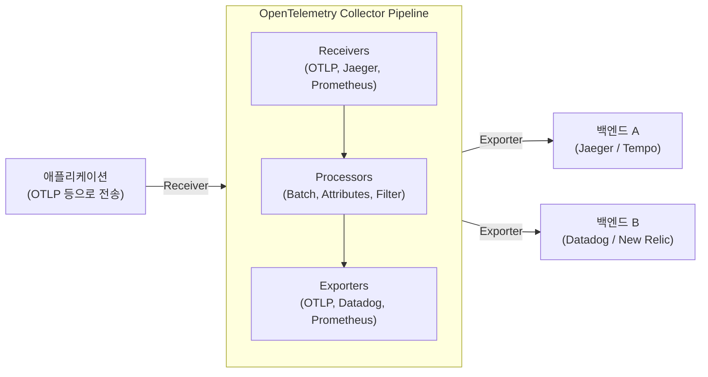

현대 소프트웨어 아키텍처에서 마이크로서비스나 서버리스와 같은 분산 시스템은 더 이상 특별한 것이 아니게 되었습니다. 하지만 시스템이 분산되고 스케일 아웃하기 쉬워진 반면, 하나의 요청이 여러 서비스에 걸쳐 처리되면서 시스템의 '현재'를 정확히 파악하고 문제가 발생했을 때 그 근본 원인을 특정하는 것은 매우 어려워졌습니다.

이러한 배경에서 '가관측성(Observability: 옵저버빌리티)'이라는 개념이 중요하게 다루어지기 시작했습니다. 그리고 그 가관측성을 실현하기 위한 표준 프레임워크로서 현재 업계를 석권하고 있는 것이 바로 **OpenTelemetry**(오픈텔레메트리, 약칭: OTel)입니다.

본 기사에서는 분산 트레이싱의 역사적 배경부터 가관측성을 구성하는 세 가지 기둥(로그·메트릭·트레이스)의 통합, OpenTelemetry Collector의 아키텍처, W3C Trace Context를 통한 컨텍스트 전파, 그리고 Python과 Go를 사용한 구체적인 계측(Instrumentation) 코드 예시에 이르기까지 OpenTelemetry를 깊이 이해하기 위한 기술적인 해설을 진행합니다.

## 1. 분산 트레이싱의 역사적 배경: Dapper에서 OpenTelemetry로

OpenTelemetry가 탄생하기까지의 역사를 되돌아보는 것은, 이 프로젝트가 왜 이토록 중요한지 이해하는 데 매우 유익합니다.

### 1.1 Google Dapper 논문의 충격
분산 시스템의 성능 분석 및 트러블슈팅을 목적으로 하는 '분산 트레이싱(Distributed Tracing)'이라는 개념은 2010년 Google이 발표한 논문 **"Dapper, a Large-Scale Distributed Systems Tracing Infrastructure"**를 통해 널리 알려지게 되었습니다.

Dapper는 Google 사내의 거대한 마이크로서비스 군을 흐르는 요청을 오버헤드를 최소화하면서 추적하기 위한 인프라스트럭처였습니다. 이 논문에서는 다음과 같은 중요한 개념이 제시되었습니다.
- **Trace(트레이스)**: 1개의 요청 전체를 아우르는 처리의 흐름.
- **Span(스팬)**: 트레이스를 구성하는 개별 작업 단위(예를 들어, 데이터베이스에 대한 쿼리나 외부 API 호출 등).
- **Context Propagation(컨텍스트 전파)**: 요청 ID나 스팬 ID를 네트워크 경계를 넘어 전파하는 메커니즘.

Dapper의 사고방식은 이후의 오픈 소스 프로젝트(Twitter의 Zipkin이나 Uber의 Jaeger 등)에 지대한 영향을 미쳤습니다.

### 1.2 OpenTracing과 OpenCensus의 대두
Dapper 논문 이후 다양한 트레이싱 도구가 등장했지만, 각각이 독자적인 API와 데이터 포맷을 가지고 있었기 때문에 개발자는 특정 벤더(Datadog, New Relic, AWS X-Ray 등)나 도구에 종속되는(락인되는) 문제에 직면했습니다.

이 문제를 해결하기 위해 두 개의 거대한 오픈 소스 프로젝트가 탄생했습니다.
1. **OpenTracing**: CNCF(Cloud Native Computing Foundation)가 호스팅하는 프로젝트. 분산 트레이싱을 위한 벤더 중립적인 API 사양을 제정하는 데 특화되어 있었습니다.
2. **OpenCensus**: Google과 Microsoft가 주도하는 프로젝트. 트레이싱뿐만 아니라 메트릭 수집 기능도 제공하며, 다양한 백엔드에 데이터를 전송할 수 있는 라이브러리를 제공했습니다.

### 1.3 OpenTelemetry의 탄생
OpenTracing과 OpenCensus 모두 널리 사용되게 되었지만 기능이 중복되어 커뮤니티가 분열되는 결과를 낳았습니다. 그래서 이 두 프로젝트를 통합하고 단일 표준을 만들어내기 위해 2019년에 탄생한 것이 바로 **OpenTelemetry**입니다.

현재 OpenTelemetry는 Kubernetes에 이어 CNCF의 거대한 프로젝트로 성장하여 업계의 사실상 표준(De facto standard)이 되었습니다.

---

## 2. 가관측성(Observability)의 3대 요소 통합

가관측성을 실현하기 위해서는 시스템 내부의 상태를 외부에서 추론하기 위한 데이터(텔레메트리 데이터)가 필요합니다. 이들은 일반적으로 '가관측성의 3대 요소(Three Pillars of Observability)'라고 불립니다.

1. **Metrics(메트릭)**: 
   - 시스템의 상태를 나타내는 수치 데이터의 모음입니다(CPU 사용률, 메모리 사용량, 요청 수, 에러율 등).
   - 장기간 보존이나 대시보드에서의 추세 분석, 알람 발송에 최적화되어 있습니다.
2. **Logs(로그)**: 
   - 시스템에서 발생한 개별 이벤트를 기록한 텍스트 또는 구조화된 데이터입니다.
   - '무슨 일이 일어났는지'에 대한 상세한 컨텍스트를 제공합니다.
3. **Traces(트레이스)**: 
   - 요청이 분산 시스템 내의 어떤 서비스를 거쳐 어떻게 처리되었는지를 보여주는 데이터입니다.
   - 병목 현상 파악이나 서비스 간의 의존 관계를 파악하는 데 유용합니다.

### OpenTelemetry를 통한 통합의 가치
이전에는 메트릭은 Prometheus, 로그는 Fluentd + Elasticsearch, 트레이스는 Jaeger와 같이 각각의 요소에 대해 별도의 에이전트나 라이브러리를 도입해야만 했습니다.

OpenTelemetry는 이들 **'메트릭·로그·트레이스'의 생성, 수집, 처리, 익스포트를 단일 API / SDK / 콜렉터로 통합**합니다. 이를 통해 다음과 같은 이점이 생깁니다.

- **에이전트의 통합**: 애플리케이션 측에서 여러 라이브러리를 로드하거나 인프라 측에 여러 에이전트를 배포할 필요가 없어집니다.
- **상관관계(Correlation) 확보**: 트레이스 ID를 로그에 삽입하거나 특정 에러 메트릭에서 관련된 트레이스로 점프하는 것이 쉬워집니다.
- **벤더 비의존성**: 데이터 전송 대상(백엔드)을 변경할 때도 애플리케이션 코드를 다시 작성할 필요가 없어지며, 설정 변경만으로 충분합니다.

---

## 3. W3C Trace Context와 컨텍스트 전파

분산 시스템에서 트레이스를 작동시키기 위한 가장 중요한 메커니즘이 **컨텍스트 전파(Context Propagation)**입니다.

서비스 A가 서비스 B를 호출할 때, 서비스 A는 자신이 현재 어떤 트레이스(요청)를 처리하고 있는지에 대한 정보(트레이스 ID 및 자신의 스팬 ID)를 서비스 B에 전달해야 합니다. 이를 통해 서비스 B는 수신한 요청이 어떤 큰 처리의 일부인지를 인식하고 텔레메트리 데이터를 올바르게 연결할 수 있습니다.

### W3C Trace Context
과거에는 각 도구가 고유한 HTTP 헤더(예: `X-B3-TraceId`, `X-Amzn-Trace-Id` 등)를 사용하여 컨텍스트를 전파했습니다. 이래서는 서로 다른 트레이싱 시스템 간에 상호 운용성을 유지할 수 없습니다.

그래서 표준화된 것이 **W3C Trace Context** 사양입니다. OpenTelemetry는 기본적으로 이 W3C Trace Context를 사용하여 컨텍스트 전파를 수행합니다.

W3C Trace Context에서는 주로 다음 두 가지 HTTP 헤더를 사용합니다.

1. **`traceparent` 헤더**: 
   - 트레이스 ID, 부모 스팬 ID, 샘플링 플래그 등을 하나의 문자열로 인코딩합니다.
   - 포맷 예: `00-4bf92f3577b34da6a3ce929d0e0e4736-00f067aa0ba902b7-01`
     - `00`: 버전
     - `4bf92f3577b34da6a3ce929d0e0e4736`: Trace ID
     - `00f067aa0ba902b7`: Parent Span ID
     - `01`: Trace Flags(01은 샘플링됨을 나타냄)
2. **`tracestate` 헤더**: 
   - 벤더 고유의 트레이스 정보 등을 Key-Value 쌍으로 전파하기 위한 확장 영역입니다.

OpenTelemetry 라이브러리는 HTTP 요청을 전송할 때 자동으로 이러한 헤더를 주입(Inject)하고, 요청을 수신할 때 헤더에서 추출(Extract)하는 기능을 가지고 있습니다.

---

## 4. OpenTelemetry Collector 아키텍처

OpenTelemetry Collector는 텔레메트리 데이터(트레이스, 메트릭, 로그)를 수신, 처리, 익스포트하기 위한 벤더 중립적인 프록시/에이전트입니다. Collector를 도입함으로써 애플리케이션 측에서 직접 백엔드(Datadog이나 New Relic 등)로 데이터를 보내는 대신, Collector에 데이터를 집중시킬 수 있습니다.

Collector는 주로 다음 3가지 컴포넌트로 구성된 파이프라인 아키텍처를 가집니다.



### 4.1 Receiver(리시버)
애플리케이션이나 다른 에이전트로부터 데이터를 받는 역할을 합니다.
푸시 방식(예: OTLP 리시버, Jaeger 리시버)과 풀 방식(예: Prometheus 리시버, 호스트 메트릭 리시버)을 모두 지원합니다.

### 4.2 Processor(프로세서)
수신한 데이터를 익스포트하기 전에 변환·가공·필터링하는 역할을 합니다.
- **Batch Processor**: 데이터를 일정량 또는 일정 시간 단위로 배치화하여 네트워크 오버헤드를 줄입니다(필수이자 권장되는 프로세서입니다).
- **Attributes Processor**: 스팬이나 메트릭에 특정 태그(환경 이름이나 버전 등)를 추가하거나 민감한 정보(비밀번호나 신용카드 번호)를 마스킹합니다.
- **Memory Limiter Processor**: Collector의 메모리 사용량이 일정 상한에 도달했을 때 데이터 드롭을 수행하여 프로세스 충돌을 방지합니다.

### 4.3 Exporter(익스포터)
처리된 데이터를 백엔드(관측 기반)로 전송하는 역할을 합니다.
하나의 파이프라인에서 여러 익스포터로 데이터를 보낼 수 있기 때문에, 예를 들어 "메트릭은 Prometheus로, 트레이스는 Jaeger와 Datadog 모두로 전송한다"와 같은 유연한 라우팅을 설정 파일만으로 구현할 수 있습니다.

---

## 5. 애플리케이션 계측(Instrumentation)

애플리케이션에서 텔레메트리 데이터를 생성하려면 '계측(Instrumentation)'이 필요합니다. OpenTelemetry에서는 크게 두 가지 접근 방식이 있습니다.

1. **자동 계측(Auto-Instrumentation)**:
   - 애플리케이션 코드를 수정하지 않고 언어의 런타임 에이전트(Java, Python, Node.js 등)나 eBPF를 사용하여 자동으로 표준 라이브러리 및 프레임워크(HTTP 클라이언트, 데이터베이스 드라이버 등)에 계측을 통합합니다.
2. **수동 계측(Manual Instrumentation)**:
   - 개발자가 코드 내에 명시적으로 OpenTelemetry SDK의 API를 호출하여 비즈니스 로직에 특화된 커스텀 스팬이나 속성(Attributes)을 추가합니다.

여기에서는 자동 계측과 수동 계측을 결합한 Python과 Go의 구현 예를 살펴보겠습니다.

### 5.1 Python을 이용한 계측 예시

Python에서는 `opentelemetry-instrument` 명령을 사용하여 쉽게 자동 계측을 수행할 수 있습니다. 나아가 코드 내에서 커스텀 스팬을 생성하는 예를 보여줍니다.

```python
from opentelemetry import trace
from opentelemetry.sdk.trace import TracerProvider
from opentelemetry.sdk.trace.export import BatchSpanProcessor
from opentelemetry.exporter.otlp.proto.grpc.trace_exporter import OTLPSpanExporter
from opentelemetry.sdk.resources import Resource
import time
import random

# 1. 리소스 설정(서비스 이름 등)
resource = Resource(attributes={
    "service.name": "python-payment-service",
    "service.version": "1.0.0"
})

# 2. TracerProvider 초기화 및 설정
provider = TracerProvider(resource=resource)
otlp_exporter = OTLPSpanExporter(endpoint="http://otel-collector:4317", insecure=True)
processor = BatchSpanProcessor(otlp_exporter)
provider.add_span_processor(processor)
trace.set_tracer_provider(provider)

# 3. 트레이서 획득
tracer = trace.get_tracer(__name__)

def process_payment(user_id: str, amount: float):
    # 수동으로 스팬 시작
    with tracer.start_as_current_span("process_payment_task") as span:
        # 스팬에 속성 추가
        span.set_attribute("payment.user_id", user_id)
        span.set_attribute("payment.amount", amount)
        
        try:
            # 비즈니스 로직 시뮬레이션
            time.sleep(random.uniform(0.1, 0.5))
            if amount > 10000:
                raise ValueError("Amount exceeds limit")
            
            span.add_event("Payment processed successfully")
            span.set_status(trace.StatusCode.OK)
            return True
            
        except Exception as e:
            # 에러 발생 시 스팬에 예외 정보 기록
            span.record_exception(e)
            span.set_status(trace.StatusCode.ERROR, str(e))
            raise

if __name__ == "__main__":
    try:
        process_payment("user-1234", 5000)
    except Exception:
        pass
```

Python의 경우 Flask나 FastAPI, Requests 등의 주요 라이브러리에 대한 자동 계측 플러그인이 제공되고 있어, 이들과 수동 계측을 원활하게 연동할 수 있습니다.

### 5.2 Go를 이용한 계측 예시

Go(Golang)는 정적 타입 언어이기 때문에 Python과 같은 마법(실행 시의 동적 패치 등)을 통한 완전한 자동 계측은 어려우며, 코드 내에서 명시적으로 `context.Context`를 전달해야 합니다. 이것이 'Context Propagation'을 매우 의식하게 만드는 구조입니다.

다음은 HTTP 핸들러 내에서 트레이스를 시작하고 내부 함수를 호출하는 Go 예시입니다.

```go
package main

import (
	"context"
	"fmt"
	"log"
	"net/http"
	"time"

	"go.opentelemetry.io/otel"
	"go.opentelemetry.io/otel/attribute"
	"go.opentelemetry.io/otel/exporters/otlp/otlptrace/otlptracegrpc"
	"go.opentelemetry.io/otel/sdk/resource"
	sdktrace "go.opentelemetry.io/otel/sdk/trace"
	semconv "go.opentelemetry.io/otel/semconv/v1.17.0"
	"go.opentelemetry.io/otel/trace"
)

// 초기화 함수
func initProvider() (*sdktrace.TracerProvider, error) {
	ctx := context.Background()
	
	// OTLP 익스포터 생성 (Collector로 전송)
	exp, err := otlptracegrpc.New(ctx, otlptracegrpc.WithInsecure(), otlptracegrpc.WithEndpoint("otel-collector:4317"))
	if err != nil {
		return nil, err
	}

	res := resource.NewWithAttributes(
		semconv.SchemaURL,
		semconv.ServiceName("go-inventory-service"),
		semconv.ServiceVersion("1.0.0"),
	)

	tp := sdktrace.NewTracerProvider(
		sdktrace.WithBatcher(exp),
		sdktrace.WithResource(res),
	)
	
	// 글로벌 트레이서 프로바이더 설정
	otel.SetTracerProvider(tp)
	return tp, nil
}

func checkInventory(ctx context.Context, itemID string) error {
	// 컨텍스트에서 트레이서를 가져와 자식 스팬 생성
	tracer := otel.Tracer("inventory-module")
	ctx, span := tracer.Start(ctx, "checkInventory_operation")
	defer span.End() // 함수 종료 시 스팬 닫기

	span.SetAttributes(attribute.String("item.id", itemID))

	// 가상 데이터베이스 쿼리
	time.Sleep(200 * time.Millisecond)
	
	span.AddEvent("Inventory check completed")
	return nil
}

func inventoryHandler(w http.ResponseWriter, r *http.Request) {
	// HTTP 요청에서 컨텍스트를 가져와 루트 스팬 생성
	tracer := otel.Tracer("http-server")
	ctx, span := tracer.Start(r.Context(), "HTTP GET /inventory")
	defer span.End()

	itemID := r.URL.Query().Get("id")
	if itemID == "" {
		span.SetStatus(trace.StatusCodeError, "missing item id")
		http.Error(w, "missing item id", http.StatusBadRequest)
		return
	}

	// 내부 함수로 컨텍스트 (ctx) 전달
	err := checkInventory(ctx, itemID)
	if err != nil {
		span.RecordError(err)
		span.SetStatus(trace.StatusCodeError, err.Error())
		http.Error(w, "internal error", http.StatusInternalServerError)
		return
	}

	span.SetStatus(trace.StatusCodeOk, "")
	w.WriteHeader(http.StatusOK)
	fmt.Fprintf(w, "Item %s is in stock", itemID)
}

func main() {
	tp, err := initProvider()
	if err != nil {
		log.Fatal(err)
	}
	// 애플리케이션 종료 시 보류 중인 스팬 플러시
	defer func() {
		if err := tp.Shutdown(context.Background()); err != nil {
			log.Fatal(err)
		}
	}()

	http.HandleFunc("/inventory", inventoryHandler)
	log.Println("Server listening on :8080")
	log.Fatal(http.ListenAndServe(":8080", nil))
}
```

Go 계측에서 가장 중요한 포인트는 함수 시그니처의 첫 번째 인수로 `ctx context.Context`를 받고, 이를 다음 함수로 확실하게 전달하는(Context Propagation) 것입니다. 이를 통해 여러 함수 호출이 단일 트레이스 트리로 연결됩니다.

---

## 6. OpenTelemetry 도입 시의 모범 사례 및 운영 전략

OpenTelemetry는 강력한 도구이지만, 프로덕션 환경에 도입할 때는 몇 가지 과제와 고려 사항이 있습니다.

### 6.1 단계적 도입 접근법
한 번에 모든 서비스, 모든 텔레메트리(메트릭, 로그, 트레이스)를 도입하려고 하면 마이그레이션 비용이 높아지고 실패할 위험이 있습니다.
권장되는 접근 방식은 **"우선 분산 트레이스부터 시작하는"** 것입니다. 메트릭이나 로그는 기존의 기반(Prometheus나 ELK 스택)이 잘 동작하고 있는 경우가 많지만, 분산 시스템에서의 트레이스는 OTel의 혜택을 가장 직접적으로 받을 수 있는 영역입니다. 트레이스가 안정적으로 가동된 후에 메트릭, 마지막으로 로그(현재 OTel의 로깅 사양은 GA가 되어 보급이 진행 중입니다) 순으로 마이그레이션해 나가는 것이 좋습니다.

### 6.2 샘플링 전략(Sampling Strategy)
트래픽이 많은 시스템에서 모든 요청(100%)을 트레이스로 기록하고 전송하면 네트워크 대역폭과 백엔드 스토리지 비용이 방대해집니다. 이를 방지하기 위한 샘플링 전략에는 주로 2가지 방법이 있습니다.

- **Head-based Sampling**:
  - 트레이스 시작 시점(첫 요청을 수신한 시점)에 해당 트레이스를 기록할지 여부(예: 10%의 확률로 기록)를 결정합니다.
  - 구현이 간단하고 오버헤드가 적지만, "에러가 발생한 요청만 확실히 남긴다"와 같은 것은 불가능합니다(시작 시점에서는 에러가 발생할지 알 수 없기 때문).
- **Tail-based Sampling**:
  - 요청 처리가 모두 완료된 후 콜렉터 측에서 판단을 내리는 방식입니다.
  - 트레이스 전체를 일시적으로 메모리에 버퍼링하고 "에러가 포함되어 있는지", "처리 시간이 비정상적으로 긴지"를 평가한 후에 전송 및 폐기 여부를 결정합니다.
  - 가치 있는 트레이스만 추출할 수 있지만, 콜렉터에 많은 메모리와 높은 처리 능력(컴퓨팅 리소스)이 필요합니다.

### 6.3 Collector 배포 패턴
Collector의 배포는 크게 'Agent(에이전트) 패턴'과 'Gateway(게이트웨이) 패턴'으로 나눌 수 있습니다. 이를 결합하여 운영하는 것이 일반적입니다.

1. **Agent 패턴**:
   - 각 노드(예: Kubernetes의 DaemonSet이나 EC2 인스턴스 내부)에 소규모 Collector를 배포합니다.
   - 애플리케이션은 항상 `localhost`에 데이터를 푸시하면 되므로 네트워크의 복잡성이 줄어듭니다. 호스트의 메트릭(CPU/메모리)을 수집하는 역할도 담당합니다.
2. **Gateway 패턴**:
   - 클러스터 외부로 통신하기 전 단계에 확장 가능한 Collector 클러스터를 독립적으로 배치합니다.
   - Agent로부터 전송된 데이터를 이곳에 모아, Tail-based 샘플링이나 민감한 정보 스크러빙(필터링)을 수행한 뒤 최종 백엔드 프로바이더(SaaS)로 전송합니다.
   - 백엔드의 API 키 관리나 트래픽 제어를 이 레이어에 집중시킬 수 있어 보안과 운영 관점에서 뛰어납니다.

---

## 7. 요약

OpenTelemetry는 분산 시스템에서 '가관측성(Observability)'을 확보하기 위한 극히 중요한 오픈 표준입니다. 벤더 종속(Lock-in)을 배제하고 메트릭·로그·트레이스라는 3가지 텔레메트리 데이터를 공통 사양(OTLP)으로 원활하게 통합함으로써, 장애 조사의 대폭적인 효율화와 시스템의 투명성 향상을 가져옵니다.

- **역사적 배경**: Google Dapper에서 시작하여 OpenTracing과 OpenCensus의 통합을 거쳐 업계 표준으로 발전.
- **데이터 통합**: 애플리케이션 측의 일원화된 SDK와 Collector를 통한 유연한 데이터 파이프라인.
- **컨텍스트 전파**: W3C Trace Context를 통한 표준화된 헤더 전파.
- **계측과 운영**: 단계적인 도입, 적절한 샘플링 설계, Gateway 아키텍처 채택이 핵심.

마이크로서비스 아키텍처를 도입했거나 앞으로의 전환을 검토하고 있는 팀에게 있어 OpenTelemetry에 대한 투자는 미래의 시스템 운영에 있어 매우 높은 ROI(투자 수익률)를 가져다줄 것입니다. 여러분의 환경에서 작은 서비스부터 OTel 계측을 시작해 보시길 바랍니다.
