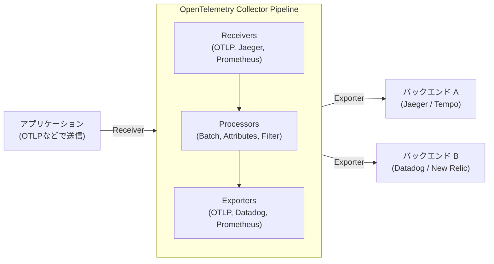

現代のソフトウェアアーキテクチャにおいて、マイクロサービスやサーバーレスといった分散システムはもはや特別なものではなくなりました。しかし、システムが分散化され、スケールアウトしやすくなる一方で、一つのリクエストが複数のサービスをまたいで処理されるようになり、システムの「今」を正確に把握し、問題が発生した際にその根本原因を特定することは非常に困難になっています。

このような背景から「可観測性（Observability：オブザーバビリティ）」という概念が重要視されるようになりました。そして、その可観測性を実現するための標準的なフレームワークとして、現在業界を席巻しているのが **OpenTelemetry**（オープンテレメトリ、略称: OTel）です。

本記事では、分散トレーシングの歴史的背景から、可観測性を構成する3つの柱（ログ・メトリクス・トレース）の統合、OpenTelemetry Collector のアーキテクチャ、W3C Trace Context によるコンテキスト伝播、そして Python と Go による具体的な計装（Instrumentation）のコード例に至るまで、OpenTelemetry を深く理解するための技術的な解説を行います。

## 1. 分散トレーシングの歴史的背景：Dapper から OpenTelemetry へ

OpenTelemetry が誕生するまでの歴史を振り返ることは、なぜこのプロジェクトがこれほどまでに重要なのかを理解する上で非常に有益です。

### 1.1 Google Dapper 論文の衝撃
分散システムのパフォーマンス分析やトラブルシューティングを目的とした「分散トレーシング（Distributed Tracing）」の概念は、2010年に Google が発表した論文 **"Dapper, a Large-Scale Distributed Systems Tracing Infrastructure"** によって広く知られるようになりました。

Dapper は、Google 社内の巨大なマイクロサービス群を流れるリクエストを、オーバーヘッドを最小限に抑えながら追跡するためのインフラストラクチャでした。この論文では、以下のような重要な概念が提示されました。
- **Trace（トレース）**: 1つのリクエスト全体を通した処理の流れ。
- **Span（スパン）**: トレースを構成する個々の作業単位（例えば、データベースへのクエリや外部API呼び出しなど）。
- **Context Propagation（コンテキスト伝播）**: リクエストIDやスパンIDをネットワーク境界を越えて伝播させる仕組み。

Dapper の考え方は、後のオープンソースプロジェクト（Twitter の Zipkin や Uber の Jaeger など）に多大な影響を与えました。

### 1.2 OpenTracing と OpenCensus の台頭
Dapper 論文以降、さまざまなトレーシングツールが登場しましたが、それぞれが独自の API やデータフォーマットを持っていたため、開発者は特定のベンダー（Datadog, New Relic, AWS X-Ray など）やツールにロックインされるという問題に直面しました。

この問題を解決するため、2つの大きなオープンソースプロジェクトが誕生しました。
1. **OpenTracing**: CNCF (Cloud Native Computing Foundation) がホストするプロジェクト。分散トレーシングのためのベンダー中立な API 仕様を策定することに特化していました。
2. **OpenCensus**: Google と Microsoft が主導するプロジェクト。トレーシングだけでなく、メトリクス収集の機能も提供し、様々なバックエンドにデータを送信できるライブラリを提供していました。

### 1.3 OpenTelemetry の誕生
OpenTracing と OpenCensus はどちらも広く使われるようになりましたが、機能が重複しており、コミュニティが分断される結果となりました。そこで、これら2つのプロジェクトを統合し、単一の標準を作り上げるために2019年に誕生したのが **OpenTelemetry** です。

現在、OpenTelemetry は Kubernetes に次ぐ CNCF の巨大なプロジェクトとして成長し、業界のデファクトスタンダードとなっています。

---

## 2. 可観測性（Observability）の3本柱の統合

可観測性を実現するためには、システム内部の状態を外部から推測するためのデータ（テレメトリーデータ）が必要です。これらは一般的に「可観測性の3本柱（Three Pillars of Observability）」と呼ばれます。

1. **Metrics（メトリクス）**: 
   - システムの状態を示す数値データの集まりです（CPU使用率、メモリ使用量、リクエスト数、エラー率など）。
   - 長期間の保存やダッシュボードでの傾向分析、アラートの発報に最適です。
2. **Logs（ログ）**: 
   - システムで発生した個別のイベントを記録したテキストまたは構造化データです。
   - 「何が起きたか」の詳細なコンテキストを提供します。
3. **Traces（トレース）**: 
   - リクエストが分散システム内のどのサービスを通ってどのように処理されたかを示すデータです。
   - ボトルネックの特定やサービス間の依存関係の把握に役立ちます。

### OpenTelemetry による統合の価値
これまでは、メトリクスは Prometheus、ログは Fluentd + Elasticsearch、トレースは Jaeger といったように、それぞれの柱に対して別々のエージェントやライブラリを導入する必要がありました。

OpenTelemetry は、これら **「メトリクス・ログ・トレース」の生成、収集、処理、エクスポートを単一の API / SDK / コレクターで統合** します。これにより、以下のメリットが生まれます。

- **エージェントの統合**: アプリケーション側で複数のライブラリを読み込んだり、インフラ側に複数のエージェントをデプロイする必要がなくなります。
- **相関関係（Correlation）の確保**: トレースIDをログに埋め込んだり、特定のエラーメトリクスから関連するトレースへジャンプしたりすることが容易になります。
- **ベンダー非依存**: データの送信先（バックエンド）を変更する際も、アプリケーションのコードを書き換える必要がなくなり、設定の変更だけで済みます。

---

## 3. W3C Trace Context とコンテキスト伝播

分散システムにおいてトレースを機能させるための最も重要なメカニズムが **コンテキスト伝播（Context Propagation）** です。

サービス A が サービス B を呼び出す際、サービス A は自身が現在どのトレース（リクエスト）を処理しているのかという情報（トレースIDや自身のスパンID）を、サービス B に伝える必要があります。これにより、サービス B は受け取ったリクエストがどの大きな処理の一部であるかを認識し、テレメトリーデータを正しく紐付けることができます。

### W3C Trace Context
かつては、各ツールが独自の HTTP ヘッダー（例: `X-B3-TraceId`, `X-Amzn-Trace-Id` など）を使用してコンテキストを伝播していました。これでは異なるトレーシングシステム間で相互運用性が保てません。

そこで標準化されたのが **W3C Trace Context** 仕様です。OpenTelemetry はデフォルトでこの W3C Trace Context を使用してコンテキスト伝播を行います。

W3C Trace Context では、主に以下の2つの HTTP ヘッダーを使用します。

1. **`traceparent` ヘッダー**: 
   - トレースID、親スパンID、サンプリングフラグなどを1つの文字列としてエンコードします。
   - フォーマット例: `00-4bf92f3577b34da6a3ce929d0e0e4736-00f067aa0ba902b7-01`
     - `00`: バージョン
     - `4bf92f3577b34da6a3ce929d0e0e4736`: Trace ID
     - `00f067aa0ba902b7`: Parent Span ID
     - `01`: Trace Flags（01 はサンプリングされることを示す）
2. **`tracestate` ヘッダー**: 
   - ベンダー固有のトレース情報などを Key-Value ペアで伝播するための拡張領域です。

OpenTelemetry のライブラリは、HTTP リクエストを送信する際に自動的にこれらのヘッダーを注入（Inject）し、リクエストを受信する際にヘッダーから抽出（Extract）する機能を持っています。

---

## 4. OpenTelemetry Collector のアーキテクチャ

OpenTelemetry Collector は、テレメトリーデータ（トレース、メトリクス、ログ）を受信、処理、エクスポートするためのベンダー中立なプロキシ/エージェントです。Collector を導入することで、アプリケーション側から直接バックエンド（Datadog や New Relic など）にデータを送るのではなく、Collector にデータを集約させることができます。

Collector は主に以下の3つのコンポーネントで構成されるパイプラインアーキテクチャを持っています。



### 4.1 Receiver（レシーバー）
アプリケーションや他のエージェントからデータを受け取る役割を持ちます。
プッシュ型（例: OTLP レシーバー、Jaeger レシーバー）とプル型（例: Prometheus レシーバー、ホストメトリクスレシーバー）の両方をサポートしています。

### 4.2 Processor（プロセッサー）
受信したデータをエクスポートする前に変換・加工・フィルタリングする役割を持ちます。
- **Batch Processor**: データを一定量または一定時間バッチ化し、ネットワークのオーバーヘッドを減らします（必須と推奨されるプロセッサです）。
- **Attributes Processor**: スパンやメトリクスに特定のタグ（環境名やバージョンなど）を追加したり、機密情報（パスワードやクレジットカード番号）をマスクしたりします。
- **Memory Limiter Processor**: Collector のメモリ使用量が一定の上限に達した場合に、データのドロップを行ってプロセスのクラッシュを防ぎます。

### 4.3 Exporter（エクスポーター）
処理されたデータをバックエンド（観測基盤）に送信する役割を持ちます。
一つのパイプラインから複数のエクスポーターにデータを送ることができるため、例えば「メトリクスは Prometheus へ、トレースは Jaeger と Datadog の両方へ送信する」といった柔軟なルーティングが設定ファイルだけで実現できます。

---

## 5. アプリケーションの計装 (Instrumentation)

アプリケーションからテレメトリーデータを生成するためには「計装（Instrumentation）」が必要です。OpenTelemetry では主に2つのアプローチがあります。

1. **自動計装 (Auto-Instrumentation)**:
   - アプリケーションのコードを変更することなく、言語のランタイムエージェント（Java, Python, Node.js など）や、eBPF を用いて自動的に標準ライブラリやフレームワーク（HTTP クライアント、データベースドライバなど）に計装を組み込みます。
2. **手動計装 (Manual Instrumentation)**:
   - 開発者がコード内に明示的に OpenTelemetry SDK の API を呼び出し、ビジネスロジックに特化したカスタムスパンや属性（Attributes）を追加します。

ここでは、自動計装と手動計装を組み合わせた Python と Go の実装例を見てみましょう。

### 5.1 Python による計装例

Python では `opentelemetry-instrument` コマンドを使用することで容易に自動計装が行えます。さらにコード内でカスタムスパンを作成する例を示します。

```python
from opentelemetry import trace
from opentelemetry.sdk.trace import TracerProvider
from opentelemetry.sdk.trace.export import BatchSpanProcessor
from opentelemetry.exporter.otlp.proto.grpc.trace_exporter import OTLPSpanExporter
from opentelemetry.sdk.resources import Resource
import time
import random

# 1. リソースの設定（サービス名など）
resource = Resource(attributes={
    "service.name": "python-payment-service",
    "service.version": "1.0.0"
})

# 2. TracerProviderの初期化と設定
provider = TracerProvider(resource=resource)
otlp_exporter = OTLPSpanExporter(endpoint="http://otel-collector:4317", insecure=True)
processor = BatchSpanProcessor(otlp_exporter)
provider.add_span_processor(processor)
trace.set_tracer_provider(provider)

# 3. トレーサーの取得
tracer = trace.get_tracer(__name__)

def process_payment(user_id: str, amount: float):
    # 手動でスパンを開始
    with tracer.start_as_current_span("process_payment_task") as span:
        # スパンに属性を追加
        span.set_attribute("payment.user_id", user_id)
        span.set_attribute("payment.amount", amount)
        
        try:
            # ビジネスロジックのシミュレーション
            time.sleep(random.uniform(0.1, 0.5))
            if amount > 10000:
                raise ValueError("Amount exceeds limit")
            
            span.add_event("Payment processed successfully")
            span.set_status(trace.StatusCode.OK)
            return True
            
        except Exception as e:
            # エラー時にスパンに例外情報を記録
            span.record_exception(e)
            span.set_status(trace.StatusCode.ERROR, str(e))
            raise

if __name__ == "__main__":
    try:
        process_payment("user-1234", 5000)
    except Exception:
        pass
```

Python の場合、Flask や FastAPI、Requests などの主要ライブラリに対する自動計装プラグインが提供されており、これらと手動計装をシームレスに連携できます。

### 5.2 Go による計装例

Go（Golang）は静的型付け言語であるため、Python のようなマジック（実行時の動的パッチなど）による完全な自動計装は難しく、コード内で明示的に `context.Context` を引き回す必要があります。これが「Context Propagation」を非常に意識させる作りになっています。

以下は、HTTP ハンドラー内でトレースを開始し、内部関数を呼び出す Go の例です。

```go
package main

import (
	"context"
	"fmt"
	"log"
	"net/http"
	"time"

	"go.opentelemetry.io/otel"
	"go.opentelemetry.io/otel/attribute"
	"go.opentelemetry.io/otel/exporters/otlp/otlptrace/otlptracegrpc"
	"go.opentelemetry.io/otel/sdk/resource"
	sdktrace "go.opentelemetry.io/otel/sdk/trace"
	semconv "go.opentelemetry.io/otel/semconv/v1.17.0"
	"go.opentelemetry.io/otel/trace"
)

// 初期化関数
func initProvider() (*sdktrace.TracerProvider, error) {
	ctx := context.Background()
	
	// OTLPエクスポーターの作成 (Collectorへ送信)
	exp, err := otlptracegrpc.New(ctx, otlptracegrpc.WithInsecure(), otlptracegrpc.WithEndpoint("otel-collector:4317"))
	if err != nil {
		return nil, err
	}

	res := resource.NewWithAttributes(
		semconv.SchemaURL,
		semconv.ServiceName("go-inventory-service"),
		semconv.ServiceVersion("1.0.0"),
	)

	tp := sdktrace.NewTracerProvider(
		sdktrace.WithBatcher(exp),
		sdktrace.WithResource(res),
	)
	
	// グローバルトレーサープロバイダを設定
	otel.SetTracerProvider(tp)
	return tp, nil
}

func checkInventory(ctx context.Context, itemID string) error {
	// コンテキストからトレーサーを取得し、子スパンを作成
	tracer := otel.Tracer("inventory-module")
	ctx, span := tracer.Start(ctx, "checkInventory_operation")
	defer span.End() // 関数終了時にスパンを閉じる

	span.SetAttributes(attribute.String("item.id", itemID))

	// 擬似的なデータベースクエリ
	time.Sleep(200 * time.Millisecond)
	
	span.AddEvent("Inventory check completed")
	return nil
}

func inventoryHandler(w http.ResponseWriter, r *http.Request) {
	// HTTPリクエストからコンテキストを取得し、ルートスパンを作成
	tracer := otel.Tracer("http-server")
	ctx, span := tracer.Start(r.Context(), "HTTP GET /inventory")
	defer span.End()

	itemID := r.URL.Query().Get("id")
	if itemID == "" {
		span.SetStatus(trace.StatusCodeError, "missing item id")
		http.Error(w, "missing item id", http.StatusBadRequest)
		return
	}

	// 内部関数へコンテキスト (ctx) を引き回す
	err := checkInventory(ctx, itemID)
	if err != nil {
		span.RecordError(err)
		span.SetStatus(trace.StatusCodeError, err.Error())
		http.Error(w, "internal error", http.StatusInternalServerError)
		return
	}

	span.SetStatus(trace.StatusCodeOk, "")
	w.WriteHeader(http.StatusOK)
	fmt.Fprintf(w, "Item %s is in stock", itemID)
}

func main() {
	tp, err := initProvider()
	if err != nil {
		log.Fatal(err)
	}
	// アプリケーション終了時に保留中のスパンをフラッシュ
	defer func() {
		if err := tp.Shutdown(context.Background()); err != nil {
			log.Fatal(err)
		}
	}()

	http.HandleFunc("/inventory", inventoryHandler)
	log.Println("Server listening on :8080")
	log.Fatal(http.ListenAndServe(":8080", nil))
}
```

Go の計装における最も重要なポイントは、関数シグネチャの第一引数に `ctx context.Context` を受け取り、それを次の関数へ確実に渡していく（Context Propagation）ことです。これにより、複数の関数呼び出しが単一のトレースツリーとして連結されます。

---

## 6. OpenTelemetry 導入におけるベストプラクティスと運用戦略

OpenTelemetry は強力なツールですが、本番環境に導入する際にはいくつかの課題と検討事項があります。

### 6.1 段階的な導入アプローチ
一度にすべてのサービス、すべてのテレメトリー（メトリクス、ログ、トレース）を導入しようとすると、移行コストが高くなり失敗するリスクがあります。
推奨されるアプローチは、**「まずは分散トレースから始める」** ことです。メトリクスやログは既存の基盤（Prometheus や ELK スタック）が機能しているケースが多いですが、分散システムにおけるトレースは OTel の恩恵を最も直接的に受けられる領域です。トレースが安定稼働した後に、メトリクス、最後にログ（現在 OTel のロギング仕様は GA になり普及が進んでいます）の順で移行していくのが良いでしょう。

### 6.2 サンプリング戦略（Sampling Strategy）
トラフィックの多いシステムにおいて、すべてのリクエスト（100%）をトレースとして記録・送信すると、ネットワーク帯域やバックエンドのストレージコストが膨大になります。これを防ぐためのサンプリング戦略には主に2つの方法があります。

- **Head-based Sampling**:
  - トレースの開始時点（最初のリクエストを受信した時点）で、そのトレースを記録するかどうか（例: 10%の確率で記録）を決定します。
  - 実装が簡単でオーバーヘッドが少ないですが、「エラーが発生したリクエストだけを確実に残す」といったことはできません（開始時点ではエラーになるか分からないため）。
- **Tail-based Sampling**:
  - リクエスト処理がすべて完了した後に、コレクター側で判断を行う方式です。
  - トレース全体を一時的にメモリにバッファリングし、「エラーが含まれているか」「処理時間が異常に長いか」を評価してから送信・破棄を決定します。
  - 価値の高いトレースのみを抽出できますが、コレクターに多くのメモリと高い処理能力（コンピュートリソース）が必要になります。

### 6.3 Collector のデプロイメントパターン
Collector のデプロイメントには大きく分けて「Agent（エージェント）パターン」と「Gateway（ゲートウェイ）パターン」があります。これらを組み合わせて運用するのが一般的です。

1. **Agent パターン**:
   - 各ノード（例: Kubernetes の DaemonSet や EC2 インスタンス内）に小規模な Collector をデプロイします。
   - アプリケーションは常に `localhost` にデータをプッシュすればよいため、ネットワークの複雑さが軽減されます。ホストのメトリクス（CPU/メモリ）を収集する役割も担います。
2. **Gateway パターン**:
   - クラスター外への通信を行う前段に、スケール可能な Collector のクラスターを独立して配置します。
   - Agent から送られてきたデータをここで集約し、Tail-based サンプリングや機密情報のスクラブ（フィルタリング）を行った上で、最終的なバックエンドプロバイダ（SaaS）へ送信します。
   - バックエンドの API キーの管理やトラフィックの制御をこのレイヤーに集約できるため、セキュリティと運用の観点で優れています。

---

## 7. まとめ

OpenTelemetry は、分散システムにおける「可観測性（Observability）」を確保するための極めて重要なオープンスタンダードです。ベンダーロックインを排除し、メトリクス・ログ・トレースという3つのテレメトリーデータを共通の仕様（OTLP）でシームレスに統合することで、障害調査の大幅な効率化とシステムの透明性向上をもたらします。

- **歴史的背景**: Google Dapper から始まり、OpenTracing と OpenCensus の統合を経て業界標準へ。
- **データ統合**: アプリケーション側の一元的な SDK と、Collector による柔軟なデータパイプライン。
- **コンテキスト伝播**: W3C Trace Context による標準化されたヘッダー伝播。
- **計装と運用**: 段階的な導入、適切なサンプリング設計、Gateway アーキテクチャの採用が鍵。

マイクロサービスアーキテクチャを採用している、あるいはこれから移行を検討しているチームにとって、OpenTelemetry への投資は将来のシステム運用において非常に高い ROI（費用対効果）をもたらすはずです。是非、お手元の環境で小さなサービスから OTel の計装を始めてみてください。
