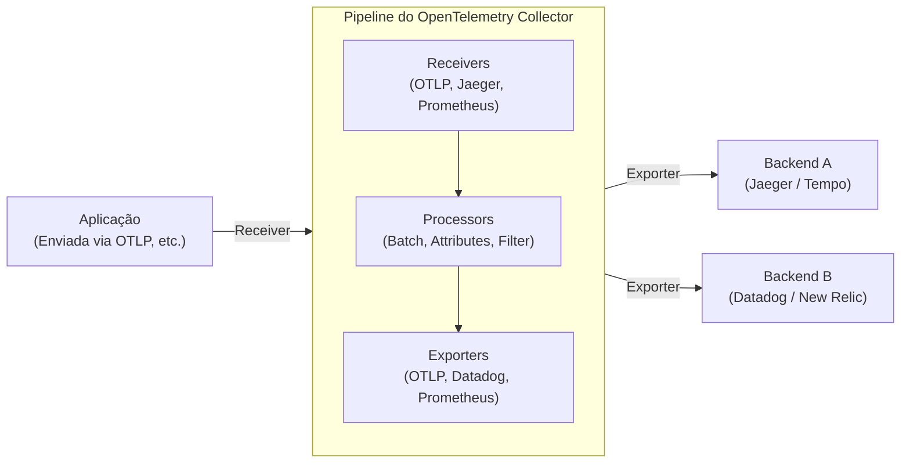

Na arquitetura de software moderna, sistemas distribuídos como microsserviços e serverless não são mais algo especial. No entanto, enquanto os sistemas se tornam descentralizados e mais fáceis de escalar, uma única requisição agora passa a ser processada por múltiplos serviços, o que torna extremamente difícil compreender o "agora" do sistema com precisão e identificar a causa raiz quando ocorre um problema.

Nesse contexto, o conceito de "Observabilidade" (Observability) ganhou grande importância. E a estrutura padrão que atualmente domina a indústria para alcançar essa observabilidade é o **OpenTelemetry** (abreviado: OTel).

Neste artigo, faremos uma explicação técnica para compreender profundamente o OpenTelemetry, desde o contexto histórico do tracing distribuído, passando pela integração dos 3 pilares da observabilidade (logs, métricas, traces), a arquitetura do OpenTelemetry Collector, a propagação de contexto através do W3C Trace Context e até exemplos práticos de código de instrumentação (Instrumentation) em Python e Go.

## 1. Contexto Histórico do Tracing Distribuído: Do Dapper ao OpenTelemetry

Revisar a história de como o OpenTelemetry surgiu é extremamente útil para entender por que este projeto é tão importante.

### 1.1 O Impacto do Artigo Google Dapper
O conceito de "Tracing Distribuído" (Distributed Tracing), cujo objetivo é a análise de desempenho e a resolução de problemas em sistemas distribuídos, tornou-se amplamente conhecido através do artigo **"Dapper, a Large-Scale Distributed Systems Tracing Infrastructure"**, publicado pelo Google em 2010.

O Dapper era uma infraestrutura para rastrear as requisições que fluíam pelos enormes grupos de microsserviços internos do Google, mantendo o overhead ao mínimo. Neste artigo, foram apresentados os seguintes conceitos fundamentais:
- **Trace (Rastreamento)**: O fluxo de processamento de uma requisição inteira de ponta a ponta.
- **Span (Extensão/Unidade de trabalho)**: Cada unidade de trabalho individual que compõe um trace (por exemplo, uma consulta a um banco de dados ou a chamada a uma API externa).
- **Context Propagation (Propagação de Contexto)**: O mecanismo de propagar o ID da requisição e o ID do span através dos limites da rede.

As ideias do Dapper influenciaram profundamente os projetos open source posteriores (como o Zipkin do Twitter e o Jaeger da Uber).

### 1.2 A Ascensão do OpenTracing e OpenCensus
Após o artigo sobre o Dapper, várias ferramentas de tracing surgiram, mas cada uma tinha suas próprias APIs e formatos de dados. Como resultado, os desenvolvedores enfrentaram o problema do lock-in de fornecedor (como Datadog, New Relic, AWS X-Ray, etc.) ou de ferramentas específicas.

Para resolver este problema, nasceram dois grandes projetos de código aberto:
1. **OpenTracing**: Um projeto hospedado pela CNCF (Cloud Native Computing Foundation). Seu foco era exclusivamente definir especificações de API neutras em relação a fornecedores para o tracing distribuído.
2. **OpenCensus**: Um projeto liderado pelo Google e pela Microsoft. Além do tracing, oferecia funcionalidades de coleta de métricas e bibliotecas que podiam enviar dados para vários backends.

### 1.3 O Nascimento do OpenTelemetry
Tanto o OpenTracing quanto o OpenCensus passaram a ser amplamente utilizados, mas suas funcionalidades se sobrepunham, resultando em uma fragmentação da comunidade. Assim, em 2019, o **OpenTelemetry** foi criado para unificar esses dois projetos e estabelecer um único padrão.

Atualmente, o OpenTelemetry cresceu e se tornou o maior projeto da CNCF logo após o Kubernetes, sendo o padrão de fato da indústria.

---

## 2. Integração dos 3 Pilares da Observabilidade (Observability)

Para alcançar a observabilidade, são necessários dados (dados de telemetria) que permitam inferir o estado interno do sistema a partir do exterior. Estes são geralmente chamados de "Os 3 Pilares da Observabilidade" (Three Pillars of Observability).

1. **Métricas (Metrics)**: 
   - Um conjunto de dados numéricos que indicam o estado do sistema (uso de CPU, uso de memória, número de requisições, taxa de erros, etc.).
   - São ideais para armazenamento de longo prazo, análise de tendências em dashboards e disparo de alertas.
2. **Logs**: 
   - Textos ou dados estruturados que registram eventos individuais que ocorreram no sistema.
   - Fornecem um contexto detalhado sobre "o que aconteceu".
3. **Traces**: 
   - Dados que mostram por quais serviços em um sistema distribuído uma requisição passou e como foi processada.
   - São úteis para identificar gargalos e compreender as dependências entre serviços.

### O Valor da Integração pelo OpenTelemetry
Até agora, era necessário introduzir agentes ou bibliotecas separadas para cada pilar, como o Prometheus para métricas, Fluentd + Elasticsearch para logs e Jaeger para traces.

O OpenTelemetry unifica a **geração, coleta, processamento e exportação destes "métricas, logs e traces" em uma única API / SDK / Collector**. Isso traz as seguintes vantagens:

- **Unificação de Agentes**: Elimina a necessidade de carregar múltiplas bibliotecas na aplicação ou implantar múltiplos agentes na infraestrutura.
- **Garantia de Correlação (Correlation)**: Torna mais fácil injetar IDs de trace em logs ou pular de uma métrica de erro específica para o trace relacionado.
- **Independência de Fornecedor**: Ao alterar o destino de envio dos dados (backend), não é mais necessário reescrever o código da aplicação; basta mudar as configurações.

---

## 3. W3C Trace Context e a Propagação de Contexto

O mecanismo mais importante para fazer o tracing funcionar em sistemas distribuídos é a **Propagação de Contexto (Context Propagation)**.

Quando o Serviço A chama o Serviço B, o Serviço A deve informar ao Serviço B qual trace (requisição) está sendo processado no momento (seu ID de trace e ID de span). Isso permite que o Serviço B reconheça de qual processamento maior a requisição recebida faz parte, associando corretamente os dados de telemetria.

### W3C Trace Context
No passado, cada ferramenta usava suas próprios cabeçalhos HTTP (ex: `X-B3-TraceId`, `X-Amzn-Trace-Id`) para propagar o contexto. Isso impedia a interoperabilidade entre diferentes sistemas de tracing.

Para resolver isso, a especificação **W3C Trace Context** foi padronizada. Por padrão, o OpenTelemetry usa este W3C Trace Context para realizar a propagação de contexto.

O W3C Trace Context utiliza principalmente os dois cabeçalhos HTTP a seguir:

1. **Cabeçalho `traceparent`**: 
   - Codifica o ID do trace, o ID do span pai, as flags de amostragem, etc., como uma única string.
   - Exemplo de formato: `00-4bf92f3577b34da6a3ce929d0e0e4736-00f067aa0ba902b7-01`
     - `00`: Versão
     - `4bf92f3577b34da6a3ce929d0e0e4736`: Trace ID
     - `00f067aa0ba902b7`: Parent Span ID
     - `01`: Trace Flags (01 indica que foi amostrado)
2. **Cabeçalho `tracestate`**: 
   - Uma área de extensão para propagar informações de rastreamento específicas do fornecedor como pares Chave-Valor (Key-Value).

As bibliotecas do OpenTelemetry possuem a funcionalidade de injetar (Inject) automaticamente esses cabeçalhos ao enviar requisições HTTP e extraí-los (Extract) dos cabeçalhos ao receber requisições.

---

## 4. Arquitetura do OpenTelemetry Collector

O OpenTelemetry Collector é um proxy/agente neutro em relação a fornecedores para receber, processar e exportar dados de telemetria (traces, métricas, logs). Ao adotar o Collector, em vez de enviar dados diretamente da aplicação para o backend (como Datadog ou New Relic), você pode centralizar os dados no Collector.

O Collector possui uma arquitetura de pipeline composta principalmente pelos três componentes a seguir.



### 4.1 Receiver (Receptor)
Sua função é receber dados de aplicações ou de outros agentes.
Suporta tanto os modelos baseados em push (ex: receptor OTLP, receptor Jaeger) quanto baseados em pull (ex: receptor Prometheus, receptor de métricas de host).

### 4.2 Processor (Processador)
Sua função é transformar, modificar ou filtrar os dados recebidos antes de exportá-los.
- **Batch Processor**: Agrupa os dados por uma quantidade definida ou por um determinado tempo, reduzindo o overhead da rede (é um processador obrigatório/recomendado).
- **Attributes Processor**: Adiciona tags específicas (como nome do ambiente ou versão) aos spans ou métricas, ou oculta informações confidenciais (senhas, números de cartão de crédito).
- **Memory Limiter Processor**: Evita que o processo trave ao descartar dados (drop) quando o uso de memória do Collector atinge um limite superior definido.

### 4.3 Exporter (Exportador)
Sua função é enviar os dados processados para os backends (infraestrutura de observabilidade).
Como os dados podem ser enviados de um único pipeline para múltiplos exportadores, é possível realizar roteamentos flexíveis apenas por meio de arquivos de configuração, como: "Enviar métricas para o Prometheus e traces para o Jaeger e Datadog".

---

## 5. Instrumentação da Aplicação (Instrumentation)

Para gerar dados de telemetria a partir da aplicação, é necessária a "Instrumentação" (Instrumentation). No OpenTelemetry, existem duas abordagens principais.

1. **Instrumentação Automática (Auto-Instrumentation)**:
   - Sem alterar o código da aplicação, utiliza os agentes de runtime da linguagem (Java, Python, Node.js, etc.) ou eBPF para injetar automaticamente a instrumentação nas bibliotecas padrão e frameworks (clientes HTTP, drivers de banco de dados, etc.).
2. **Instrumentação Manual (Manual Instrumentation)**:
   - Os desenvolvedores chamam explicitamente a API do OpenTelemetry SDK dentro do código e adicionam atributos (Attributes) e spans customizados específicos para a lógica de negócios.

Vejamos exemplos de implementação em Python e Go, combinando a instrumentação automática e a manual.

### 5.1 Exemplo de Instrumentação em Python

Em Python, a instrumentação automática pode ser facilmente realizada usando o comando `opentelemetry-instrument`. Além disso, aqui está um exemplo de como criar spans customizados no código.

```python
from opentelemetry import trace
from opentelemetry.sdk.trace import TracerProvider
from opentelemetry.sdk.trace.export import BatchSpanProcessor
from opentelemetry.exporter.otlp.proto.grpc.trace_exporter import OTLPSpanExporter
from opentelemetry.sdk.resources import Resource
import time
import random

# 1. Configuração de Recursos (nome do serviço, etc.)
resource = Resource(attributes={
    "service.name": "python-payment-service",
    "service.version": "1.0.0"
})

# 2. Inicialização e configuração do TracerProvider
provider = TracerProvider(resource=resource)
otlp_exporter = OTLPSpanExporter(endpoint="http://otel-collector:4317", insecure=True)
processor = BatchSpanProcessor(otlp_exporter)
provider.add_span_processor(processor)
trace.set_tracer_provider(provider)

# 3. Obter o tracer
tracer = trace.get_tracer(__name__)

def process_payment(user_id: str, amount: float):
    # Inicia um span manualmente
    with tracer.start_as_current_span("process_payment_task") as span:
        # Adiciona atributos ao span
        span.set_attribute("payment.user_id", user_id)
        span.set_attribute("payment.amount", amount)
        
        try:
            # Simulação da lógica de negócios
            time.sleep(random.uniform(0.1, 0.5))
            if amount > 10000:
                raise ValueError("Amount exceeds limit")
            
            span.add_event("Payment processed successfully")
            span.set_status(trace.StatusCode.OK)
            return True
            
        except Exception as e:
            # Registra informações de exceção no span em caso de erro
            span.record_exception(e)
            span.set_status(trace.StatusCode.ERROR, str(e))
            raise

if __name__ == "__main__":
    try:
        process_payment("user-1234", 5000)
    except Exception:
        pass
```

Para Python, plugins de instrumentação automática são fornecidos para as principais bibliotecas, como Flask, FastAPI e Requests, permitindo que elas se integrem perfeitamente com a instrumentação manual.

### 5.2 Exemplo de Instrumentação em Go

Como o Go (Golang) é uma linguagem tipada estaticamente, uma instrumentação automática completa por meio de "mágicas" como em Python (patches dinâmicos em tempo de execução, etc.) é difícil, sendo necessário passar explicitamente o `context.Context` no código. Isso faz com que a "Context Propagation" seja uma preocupação central no design do código.

O exemplo abaixo mostra como iniciar um trace dentro de um handler HTTP e como invocar uma função interna em Go.

```go
package main

import (
	"context"
	"fmt"
	"log"
	"net/http"
	"time"

	"go.opentelemetry.io/otel"
	"go.opentelemetry.io/otel/attribute"
	"go.opentelemetry.io/otel/exporters/otlp/otlptrace/otlptracegrpc"
	"go.opentelemetry.io/otel/sdk/resource"
	sdktrace "go.opentelemetry.io/otel/sdk/trace"
	semconv "go.opentelemetry.io/otel/semconv/v1.17.0"
	"go.opentelemetry.io/otel/trace"
)

// Função de inicialização
func initProvider() (*sdktrace.TracerProvider, error) {
	ctx := context.Background()
	
	// Criação do OTLP Exporter (Envia para o Collector)
	exp, err := otlptracegrpc.New(ctx, otlptracegrpc.WithInsecure(), otlptracegrpc.WithEndpoint("otel-collector:4317"))
	if err != nil {
		return nil, err
	}

	res := resource.NewWithAttributes(
		semconv.SchemaURL,
		semconv.ServiceName("go-inventory-service"),
		semconv.ServiceVersion("1.0.0"),
	)

	tp := sdktrace.NewTracerProvider(
		sdktrace.WithBatcher(exp),
		sdktrace.WithResource(res),
	)
	
	// Configura o provedor de tracer global
	otel.SetTracerProvider(tp)
	return tp, nil
}

func checkInventory(ctx context.Context, itemID string) error {
	// Obtém o tracer do contexto e cria um span filho
	tracer := otel.Tracer("inventory-module")
	ctx, span := tracer.Start(ctx, "checkInventory_operation")
	defer span.End() // Encerra o span ao finalizar a função

	span.SetAttributes(attribute.String("item.id", itemID))

	// Consulta pseudo-banco de dados
	time.Sleep(200 * time.Millisecond)
	
	span.AddEvent("Inventory check completed")
	return nil
}

func inventoryHandler(w http.ResponseWriter, r *http.Request) {
	// Obtém o contexto da requisição HTTP e cria o span raiz
	tracer := otel.Tracer("http-server")
	ctx, span := tracer.Start(r.Context(), "HTTP GET /inventory")
	defer span.End()

	itemID := r.URL.Query().Get("id")
	if itemID == "" {
		span.SetStatus(trace.StatusCodeError, "missing item id")
		http.Error(w, "missing item id", http.StatusBadRequest)
		return
	}

	// Passa o contexto (ctx) para a função interna
	err := checkInventory(ctx, itemID)
	if err != nil {
		span.RecordError(err)
		span.SetStatus(trace.StatusCodeError, err.Error())
		http.Error(w, "internal error", http.StatusInternalServerError)
		return
	}

	span.SetStatus(trace.StatusCodeOk, "")
	w.WriteHeader(http.StatusOK)
	fmt.Fprintf(w, "Item %s is in stock", itemID)
}

func main() {
	tp, err := initProvider()
	if err != nil {
		log.Fatal(err)
	}
	// Faz o flush de spans pendentes quando a aplicação terminar
	defer func() {
		if err := tp.Shutdown(context.Background()); err != nil {
			log.Fatal(err)
		}
	}()

	http.HandleFunc("/inventory", inventoryHandler)
	log.Println("Server listening on :8080")
	log.Fatal(http.ListenAndServe(":8080", nil))
}
```

O ponto mais importante na instrumentação em Go é receber `ctx context.Context` como o primeiro argumento na assinatura da função e propagá-lo adequadamente para as funções subsequentes (Context Propagation). Isso garante que múltiplas chamadas de funções sejam interligadas em uma única árvore de traces.

---

## 6. Melhores Práticas e Estratégias de Operação na Adoção do OpenTelemetry

O OpenTelemetry é uma ferramenta poderosa, mas há alguns desafios e considerações ao introduzi-lo em ambientes de produção.

### 6.1 Abordagem de Adoção em Fases
Tentar implementar tudo em todos os serviços e com todos os dados de telemetria (métricas, logs, traces) de uma só vez aumenta o custo de migração e o risco de fracasso.
A abordagem recomendada é **"começar primeiro pelo tracing distribuído"**. Em muitos casos, a infraestrutura existente (como Prometheus ou a stack ELK) já funciona bem para métricas e logs, mas o tracing em sistemas distribuídos é onde os benefícios do OTel podem ser mais aproveitados. Após a estabilização dos traces, seria melhor migrar as métricas e, por último, os logs (atualmente, a especificação de logging do OTel já está em GA e a adoção está crescendo).

### 6.2 Estratégia de Amostragem (Sampling Strategy)
Em sistemas de alto tráfego, gravar e enviar todas as requisições (100%) como traces resultará em um consumo massivo de banda de rede e nos custos de armazenamento no backend. Para evitar isso, há dois métodos principais para a estratégia de amostragem.

- **Head-based Sampling (Amostragem Baseada na Cabeça)**:
  - Decide se um trace deve ser gravado (por exemplo, 10% de probabilidade) logo no momento de início do trace (quando a primeira requisição é recebida).
  - É simples de implementar e possui baixo overhead, mas não permite "reter apenas requisições que tiveram erro" (já que no início não se sabe se ocorrerá um erro).
- **Tail-based Sampling (Amostragem Baseada na Cauda)**:
  - A decisão é tomada no lado do Collector após o processamento completo de toda a requisição.
  - O trace inteiro é colocado temporariamente em buffer na memória; o sistema avalia se "houve algum erro" ou se "o tempo de processamento foi anormalmente longo" antes de decidir enviar ou descartar.
  - Permite extrair apenas os traces de alto valor, mas exige mais memória e alto poder de processamento (recursos computacionais) do Collector.

### 6.3 Padrões de Implantação (Deployment Patterns) do Collector
O deployment do Collector pode ser amplamente dividido entre o "Padrão Agent" e o "Padrão Gateway". O uso combinado de ambos é a prática mais comum de operação.

1. **Padrão Agent (Agente)**:
   - Um Collector em pequena escala é implantado em cada nó (ex: em um DaemonSet do Kubernetes ou instâncias EC2).
   - As aplicações sempre enviam (push) os dados para o `localhost`, reduzindo a complexidade da rede. Também atua na coleta de métricas do host (CPU/memória).
2. **Padrão Gateway (Portal)**:
   - Um cluster independente e escalável de Collectors é colocado antes do tráfego sair do cluster.
   - Os dados enviados pelos Agents são centralizados aqui para realizar o Tail-based Sampling e o descarte/anonimização (scrubbing/filtering) de informações confidenciais antes do envio final para o provedor do backend (SaaS).
   - O gerenciamento das chaves de API dos backends e o controle de tráfego podem ser consolidados nesta camada, sendo excelente para segurança e operações.

---

## 7. Conclusão

O OpenTelemetry é um padrão aberto de extrema importância para garantir a "Observabilidade" (Observability) em sistemas distribuídos. Ao eliminar o lock-in de fornecedores e integrar perfeitamente as três dimensões de telemetria – métricas, logs e traces – através de uma especificação comum (OTLP), ele aumenta significativamente a transparência do sistema e a eficiência na investigação de falhas.

- **Contexto Histórico**: Começou com o Google Dapper e, por meio da fusão do OpenTracing e OpenCensus, tornou-se o padrão da indústria.
- **Integração de Dados**: Um SDK centralizado na aplicação e um pipeline flexível via Collector.
- **Propagação de Contexto**: Utilização da padronização de propagação de cabeçalhos pelo W3C Trace Context.
- **Instrumentação e Operações**: Os elementos chaves são a introdução em fases, um design adequado de amostragem e o uso de uma arquitetura baseada em Gateways.

Para equipes que já utilizam arquitetura de microsserviços ou planejam migrar para ela, investir no OpenTelemetry deve fornecer um Retorno de Investimento (ROI) muito alto nas futuras operações dos sistemas. Tente começar a implementar a instrumentação OTel em um serviço pequeno em seu ambiente local.
