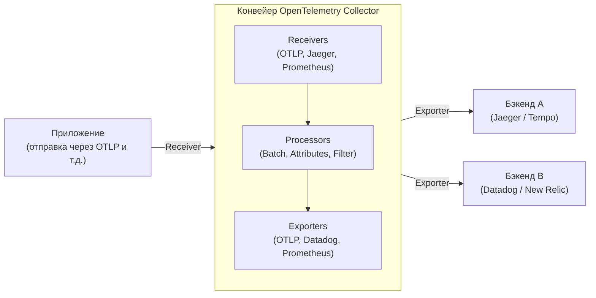

В современной архитектуре программного обеспечения распределенные системы, такие как микросервисы и serverless, больше не являются чем-то необычным. Однако, в то время как системы становятся распределенными и легко масштабируются, один запрос может обрабатываться сразу несколькими сервисами, что делает крайне сложной задачу точного понимания "текущего состояния" системы и выявления первопричин при возникновении проблем.

На фоне этого концепция «наблюдаемости» (Observability) стала приобретать важное значение. А в качестве стандартного фреймворка для реализации этой наблюдаемости сейчас в индустрии доминирует **OpenTelemetry** (сокращенно: OTel).

В этой статье будет представлен глубокий технический обзор для понимания OpenTelemetry: от исторического контекста распределенной трассировки до интеграции трех столпов наблюдаемости (логи, метрики, трассировки), архитектуры OpenTelemetry Collector, распространения контекста с помощью W3C Trace Context и конкретных примеров кода инструментовки (Instrumentation) на Python и Go.

## 1. Исторический контекст распределенной трассировки: От Dapper до OpenTelemetry

Оглянуться на историю создания OpenTelemetry очень полезно для понимания того, почему этот проект настолько важен.

### 1.1 Влияние статьи о Google Dapper
Концепция «распределенной трассировки» (Distributed Tracing), предназначенная для анализа производительности и устранения неполадок в распределенных системах, стала широко известной благодаря статье **"Dapper, a Large-Scale Distributed Systems Tracing Infrastructure"**, опубликованной Google в 2010 году.

Dapper был инфраструктурой для отслеживания запросов, проходящих через огромный набор микросервисов внутри Google, с минимизацией накладных расходов. В этой статье были представлены следующие важные концепции:
- **Трассировка (Trace)**: Поток обработки одного полного запроса от начала до конца.
- **Спан (Span)**: Отдельная единица работы, составляющая трассировку (например, запрос к базе данных или вызов внешнего API).
- **Распространение контекста (Context Propagation)**: Механизм передачи идентификаторов трассировки (Trace ID) и идентификаторов спанов (Span ID) через сетевые границы.

Идеи Dapper оказали огромное влияние на последующие проекты с открытым исходным кодом (такие как Zipkin от Twitter и Jaeger от Uber).

### 1.2 Появление OpenTracing и OpenCensus
После статьи о Dapper появилось множество различных инструментов трассировки, но каждый из них имел собственные API и форматы данных. В результате разработчики столкнулись с проблемой привязки к конкретным вендорам (Datadog, New Relic, AWS X-Ray и др.) и инструментам (vendor lock-in).

Для решения этой проблемы родились два крупных проекта с открытым исходным кодом:
1. **OpenTracing**: Проект, размещенный в CNCF (Cloud Native Computing Foundation). Он специализировался на разработке независимых от вендоров спецификаций API для распределенной трассировки.
2. **OpenCensus**: Проект, возглавляемый Google и Microsoft. Он предоставлял не только трассировку, но и функции сбора метрик, а также библиотеки, позволяющие отправлять данные в различные бэкенды.

### 1.3 Рождение OpenTelemetry
Хотя OpenTracing и OpenCensus стали широко использоваться, их функции дублировались, что привело к фрагментации сообщества. Поэтому в 2019 году был создан **OpenTelemetry**, чтобы объединить эти два проекта и создать единый стандарт.

Сегодня OpenTelemetry вырос в огромный проект CNCF, уступающий по масштабам только Kubernetes, и стал стандартом де-факто в индустрии.

---

## 2. Интеграция трех столпов наблюдаемости (Observability)

Для реализации наблюдаемости необходимы данные (телеметрические данные), позволяющие выводить внутреннее состояние системы извне. Обычно их называют «тремя столпами наблюдаемости» (Three Pillars of Observability).

1. **Метрики (Metrics)**: 
   - Набор числовых данных, отражающих состояние системы (загрузка процессора, использование памяти, количество запросов, уровень ошибок и т.д.).
   - Идеально подходят для длительного хранения, анализа тенденций на дашбордах и срабатывания оповещений (алертов).
2. **Логи (Logs)**: 
   - Текстовые или структурированные данные, регистрирующие отдельные события, произошедшие в системе.
   - Предоставляют детальный контекст того, "что произошло".
3. **Трассировки (Traces)**: 
   - Данные, показывающие, через какие сервисы распределенной системы прошел запрос и как он обрабатывался.
   - Полезны для выявления узких мест и понимания зависимостей между сервисами.

### Ценность интеграции с помощью OpenTelemetry
Раньше для каждого из столпов требовалось внедрять отдельные агенты и библиотеки, например: метрики — Prometheus, логи — Fluentd + Elasticsearch, трассировки — Jaeger.

OpenTelemetry **объединяет генерацию, сбор, обработку и экспорт "метрик, логов и трассировок" с помощью единого API / SDK / Коллектора**. Это дает следующие преимущества:

- **Интеграция агентов**: Отпадает необходимость загружать множество библиотек на стороне приложения или развертывать множество агентов на стороне инфраструктуры.
- **Обеспечение корреляции (Correlation)**: Становится легче внедрять ID трассировки в логи или переходить от конкретной метрики ошибок к связанной с ней трассировке.
- **Независимость от вендоров**: При изменении пункта назначения отправки данных (бэкенда) больше не нужно переписывать код приложения, достаточно изменить настройки.

---

## 3. W3C Trace Context и распространение контекста

Самым важным механизмом для обеспечения работы трассировки в распределенных системах является **распространение контекста (Context Propagation)**.

Когда Сервис A вызывает Сервис B, Сервис A должен передать Сервису B информацию о том, какую трассировку (запрос) он сейчас обрабатывает (Trace ID и свой Span ID). Благодаря этому Сервис B понимает, частью какого большого процесса является полученный запрос, и может правильно связать телеметрические данные.

### W3C Trace Context
Раньше каждый инструмент использовал собственные HTTP-заголовки (например, `X-B3-TraceId`, `X-Amzn-Trace-Id` и т.д.) для передачи контекста. Это не позволяло поддерживать интероперабельность между различными системами трассировки.

Именно поэтому была стандартизирована спецификация **W3C Trace Context**. По умолчанию OpenTelemetry использует этот W3C Trace Context для распространения контекста.

W3C Trace Context в основном использует следующие два HTTP-заголовка:

1. **Заголовок `traceparent`**: 
   - Кодирует Trace ID, Parent Span ID, флаги сэмплирования и прочее в виде одной строки.
   - Пример формата: `00-4bf92f3577b34da6a3ce929d0e0e4736-00f067aa0ba902b7-01`
     - `00`: Версия
     - `4bf92f3577b34da6a3ce929d0e0e4736`: Trace ID
     - `00f067aa0ba902b7`: Parent Span ID
     - `01`: Флаги трассировки (Trace Flags, 01 означает, что трассировка сэмплируется)
2. **Заголовок `tracestate`**: 
   - Область расширения для передачи информации о трассировке, специфичной для вендора, в виде пар ключ-значение.

Библиотеки OpenTelemetry имеют функцию автоматического внедрения (Inject) этих заголовков при отправке HTTP-запросов и их извлечения (Extract) из заголовков при получении запроса.

---

## 4. Архитектура OpenTelemetry Collector

OpenTelemetry Collector — это независимый от вендоров прокси/агент для приема, обработки и экспорта телеметрических данных (трассировок, метрик и логов). Внедряя Collector, вы можете агрегировать данные в нем, а не отправлять их напрямую из приложения в бэкенды (например, Datadog или New Relic).

Collector имеет конвейерную архитектуру (pipeline) и состоит в основном из следующих трех компонентов:



### 4.1 Receiver (Приемник)
Выполняет роль приема данных от приложений или других агентов.
Поддерживает как push-модель (например, OTLP Receiver, Jaeger Receiver), так и pull-модель (например, Prometheus Receiver, Host Metrics Receiver).

### 4.2 Processor (Процессор)
Отвечает за преобразование, модификацию и фильтрацию полученных данных перед их экспортом.
- **Batch Processor**: Пакетная обработка данных по определенному объему или времени для снижения сетевых накладных расходов (является обязательным и рекомендуемым процессором).
- **Attributes Processor**: Добавляет определенные теги (название среды, версия и т.д.) к спанам и метрикам или маскирует конфиденциальную информацию (пароли, номера кредитных карт).
- **Memory Limiter Processor**: Предотвращает сбои процесса (краш) путем отбрасывания данных, когда использование памяти коллектором достигает определенного верхнего предела.

### 4.3 Exporter (Экспортер)
Выполняет роль отправки обработанных данных в бэкенд (платформу наблюдаемости).
Поскольку данные можно отправлять в несколько экспортеров из одного конвейера, можно настроить гибкую маршрутизацию только с помощью конфигурационного файла, например: "Метрики отправлять в Prometheus, а трассировки — и в Jaeger, и в Datadog".

---

## 5. Инструментовка приложений (Instrumentation)

Для генерации телеметрических данных из приложения требуется "инструментовка" (Instrumentation). В OpenTelemetry существует два основных подхода.

1. **Автоматическая инструментовка (Auto-Instrumentation)**:
   - Без изменения кода приложения автоматически внедряет инструментовку в стандартные библиотеки и фреймворки (HTTP-клиенты, драйверы баз данных и т.д.) с помощью агентов среды выполнения языка (Java, Python, Node.js и т.д.) или с использованием eBPF.
2. **Ручная инструментовка (Manual Instrumentation)**:
   - Разработчик явно вызывает API OpenTelemetry SDK в коде и добавляет пользовательские спаны и атрибуты (Attributes), специфичные для бизнес-логики.

Давайте рассмотрим примеры реализации на Python и Go, сочетающие автоматическую и ручную инструментовку.

### 5.1 Пример инструментовки на Python

В Python автоматическую инструментовку можно легко выполнить с помощью команды `opentelemetry-instrument`. Ниже также показан пример создания пользовательского спана внутри кода.

```python
from opentelemetry import trace
from opentelemetry.sdk.trace import TracerProvider
from opentelemetry.sdk.trace.export import BatchSpanProcessor
from opentelemetry.exporter.otlp.proto.grpc.trace_exporter import OTLPSpanExporter
from opentelemetry.sdk.resources import Resource
import time
import random

# 1. Настройка ресурса (имя сервиса и т.д.)
resource = Resource(attributes={
    "service.name": "python-payment-service",
    "service.version": "1.0.0"
})

# 2. Инициализация и настройка TracerProvider
provider = TracerProvider(resource=resource)
otlp_exporter = OTLPSpanExporter(endpoint="http://otel-collector:4317", insecure=True)
processor = BatchSpanProcessor(otlp_exporter)
provider.add_span_processor(processor)
trace.set_tracer_provider(provider)

# 3. Получение трассировщика
tracer = trace.get_tracer(__name__)

def process_payment(user_id: str, amount: float):
    # Ручной запуск спана
    with tracer.start_as_current_span("process_payment_task") as span:
        # Добавление атрибутов к спану
        span.set_attribute("payment.user_id", user_id)
        span.set_attribute("payment.amount", amount)
        
        try:
            # Симуляция бизнес-логики
            time.sleep(random.uniform(0.1, 0.5))
            if amount > 10000:
                raise ValueError("Amount exceeds limit")
            
            span.add_event("Payment processed successfully")
            span.set_status(trace.StatusCode.OK)
            return True
            
        except Exception as e:
            # Запись информации об исключении в спан при ошибке
            span.record_exception(e)
            span.set_status(trace.StatusCode.ERROR, str(e))
            raise

if __name__ == "__main__":
    try:
        process_payment("user-1234", 5000)
    except Exception:
        pass
```

В случае Python предоставляются плагины автоматической инструментовки для основных библиотек, таких как Flask, FastAPI и Requests, и их можно легко интегрировать с ручной инструментовкой.

### 5.2 Пример инструментовки на Go

Поскольку Go (Golang) является статически типизированным языком, полная автоматическая инструментовка с помощью "магии" (например, динамических патчей во время выполнения), как в Python, затруднена. Необходимо явно передавать `context.Context` в коде. Это делает разработчика очень осознанным в отношении процесса распространения контекста (Context Propagation).

Ниже приведен пример на Go, в котором начинается трассировка внутри HTTP-обработчика и вызывается внутренняя функция.

```go
package main

import (
	"context"
	"fmt"
	"log"
	"net/http"
	"time"

	"go.opentelemetry.io/otel"
	"go.opentelemetry.io/otel/attribute"
	"go.opentelemetry.io/otel/exporters/otlp/otlptrace/otlptracegrpc"
	"go.opentelemetry.io/otel/sdk/resource"
	sdktrace "go.opentelemetry.io/otel/sdk/trace"
	semconv "go.opentelemetry.io/otel/semconv/v1.17.0"
	"go.opentelemetry.io/otel/trace"
)

// Функция инициализации
func initProvider() (*sdktrace.TracerProvider, error) {
	ctx := context.Background()
	
	// Создание OTLP экспортера (отправка в Collector)
	exp, err := otlptracegrpc.New(ctx, otlptracegrpc.WithInsecure(), otlptracegrpc.WithEndpoint("otel-collector:4317"))
	if err != nil {
		return nil, err
	}

	res := resource.NewWithAttributes(
		semconv.SchemaURL,
		semconv.ServiceName("go-inventory-service"),
		semconv.ServiceVersion("1.0.0"),
	)

	tp := sdktrace.NewTracerProvider(
		sdktrace.WithBatcher(exp),
		sdktrace.WithResource(res),
	)
	
	// Установка глобального провайдера трассировки
	otel.SetTracerProvider(tp)
	return tp, nil
}

func checkInventory(ctx context.Context, itemID string) error {
	// Получение трассировщика из контекста и создание дочернего спана
	tracer := otel.Tracer("inventory-module")
	ctx, span := tracer.Start(ctx, "checkInventory_operation")
	defer span.End() // Закрытие спана при завершении функции

	span.SetAttributes(attribute.String("item.id", itemID))

	// Имитация запроса к базе данных
	time.Sleep(200 * time.Millisecond)
	
	span.AddEvent("Inventory check completed")
	return nil
}

func inventoryHandler(w http.ResponseWriter, r *http.Request) {
	// Получение контекста из HTTP-запроса и создание корневого спана
	tracer := otel.Tracer("http-server")
	ctx, span := tracer.Start(r.Context(), "HTTP GET /inventory")
	defer span.End()

	itemID := r.URL.Query().Get("id")
	if itemID == "" {
		span.SetStatus(trace.StatusCodeError, "missing item id")
		http.Error(w, "missing item id", http.StatusBadRequest)
		return
	}

	// Передача контекста (ctx) во внутреннюю функцию
	err := checkInventory(ctx, itemID)
	if err != nil {
		span.RecordError(err)
		span.SetStatus(trace.StatusCodeError, err.Error())
		http.Error(w, "internal error", http.StatusInternalServerError)
		return
	}

	span.SetStatus(trace.StatusCodeOk, "")
	w.WriteHeader(http.StatusOK)
	fmt.Fprintf(w, "Item %s is in stock", itemID)
}

func main() {
	tp, err := initProvider()
	if err != nil {
		log.Fatal(err)
	}
	// Сброс (flush) ожидающих спанов при завершении работы приложения
	defer func() {
		if err := tp.Shutdown(context.Background()); err != nil {
			log.Fatal(err)
		}
	}()

	http.HandleFunc("/inventory", inventoryHandler)
	log.Println("Server listening on :8080")
	log.Fatal(http.ListenAndServe(":8080", nil))
}
```

Наиболее важным моментом при инструментовке в Go является то, что необходимо принимать `ctx context.Context` первым аргументом в сигнатуре функции и надежно передавать его в следующую функцию (Context Propagation). Это позволяет объединить несколько вызовов функций в единое дерево трассировки.

---

## 6. Лучшие практики и стратегии эксплуатации при внедрении OpenTelemetry

OpenTelemetry — мощный инструмент, но при его внедрении в производственную среду (production) есть несколько проблем и моментов, которые следует учитывать.

### 6.1 Поэтапный подход к внедрению
Если попытаться внедрить все телеметрические данные (метрики, логи, трассировки) для всех сервисов сразу, стоимость миграции будет высокой, и существует риск неудачи.
Рекомендуемый подход — **"начать с распределенной трассировки"**. Во многих случаях уже существуют рабочие платформы для метрик и логов (Prometheus, ELK-стек), но именно в области трассировки в распределенных системах можно получить наиболее прямую выгоду от OTel. После того как трассировки начнут стабильно работать, будет целесообразно переходить на метрики, а в последнюю очередь — на логи (в настоящее время спецификация логирования OTel достигла статуса GA и набирает популярность).

### 6.2 Стратегия сэмплирования (Sampling Strategy)
В системах с высоким трафиком запись и отправка всех запросов (100%) в качестве трассировок приведет к огромным затратам на пропускную способность сети и хранилище на бэкенде. Для предотвращения этого существуют два основных метода стратегии сэмплирования.

- **Head-based Sampling (Сэмплирование в начале)**:
  - Решение о том, записывать ли трассировку (например, с вероятностью 10%), принимается в начале трассировки (в момент получения первого запроса).
  - Легко реализуется и имеет низкие накладные расходы, но не позволяет сказать: "сохранять только те запросы, в которых произошла ошибка" (так как в начале неизвестно, возникнет ли ошибка).
- **Tail-based Sampling (Сэмплирование в конце)**:
  - Подход, при котором решение принимается на стороне коллектора после завершения всей обработки запроса.
  - Вся трассировка временно буферизуется в памяти, оценивается, "содержит ли она ошибки" или "не была ли обработка аномально долгой", после чего принимается решение об отправке или удалении.
  - Позволяет извлекать только ценные трассировки, но требует от коллектора больше памяти и высокой вычислительной мощности (вычислительных ресурсов).

### 6.3 Паттерны развертывания Collector
Развертывание Collector можно разделить на два основных паттерна: «Паттерн Agent (Агент)» и «Паттерн Gateway (Шлюз)». Обычно их комбинируют на практике.

1. **Паттерн Agent**:
   - На каждом узле (например, в Kubernetes DaemonSet или внутри EC2-инстанса) развертывается небольшой Collector.
   - Приложению всегда достаточно просто отправлять данные (push) на `localhost`, что снижает сетевую сложность. Он также берет на себя роль сбора хостовых метрик (CPU/память).
2. **Паттерн Gateway**:
   - Независимый масштабируемый кластер Collector-ов размещается перед отправкой данных за пределы кластера.
   - Данные, отправляемые от Agent-ов, агрегируются здесь, применяется Tail-based сэмплирование и очистка (фильтрация) конфиденциальной информации, после чего они отправляются к конечному провайдеру бэкенда (SaaS).
   - Централизация управления API-ключами бэкенда и контроля трафика на этом уровне является преимуществом с точки зрения безопасности и эксплуатации.

---

## 7. Заключение

OpenTelemetry является чрезвычайно важным открытым стандартом для обеспечения «наблюдаемости» (Observability) в распределенных системах. Устраняя привязку к вендорам (vendor lock-in) и бесшовно интегрируя три вида телеметрических данных (метрики, логи, трассировки) через общую спецификацию (OTLP), он значительно повышает эффективность расследования сбоев и улучшает прозрачность системы.

- **Исторический контекст**: Начиная с Google Dapper, через объединение OpenTracing и OpenCensus, к отраслевому стандарту.
- **Интеграция данных**: Единый SDK на стороне приложения и гибкий конвейер данных благодаря Collector.
- **Распространение контекста**: Стандартизированная передача заголовков с помощью W3C Trace Context.
- **Инструментовка и эксплуатация**: Поэтапное внедрение, правильный дизайн сэмплирования и использование архитектуры Gateway являются ключами к успеху.

Для команд, использующих микросервисную архитектуру или рассматривающих переход на нее, инвестиции в OpenTelemetry принесут очень высокий показатель ROI (возврат инвестиций) в будущей эксплуатации системы. Попробуйте начать внедрять инструментовку OTel с небольшого сервиса в вашем собственном окружении!
