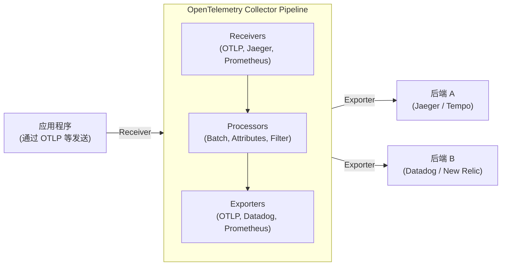

现代软件架构中，微服务和无服务器等分布式系统已经不再是什么新鲜事物。然而，虽然系统变得分布式且易于横向扩展，但一个请求往往需要跨越多个服务进行处理。这就导致准确掌握系统的“当前状态”，以及在出现问题时定位根本原因变得极其困难。

在这种背景下，“可观测性（Observability）”的概念开始受到高度重视。而目前席卷业界、用于实现可观测性的标准框架正是 **OpenTelemetry**（简称：OTel）。

本文将带您深入理解 OpenTelemetry，从分布式追踪的历史背景，到构成可观测性的三大支柱（日志、指标、追踪）的整合、OpenTelemetry Collector 的架构、基于 W3C Trace Context 的上下文传播，以及具体的 Python 和 Go 语言的插桩（Instrumentation）代码示例，进行全面的技术解析。

## 1. 分布式追踪的历史背景：从 Dapper 到 OpenTelemetry

回顾 OpenTelemetry 诞生之前的历史，对于理解为什么这个项目如此重要非常有帮助。

### 1.1 Google Dapper 论文的冲击
为了对分布式系统进行性能分析和故障排查，“分布式追踪（Distributed Tracing）”的概念随着 2010 年 Google 发表的论文 **"Dapper, a Large-Scale Distributed Systems Tracing Infrastructure"** 而广为人知。

Dapper 是一个在尽量降低开销的情况下，追踪流经 Google 内部庞大微服务群的请求的基础架构。在这篇论文中，提出了以下几个重要概念：
- **Trace（追踪/链路）**: 贯穿整个请求处理流程的轨迹。
- **Span（跨度/操作）**: 构成 Trace 的各个独立工作单元（例如：对数据库的查询或调用外部 API）。
- **Context Propagation（上下文传播）**: 跨越网络边界传递请求 ID 或 Span ID 的机制。

Dapper 的理念对后来的开源项目（如 Twitter 的 Zipkin 和 Uber 的 Jaeger 等）产生了深远的影响。

### 1.2 OpenTracing 与 OpenCensus 的崛起
在 Dapper 论文之后，各种追踪工具相继出现，但它们各自拥有独立的 API 和数据格式。这导致开发人员面临被锁定在特定供应商（如 Datadog、New Relic、AWS X-Ray 等）或工具中的问题。

为了解决这个问题，诞生了两个大型开源项目：
1. **OpenTracing**: 由 CNCF (Cloud Native Computing Foundation) 托管的项目。它专门致力于制定用于分布式追踪的、供应商中立的 API 规范。
2. **OpenCensus**: 由 Google 和 Microsoft 主导的项目。它不仅提供追踪功能，还提供指标收集功能，并提供了能够将数据发送到各种后端的库。

### 1.3 OpenTelemetry 的诞生
尽管 OpenTracing 和 OpenCensus 都得到了广泛应用，但它们在功能上存在重叠，导致了社区的分裂。于是，为了整合这两个项目并打造一个单一的标准，**OpenTelemetry** 于 2019 年应运而生。

如今，OpenTelemetry 已经成长为 CNCF 旗下仅次于 Kubernetes 的庞大项目，并成为业界的绝对标准（De facto standard）。

---

## 2. 可观测性（Observability）三大支柱的整合

为了实现可观测性，我们需要能够从外部推测系统内部状态的数据（遥测数据，Telemetry Data）。这些数据通常被称为“可观测性的三大支柱（Three Pillars of Observability）”。

1. **Metrics（指标）**: 
   - 表示系统状态的数值数据集合（如 CPU 使用率、内存使用量、请求数、错误率等）。
   - 非常适合长期保存、仪表盘趋势分析以及触发告警。
2. **Logs（日志）**: 
   - 记录系统中发生的独立事件的文本或结构化数据。
   - 提供“发生了什么”的详细上下文。
3. **Traces（追踪/链路）**: 
   - 展示请求在分布式系统内经过了哪些服务以及是如何被处理的数据。
   - 有助于定位性能瓶颈和掌握服务间的依赖关系。

### OpenTelemetry 整合的价值
在过去，我们需要为这三大支柱分别引入不同的代理（Agent）或库。比如指标用 Prometheus，日志用 Fluentd + Elasticsearch，追踪用 Jaeger。

OpenTelemetry 则**通过单一的 API / SDK / Collector 将这“指标、日志、追踪”的生成、收集、处理和导出进行了整合**。这带来了以下优势：

- **代理的统一**: 不再需要在应用程序端引入多个库，也不需要在基础设施端部署多个代理。
- **确保相关性（Correlation）**: 可以轻松地将 Trace ID 嵌入到日志中，或者从特定的错误指标直接跳转到相关的链路追踪。
- **供应商中立**: 在更改数据发送目标（后端）时，无需修改应用程序的代码，只需更改配置即可。

---

## 3. W3C Trace Context 与上下文传播

在分布式系统中，让追踪发挥作用的最重要机制就是**上下文传播（Context Propagation）**。

当服务 A 调用服务 B 时，服务 A 必须将自身当前正在处理哪个 Trace（请求）的信息（Trace ID 以及自身的 Span ID）传递给服务 B。这样一来，服务 B 就能识别出接收到的请求是哪个大型处理流程的一部分，从而正确地关联遥测数据。

### W3C Trace Context
过去，各工具都使用自己专有的 HTTP 请求头（例如：`X-B3-TraceId`、`X-Amzn-Trace-Id` 等）来传播上下文。这导致在不同的追踪系统之间无法保持互操作性。

为此，**W3C Trace Context** 规范被制定出来作为标准。OpenTelemetry 默认使用此 W3C Trace Context 进行上下文传播。

W3C Trace Context 主要使用以下两个 HTTP 请求头：

1. **`traceparent` 请求头**: 
   - 将 Trace ID、父 Span ID、采样标志等编码为一个字符串。
   - 格式示例: `00-4bf92f3577b34da6a3ce929d0e0e4736-00f067aa0ba902b7-01`
     - `00`: 版本号
     - `4bf92f3577b34da6a3ce929d0e0e4736`: Trace ID
     - `00f067aa0ba902b7`: Parent Span ID
     - `01`: Trace Flags（01 表示被采样）
2. **`tracestate` 请求头**: 
   - 这是一个扩展区域，用于以键值对（Key-Value）的形式传播特定于供应商的追踪信息等。

OpenTelemetry 的库在发送 HTTP 请求时会自动注入（Inject）这些请求头，并在接收请求时从请求头中提取（Extract）它们。

---

## 4. OpenTelemetry Collector 的架构

OpenTelemetry Collector 是一个供应商中立的代理/收集器，用于接收、处理和导出遥测数据（追踪、指标、日志）。通过引入 Collector，应用程序无需直接将数据发送到后端（如 Datadog 或 New Relic 等），而是可以将数据集中发送给 Collector。

Collector 主要由以下三个组件构成的管道（Pipeline）架构：



### 4.1 Receiver（接收器）
负责从应用程序或其他代理接收数据。
它同时支持推送型（例如：OTLP Receiver、Jaeger Receiver）和拉取型（例如：Prometheus Receiver、Host Metrics Receiver）。

### 4.2 Processor（处理器）
负责在导出接收到的数据之前，对其进行转换、加工和过滤。
- **Batch Processor**: 将数据分批（按一定数量或一定时间）处理，以减少网络开销（这是必须且推荐使用的处理器）。
- **Attributes Processor**: 为 Span 或指标添加特定的标签（如环境名称或版本号等），或者对敏感信息（如密码或信用卡号）进行脱敏掩码处理。
- **Memory Limiter Processor**: 当 Collector 的内存使用量达到一定上限时，丢弃数据以防止进程崩溃。

### 4.3 Exporter（导出器）
负责将处理后的数据发送到后端（可观测性平台）。
由于可以从一个管道将数据发送给多个导出器，因此仅通过配置文件即可实现灵活的路由功能，例如“将指标发送到 Prometheus，将追踪同时发送给 Jaeger 和 Datadog”。

---

## 5. 应用程序的插桩 (Instrumentation)

为了从应用程序中生成遥测数据，需要进行“插桩（Instrumentation）”。在 OpenTelemetry 中主要有两种方法：

1. **自动插桩 (Auto-Instrumentation)**:
   - 无需修改应用程序的代码，通过语言的运行时代理（如 Java, Python, Node.js 等）或使用 eBPF，自动在标准库和框架（HTTP 客户端、数据库驱动等）中嵌入插桩代码。
2. **手动插桩 (Manual Instrumentation)**:
   - 开发人员在代码中显式地调用 OpenTelemetry SDK 的 API，添加特定于业务逻辑的自定义 Span 或属性（Attributes）。

在这里，我们将结合自动插桩和手动插桩，看看 Python 和 Go 的具体实现示例。

### 5.1 Python 的插桩示例

在 Python 中，可以使用 `opentelemetry-instrument` 命令轻松实现自动插桩。下面展示了如何在代码中进一步创建自定义 Span 的示例。

```python
from opentelemetry import trace
from opentelemetry.sdk.trace import TracerProvider
from opentelemetry.sdk.trace.export import BatchSpanProcessor
from opentelemetry.exporter.otlp.proto.grpc.trace_exporter import OTLPSpanExporter
from opentelemetry.sdk.resources import Resource
import time
import random

# 1. 资源配置（如服务名称等）
resource = Resource(attributes={
    "service.name": "python-payment-service",
    "service.version": "1.0.0"
})

# 2. TracerProvider 的初始化和配置
provider = TracerProvider(resource=resource)
otlp_exporter = OTLPSpanExporter(endpoint="http://otel-collector:4317", insecure=True)
processor = BatchSpanProcessor(otlp_exporter)
provider.add_span_processor(processor)
trace.set_tracer_provider(provider)

# 3. 获取 Tracer
tracer = trace.get_tracer(__name__)

def process_payment(user_id: str, amount: float):
    # 手动开始一个 Span
    with tracer.start_as_current_span("process_payment_task") as span:
        # 为 Span 添加属性
        span.set_attribute("payment.user_id", user_id)
        span.set_attribute("payment.amount", amount)
        
        try:
            # 模拟业务逻辑
            time.sleep(random.uniform(0.1, 0.5))
            if amount > 10000:
                raise ValueError("Amount exceeds limit")
            
            span.add_event("Payment processed successfully")
            span.set_status(trace.StatusCode.OK)
            return True
            
        except Exception as e:
            # 发生错误时，在 Span 中记录异常信息
            span.record_exception(e)
            span.set_status(trace.StatusCode.ERROR, str(e))
            raise

if __name__ == "__main__":
    try:
        process_payment("user-1234", 5000)
    except Exception:
        pass
```

对于 Python，社区提供了针对 Flask、FastAPI、Requests 等主流库的自动插桩插件，并且可以与手动插桩无缝结合。

### 5.2 Go 的插桩示例

由于 Go（Golang）是一种静态类型语言，很难像 Python 那样通过魔法（如运行时的动态补丁等）实现完全的自动插桩，因此需要在代码中显式地传递 `context.Context`。这种设计使得开发者必须高度关注“上下文传播（Context Propagation）”。

以下是在 HTTP 处理器中启动 Trace，并调用内部函数的 Go 示例。

```go
package main

import (
	"context"
	"fmt"
	"log"
	"net/http"
	"time"

	"go.opentelemetry.io/otel"
	"go.opentelemetry.io/otel/attribute"
	"go.opentelemetry.io/otel/exporters/otlp/otlptrace/otlptracegrpc"
	"go.opentelemetry.io/otel/sdk/resource"
	sdktrace "go.opentelemetry.io/otel/sdk/trace"
	semconv "go.opentelemetry.io/otel/semconv/v1.17.0"
	"go.opentelemetry.io/otel/trace"
)

// 初始化函数
func initProvider() (*sdktrace.TracerProvider, error) {
	ctx := context.Background()
	
	// 创建 OTLP 导出器 (发送至 Collector)
	exp, err := otlptracegrpc.New(ctx, otlptracegrpc.WithInsecure(), otlptracegrpc.WithEndpoint("otel-collector:4317"))
	if err != nil {
		return nil, err
	}

	res := resource.NewWithAttributes(
		semconv.SchemaURL,
		semconv.ServiceName("go-inventory-service"),
		semconv.ServiceVersion("1.0.0"),
	)

	tp := sdktrace.NewTracerProvider(
		sdktrace.WithBatcher(exp),
		sdktrace.WithResource(res),
	)
	
	// 设置全局 TracerProvider
	otel.SetTracerProvider(tp)
	return tp, nil
}

func checkInventory(ctx context.Context, itemID string) error {
	// 从上下文中获取 Tracer，并创建子 Span
	tracer := otel.Tracer("inventory-module")
	ctx, span := tracer.Start(ctx, "checkInventory_operation")
	defer span.End() // 函数结束时关闭 Span

	span.SetAttributes(attribute.String("item.id", itemID))

	// 模拟数据库查询
	time.Sleep(200 * time.Millisecond)
	
	span.AddEvent("Inventory check completed")
	return nil
}

func inventoryHandler(w http.ResponseWriter, r *http.Request) {
	// 从 HTTP 请求中获取上下文，并创建根 Span
	tracer := otel.Tracer("http-server")
	ctx, span := tracer.Start(r.Context(), "HTTP GET /inventory")
	defer span.End()

	itemID := r.URL.Query().Get("id")
	if itemID == "" {
		span.SetStatus(trace.StatusCodeError, "missing item id")
		http.Error(w, "missing item id", http.StatusBadRequest)
		return
	}

	// 将上下文 (ctx) 传递给内部函数
	err := checkInventory(ctx, itemID)
	if err != nil {
		span.RecordError(err)
		span.SetStatus(trace.StatusCodeError, err.Error())
		http.Error(w, "internal error", http.StatusInternalServerError)
		return
	}

	span.SetStatus(trace.StatusCodeOk, "")
	w.WriteHeader(http.StatusOK)
	fmt.Fprintf(w, "Item %s is in stock", itemID)
}

func main() {
	tp, err := initProvider()
	if err != nil {
		log.Fatal(err)
	}
	// 应用程序结束时刷新挂起的 Span
	defer func() {
		if err := tp.Shutdown(context.Background()); err != nil {
			log.Fatal(err)
		}
	}()

	http.HandleFunc("/inventory", inventoryHandler)
	log.Println("Server listening on :8080")
	log.Fatal(http.ListenAndServe(":8080", nil))
}
```

Go 插桩中最重要的一点是，在函数签名中必须将 `ctx context.Context` 作为第一个参数接收，并确保将其传递给下一个函数（上下文传播）。通过这种方式，多个函数调用将被连接成一个单一的追踪树（Trace Tree）。

---

## 6. 引入 OpenTelemetry 的最佳实践与运维策略

OpenTelemetry 是一款强大的工具，但在将其引入生产环境时，也有一些需要克服的挑战和考量因素。

### 6.1 阶段性引入策略
如果试图一次性为所有服务、所有遥测数据（指标、日志、追踪）引入 OTel，迁移成本会非常高，且失败风险很大。
推荐的策略是**“首先从分布式追踪开始”**。对于指标和日志，很多情况下现有的基础设施（如 Prometheus 或 ELK 技术栈）已经能够良好运作，而在分布式系统中的追踪才是最能直接体现 OTel 价值的领域。在链路追踪稳定运行之后，再依次将指标和日志（目前 OTel 的日志规范已达到 GA，普及度越来越高）进行迁移才是明智之举。

### 6.2 采样策略（Sampling Strategy）
在流量巨大的系统中，如果记录并发送所有请求（100%）的追踪信息，会消耗庞大的网络带宽和后端存储成本。为了防止这种情况发生，主要有以下两种采样策略：

- **基于头部的采样 (Head-based Sampling)**:
  - 在 Trace 开始的那一刻（接收到第一个请求时），就决定是否记录该 Trace（例如：以 10% 的概率记录）。
  - 实现简单且开销低，但无法做到“只确实保留发生错误的请求”（因为在开始时还无法得知是否会发生错误）。
- **基于尾部的采样 (Tail-based Sampling)**:
  - 在请求处理全部完成后，由 Collector 端进行判断的模式。
  - 将整个 Trace 临时缓冲到内存中，评估“是否包含错误”或“处理时间是否异常地长”之后，再决定是发送还是丢弃。
  - 这种方式可以仅提取高价值的追踪信息，但需要 Collector 具备大量的内存和强大的处理能力（计算资源）。

### 6.3 Collector 的部署模式
Collector 的部署大致可分为“代理模式（Agent Pattern）”和“网关模式（Gateway Pattern）”。在实际运用中，通常会将二者结合起来。

1. **代理模式 (Agent Pattern)**:
   - 在每个节点（例如：Kubernetes 的 DaemonSet 或 EC2 实例内）部署一个小规模的 Collector。
   - 应用程序只需始终将数据推送到 `localhost`，从而降低了网络的复杂性。它也承担着收集主机级指标（CPU/内存）的任务。
2. **网关模式 (Gateway Pattern)**:
   - 在向集群外进行通信的前置位置，独立部署一个可横向扩展的 Collector 集群。
   - 代理（Agent）发送来的数据会集中在这里，经过基于尾部的采样（Tail-based Sampling）和敏感信息脱敏（过滤）后，最终发送给后端提供商（SaaS）。
   - 由于可以将后端的 API 密钥管理和流量控制集中在这一层，因此在安全性和运维方面具有优势。

---

## 7. 总结

OpenTelemetry 是确保分布式系统中“可观测性（Observability）”的至关重要的开放标准。它消除了供应商锁定，并通过统一的规范（OTLP）无缝整合了指标、日志和追踪这三种遥测数据，从而大幅提高了故障排查的效率并提升了系统的透明度。

- **历史背景**: 起源于 Google Dapper，经过 OpenTracing 和 OpenCensus 的整合，最终成为行业标准。
- **数据整合**: 应用程序端统一的 SDK 和 Collector 灵活的数据管道。
- **上下文传播**: 基于 W3C Trace Context 规范的请求头传播机制。
- **插桩与运维**: 阶段性引入、合理的采样设计以及采用网关架构是成功的关键。

对于已经采用微服务架构，或正考虑向微服务转型的团队而言，投资 OpenTelemetry 必将为您未来的系统运维带来极高的投资回报率（ROI）。请务必尝试在您的环境中挑选一个小型的服务，开始体验 OTel 的插桩吧！
