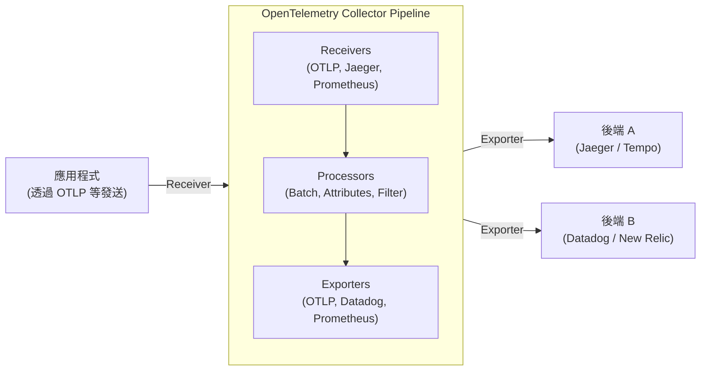

在現代的軟體架構中，微服務和無伺服器 (Serverless) 等分散式系統已經不再是特例。然而，在系統變得分散且更容易向外擴展 (Scale-out) 的同時，單一請求也會橫跨多個服務進行處理，這使得準確掌握系統的「當下狀態」，並在發生問題時找出根本原因變得非常困難。

基於這樣的背景，「可觀測性（Observability）」的概念開始受到重視。而作為實現該可觀測性的標準化框架，目前席捲整個業界的就是 **OpenTelemetry**（簡稱: OTel）。

本篇文章將從分散式追蹤 (Distributed Tracing) 的歷史背景出發，涵蓋可觀測性三大支柱（日誌、指標、追蹤）的整合、OpenTelemetry Collector 的架構、透過 W3C Trace Context 進行的上下文傳播 (Context Propagation)，直到使用 Python 和 Go 進行具體埋點 (Instrumentation) 的程式碼範例，為您帶來深入理解 OpenTelemetry 的技術解說。

## 1. 分散式追蹤的歷史背景：從 Dapper 到 OpenTelemetry

回顧 OpenTelemetry 誕生之前的歷史，對於理解為何這個專案如此重要非常有幫助。

### 1.1 Google Dapper 論文的衝擊
旨在進行分散式系統效能分析與故障排除的「分散式追蹤（Distributed Tracing）」概念，在 2010 年 Google 發布了論文 **"Dapper, a Large-Scale Distributed Systems Tracing Infrastructure"** 之後開始廣為人知。

Dapper 是一個基礎設施，用於在將額外開銷 (Overhead) 降至最低的情況下，追蹤流經 Google 內部龐大微服務群的請求。這篇論文提出了以下幾個重要概念：
- **Trace（追蹤）**: 貫穿整個單一請求的處理流程。
- **Span（跨度）**: 構成追蹤的各個工作單位（例如：對資料庫的查詢或呼叫外部 API 等）。
- **Context Propagation（上下文傳播）**: 跨越網路邊界傳遞請求 ID 或跨度 ID 的機制。

Dapper 的思維對後來開源專案（如 Twitter 的 Zipkin 與 Uber 的 Jaeger 等）產生了深遠的影響。

### 1.2 OpenTracing 與 OpenCensus 的崛起
自 Dapper 論文發表後，出現了各種追蹤工具，但由於各自擁有專屬的 API 與資料格式，導致開發者面臨被特定供應商（Datadog、New Relic、AWS X-Ray 等）或工具鎖定 (Vendor Lock-in) 的問題。

為了解決這個問題，誕生了兩個大型開源專案：
1. **OpenTracing**: 由 CNCF (Cloud Native Computing Foundation) 託管的專案。專注於為分散式追蹤制定供應商中立的 API 規範。
2. **OpenCensus**: 由 Google 和 Microsoft 主導的專案。不僅提供追蹤，還具備指標收集的功能，並提供能將資料傳送至各種後端系統的函式庫。

### 1.3 OpenTelemetry 的誕生
儘管 OpenTracing 和 OpenCensus 都被廣泛使用，但它們的功能存在重疊，導致社群分裂。因此，為將這兩個專案整合並建立單一標準，**OpenTelemetry** 於 2019 年應運而生。

目前，OpenTelemetry 已成長為 CNCF 中僅次於 Kubernetes 的龐大專案，並成為業界的實質標準 (De facto standard)。

---

## 2. 可觀測性（Observability）三大支柱的整合

為了實現可觀測性，我們需要資料（遙測資料, Telemetry Data）來從外部推測系統內部的狀態。這些通常被稱為「可觀測性的三大支柱（Three Pillars of Observability）」。

1. **Metrics（指標）**: 
   - 顯示系統狀態的數值資料集合（CPU 使用率、記憶體使用量、請求數、錯誤率等）。
   - 非常適合長期保存、儀表板趨勢分析以及觸發警報。
2. **Logs（日誌）**: 
   - 記錄系統中所發生個別事件的文字或結構化資料。
   - 提供「發生了什麼事」的詳細上下文。
3. **Traces（追蹤）**: 
   - 顯示請求在分散式系統中途經了哪些服務以及如何被處理的資料。
   - 有助於找出效能瓶頸及了解服務間的依賴關係。

### OpenTelemetry 帶來的整合價值
過去，這三大支柱必須分別導入不同的代理程式 (Agent) 或函式庫，例如指標使用 Prometheus、日誌使用 Fluentd + Elasticsearch、追蹤使用 Jaeger。

OpenTelemetry 則是透過 **單一的 API / SDK / Collector 來整合「指標、日誌、追蹤」的生成、收集、處理與匯出**。這帶來了以下好處：

- **代理程式的整合**: 應用程式端不需要載入多個函式庫，基礎設施端也不需要部署多個代理程式。
- **確保關聯性（Correlation）**: 將追蹤 ID 嵌入日誌中，或從特定的錯誤指標直接跳轉至相關的追蹤變得更加容易。
- **供應商中立**: 即使要更改資料的發送目的地（後端），也不需要改寫應用程式碼，只需修改設定即可。

---

## 3. W3C Trace Context 與上下文傳播

在分散式系統中，讓追蹤功能正常運作的最重要機制就是 **上下文傳播（Context Propagation）**。

當服務 A 呼叫服務 B 時，服務 A 必須告訴服務 B 它目前正在處理哪個追蹤（請求）的資訊（如追蹤 ID 及自身的跨度 ID）。藉此，服務 B 就能認知其接收到的請求屬於哪個大型處理流程的一部分，並正確地將遙測資料串聯起來。

### W3C Trace Context
過去，各家工具會使用獨自的 HTTP 標頭（例如: `X-B3-TraceId`, `X-Amzn-Trace-Id` 等）來傳播上下文。這導致不同的追蹤系統之間無法保持互通性。

因此，**W3C Trace Context** 規範應運而生並成為標準。OpenTelemetry 預設即使用這個 W3C Trace Context 來進行上下文傳播。

W3C Trace Context 主要使用以下兩種 HTTP 標頭：

1. **`traceparent` 標頭**: 
   - 將追蹤 ID、父跨度 ID (Parent Span ID) 及採樣標記 (Sampling flag) 等編碼成單一字串。
   - 格式範例: `00-4bf92f3577b34da6a3ce929d0e0e4736-00f067aa0ba902b7-01`
     - `00`: 版本
     - `4bf92f3577b34da6a3ce929d0e0e4736`: Trace ID
     - `00f067aa0ba902b7`: Parent Span ID
     - `01`: Trace Flags（01 代表將被採樣）
2. **`tracestate` 標頭**: 
   - 以鍵值對 (Key-Value pair) 的形式傳播供應商特定的追蹤資訊等擴充領域。

OpenTelemetry 的函式庫在發送 HTTP 請求時，會自動將這些標頭注入（Inject），並在接收請求時從標頭中提取（Extract）這些資訊。

---

## 4. OpenTelemetry Collector 的架構

OpenTelemetry Collector 是一個供應商中立的代理伺服器 (Proxy)/代理程式 (Agent)，用於接收、處理及匯出遙測資料（追蹤、指標、日誌）。透過導入 Collector，不需要讓應用程式直接將資料發送至後端（如 Datadog 或 New Relic），而是可以將資料集中至 Collector。

Collector 主要由以下三個元件所構成的管線 (Pipeline) 架構組成。



### 4.1 Receiver（接收器）
負責接收來自應用程式或其他代理程式的資料。
支援推送模式（例如: OTLP 接收器、Jaeger 接收器）與拉取模式（例如: Prometheus 接收器、主機指標接收器）。

### 4.2 Processor（處理器）
負責在匯出資料之前，對接收到的資料進行轉換、加工及過濾。
- **Batch Processor**: 將資料以固定數量或時間進行批次處理，以減少網路開銷（這是一個被要求且強烈建議使用的處理器）。
- **Attributes Processor**: 為跨度或指標新增特定標籤（例如環境名稱或版本），或是遮蔽機密資訊（如密碼或信用卡卡號）。
- **Memory Limiter Processor**: 當 Collector 的記憶體使用量達到一定上限時，會丟棄資料以防止行程 (Process) 崩潰。

### 4.3 Exporter（匯出器）
負責將處理後的資料發送至後端（觀測基礎設施）。
因為可以從單一管線將資料發送至多個匯出器，所以只需透過設定檔就能實現靈活的路由，例如「指標送到 Prometheus，追蹤同時送到 Jaeger 和 Datadog」。

---

## 5. 應用程式的埋點 (Instrumentation)

為了讓應用程式生成遙測資料，我們需要進行「埋點（Instrumentation）」。在 OpenTelemetry 中主要有兩種方法。

1. **自動埋點 (Auto-Instrumentation)**:
   - 無需更改應用程式的程式碼，透過語言的執行期代理程式（如 Java, Python, Node.js 等）或使用 eBPF，自動在標準函式庫和框架（HTTP 客戶端、資料庫驅動程式等）中植入追蹤邏輯。
2. **手動埋點 (Manual Instrumentation)**:
   - 開發者在程式碼中明確呼叫 OpenTelemetry SDK 的 API，加入針對商業邏輯的自訂跨度或屬性（Attributes）。

在這裡，我們將透過 Python 與 Go 的實作範例，來看結合自動與手動埋點的做法。

### 5.1 Python 的埋點範例

在 Python 中，使用 `opentelemetry-instrument` 指令就可以輕鬆地進行自動埋點。接下來展示在程式碼中建立自訂跨度的範例。

```python
from opentelemetry import trace
from opentelemetry.sdk.trace import TracerProvider
from opentelemetry.sdk.trace.export import BatchSpanProcessor
from opentelemetry.exporter.otlp.proto.grpc.trace_exporter import OTLPSpanExporter
from opentelemetry.sdk.resources import Resource
import time
import random

# 1. 資源設定（服務名稱等）
resource = Resource(attributes={
    "service.name": "python-payment-service",
    "service.version": "1.0.0"
})

# 2. TracerProvider 的初始化與設定
provider = TracerProvider(resource=resource)
otlp_exporter = OTLPSpanExporter(endpoint="http://otel-collector:4317", insecure=True)
processor = BatchSpanProcessor(otlp_exporter)
provider.add_span_processor(processor)
trace.set_tracer_provider(provider)

# 3. 取得 Tracer
tracer = trace.get_tracer(__name__)

def process_payment(user_id: str, amount: float):
    # 手動開始跨度
    with tracer.start_as_current_span("process_payment_task") as span:
        # 新增屬性至跨度
        span.set_attribute("payment.user_id", user_id)
        span.set_attribute("payment.amount", amount)
        
        try:
            # 模擬商業邏輯
            time.sleep(random.uniform(0.1, 0.5))
            if amount > 10000:
                raise ValueError("Amount exceeds limit")
            
            span.add_event("Payment processed successfully")
            span.set_status(trace.StatusCode.OK)
            return True
            
        except Exception as e:
            # 發生錯誤時記錄例外資訊至跨度
            span.record_exception(e)
            span.set_status(trace.StatusCode.ERROR, str(e))
            raise

if __name__ == "__main__":
    try:
        process_payment("user-1234", 5000)
    except Exception:
        pass
```

在 Python 的情況下，官方為 Flask、FastAPI 和 Requests 等主要函式庫提供了自動埋點的外掛 (Plugin)，且這些外掛能與手動埋點無縫整合。

### 5.2 Go 的埋點範例

因為 Go（Golang）是一種靜態強型別語言，所以很難像 Python 那樣透過魔法（執行期動態修補等）實現完全自動化的埋點，必須在程式碼中明確傳遞 `context.Context`。這會讓開發者非常清楚地意識到「Context Propagation」的過程。

以下是在 HTTP 處理器中啟動追蹤，並呼叫內部函式的 Go 範例。

```go
package main

import (
	"context"
	"fmt"
	"log"
	"net/http"
	"time"

	"go.opentelemetry.io/otel"
	"go.opentelemetry.io/otel/attribute"
	"go.opentelemetry.io/otel/exporters/otlp/otlptrace/otlptracegrpc"
	"go.opentelemetry.io/otel/sdk/resource"
	sdktrace "go.opentelemetry.io/otel/sdk/trace"
	semconv "go.opentelemetry.io/otel/semconv/v1.17.0"
	"go.opentelemetry.io/otel/trace"
)

// 初始化函式
func initProvider() (*sdktrace.TracerProvider, error) {
	ctx := context.Background()
	
	// 建立 OTLP 匯出器 (發送至 Collector)
	exp, err := otlptracegrpc.New(ctx, otlptracegrpc.WithInsecure(), otlptracegrpc.WithEndpoint("otel-collector:4317"))
	if err != nil {
		return nil, err
	}

	res := resource.NewWithAttributes(
		semconv.SchemaURL,
		semconv.ServiceName("go-inventory-service"),
		semconv.ServiceVersion("1.0.0"),
	)

	tp := sdktrace.NewTracerProvider(
		sdktrace.WithBatcher(exp),
		sdktrace.WithResource(res),
	)
	
	// 設定全域 TracerProvider
	otel.SetTracerProvider(tp)
	return tp, nil
}

func checkInventory(ctx context.Context, itemID string) error {
	// 從 Context 取得 Tracer，並建立子跨度
	tracer := otel.Tracer("inventory-module")
	ctx, span := tracer.Start(ctx, "checkInventory_operation")
	defer span.End() // 函式結束時關閉跨度

	span.SetAttributes(attribute.String("item.id", itemID))

	// 模擬資料庫查詢
	time.Sleep(200 * time.Millisecond)
	
	span.AddEvent("Inventory check completed")
	return nil
}

func inventoryHandler(w http.ResponseWriter, r *http.Request) {
	// 從 HTTP 請求中取得 Context，並建立根跨度 (Root Span)
	tracer := otel.Tracer("http-server")
	ctx, span := tracer.Start(r.Context(), "HTTP GET /inventory")
	defer span.End()

	itemID := r.URL.Query().Get("id")
	if itemID == "" {
		span.SetStatus(trace.StatusCodeError, "missing item id")
		http.Error(w, "missing item id", http.StatusBadRequest)
		return
	}

	// 將 Context (ctx) 傳遞給內部函式
	err := checkInventory(ctx, itemID)
	if err != nil {
		span.RecordError(err)
		span.SetStatus(trace.StatusCodeError, err.Error())
		http.Error(w, "internal error", http.StatusInternalServerError)
		return
	}

	span.SetStatus(trace.StatusCodeOk, "")
	w.WriteHeader(http.StatusOK)
	fmt.Fprintf(w, "Item %s is in stock", itemID)
}

func main() {
	tp, err := initProvider()
	if err != nil {
		log.Fatal(err)
	}
	// 在應用程式關閉時清除 (flush) 尚未處理完的跨度
	defer func() {
		if err := tp.Shutdown(context.Background()); err != nil {
			log.Fatal(err)
		}
	}()

	http.HandleFunc("/inventory", inventoryHandler)
	log.Println("Server listening on :8080")
	log.Fatal(http.ListenAndServe(":8080", nil))
}
```

Go 埋點中最重要的關鍵在於，函式簽章 (Function Signature) 的第一個參數必須接收 `ctx context.Context`，並確保將其傳遞給下一個呼叫的函式（Context Propagation）。透過這樣的方式，多個函式呼叫才會被串聯為單一的追蹤樹 (Trace Tree)。

---

## 6. 導入 OpenTelemetry 的最佳實踐與維運策略

雖然 OpenTelemetry 是一個強大的工具，但在導入正式環境 (Production) 時，仍有一些挑戰與考量事項。

### 6.1 循序漸進的導入策略
如果試圖一次性為所有服務導入所有的遙測資料（指標、日誌、追蹤），會因為轉移成本過高而增加失敗的風險。
建議的做法是 **「先從分散式追蹤開始」**。指標和日誌通常已經有現成的基礎設施（例如 Prometheus 和 ELK 堆疊）在運作，而分散式系統的追蹤則是能最直接受益於 OTel 的領域。當追蹤功能穩定運作後，再接著轉移指標，最後再處理日誌（目前 OTel 的日誌規範已進入 GA 階段並在逐漸普及中），這樣的順序會是比較好的。

### 6.2 採樣策略（Sampling Strategy）
在高流量系統中，若將所有請求（100%）都記錄為追蹤並發送，將會造成龐大的網路頻寬與後端儲存成本。為了避免這個問題，主要有兩種採樣策略可供選擇：

- **Head-based Sampling**:
  - 在追蹤的起點（接收到第一個請求時），就決定是否要記錄這個追蹤（例如: 10% 的機率被記錄）。
  - 實作簡單且額外開銷小，但無法做到「只保留發生錯誤的請求」（因為在開始時無法預知是否會發生錯誤）。
- **Tail-based Sampling**:
  - 等到所有請求處理完畢後，在 Collector 端進行判斷的模式。
  - 將整個追蹤暫存至記憶體中，評估「是否包含錯誤」或「處理時間是否過長」後，再決定要發送還是丟棄。
  - 能夠提取出具有高價值的追蹤資料，但 Collector 會需要大量的記憶體與較高的運算能力（運算資源）。

### 6.3 Collector 的部署模式
Collector 的部署主要可分為「Agent（代理程式）模式」與「Gateway（閘道器）模式」。實務上通常會結合兩者進行維運。

1. **Agent 模式**:
   - 在每個節點（例如 Kubernetes 的 DaemonSet 或 EC2 執行個體內）部署小規模的 Collector。
   - 應用程式永遠只需將資料推送至 `localhost` 即可，降低了網路的複雜度。同時也負責收集主機指標（CPU / 記憶體）。
2. **Gateway 模式**:
   - 在對外進行叢集外通訊之前，獨立配置一個可擴充 (Scalable) 的 Collector 叢集。
   - 在此處集中處理來自 Agent 的資料，進行 Tail-based 採樣或機密資料的過濾 (Scrubbing)，然後再發送至最終的後端提供者 (SaaS)。
   - 可以將後端的 API 金鑰管理和流量控制集中在此層，在安全性和運營角度上更具優勢。

---

## 7. 總結

OpenTelemetry 是確保分散式系統具備「可觀測性（Observability）」的極為關鍵之開放標準。它排除了供應商鎖定，並藉由共通的規範（OTLP）無縫整合了指標、日誌與追蹤這三種遙測資料，大幅提升了故障排除的效率與系統的透明度。

- **歷史背景**: 始於 Google Dapper，歷經 OpenTracing 與 OpenCensus 的整合後成為業界標準。
- **資料整合**: 應用程式端統一的 SDK，與由 Collector 構成之靈活的資料管線。
- **上下文傳播**: 透過 W3C Trace Context 進行標準化的標頭傳播。
- **埋點與維運**: 循序漸進的導入、適當的採樣設計，以及採用 Gateway 架構是成功的關鍵。

對於已採用微服務架構，或正考慮轉型的團隊而言，投資 OpenTelemetry 勢必能在未來的系統維運中帶來極高的投資報酬率 (ROI)。請務必在您手邊的環境中，挑選一個小型服務來開始試試 OTel 的埋點吧。
