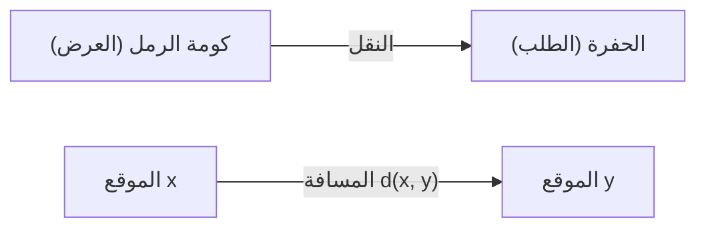
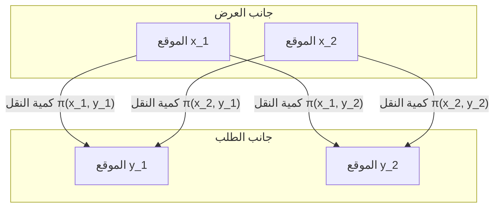

## مقدمة

[مشكلة النقل الأمثل](https://kenji.blog/ar/p/optimal-transport-problem/) ([Optimal Transport Problem](https://kenji.blog/ar/p/optimal-transport-problem/)) هي مشكلة رياضية تطرح السؤال **"كيفية نقل المواد بأقل جهد"** عند نقل مادة (مثل كومة من الرمل) من مكان إلى آخر (مثل حفرة).

تم طرحها من قبل عالم الرياضيات الفرنسي غاسبار مونج في القرن الثامن عشر، وتم وضع صياغة حديثة لها بواسطة ليونيد كانتوروفيتش في القرن العشرين. اليوم، يتم تطبيقها على نطاق واسع في مجالات تتراوح من تخصيص الموارد في الاقتصاد إلى التعلم الآلي.

## صياغة مشكلة مونج

ما فكر فيه مونج كان مشكلة بديهية للغاية. لنفترض أن هناك كومة من الرمل في مكان واحد وحفرة بنفس الحجم في مكان آخر. عند التفكير في مهمة هدم كومة الرمل لملء الحفرة، نريد تقليل **"تكلفة"** نقل الرمل.

يتم تمثيل التكلفة عادةً بحاصل ضرب "كمية الرمل المنقولة" و"المسافة المقطوعة".

بالتعبير الرياضي، لنفترض أن توزيع كومة الرمل الأصلية هو مقياس الاحتمال $\mu$ على $X$، وتوزيع الحفرة هو مقياس الاحتمال $\nu$ على $Y$.
لنفترض أن $T: X \to Y$ هو تطبيق (دالة) يحدد الوجهة من كل موقع $x \in X$ إلى $y \in Y$. يجب أن ينقل (يدفع للأمام) هذا الـ $T$ من $\mu$ إلى $\nu$. وهذا يعني، $T_{\#}\mu = \nu$.

بافتراض أن دالة التكلفة المرتبطة بالحركة هي $c(x, y)$، فإن [مشكلة النقل الأمثل](https://kenji.blog/ar/p/optimal-transport-problem/) لمونج هي إيجاد تطبيق $T$ يقلل التكلفة الإجمالية التالية.

$$
\inf_{T_{\#}\mu = \nu} \int_X c(x, T(x)) d\mu(x)
$$

ومع ذلك، كانت هناك مشكلة في هذه الصياغة. على سبيل المثال، الموقف الذي يتم فيه تقسيم الرمل في نقطة واحدة من كومة الرمل ونقله إلى عدة حفر لا يمكن التعبير عنه بواسطة التطبيق $T$.

## استرخاء كانتوروفيتش

كانتوروفيتش هو من حل هذه المشكلة. لقد نظر في خطة نقل (Transport Plan) تمثل **"مقدار الكمية التي يجب تخصيصها"** من كل موقع $x$ إلى $y$.

لنفترض أن خطة النقل هي مقياس احتمال مشترك $\pi$ على $X \times Y$. هنا، نفرض شرطًا وهو أن التوزيعات الهامشية لـ $\pi$ هي $\mu$ و $\nu$ على التوالي. يُشار إلى هذه المجموعة باسم $\Pi(\mu, \nu)$.

[مشكلة النقل الأمثل](https://kenji.blog/ar/p/optimal-transport-problem/) لكانتوروفيتش هي إيجاد توزيع مشترك $\pi$ يقلل التكلفة الإجمالية التالية.

$$
\inf_{\pi \in \Pi(\mu, \nu)} \int_{X \times Y} c(x, y) d\pi(x, y)
$$

من خلال هذه الصياغة، سُمح بتقسيم الرمل ونقله، وأصبحت المعالجة الرياضية أسهل بكثير. علاوة على ذلك، نظرًا لأنه يمكن صياغة هذه المشكلة كمشكلة برمجة خطية، أصبح التحليل القوي باستخدام الثنائية ممكنًا.

## مسافة واسرشتاين

عندما يتم اختيار القوة $p$ للمسافة في الفضاء المتري، وتحديدًا $d(x, y)^p$، كدالة تكلفة $c(x, y)$، فإن القوة $1/p$ لتكلفة النقل الأمثل تصبح مؤشرًا لقياس المسافة بين توزيعات الاحتمال. يُطلق على هذا اسم **مسافة واسرشتاين** (Wasserstein Distance).

$$
W_p(\mu, \nu) = \left( \inf_{\pi \in \Pi(\mu, \nu)} \int_{X \times Y} d(x, y)^p d\pi(x, y) \right)^{1/p}
$$

على وجه الخصوص، عندما يكون $p=1$، يُطلق عليها أيضًا **Earth Mover's Distance (EMD)**، وتُستخدم بشكل مفضل كمسافة بديهية بين التوزيعات في مجالات معالجة الصور والتعلم الآلي.

### مزايا مسافة واسرشتاين

مقارنة بالمقاييس الأخرى بين التوزيعات مثل تباعد كولباك-ليبلر (KL divergence)، تتمتع مسافة واسرشتاين بميزة كبيرة.

أي أنه **"حتى لو لم تتداخل التوزيعات على الإطلاق، يمكن قياس مسافتها كقيمة ذات معنى"**. على سبيل المثال، عندما تكون مجموعتان من النقاط متباعدتين في الفضاء، يصبح تباعد KL لا نهائيًا، بينما تعكس مسافة واسرشتاين المسافة الهندسية بين مجموعات النقاط بشكل مباشر.

## التطبيقات في التعلم الآلي

في السنوات الأخيرة، جذبت نظرية النقل الأمثل اهتمامًا كبيرًا في مجال التعلم الآلي، وخاصة في النماذج التوليدية. مثال تمثيلي هو **Wasserstein GAN (WGAN)**.

من خلال تقليل مسافة واسرشتاين بين توزيع البيانات الذي تم إنشاؤه بواسطة المولد وتوزيع البيانات الفعلي، أصبح التعلم الأكثر استقرارًا ممكنًا، وتحسنت جودة الصور المنشأة بشكل كبير.

بدأت [مشكلة النقل الأمثل](https://kenji.blog/ar/p/optimal-transport-problem/) من الاستكشاف الرياضي البحت وأصبحت الآن أداة قوية تدعم علم البيانات. من المرجح أن تستمر هذه الفكرة البديهية لقياس "الاختلاف" بين التوزيعات في التطبيق في مجالات مختلفة في المستقبل.
