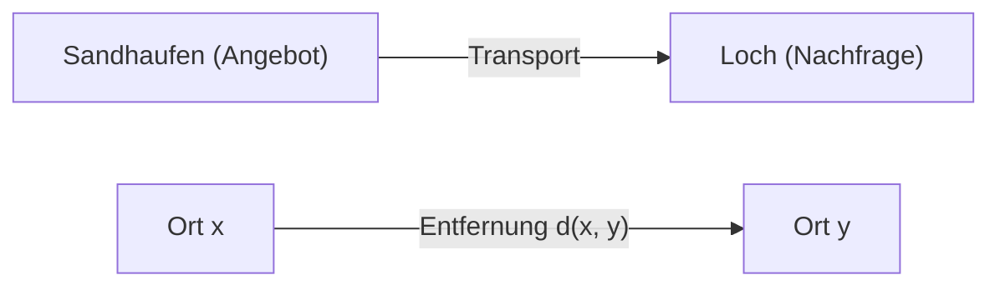
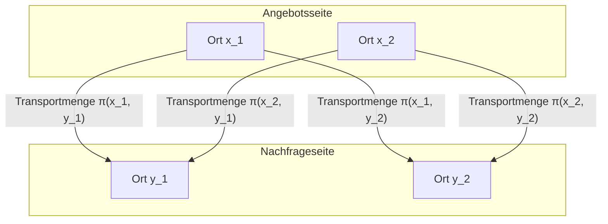

## Einleitung

Das optimale Transportproblem ([Optimal Transport Problem](https://kenji.blog/p/optimal-transport-problem/)) ist ein mathematisches Problem, das die Frage stellt, **"wie man Material mit minimalem Aufwand bewegen kann"**, wenn man eine Substanz (wie einen Sandhaufen) von einem Ort an einen anderen (wie ein Loch) bewegt.

Es wurde im 18. Jahrhundert von dem französischen Mathematiker Gaspard Monge formuliert, und im 20. Jahrhundert von Leonid Kantorovich in einer modernen Form etabliert. Heute findet es breite Anwendung in Bereichen, die von der Ressourcenallokation in der Wirtschaft bis hin zum maschinellen Lernen reichen.

## Monges Problemformulierung

Was Monge betrachtete, war ein sehr intuitives Problem. Angenommen, es gibt an einem Ort einen Sandhaufen und an einem anderen Ort ein Loch mit dem gleichen Volumen. Wenn wir über die Aufgabe nachdenken, den Sandhaufen abzutragen, um das Loch zu füllen, möchten wir die **"Kosten"** für den Transport des Sandes minimieren.

Die Kosten werden normalerweise als Produkt aus der "bewegten Sandmenge" und der "zurückgelegten Entfernung" dargestellt.

Mathematisch ausgedrückt: Sei die Verteilung des ursprünglichen Sandhaufens ein Wahrscheinlichkeitsmaß $\mu$ auf $X$ und die Verteilung des Lochs ein Wahrscheinlichkeitsmaß $\nu$ auf $Y$.
Sei $T: X \to Y$ eine Abbildung (Funktion), die das Ziel für jeden Ort $x \in X$ nach $y \in Y$ bestimmt. Dieses $T$ muss $\mu$ nach $\nu$ bewegen (vorwärtsschieben). Das heißt, $T_{\#}\mu = \nu$.

Unter der Annahme, dass die mit der Bewegung verbundene Kostenfunktion $c(x, y)$ ist, besteht Monges optimales Transportproblem darin, eine Abbildung $T$ zu finden, die die folgenden Gesamtkosten minimiert.

$$
\inf_{T_{\#}\mu = \nu} \int_X c(x, T(x)) d\mu(x)
$$

Es gab jedoch ein Problem mit dieser Formulierung. Zum Beispiel konnte eine Situation, in der Sand an einem Punkt im Sandhaufen aufgeteilt und zu mehreren Löchern transportiert wird, durch die Abbildung $T$ nicht ausgedrückt werden.

## Kantorovichs Relaxierung

Es war Kantorovich, der dieses Problem löste. Er betrachtete einen Transportplan (Transport Plan), der darstellt, **"wie viel Menge zugewiesen werden soll"**, von jedem Ort $x$ nach $y$.

Sei der Transportplan ein gemeinsames Wahrscheinlichkeitsmaß $\pi$ auf $X \times Y$. Hierbei fordern wir die Bedingung, dass die Randverteilungen von $\pi$ jeweils $\mu$ und $\nu$ sind. Diese Menge wird als $\Pi(\mu, \nu)$ bezeichnet.

Kantorovichs optimales Transportproblem besteht darin, eine gemeinsame Verteilung $\pi$ zu finden, die die folgenden Gesamtkosten minimiert.

$$
\inf_{\pi \in \Pi(\mu, \nu)} \int_{X \times Y} c(x, y) d\pi(x, y)
$$

Mit dieser Formulierung wurde das Aufteilen und Transportieren von Sand erlaubt, und die mathematische Handhabung wurde viel einfacher. Darüber hinaus wurde, da dieses Problem als lineares Programmierproblem formuliert werden kann, eine leistungsstarke Analyse mithilfe der Dualität möglich.

## Wasserstein-Distanz

Wenn die $p$-te Potenz des Abstands in einem metrischen Raum, nämlich $d(x, y)^p$, als Kostenfunktion $c(x, y)$ gewählt wird, wird die $1/p$-te Potenz der optimalen Transportkosten zu einem Index, um den Abstand zwischen Wahrscheinlichkeitsverteilungen zu messen. Dies wird als **Wasserstein-Distanz** bezeichnet.

$$
W_p(\mu, \nu) = \left( \inf_{\pi \in \Pi(\mu, \nu)} \int_{X \times Y} d(x, y)^p d\pi(x, y) \right)^{1/p}
$$

Insbesondere bei $p=1$ wird sie auch als **Earth Mover's Distance (EMD)** bezeichnet und in den Bereichen der Bildverarbeitung und des maschinellen Lernens gerne als intuitiver Abstand zwischen Verteilungen verwendet.

### Vorteile der Wasserstein-Distanz

Im Vergleich zu anderen Metriken zwischen Verteilungen wie der Kullback-Leibler-Divergenz (KL-Divergenz) hat die Wasserstein-Distanz einen großen Vorteil.

Das heißt, **"selbst wenn sich Verteilungen überhaupt nicht überschneiden, kann ihr Abstand als aussagekräftiger Wert gemessen werden"**. Wenn beispielsweise zwei Punktmengen im Raum weit voneinander entfernt sind, wird die KL-Divergenz unendlich, während die Wasserstein-Distanz direkt den geometrischen Abstand zwischen den Punktmengen widerspiegelt.

## Anwendungen im maschinellen Lernen

In den letzten Jahren hat die Theorie des optimalen Transports im Bereich des maschinellen Lernens, insbesondere bei generativen Modellen, große Aufmerksamkeit erregt. Ein repräsentatives Beispiel ist das **Wasserstein GAN (WGAN)**.

Durch die Minimierung der Wasserstein-Distanz zwischen der vom Generator erzeugten Datenverteilung und der tatsächlichen Datenverteilung wurde ein stabileres Lernen möglich, und die Qualität der erzeugten Bilder verbesserte sich dramatisch.

Das optimale Transportproblem begann als rein mathematische Erforschung und ist heute zu einem mächtigen Werkzeug geworden, das die Datenwissenschaft unterstützt. Diese intuitive Idee, den "Unterschied" zwischen Verteilungen zu messen, wird wahrscheinlich auch in Zukunft in verschiedenen Bereichen Anwendung finden.
