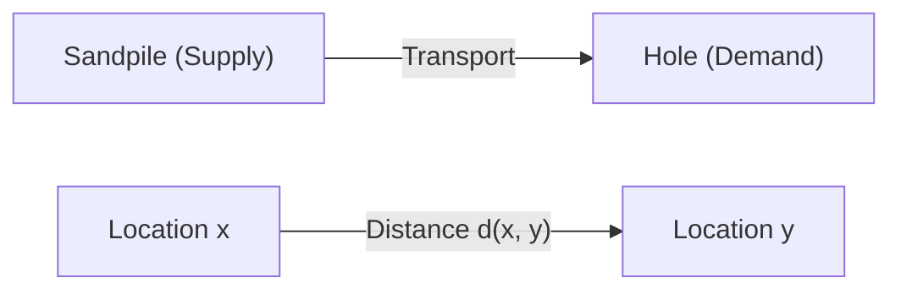
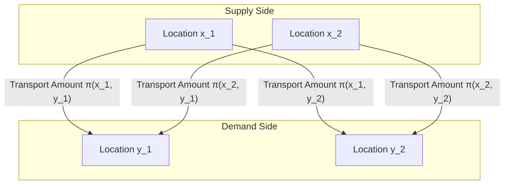

## Introduction

The [Optimal Transport Problem](https://kenji.blog/en/p/optimal-transport-problem/) is a mathematical problem that asks **"how to move material with minimal effort"** when moving a substance (like a sandpile) from one place to another (like a hole).

It was posed by the French mathematician Gaspard Monge in the 18th century, and a modern formulation was established by Leonid Kantorovich in the 20th century. Today, it is widely applied in fields ranging from resource allocation in economics to machine learning.

## Monge's Problem Formulation

What Monge considered was a very intuitive problem. Suppose there is a sandpile in one location and a hole of the same volume in another. When thinking about the task of breaking down the sandpile to fill the hole, we want to minimize the **"cost"** of transporting the sand.

Cost is usually represented by the product of the "amount of sand moved" and the "distance moved".

Expressed mathematically, let the distribution of the original sandpile be a probability measure $\mu$ on $X$, and the distribution of the hole be a probability measure $\nu$ on $Y$.
Let $T: X \to Y$ be a map (function) that determines the destination from each location $x \in X$ to $y \in Y$. This $T$ must move (push forward) $\mu$ to $\nu$. That is, $T_{\#}\mu = \nu$.

Letting the cost function associated with the movement be $c(x, y)$, Monge's optimal transport problem is to find a map $T$ that minimizes the following total cost.

$$
\inf_{T_{\#}\mu = \nu} \int_X c(x, T(x)) d\mu(x)
$$

However, there was a problem with this formulation. For example, a situation where sand at one point in the sandpile is split and transported to multiple holes could not be expressed by the map $T$.

## Kantorovich's Relaxation

It was Kantorovich who solved this problem. He considered a Transport Plan that represents **"how much amount to allocate"** from each location $x$ to $y$.

Let the transport plan be a joint probability measure $\pi$ on $X \times Y$. Here, we impose the condition that the marginal distributions of $\pi$ are $\mu$ and $\nu$, respectively. This set is denoted as $\Pi(\mu, \nu)$.

Kantorovich's optimal transport problem is to find a joint distribution $\pi$ that minimizes the following total cost.

$$
\inf_{\pi \in \Pi(\mu, \nu)} \int_{X \times Y} c(x, y) d\pi(x, y)
$$

With this formulation, splitting and transporting sand was allowed, and mathematical handling became much easier. Furthermore, because this problem can be formulated as a linear programming problem, powerful analysis using duality became possible.

## Wasserstein Distance

When the $p$-th power of the distance in a metric space, namely $d(x, y)^p$, is chosen as the cost function $c(x, y)$, the $1/p$-th power of the optimal transport cost becomes an index to measure the distance between probability distributions. This is called the **Wasserstein Distance**.

$$
W_p(\mu, \nu) = \left( \inf_{\pi \in \Pi(\mu, \nu)} \int_{X \times Y} d(x, y)^p d\pi(x, y) \right)^{1/p}
$$

In particular, when $p=1$, it is also called the **Earth Mover's Distance (EMD)**, and it is favorably used as an intuitive distance between distributions in the fields of image processing and machine learning.

### Advantages of the Wasserstein Distance

Compared to other metrics between distributions such as the Kullback-Leibler divergence (KL divergence), the Wasserstein distance has a major advantage.

That is, **"even if distributions do not overlap at all, their distance can be measured as a meaningful value"**. For example, when two sets of points are far apart in space, the KL divergence becomes infinite, whereas the Wasserstein distance directly reflects the geometric distance between the point sets.

## Applications in Machine Learning

In recent years, the theory of optimal transport has attracted great attention in the field of machine learning, especially in generative models. A representative example is the **Wasserstein GAN (WGAN)**.

By minimizing the Wasserstein distance between the data distribution created by the Generator and the actual data distribution, more stable learning became possible, and the quality of generated images improved dramatically.

The optimal transport problem started from pure mathematical exploration and has now become a powerful tool supporting data science. This intuitive idea of measuring the "difference" between distributions will likely continue to be applied in various fields in the future.
