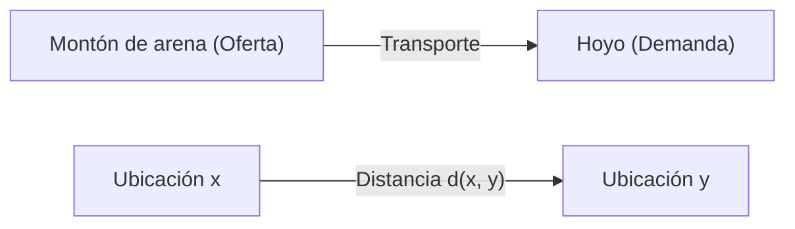
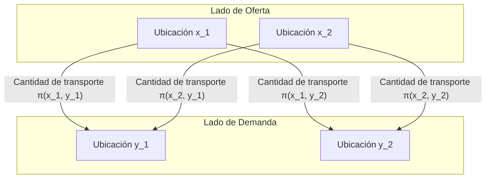

## Introducción

El Problema de Transporte Óptimo (Optimal Transport Problem) es un problema matemático que plantea **"cómo mover material con el mínimo esfuerzo"** al trasladar una sustancia (como un montón de arena) de un lugar a otro (como un hoyo).

Fue planteado por el matemático francés Gaspard Monge en el siglo XVIII, y en el siglo XX Leonid Kantorovich estableció una formulación moderna. En la actualidad, se aplica ampliamente en campos que van desde la asignación de recursos en economía hasta el aprendizaje automático.

## Formulación del problema de Monge

Lo que Monge consideró fue un problema muy intuitivo. Supongamos que hay un montón de arena en un lugar y un hoyo del mismo volumen en otro. Al pensar en la tarea de deshacer el montón de arena para llenar el hoyo, queremos minimizar el **"costo"** de transportar la arena.

El costo suele representarse como el producto de la "cantidad de arena movida" por la "distancia recorrida".

Expresado matemáticamente, sea la distribución del montón de arena original una medida de probabilidad $\mu$ en $X$, y la distribución del hoyo una medida de probabilidad $\nu$ en $Y$.
Sea $T: X \to Y$ una aplicación (función) que determina el destino de cada ubicación $x \in X$ a $y \in Y$. Esta $T$ debe mover (empujar hacia adelante) $\mu$ a $\nu$. Es decir, $T_{\#}\mu = \nu$.

Suponiendo que la función de costo asociada al movimiento es $c(x, y)$, el problema de transporte óptimo de Monge consiste en encontrar una aplicación $T$ que minimice el siguiente costo total.

$$
\inf_{T_{\#}\mu = \nu} \int_X c(x, T(x)) d\mu(x)
$$

Sin embargo, había un problema con esta formulación. Por ejemplo, una situación en la que la arena en un punto del montón se divide y se transporta a varios hoyos no podía expresarse mediante la aplicación $T$.

## Relajación de Kantorovich

Fue Kantorovich quien resolvió este problema. Él consideró un Plan de Transporte (Transport Plan) que representa **"qué cantidad asignar"** de cada ubicación $x$ a $y$.

Sea el plan de transporte una medida de probabilidad conjunta $\pi$ en $X \times Y$. Aquí, imponemos la condición de que las distribuciones marginales de $\pi$ sean $\mu$ y $\nu$, respectivamente. Este conjunto se denota como $\Pi(\mu, \nu)$.

El problema de transporte óptimo de Kantorovich consiste en encontrar una distribución conjunta $\pi$ que minimice el siguiente costo total.

$$
\inf_{\pi \in \Pi(\mu, \nu)} \int_{X \times Y} c(x, y) d\pi(x, y)
$$

Con esta formulación, se permitía dividir y transportar la arena, y el manejo matemático se volvió mucho más fácil. Además, dado que este problema puede formularse como un problema de programación lineal, se hizo posible un análisis potente utilizando la dualidad.

## Distancia de Wasserstein

Cuando la potencia $p$-ésima de la distancia en un espacio métrico, es decir $d(x, y)^p$, se elige como función de costo $c(x, y)$, la potencia $1/p$-ésima del costo de transporte óptimo se convierte en un índice para medir la distancia entre las distribuciones de probabilidad. Esto se llama la **Distancia de Wasserstein**.

$$
W_p(\mu, \nu) = \left( \inf_{\pi \in \Pi(\mu, \nu)} \int_{X \times Y} d(x, y)^p d\pi(x, y) \right)^{1/p}
$$

En particular, cuando $p=1$, también se le llama **Earth Mover's Distance (EMD)**, y se utiliza favorablemente como una distancia intuitiva entre distribuciones en los campos del procesamiento de imágenes y el aprendizaje automático.

### Ventajas de la distancia de Wasserstein

En comparación con otras métricas entre distribuciones, como la divergencia de Kullback-Leibler (divergencia KL), la distancia de Wasserstein tiene una gran ventaja.

Es decir, **"incluso si las distribuciones no se superponen en absoluto, su distancia puede medirse como un valor significativo"**. Por ejemplo, cuando dos conjuntos de puntos están muy separados en el espacio, la divergencia KL se vuelve infinita, mientras que la distancia de Wasserstein refleja directamente la distancia geométrica entre los conjuntos de puntos.

## Aplicaciones en el aprendizaje automático

En los últimos años, la teoría del transporte óptimo ha atraído gran atención en el campo del aprendizaje automático, especialmente en los modelos generativos. Un ejemplo representativo es la **Wasserstein GAN (WGAN)**.

Al minimizar la distancia de Wasserstein entre la distribución de datos creada por el Generador y la distribución de datos real, se hizo posible un aprendizaje más estable, y la calidad de las imágenes generadas mejoró drásticamente.

El problema de transporte óptimo comenzó como una exploración matemática pura y ahora se ha convertido en una poderosa herramienta que apoya la ciencia de datos. Esta idea intuitiva de medir la "diferencia" entre distribuciones probablemente seguirá aplicándose en diversos campos en el futuro.
