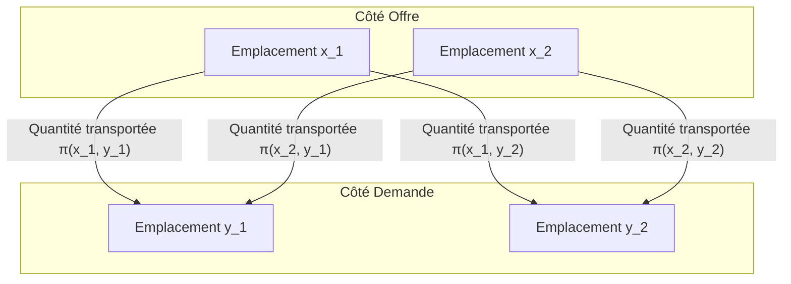

## Introduction

Le problème du transport optimal ([Optimal Transport Problem](https://kenji.blog/fr/p/optimal-transport-problem/)) est un problème mathématique qui demande **« comment déplacer de la matière avec un minimum d'effort »** lors du déplacement d'une substance (comme un tas de sable) d'un endroit à un autre (comme un trou).

Il a été posé par le mathématicien français Gaspard Monge au 18ème siècle, et une formulation moderne a été établie par Leonid Kantorovich au 20ème siècle. Aujourd'hui, il est largement appliqué dans des domaines allant de l'allocation des ressources en économie à l'apprentissage automatique.

## Formulation du problème de Monge

Ce que Monge a considéré était un problème très intuitif. Supposons qu'il y ait un tas de sable à un endroit et un trou du même volume à un autre. Lorsque l'on pense à la tâche de décomposer le tas de sable pour remplir le trou, nous voulons minimiser le **« coût »** du transport du sable.

Le coût est généralement représenté par le produit de la « quantité de sable déplacée » et de la « distance parcourue ».

```mermaid
flowchart LR
    A["Tas de sable (Offre)"] -->|"Transport"| B["Trou (Demande)"]
    C["Emplacement x"] -->|"Distance d("x, y")"| D["Emplacement y"]
```

Exprimé mathématiquement, soit la distribution du tas de sable d'origine une mesure de probabilité $\mu$ sur $X$, et la distribution du trou une mesure de probabilité $\nu$ sur $Y$.
Soit $T: X \to Y$ une application (fonction) qui détermine la destination de chaque emplacement $x \in X$ à $y \in Y$. Ce $T$ doit déplacer (pousser en avant) $\mu$ vers $\nu$. C'est-à-dire, $T_{\#}\mu = \nu$.

En supposant que la fonction de coût associée au mouvement est $c(x, y)$, le problème de transport optimal de Monge consiste à trouver une application $T$ qui minimise le coût total suivant.

$$
\inf_{T_{\#}\mu = \nu} \int_X c(x, T(x)) d\mu(x)
$$

Cependant, il y avait un problème avec cette formulation. Par exemple, une situation où le sable en un point du tas de sable est divisé et transporté vers plusieurs trous ne pouvait pas être exprimée par l'application $T$.

## Relaxation de Kantorovich

C'est Kantorovich qui a résolu ce problème. Il a considéré un plan de transport (Transport Plan) qui représente **« quelle quantité allouer »** de chaque emplacement $x$ à $y$.

Soit le plan de transport une mesure de probabilité jointe $\pi$ sur $X \times Y$. Ici, nous imposons la condition que les distributions marginales de $\pi$ sont respectivement $\mu$ et $\nu$. Cet ensemble est noté $\Pi(\mu, \nu)$.



Le problème de transport optimal de Kantorovich consiste à trouver une distribution jointe $\pi$ qui minimise le coût total suivant.

$$
\inf_{\pi \in \Pi(\mu, \nu)} \int_{X \times Y} c(x, y) d\pi(x, y)
$$

Avec cette formulation, diviser et transporter le sable était autorisé, et la manipulation mathématique est devenue beaucoup plus facile. De plus, comme ce problème peut être formulé comme un problème de programmation linéaire, une analyse puissante utilisant la dualité est devenue possible.

## Distance de Wasserstein

Lorsque la puissance $p$-ième de la distance dans un espace métrique, à savoir $d(x, y)^p$, est choisie comme fonction de coût $c(x, y)$, la puissance $1/p$-ième du coût de transport optimal devient un indice pour mesurer la distance entre les distributions de probabilité. C'est ce qu'on appelle la **Distance de Wasserstein**.

$$
W_p(\mu, \nu) = \left( \inf_{\pi \in \Pi(\mu, \nu)} \int_{X \times Y} d(x, y)^p d\pi(x, y) \right)^{1/p}
$$

En particulier, lorsque $p=1$, elle est également appelée **Earth Mover's Distance (EMD)**, et elle est favorablement utilisée comme une distance intuitive entre les distributions dans les domaines du traitement d'images et de l'apprentissage automatique.

### Avantages de la distance de Wasserstein

Par rapport à d'autres métriques entre les distributions telles que la divergence de Kullback-Leibler (divergence KL), la distance de Wasserstein présente un avantage majeur.

C'est-à-dire que **« même si les distributions ne se chevauchent pas du tout, leur distance peut être mesurée comme une valeur significative »**. Par exemple, lorsque deux ensembles de points sont très éloignés dans l'espace, la divergence KL devient infinie, tandis que la distance de Wasserstein reflète directement la distance géométrique entre les ensembles de points.

## Applications en apprentissage automatique

Ces dernières années, la théorie du transport optimal a attiré une grande attention dans le domaine de l'apprentissage automatique, en particulier dans les modèles génératifs. Un exemple représentatif est le **Wasserstein GAN (WGAN)**.

En minimisant la distance de Wasserstein entre la distribution des données créée par le générateur et la distribution réelle des données, un apprentissage plus stable est devenu possible, et la qualité des images générées s'est considérablement améliorée.

Le problème du transport optimal a commencé par une pure exploration mathématique et est devenu aujourd'hui un outil puissant soutenant la science des données. Cette idée intuitive de mesurer la « différence » entre les distributions continuera probablement d'être appliquée dans divers domaines à l'avenir.
