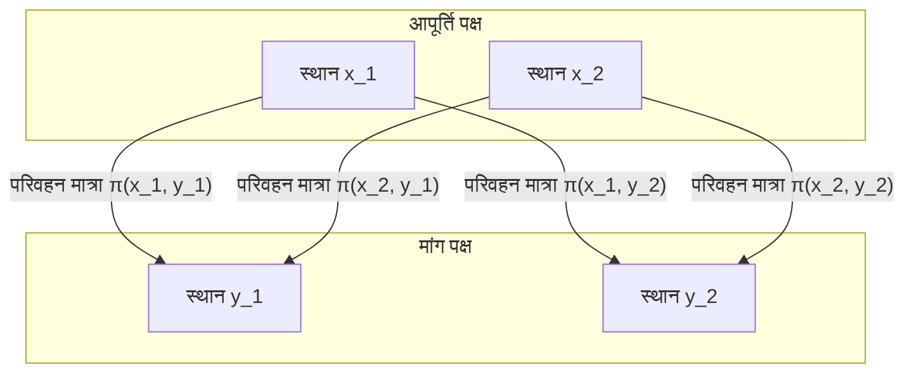

## प्रस्तावना

[इष्टतम परिवहन समस्या](https://kenji.blog/hi/p/optimal-transport-problem/) ([Optimal Transport Problem](https://kenji.blog/hi/p/optimal-transport-problem/)) एक गणितीय समस्या है जो यह पूछती है कि **"न्यूनतम प्रयास के साथ सामग्री को कैसे ले जाया जाए"** जब किसी पदार्थ (जैसे रेत का टीला) को एक स्थान से दूसरे स्थान (जैसे गड्ढे) पर ले जाया जाता है।

यह 18वीं सदी में फ्रांसीसी गणितज्ञ गैस्पर्ड मोंगे द्वारा प्रस्तुत की गई थी, और 20वीं सदी में लियोनिद कांतोरोविच द्वारा एक आधुनिक सूत्रीकरण स्थापित किया गया था। आज, इसका अर्थशास्त्र में संसाधन आवंटन से लेकर मशीन लर्निंग तक के क्षेत्रों में व्यापक रूप से उपयोग किया जाता है।

## मोंगे की समस्या का सूत्रीकरण

मोंगे ने जिस बात पर विचार किया वह एक बहुत ही सहज समस्या थी। मान लीजिए कि एक स्थान पर रेत का टीला है और दूसरे स्थान पर समान आयतन का गड्ढा है। गड्ढे को भरने के लिए रेत के टीले को तोड़ने के कार्य के बारे में सोचते समय, हम रेत के परिवहन की **"लागत"** को कम करना चाहते हैं।

लागत को आमतौर पर "ले जाई गई रेत की मात्रा" और "तय की गई दूरी" के उत्पाद द्वारा दर्शाया जाता है।

```mermaid
flowchart LR
    A["रेत का टीला (आपूर्ति)"] -->|"परिवहन"| B["गड्ढा (मांग)"]
    C["स्थान x"] -->|"दूरी d("x, y")"| D["स्थान y"]
```

गणितीय रूप से व्यक्त किया गया, मान लीजिए कि मूल रेत के टीले का वितरण $X$ पर एक प्रायिकता माप $\mu$ है, और गड्ढे का वितरण $Y$ पर एक प्रायिकता माप $\nu$ है।
मान लीजिए कि $T: X \to Y$ एक मानचित्र (फ़ंक्शन) है जो प्रत्येक स्थान $x \in X$ से $y \in Y$ तक गंतव्य निर्धारित करता है। इस $T$ को $\mu$ को $\nu$ पर ले जाना (आगे बढ़ाना) चाहिए। अर्थात, $T_{\#}\mu = \nu$।

यह मानते हुए कि गति से जुड़ा लागत फ़ंक्शन $c(x, y)$ है, मोंगे की [इष्टतम परिवहन समस्या](https://kenji.blog/hi/p/optimal-transport-problem/) एक ऐसा मानचित्र $T$ खोजना है जो निम्नलिखित कुल लागत को कम करता है।

$$
\inf_{T_{\#}\mu = \nu} \int_X c(x, T(x)) d\mu(x)
$$

हालाँकि, इस सूत्रीकरण के साथ एक समस्या थी। उदाहरण के लिए, ऐसी स्थिति जहाँ रेत के टीले के एक बिंदु पर रेत को विभाजित किया जाता है और कई गड्ढों में ले जाया जाता है, मानचित्र $T$ द्वारा व्यक्त नहीं की जा सकती है।

## कांतोरोविच की छूट

यह कांतोरोविच थे जिन्होंने इस समस्या को हल किया। उन्होंने एक परिवहन योजना (Transport Plan) पर विचार किया जो दर्शाता है कि प्रत्येक स्थान $x$ से $y$ तक **"कितनी मात्रा आवंटित करनी है"**।

मान लीजिए कि परिवहन योजना $X \times Y$ पर एक संयुक्त प्रायिकता माप $\pi$ है। यहाँ, हम यह शर्त लगाते हैं कि $\pi$ का सीमांत वितरण क्रमशः $\mu$ और $\nu$ है। इस समुच्चय को $\Pi(\mu, \nu)$ के रूप में दर्शाया गया है।



कांतोरोविच की [इष्टतम परिवहन समस्या](https://kenji.blog/hi/p/optimal-transport-problem/) एक संयुक्त वितरण $\pi$ खोजना है जो निम्नलिखित कुल लागत को कम करता है।

$$
\inf_{\pi \in \Pi(\mu, \nu)} \int_{X \times Y} c(x, y) d\pi(x, y)
$$

इस सूत्रीकरण के साथ, रेत को विभाजित करने और परिवहन की अनुमति दी गई, और गणितीय संचालन बहुत आसान हो गया। इसके अलावा, क्योंकि इस समस्या को एक रेखीय प्रोग्रामिंग समस्या के रूप में तैयार किया जा सकता है, द्वैत का उपयोग करके शक्तिशाली विश्लेषण संभव हो गया।

## वासरस्टीन दूरी

जब मीट्रिक स्थान में दूरी की $p$-वीं शक्ति, अर्थात् $d(x, y)^p$, को लागत फ़ंक्शन $c(x, y)$ के रूप में चुना जाता है, तो इष्टतम परिवहन लागत की $1/p$-वीं शक्ति प्रायिकता वितरण के बीच की दूरी को मापने के लिए एक सूचकांक बन जाती है। इसे **वासरस्टीन दूरी** (Wasserstein Distance) कहा जाता है।

$$
W_p(\mu, \nu) = \left( \inf_{\pi \in \Pi(\mu, \nu)} \int_{X \times Y} d(x, y)^p d\pi(x, y) \right)^{1/p}
$$

विशेष रूप से, जब $p=1$, तो इसे **Earth Mover's Distance (EMD)** भी कहा जाता है, और इसका उपयोग छवि प्रसंस्करण और मशीन लर्निंग के क्षेत्रों में वितरण के बीच एक सहज दूरी के रूप में अनुकूल रूप से किया जाता है।

### वासरस्टीन दूरी के लाभ

अन्य वितरणों के बीच अन्य मैट्रिक्स जैसे कुलबैक-लीबलर विचलन (KL divergence) की तुलना में, वासरस्टीन दूरी का एक बड़ा फायदा है।

अर्थात्, **"भले ही वितरण बिल्कुल भी ओवरलैप न हों, उनकी दूरी को एक सार्थक मूल्य के रूप में मापा जा सकता है"**। उदाहरण के लिए, जब अंतरिक्ष में बिंदुओं के दो सेट एक-दूसरे से दूर होते हैं, तो KL विचलन अनंत हो जाता है, जबकि वासरस्टीन दूरी सीधे बिंदु सेट के बीच ज्यामितीय दूरी को दर्शाती है।

## मशीन लर्निंग में अनुप्रयोग

हाल के वर्षों में, इष्टतम परिवहन के सिद्धांत ने मशीन लर्निंग के क्षेत्र में, विशेष रूप से जेनरेटिव मॉडल में बहुत ध्यान आकर्षित किया है। एक प्रतिनिधि उदाहरण **Wasserstein GAN (WGAN)** है।

जनरेटर द्वारा बनाए गए डेटा वितरण और वास्तविक डेटा वितरण के बीच वासरस्टीन दूरी को कम करके, अधिक स्थिर शिक्षा संभव हो गई, और उत्पन्न छवियों की गुणवत्ता में नाटकीय रूप से सुधार हुआ।

[इष्टतम परिवहन समस्या](https://kenji.blog/hi/p/optimal-transport-problem/) शुद्ध गणितीय अन्वेषण से शुरू हुई और अब डेटा विज्ञान का समर्थन करने वाला एक शक्तिशाली उपकरण बन गई है। वितरण के बीच "अंतर" को मापने का यह सहज विचार भविष्य में विभिन्न क्षेत्रों में लागू होने की संभावना है।
