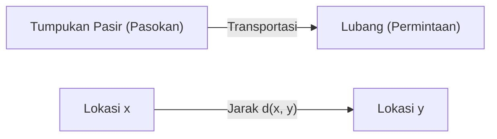
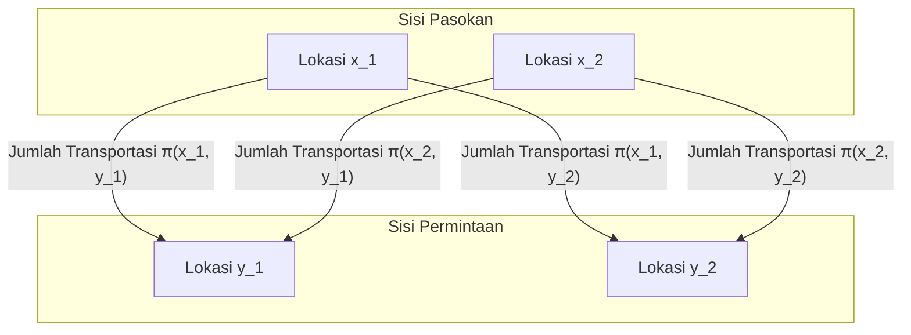

## Pengantar

[Masalah Transportasi Optimal](https://kenji.blog/id/p/optimal-transport-problem/) ([Optimal Transport Problem](https://kenji.blog/id/p/optimal-transport-problem/)) adalah masalah matematika yang menanyakan **"bagaimana memindahkan material dengan usaha minimal"** ketika memindahkan suatu zat (seperti tumpukan pasir) dari satu tempat ke tempat lain (seperti lubang).

Masalah ini diajukan oleh matematikawan Prancis Gaspard Monge pada abad ke-18, dan perumusan modern ditetapkan oleh Leonid Kantorovich pada abad ke-20. Saat ini, masalah tersebut banyak diterapkan di berbagai bidang mulai dari alokasi sumber daya di bidang ekonomi hingga pembelajaran mesin.

## Rumusan Masalah Monge

Apa yang dipertimbangkan Monge adalah masalah yang sangat intuitif. Misalkan ada tumpukan pasir di satu lokasi dan lubang dengan volume yang sama di lokasi lain. Saat memikirkan tugas membongkar tumpukan pasir untuk mengisi lubang, kita ingin meminimalkan **"biaya"** memindahkan pasir tersebut.

Biaya biasanya direpresentasikan sebagai produk dari "jumlah pasir yang dipindahkan" dan "jarak yang ditempuh".

Dinyatakan secara matematis, misalkan distribusi tumpukan pasir asli adalah ukuran probabilitas $\mu$ pada $X$, dan distribusi lubang adalah ukuran probabilitas $\nu$ pada $Y$.
Misalkan $T: X \to Y$ menjadi pemetaan (fungsi) yang menentukan tujuan dari setiap lokasi $x \in X$ ke $y \in Y$. $T$ ini harus memindahkan (mendorong ke depan) $\mu$ ke $\nu$. Yaitu, $T_{\#}\mu = \nu$.

Dengan asumsi bahwa fungsi biaya yang terkait dengan pergerakan adalah $c(x, y)$, masalah transportasi optimal Monge adalah menemukan pemetaan $T$ yang meminimalkan total biaya berikut.

$$
\inf_{T_{\#}\mu = \nu} \int_X c(x, T(x)) d\mu(x)
$$

Namun, ada masalah dengan rumusan ini. Misalnya, situasi di mana pasir pada satu titik di tumpukan pasir dibagi dan diangkut ke beberapa lubang tidak dapat diekspresikan oleh pemetaan $T$.

## Relaksasi Kantorovich

Kantorovich-lah yang memecahkan masalah ini. Dia mempertimbangkan Rencana Transportasi (Transport Plan) yang mewakili **"berapa banyak jumlah yang dialokasikan"** dari setiap lokasi $x$ ke $y$.

Misalkan rencana transportasi adalah ukuran probabilitas gabungan $\pi$ pada $X \times Y$. Di sini, kita memaksakan syarat bahwa distribusi marginal dari $\pi$ berturut-turut adalah $\mu$ dan $\nu$. Himpunan ini dilambangkan sebagai $\Pi(\mu, \nu)$.

Masalah transportasi optimal Kantorovich adalah menemukan distribusi gabungan $\pi$ yang meminimalkan total biaya berikut.

$$
\inf_{\pi \in \Pi(\mu, \nu)} \int_{X \times Y} c(x, y) d\pi(x, y)
$$

Dengan perumusan ini, membagi dan mengangkut pasir diperbolehkan, dan penanganan matematis menjadi jauh lebih mudah. Selanjutnya, karena masalah ini dapat dirumuskan sebagai masalah pemrograman linier, analisis yang kuat menggunakan dualitas menjadi mungkin dilakukan.

## Jarak Wasserstein

Ketika pangkat ke-$p$ dari jarak dalam ruang metrik, yaitu $d(x, y)^p$, dipilih sebagai fungsi biaya $c(x, y)$, pangkat ke-$1/p$ dari biaya transportasi optimal menjadi indeks untuk mengukur jarak antara distribusi probabilitas. Ini disebut **Jarak Wasserstein** (Wasserstein Distance).

$$
W_p(\mu, \nu) = \left( \inf_{\pi \in \Pi(\mu, \nu)} \int_{X \times Y} d(x, y)^p d\pi(x, y) \right)^{1/p}
$$

Secara khusus, bila $p=1$, ini juga disebut **Earth Mover's Distance (EMD)**, dan digunakan sebagai jarak yang intuitif antara distribusi di bidang pemrosesan gambar dan pembelajaran mesin.

### Keuntungan dari Jarak Wasserstein

Dibandingkan dengan metrik lain antara distribusi seperti divergensi Kullback-Leibler (divergensi KL), jarak Wasserstein memiliki keuntungan besar.

Yaitu, **"meskipun distribusi tidak tumpang tindih sama sekali, jaraknya dapat diukur sebagai nilai yang bermakna"**. Misalnya, ketika dua kumpulan titik terpisah jauh di ruang angkasa, divergensi KL menjadi tidak terbatas, sedangkan jarak Wasserstein secara langsung mencerminkan jarak geometris antara kumpulan titik tersebut.

## Aplikasi dalam Pembelajaran Mesin

Dalam beberapa tahun terakhir, teori transportasi optimal telah menarik perhatian besar di bidang pembelajaran mesin, khususnya dalam model generatif. Contoh representatif adalah **Wasserstein GAN (WGAN)**.

Dengan meminimalkan jarak Wasserstein antara distribusi data yang dibuat oleh Generator dan distribusi data aktual, pembelajaran yang lebih stabil menjadi mungkin, dan kualitas gambar yang dihasilkan meningkat secara dramatis.

Masalah transportasi optimal dimulai dari eksplorasi matematika murni dan kini telah menjadi alat yang kuat untuk mendukung ilmu data. Ide intuitif untuk mengukur "perbedaan" antara distribusi ini kemungkinan akan terus diterapkan di berbagai bidang di masa depan.
