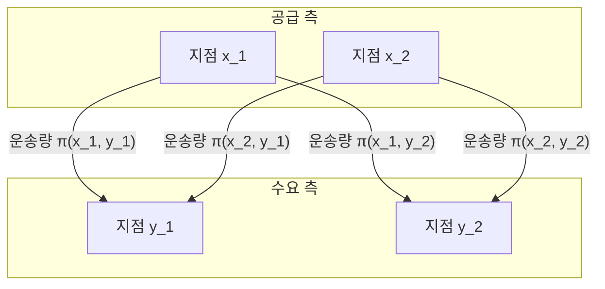

## 처음으로

[최적 운송 문제](https://kenji.blog/ko/p/optimal-transport-problem/) ([Optimal Transport Problem](https://kenji.blog/ko/p/optimal-transport-problem/)) 는 한 장소에 있는 물질(예: 모래더미)을 다른 장소(예: 구멍)로 이동시킬 때, **"최소한의 노력으로 이동시키려면 어떻게 해야 하는가?"** 를 묻는 수학 문제입니다.

18세기 프랑스의 수학자 가스파르 몽주 (Gaspard Monge) 에 의해 제기되었고, 20세기에 레오니트 칸토로비치 (Leonid Kantorovich) 에 의해 현대적인 정식화가 이루어졌습니다. 현재는 경제학의 자원 배분에서부터 기계 학습 분야에 이르기까지 폭넓게 응용되고 있습니다.

## 몽주의 문제 제기

몽주가 생각한 것은 매우 직관적인 문제였습니다. 어느 한 장소에 모래더미가 있고, 다른 장소에 같은 부피의 구멍이 있다고 가정합시다. 모래더미를 무너뜨려 구멍을 메우는 작업을 생각할 때, 모래를 운반하는 **"비용"** 을 최소화하고자 합니다.

비용은 일반적으로 '이동시키는 모래의 양'과 '이동시키는 거리'의 곱으로 표현됩니다.

```mermaid
flowchart LR
    A["모래더미 (공급)"] -->|"운송"| B["구멍 (수요)"]
    C["지점 x"] -->|"거리 d("x, y")"| D["지점 y"]
```

수학적으로 표현하자면, 원래 모래더미의 분포를 $X$ 상의 확률 측도 $\mu$, 구멍의 분포를 $Y$ 상의 확률 측도 $\nu$ 라고 합니다.
각 지점 $x \in X$ 에서 $y \in Y$ 로의 이동 목적지를 결정하는 사상(함수)을 $T: X \to Y$ 라고 합시다. 이 $T$ 는 $\mu$ 를 $\nu$ 로 이동시켜야(밀어내야) 합니다. 즉, $T_{\#}\mu = \nu$ 입니다.

이동에 수반되는 비용 함수를 $c(x, y)$ 라고 할 때, 몽주의 [최적 운송 문제](https://kenji.blog/ko/p/optimal-transport-problem/)는 다음의 총비용을 최소화하는 사상 $T$ 를 찾는 것이 됩니다.

$$
\inf_{T_{\#}\mu = \nu} \int_X c(x, T(x)) d\mu(x)
$$

하지만 이 정식화에는 문제가 있었습니다. 예를 들어, 모래더미의 한 지점에 있는 모래를 분할하여 여러 구멍으로 운반하는 것과 같은 상황을 사상 $T$ 로는 표현할 수 없었습니다.

## 칸토로비치의 완화 문제

이 문제를 해결한 사람이 칸토로비치입니다. 그는 각 지점 $x$ 에서 $y$ 로 **"얼마만큼의 양을 할당할 것인가"** 를 나타내는 운송 계획 (Transport Plan) 을 고안했습니다.

운송 계획을 $X \times Y$ 상의 결합 확률 측도 $\pi$ 라고 합시다. 여기서 $\pi$ 의 주변 분포가 각각 $\mu$ 와 $\nu$ 가 된다는 조건을 부여합니다. 이를 $\Pi(\mu, \nu)$ 로 나타냅니다.



칸토로비치의 [최적 운송 문제](https://kenji.blog/ko/p/optimal-transport-problem/)는 다음의 총비용을 최소화하는 결합 분포 $\pi$ 를 찾는 것입니다.

$$
\inf_{\pi \in \Pi(\mu, \nu)} \int_{X \times Y} c(x, y) d\pi(x, y)
$$

이러한 정식화로 인해 모래를 분할하여 운반하는 것이 허용되었고, 수학적 취급이 매우 쉬워졌습니다. 더욱이, 이 문제는 선형 계획 문제로 정식화될 수 있기 때문에 쌍대성 (Duality) 을 이용한 강력한 해석이 가능해졌습니다.

## 바서슈타인 거리

비용 함수 $c(x, y)$ 로서 거리 공간에서의 거리의 $p$ 제곱, 즉 $d(x, y)^p$ 를 선택했을 때, 최적 운송 비용의 $1/p$ 제곱은 확률 분포 간의 거리를 측정하는 지표가 됩니다. 이를 **바서슈타인 거리** (Wasserstein Distance) 라고 부릅니다.

$$
W_p(\mu, \nu) = \left( \inf_{\pi \in \Pi(\mu, \nu)} \int_{X \times Y} d(x, y)^p d\pi(x, y) \right)^{1/p}
$$

특히 $p=1$ 인 경우는 **Earth Mover's Distance (EMD)** 라고도 불리며, 화상 처리나 기계 학습 분야에서 직관적인 분포 간의 거리로 선호되어 사용됩니다.

### 바서슈타인 거리의 장점

쿨백-라이블러 발산 (KL divergence) 등 다른 분포 간의 지표와 비교하여, 바서슈타인 거리에는 큰 장점이 있습니다.

그것은 **"분포들이 전혀 겹치지 않더라도 그 거리를 의미 있는 값으로 측정할 수 있다"** 는 점입니다. 예를 들어, 두 개의 점 집합이 공간상에서 떨어져 있을 때 KL 발산은 무한대가 되어버리는 반면, 바서슈타인 거리는 점 집합 간의 기하학적 거리를 그대로 반영합니다.

## 기계 학습으로의 응용

최근 최적 운송 이론은 기계 학습, 특히 생성 모델 분야에서 큰 주목을 받았습니다. 대표적인 것이 **Wasserstein GAN (WGAN)** 입니다.

생성기 (Generator) 가 만들어내는 데이터의 분포와 실제 데이터의 분포 사이의 바서슈타인 거리를 최소화함으로써 더 안정적인 학습이 가능해졌고, 생성되는 이미지의 품질이 비약적으로 향상되었습니다.

[최적 운송 문제](https://kenji.blog/ko/p/optimal-transport-problem/)는 순수 수학적 탐구에서 시작되어, 현재는 데이터 과학을 지탱하는 강력한 도구가 되었습니다. 분포와 분포의 '차이'를 측정하는 이 직관적인 아이디어는 앞으로도 다양한 분야에서 응용될 것입니다.
