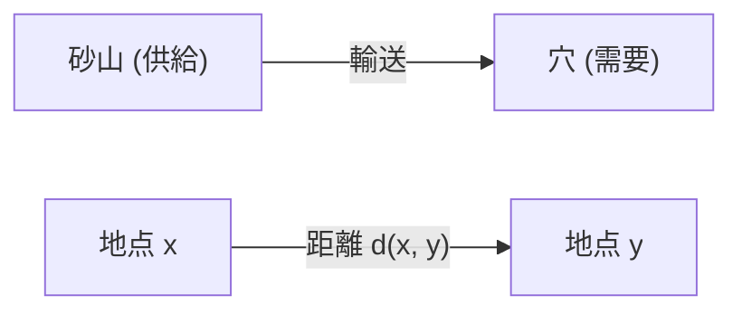
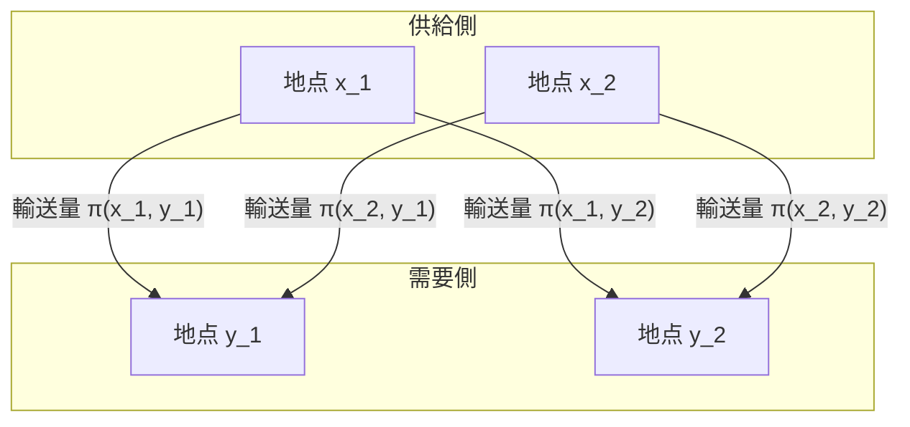

## はじめに

[最適輸送問題](https://kenji.blog/p/optimal-transport-problem/) ([Optimal Transport Problem](https://kenji.blog/p/optimal-transport-problem/)) は、ある場所にある物質（例えば砂山）を、別の場所（例えば穴）へ移動させる際に、 **「最小の手間で移動させるにはどうすればよいか？」** を問う数学の問題です。

18世紀にフランスの数学者ガスパール・モンジュ (Gaspard Monge) によって提起され、20世紀にレオニート・カントロヴィチ (Leonid Kantorovich) によって現代的な定式化がなされました。現在では、経済学の資源配分から機械学習の分野まで幅広く応用されています。

## モンジュの問題提起

モンジュが考えたのは、とても直感的な問題でした。ある場所に砂山があり、別の場所に同じ体積の穴があるとします。砂山を崩して穴を埋める作業を考えたとき、砂を運ぶ **「コスト」** を最小にしたいと考えます。

コストは通常、「移動させる砂の量」と「移動させる距離」の積で表されます。

数学的に表現すると、元の砂山の分布を $X$ 上の確率測度 $\mu$、穴の分布を $Y$ 上の確率測度 $\nu$ とします。
各地点 $x \in X$ から $y \in Y$ への移動先を決める写像（関数）を $T: X \to Y$ とします。この $T$ は、 $\mu$ を $\nu$ に移す（押し出す）必要があります。つまり、 $T_{\#}\mu = \nu$ です。

移動に伴うコスト関数を $c(x, y)$ とすると、モンジュの[最適輸送問題](https://kenji.blog/p/optimal-transport-problem/)は、以下の総コストを最小化する写像 $T$ を見つけることになります。

$$
\inf_{T_{\#}\mu = \nu} \int_X c(x, T(x)) d\mu(x)
$$

しかし、この定式化には問題がありました。例えば、砂山の一つの点にある砂を分割して複数の穴へ運ぶような状況を写像 $T$ では表現できませんでした。

## カントロヴィチの緩和問題

この問題を解決したのがカントロヴィチです。彼は、各地点 $x$ から $y$ へ **「どれだけの量を割り当てるか」** を表す輸送計画 (Transport Plan) を考えました。

輸送計画を $X \times Y$ 上の同時確率測度 $\pi$ とします。ここで、 $\pi$ の周辺分布がそれぞれ $\mu$ と $\nu$ になるという条件を課します。これを $\Pi(\mu, \nu)$ と表します。

カントロヴィチの[最適輸送問題](https://kenji.blog/p/optimal-transport-problem/)は、以下の総コストを最小化する同時分布 $\pi$ を見つけることです。

$$
\inf_{\pi \in \Pi(\mu, \nu)} \int_{X \times Y} c(x, y) d\pi(x, y)
$$

この定式化により、砂を分割して運ぶことが許容され、数学的な取り扱いが非常に容易になりました。さらに、この問題は線形計画問題として定式化できるため、双対性 (Duality) を用いた強力な解析が可能になりました。

## ワッサースタイン距離

コスト関数 $c(x, y)$ として、距離空間における距離の $p$ 乗、つまり $d(x, y)^p$ を選んだとき、最適輸送コストの $1/p$ 乗は、確率分布間の距離を測る指標になります。これを **ワッサースタイン距離** (Wasserstein Distance) と呼びます。

$$
W_p(\mu, \nu) = \left( \inf_{\pi \in \Pi(\mu, \nu)} \int_{X \times Y} d(x, y)^p d\pi(x, y) \right)^{1/p}
$$

特に $p=1$ の場合は **Earth Mover's Distance (EMD)** とも呼ばれ、画像処理や機械学習の分野で直感的な分布間の距離として好まれて使われます。

### ワッサースタイン距離の利点

カルバック・ライブラー情報量 (KL divergence) などの他の分布間の指標と比較して、ワッサースタイン距離には大きな利点があります。

それは、 **「分布同士が全く重なっていなくても、その距離を意味のある値として測れる」** という点です。例えば、2つの点集合が空間上で離れているとき、KL情報量では無限大になってしまうのに対し、ワッサースタイン距離は点集合間の幾何学的な距離をそのまま反映します。

## 機械学習への応用

近年、最適輸送の理論は機械学習、特に生成モデルの分野で大きな注目を集めました。代表的なのが **Wasserstein GAN (WGAN)** です。

生成器 (Generator) が作り出すデータの分布と、実際のデータの分布の間のワッサースタイン距離を最小化することで、より安定した学習が可能になり、生成される画像の品質が飛躍的に向上しました。

[最適輸送問題](https://kenji.blog/p/optimal-transport-problem/)は、純粋な数学的探求から始まり、現在ではデータサイエンスを支える強力なツールとなっています。分布と分布の「違い」を測るこの直感的なアイデアは、今後もさまざまな分野で応用されていくことでしょう。
