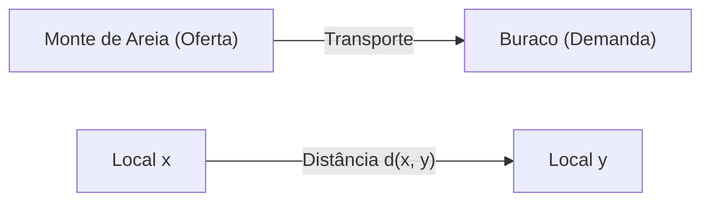
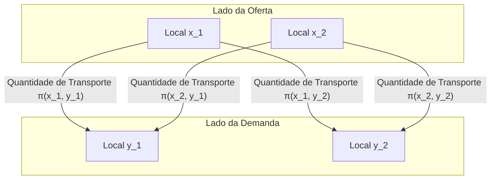

## Introdução

O [Problema de Transporte Ótimo](https://kenji.blog/pt/p/optimal-transport-problem/) ([Optimal Transport Problem](https://kenji.blog/pt/p/optimal-transport-problem/)) é um problema matemático que pergunta **"como mover material com o mínimo de esforço"** ao mover uma substância (como um monte de areia) de um lugar para outro (como um buraco).

Foi proposto pelo matemático francês Gaspard Monge no século 18, e uma formulação moderna foi estabelecida por Leonid Kantorovich no século 20. Hoje, é amplamente aplicado em campos que vão desde a alocação de recursos na economia até o aprendizado de máquina.

## Formulação do Problema de Monge

O que Monge considerou foi um problema muito intuitivo. Suponha que haja um monte de areia em um local e um buraco do mesmo volume em outro. Ao pensar na tarefa de desmanchar o monte de areia para tapar o buraco, queremos minimizar o **"custo"** de transportar a areia.

O custo é geralmente representado pelo produto da "quantidade de areia movida" e da "distância percorrida".

Expresso matematicamente, seja a distribuição do monte de areia original uma medida de probabilidade $\mu$ em $X$, e a distribuição do buraco uma medida de probabilidade $\nu$ em $Y$.
Seja $T: X \to Y$ um mapeamento (função) que determina o destino de cada local $x \in X$ para $y \in Y$. Este $T$ deve mover (empurrar para a frente) $\mu$ para $\nu$. Ou seja, $T_{\#}\mu = \nu$.

Supondo que a função de custo associada ao movimento seja $c(x, y)$, o problema de transporte ótimo de Monge consiste em encontrar um mapeamento $T$ que minimize o seguinte custo total.

$$
\inf_{T_{\#}\mu = \nu} \int_X c(x, T(x)) d\mu(x)
$$

No entanto, havia um problema com esta formulação. Por exemplo, uma situação em que a areia em um ponto do monte de areia é dividida e transportada para vários buracos não poderia ser expressa pelo mapeamento $T$.

## Relaxamento de Kantorovich

Foi Kantorovich quem resolveu esse problema. Ele considerou um Plano de Transporte (Transport Plan) que representa **"quanta quantidade alocar"** de cada local $x$ para $y$.

Seja o plano de transporte uma medida de probabilidade conjunta $\pi$ em $X \times Y$. Aqui, impomos a condição de que as distribuições marginais de $\pi$ sejam $\mu$ e $\nu$, respectivamente. Este conjunto é denotado como $\Pi(\mu, \nu)$.

O problema de transporte ótimo de Kantorovich consiste em encontrar uma distribuição conjunta $\pi$ que minimize o seguinte custo total.

$$
\inf_{\pi \in \Pi(\mu, \nu)} \int_{X \times Y} c(x, y) d\pi(x, y)
$$

Com essa formulação, dividir e transportar areia foi permitido, e o manuseio matemático tornou-se muito mais fácil. Além disso, como esse problema pode ser formulado como um problema de programação linear, tornou-se possível uma análise poderosa usando a dualidade.

## Distância de Wasserstein

Quando a $p$-ésima potência da distância em um espaço métrico, ou seja, $d(x, y)^p$, é escolhida como a função de custo $c(x, y)$, a $1/p$-ésima potência do custo de transporte ótimo torna-se um índice para medir a distância entre distribuições de probabilidade. Isso é chamado de **Distância de Wasserstein**.

$$
W_p(\mu, \nu) = \left( \inf_{\pi \in \Pi(\mu, \nu)} \int_{X \times Y} d(x, y)^p d\pi(x, y) \right)^{1/p}
$$

Em particular, quando $p=1$, também é chamada de **Earth Mover's Distance (EMD)**, e é usada favoravelmente como uma distância intuitiva entre distribuições nas áreas de processamento de imagens e aprendizado de máquina.

### Vantagens da Distância de Wasserstein

Em comparação com outras métricas entre distribuições, como a divergência de Kullback-Leibler (divergência KL), a distância de Wasserstein tem uma grande vantagem.

Ou seja, **"mesmo que as distribuições não se sobreponham, sua distância pode ser medida como um valor significativo"**. Por exemplo, quando dois conjuntos de pontos estão distantes no espaço, a divergência KL se torna infinita, enquanto a distância de Wasserstein reflete diretamente a distância geométrica entre os conjuntos de pontos.

## Aplicações no Aprendizado de Máquina

Nos últimos anos, a teoria do transporte ótimo tem atraído grande atenção no campo do aprendizado de máquina, especialmente em modelos generativos. Um exemplo representativo é a **Wasserstein GAN (WGAN)**.

Ao minimizar a distância de Wasserstein entre a distribuição de dados criada pelo Gerador e a distribuição real dos dados, um aprendizado mais estável tornou-se possível, e a qualidade das imagens geradas melhorou drasticamente.

O problema de transporte ótimo começou como uma exploração matemática pura e agora se tornou uma ferramenta poderosa que apoia a ciência de dados. Esta ideia intuitiva de medir a "diferença" entre distribuições provavelmente continuará a ser aplicada em vários campos no futuro.
