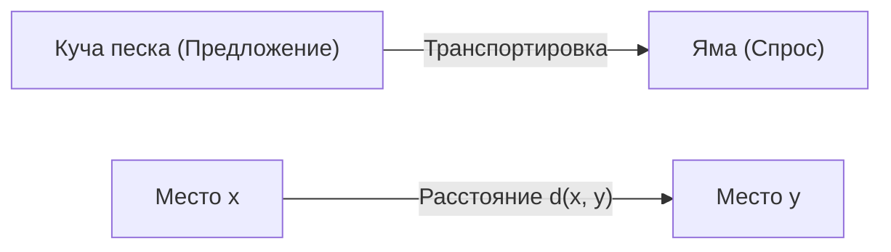
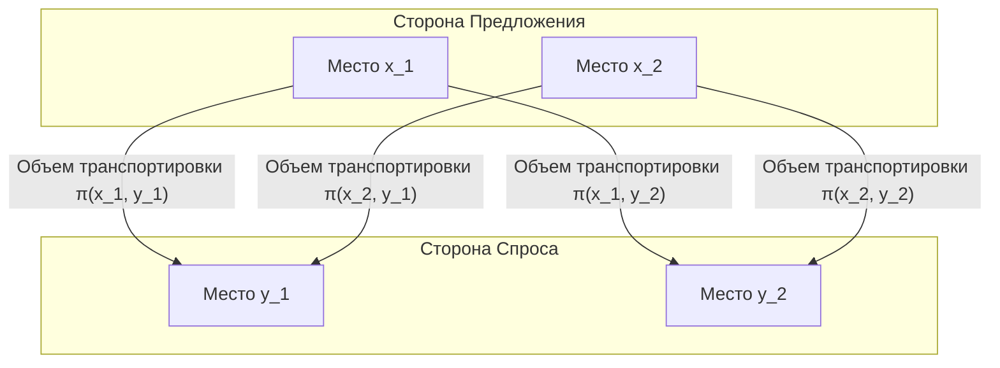

## Введение

Задача оптимального транспорта ([Optimal Transport Problem](https://kenji.blog/ru/p/optimal-transport-problem/)) — это математическая задача, которая задает вопрос, **«как переместить материал с минимальными усилиями»** при перемещении вещества (например, кучи песка) из одного места в другое (например, в яму).

Она была поставлена французским математиком Гаспаром Монжем в 18 веке, а современная формулировка была предложена Леонидом Канторовичем в 20 веке. Сегодня она широко применяется в областях от распределения ресурсов в экономике до машинного обучения.

## Формулировка задачи Монжа

То, что рассматривал Монж, было очень интуитивной задачей. Представьте, что в одном месте есть куча песка, а в другом — яма такого же объема. Думая о задаче по перемещению песка для заполнения ямы, мы хотим минимизировать **«стоимость»** транспортировки песка.

Стоимость обычно представляется как произведение «количества перемещенного песка» на «пройденное расстояние».

С точки зрения математики, пусть распределение исходной кучи песка будет вероятностной мерой $\mu$ на $X$, а распределение ямы — вероятностной мерой $\nu$ на $Y$.
Пусть $T: X \to Y$ будет отображением (функцией), которое определяет пункт назначения для каждого места $x \in X$ в $y \in Y$. Это $T$ должно перемещать (передвигать) $\mu$ в $\nu$. То есть $T_{\#}\mu = \nu$.

Предполагая, что функция стоимости, связанная с перемещением, равна $c(x, y)$, задача оптимального транспорта Монжа состоит в том, чтобы найти такое отображение $T$, которое минимизирует следующую общую стоимость.

$$
\inf_{T_{\#}\mu = \nu} \int_X c(x, T(x)) d\mu(x)
$$

Однако с этой формулировкой была проблема. Например, ситуация, когда песок в одной точке кучи песка разделяется и перевозится в несколько ям, не могла быть выражена с помощью отображения $T$.

## Ослабление Канторовича

Именно Канторович решил эту проблему. Он рассмотрел транспортный план (Transport Plan), который представляет собой **«какое количество выделить»** из каждого места $x$ в $y$.

Пусть транспортный план будет совместной вероятностной мерой $\pi$ на $X \times Y$. Здесь мы налагаем условие, что маргинальные распределения $\pi$ равны $\mu$ и $\nu$ соответственно. Это множество обозначается как $\Pi(\mu, \nu)$.

Задача оптимального транспорта Канторовича состоит в том, чтобы найти совместное распределение $\pi$, которое минимизирует следующую общую стоимость.

$$
\inf_{\pi \in \Pi(\mu, \nu)} \int_{X \times Y} c(x, y) d\pi(x, y)
$$

С такой формулировкой разделение и транспортировка песка были разрешены, и математическая обработка стала намного проще. Кроме того, поскольку эта задача может быть сформулирована как задача линейного программирования, стал возможным мощный анализ с использованием двойственности.

## Расстояние Вассерштейна

Когда в качестве функции стоимости $c(x, y)$ выбирается $p$-я степень расстояния в метрическом пространстве, а именно $d(x, y)^p$, $1/p$-я степень оптимальной стоимости транспорта становится индексом для измерения расстояния между распределениями вероятностей. Это называется **расстоянием Вассерштейна** (Wasserstein Distance).

$$
W_p(\mu, \nu) = \left( \inf_{\pi \in \Pi(\mu, \nu)} \int_{X \times Y} d(x, y)^p d\pi(x, y) \right)^{1/p}
$$

В частности, когда $p=1$, оно также называется **Earth Mover's Distance (EMD)** и широко используется как интуитивно понятное расстояние между распределениями в областях обработки изображений и машинного обучения.

### Преимущества расстояния Вассерштейна

По сравнению с другими метриками между распределениями, такими как дивергенция Кульбака-Лейблера (KL дивергенция), расстояние Вассерштейна имеет большое преимущество.

А именно, **«даже если распределения вообще не перекрываются, их расстояние можно измерить как значимое значение»**. Например, когда два набора точек находятся далеко друг от друга в пространстве, дивергенция KL стремится к бесконечности, в то время как расстояние Вассерштейна напрямую отражает геометрическое расстояние между наборами точек.

## Применение в машинном обучении

В последние годы теория оптимального транспорта привлекла большое внимание в области машинного обучения, особенно в генеративных моделях. Ярким примером является **Wasserstein GAN (WGAN)**.

За счет минимизации расстояния Вассерштейна между распределением данных, созданным генератором, и фактическим распределением данных стало возможным более стабильное обучение, а качество генерируемых изображений резко улучшилось.

Задача оптимального транспорта началась с чистых математических исследований и теперь стала мощным инструментом поддержки науки о данных. Эта интуитивно понятная идея измерения «разницы» между распределениями, вероятно, будет продолжать применяться в различных областях и в будущем.
