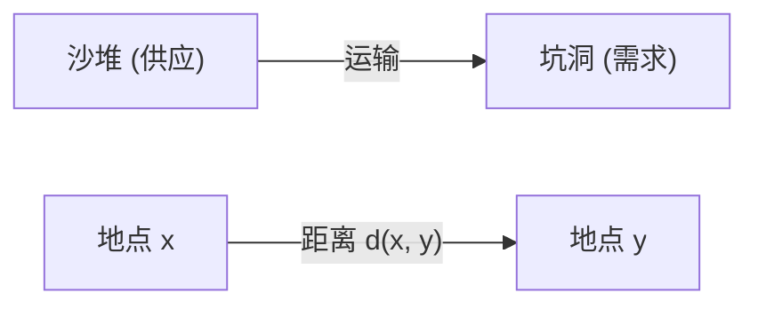
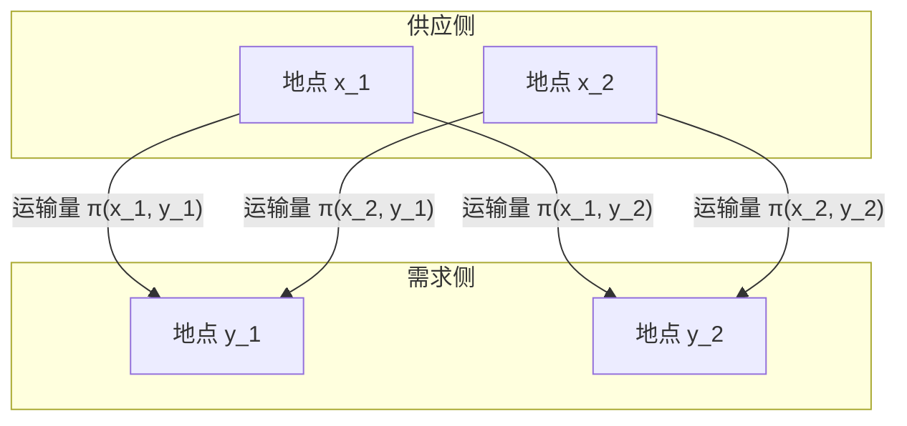

## 引言

[最优传输问题](https://kenji.blog/zh-cn/p/optimal-transport-problem/) ([Optimal Transport Problem](https://kenji.blog/zh-cn/p/optimal-transport-problem/)) 是一个数学问题，探讨在将某处的物质（如沙堆）移动到另一处（如坑洞）时， **“如何以最小的代价完成移动？”** 

它由法国数学家加斯帕尔·蒙日 (Gaspard Monge) 在18世纪提出，并在20世纪由列昂尼德·康托罗维奇 (Leonid Kantorovich) 进行了现代形式的表述。如今，它被广泛应用于从经济学的资源分配到机器学习等各个领域。

## 蒙日的问题表述

蒙日所考虑的是一个非常直观的问题。假设在一个地方有一个沙堆，在另一个地方有一个体积相同的坑洞。当我们考虑将沙堆推平填入坑洞的操作时，我们希望将运输沙子的 **“成本”** 降到最低。

成本通常表示为“移动的沙子量”与“移动的距离”的乘积。

用数学语言来表达，假设原沙堆的分布是 $X$ 上的概率测度 $\mu$，坑洞的分布是 $Y$ 上的概率测度 $\nu$。
我们设 $T: X \to Y$ 是一个映射（函数），决定了每个地点 $x \in X$ 到 $y \in Y$ 的移动目的地。这个 $T$ 必须将 $\mu$ 转移（前推）到 $\nu$。也就是说， $T_{\#}\mu = \nu$。

假设移动带来的成本函数为 $c(x, y)$，蒙日[最优传输问题](https://kenji.blog/zh-cn/p/optimal-transport-problem/)就是要找到一个使以下总成本最小化的映射 $T$。

$$
\inf_{T_{\#}\mu = \nu} \int_X c(x, T(x)) d\mu(x)
$$

然而，这种表述存在一个问题。例如，映射 $T$ 无法表示将沙堆中某一点的沙子分割并运送到多个坑洞的情况。

## 康托罗维奇的松弛问题

解决这个问题的是康托罗维奇。他提出了一种运输计划 (Transport Plan)，用来表示从每个地点 $x$ 到 $y$ **“分配多少数量”** 。

设运输计划为 $X \times Y$ 上的联合概率测度 $\pi$。在这里，我们施加一个条件，即 $\pi$ 的边缘分布分别为 $\mu$ 和 $\nu$。这被记为 $\Pi(\mu, \nu)$。

康托罗维奇[最优传输问题](https://kenji.blog/zh-cn/p/optimal-transport-problem/)就是要找到一个使以下总成本最小化的联合分布 $\pi$。

$$
\inf_{\pi \in \Pi(\mu, \nu)} \int_{X \times Y} c(x, y) d\pi(x, y)
$$

通过这种表述，分割运输沙子被允许，数学处理也变得非常容易。此外，由于该问题可以表述为线性规划问题，因此可以使用对偶性 (Duality) 进行强大的分析。

## Wasserstein 距离

当选择度量空间中距离的 $p$ 次方，即 $d(x, y)^p$ 作为成本函数 $c(x, y)$ 时，最优传输成本的 $1/p$ 次方就成为衡量概率分布间距离的指标。这被称为 **Wasserstein 距离** (Wasserstein Distance)。

$$
W_p(\mu, \nu) = \left( \inf_{\pi \in \Pi(\mu, \nu)} \int_{X \times Y} d(x, y)^p d\pi(x, y) \right)^{1/p}
$$

特别是当 $p=1$ 时，它也被称为 **推土机距离 (Earth Mover's Distance, EMD)** ，在图像处理和机器学习领域被广泛用作直观的分布间距离。

### Wasserstein 距离的优势

与库尔贝克-莱布勒散度 (KL divergence) 等其他分布间指标相比，Wasserstein 距离有一个巨大的优势。

那就是， **“即使分布之间完全没有重叠，也可以将其距离作为有意义的值来衡量”** 。例如，当两个点集在空间中相距甚远时，KL 散度会趋于无穷大，而 Wasserstein 距离则直接反映了点集之间的几何距离。

## 在机器学习中的应用

近年来，最优传输理论在机器学习，特别是生成模型领域引起了极大的关注。其代表作就是 **Wasserstein GAN (WGAN)** 。

通过最小化生成器 (Generator) 生成的数据分布与实际数据分布之间的 Wasserstein 距离，实现了更稳定的训练，并使生成的图像质量得到了飞跃性的提升。

[最优传输问题](https://kenji.blog/zh-cn/p/optimal-transport-problem/)始于纯粹的数学探索，如今已成为支撑数据科学的强大工具。这种衡量分布与分布间“差异”的直观思想，在未来必定会继续在各个领域中得到应用。
