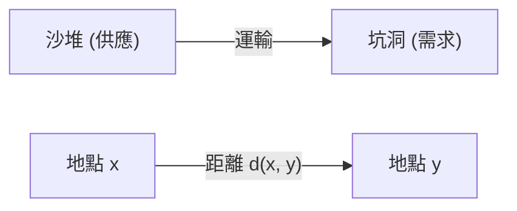
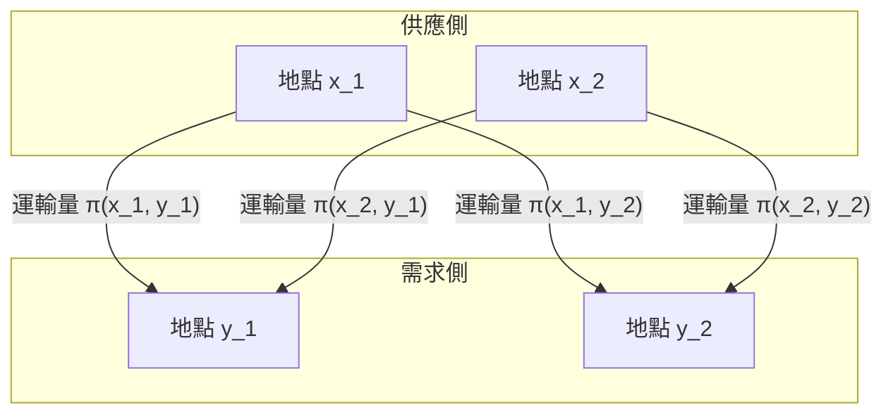

## 引言

[最佳傳輸問題](https://kenji.blog/zh-tw/p/optimal-transport-problem/) ([Optimal Transport Problem](https://kenji.blog/zh-tw/p/optimal-transport-problem/)) 是一個數學問題，探討在將某處的物質（如沙堆）移動到另一處（如坑洞）時， **「如何以最小的代價完成移動？」** 

它由法國數學家加斯帕爾·蒙日 (Gaspard Monge) 在18世紀提出，並在20世紀由列昂尼德·康托羅維奇 (Leonid Kantorovich) 進行了現代形式的表述。如今，它被廣泛應用於從經濟學的資源分配到機器學習等各個領域。

## 蒙日的問題表述

蒙日所考慮的是一個非常直觀的問題。假設在一個地方有一個沙堆，在另一個地方有一個體積相同的坑洞。當我們考慮將沙堆推平填入坑洞的操作時，我們希望將運輸沙子的 **「成本」** 降到最低。

成本通常表示為「移動的沙子量」與「移動的距離」的乘積。

用數學語言來表達，假設原沙堆的分佈是 $X$ 上的機率測度 $\mu$，坑洞的分佈是 $Y$ 上的機率測度 $\nu$。
我們設 $T: X \to Y$ 是一個映射（函數），決定了每個地點 $x \in X$ 到 $y \in Y$ 的移動目的地。這個 $T$ 必須將 $\mu$ 轉移（前推）到 $\nu$。也就是說， $T_{\#}\mu = \nu$。

假設移動帶來的成本函數為 $c(x, y)$，蒙日[最佳傳輸問題](https://kenji.blog/zh-tw/p/optimal-transport-problem/)就是要找到一個使以下總成本最小化的映射 $T$。

$$
\inf_{T_{\#}\mu = \nu} \int_X c(x, T(x)) d\mu(x)
$$

然而，這種表述存在一個問題。例如，映射 $T$ 無法表示將沙堆中某一點的沙子分割並運送到多個坑洞的情況。

## 康托羅維奇的鬆弛問題

解決這個問題的是康托羅維奇。他提出了一種運輸計畫 (Transport Plan)，用來表示從每個地點 $x$ 到 $y$ **「分配多少數量」** 。

設運輸計畫為 $X \times Y$ 上的聯合機率測度 $\pi$。在這裡，我們施加一個條件，即 $\pi$ 的邊際分佈分別為 $\mu$ 和 $\nu$。這被記為 $\Pi(\mu, \nu)$。

康托羅維奇[最佳傳輸問題](https://kenji.blog/zh-tw/p/optimal-transport-problem/)就是要找到一個使以下總成本最小化的聯合分佈 $\pi$。

$$
\inf_{\pi \in \Pi(\mu, \nu)} \int_{X \times Y} c(x, y) d\pi(x, y)
$$

透過這種表述，分割運輸沙子被允許，數學處理也變得非常容易。此外，由於該問題可以表述為線性規劃問題，因此可以使用對偶性 (Duality) 進行強大的分析。

## Wasserstein 距離

當選擇度量空間中距離的 $p$ 次方，即 $d(x, y)^p$ 作為成本函數 $c(x, y)$ 時，最佳傳輸成本的 $1/p$ 次方就成為衡量機率分佈間距離的指標。這被稱為 **Wasserstein 距離** (Wasserstein Distance)。

$$
W_p(\mu, \nu) = \left( \inf_{\pi \in \Pi(\mu, \nu)} \int_{X \times Y} d(x, y)^p d\pi(x, y) \right)^{1/p}
$$

特別是當 $p=1$ 時，它也被稱為 **推土機距離 (Earth Mover's Distance, EMD)** ，在影像處理和機器學習領域被廣泛用作直觀的分佈間距離。

### Wasserstein 距離的優勢

與庫爾貝克-萊布勒散度 (KL divergence) 等其他分佈間指標相比，Wasserstein 距離有一個巨大的優勢。

那就是， **「即使分佈之間完全沒有重疊，也可以將其距離作為有意義的值來衡量」** 。例如，當兩個點集在空間中相距甚遠時，KL 散度會趨於無限大，而 Wasserstein 距離則直接反映了點集之間的幾何距離。

## 在機器學習中的應用

近年來，最佳傳輸理論在機器學習，特別是生成模型領域引起了極大的關注。其代表作就是 **Wasserstein GAN (WGAN)** 。

透過最小化生成器 (Generator) 生成的資料分佈與實際資料分佈之間的 Wasserstein 距離，實現了更穩定的訓練，並使生成的影像品質得到了飛躍性的提升。

[最佳傳輸問題](https://kenji.blog/zh-tw/p/optimal-transport-problem/)始於純粹的數學探索，如今已成為支撐資料科學的強大工具。這種衡量分佈與分佈間「差異」的直觀思想，在未來必定會繼續在各個領域中得到應用。
